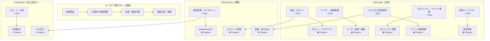
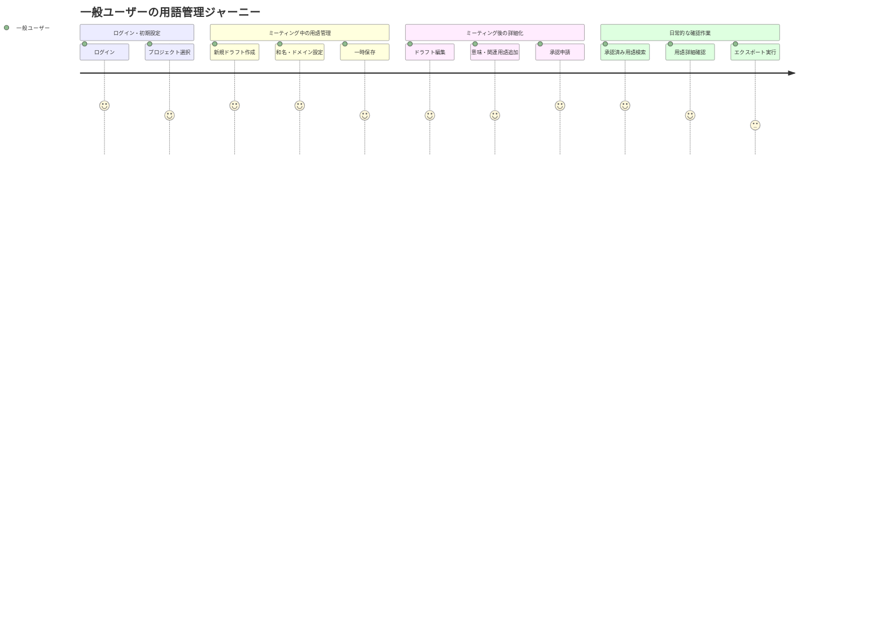
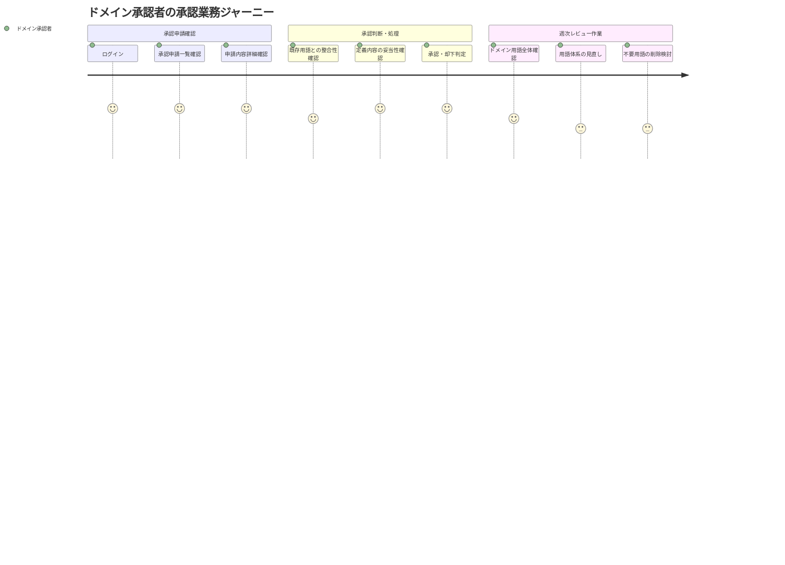
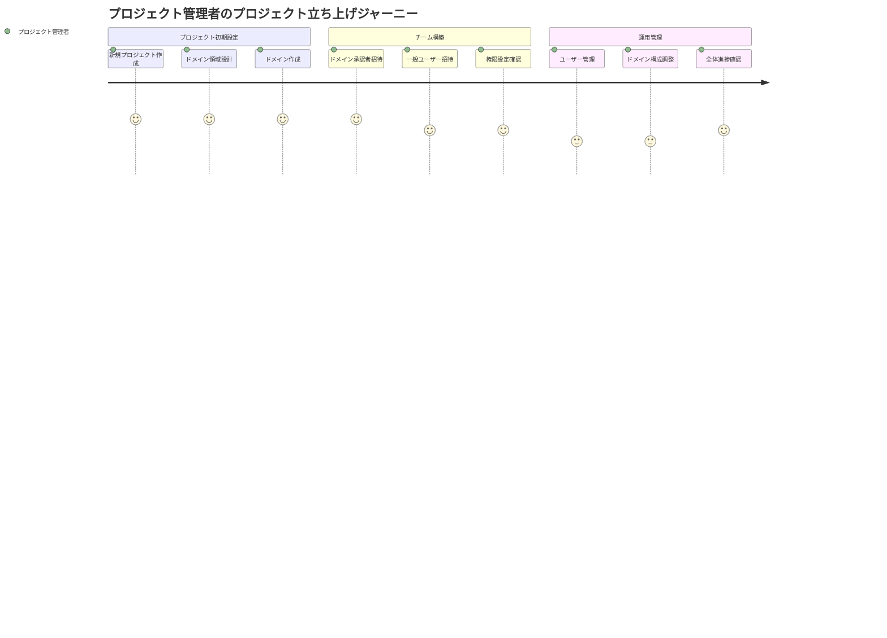
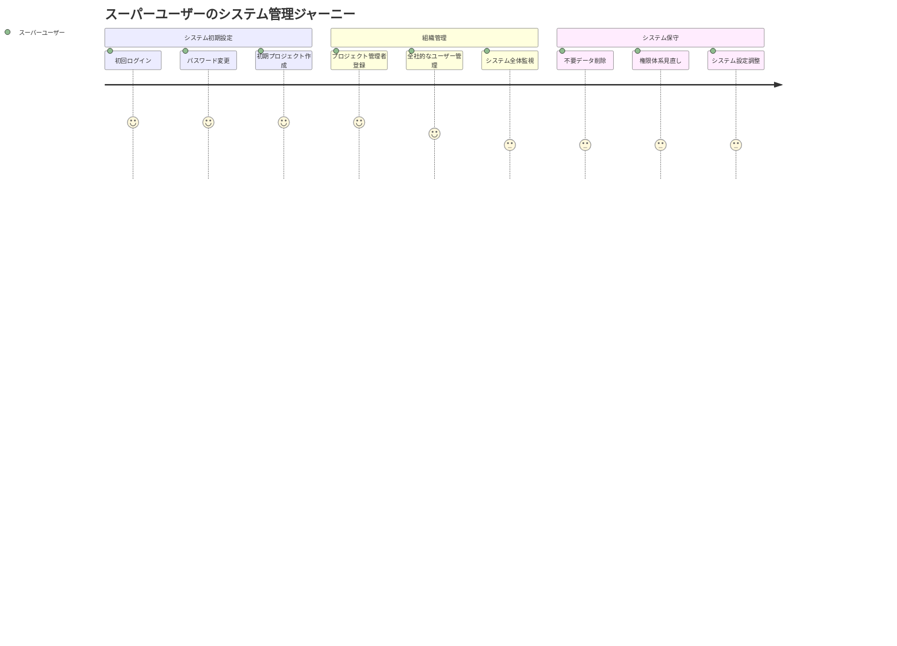
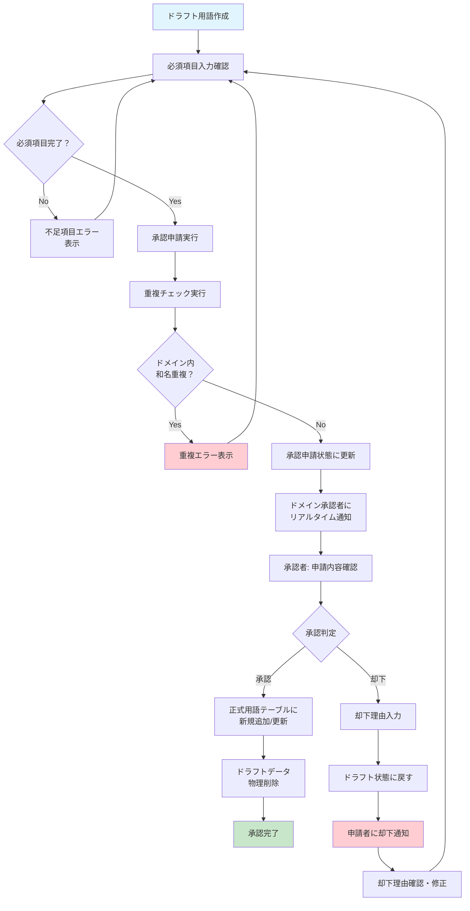

# ユビキタス言語管理システム ユーザーストーリー

**プロジェクト名**: ユビキタス言語管理システム  
**バージョン**: 1.0  
**作成日**: 2025-06-29  
**最終更新**: 2025-06-29  
**承認者**: プロジェクトオーナー  

## 目次

1. [ユーザーストーリー概要](#1-ユーザーストーリー概要)
2. [ストーリーマップ](#2-ストーリーマップ)
3. [Epic別ユーザーストーリー](#3-epic別ユーザーストーリー)
4. [ユーザージャーニー図](#4-ユーザージャーニー図)
5. [承認ワークフロー図](#5-承認ワークフロー図)
6. [優先度・実装計画](#6-優先度実装計画)

---

## 1. ユーザーストーリー概要

### 1.1 記述形式

本文書では以下の日本語形式でユーザーストーリーを記述します：

```
「[ユーザーロール]として、[機能・操作]したい。なぜなら[価値・目的]だから。」
```

### 1.2 ユーザーロール定義

- **スーパーユーザー**: システム全体の管理者
- **プロジェクト管理者**: プロジェクト単位の管理者
- **ドメイン承認者**: 特定ドメインの承認権限者
- **一般ユーザー**: 用語の作成・編集を行う開発者・ビジネス関係者

### 1.3 優先度分類（MoSCoW法）

- **Must have（必須）**: システムの基本機能として絶対に必要
- **Should have（重要）**: 重要だが最初のリリースで必須ではない
- **Could have（あれば良い）**: あると便利だが優先度は低い

---

## 2. ストーリーマップ

以下のMermaid図は、ユーザーの行動フローを横軸、優先度（MoSCoW）を縦軸として、Epic・Feature・User Storyの関係性を表現しています。



---

## 3. Epic別ユーザーストーリー

### 3.1 認証・セッション管理 Epic

#### 3.1.1 ログイン・ログアウト Feature

**US-001: ログイン機能**
- **ストーリー**: 一般ユーザーとして、メールアドレスとパスワードでログインしたい。なぜならシステムを安全に利用するため。
- **優先度**: Must have
- **アクセプタンスクライテリア**:
  - 正しいメールアドレス・パスワードでログインできる
  - ログイン失敗時はエラーメッセージが表示される
  - ログイン成功時はユビキタス言語一覧画面に遷移する
  - ログイン状態保持オプションが選択できる

**US-002: ログアウト機能**
- **ストーリー**: ユーザーとして、セキュアにログアウトしたい。なぜなら作業終了時にセッションを安全に終了するため。
- **優先度**: Must have
- **アクセプタンスクライテリア**:
  - ログアウトボタンをクリックしてセッションを終了できる
  - ログアウト後はログイン画面に遷移する

#### 3.1.2 パスワード管理 Feature

**US-003: パスワード変更機能**
- **ストーリー**: ユーザーとして、自分のパスワードを変更したい。なぜならセキュリティを維持するため。
- **優先度**: Should have
- **アクセプタンスクライテリア**:
  - 現在のパスワード認証後に新しいパスワードを設定できる
  - パスワード要件（8文字以上）が確認される
  - 初回ログイン時はパスワード変更が必須となる

**US-004: パスワードリセット機能**
- **ストーリー**: ユーザーとして、パスワードを忘れた場合にリセットしたい。なぜならシステムに再アクセスするため。
- **優先度**: Should have
- **アクセプタンスクライテリア**:
  - メールアドレス入力でリセット申請ができる
  - リセットリンクから新しいパスワードを設定できる
  - リセットリンクの有効期限は24時間である

### 3.2 ユーザー・権限管理 Epic

#### 3.2.1 ユーザー登録・編集・削除 Feature

**US-005: ユーザー登録機能**
- **ストーリー**: スーパーユーザーとして、新しいユーザーを登録したい。なぜならシステム利用者を管理するため。
- **優先度**: Must have
- **アクセプタンスクライテリア**:
  - メールアドレス、氏名、初期パスワード、ユーザーロールを設定できる
  - 登録成功時はユーザー一覧画面に遷移する
  - メールアドレスの重複チェックが実行される

**US-006: ユーザー編集機能**
- **ストーリー**: プロジェクト管理者として、担当プロジェクトのユーザー情報を編集したい。なぜなら組織変更に対応するため。
- **優先度**: Must have
- **アクセプタンスクライテリア**:
  - 権限範囲内のユーザーの氏名、ロール、所属プロジェクトを編集できる
  - 自分自身のロール変更はできない
  - 編集成功時は成功メッセージが表示される

**US-007: ユーザー削除機能**
- **ストーリー**: スーパーユーザーとして、不要になったユーザーを削除したい。なぜなら適切なアクセス制御を維持するため。
- **優先度**: Must have
- **アクセプタンスクライテリア**:
  - 削除確認ダイアログが表示される
  - 論理削除により作成データは保持される
  - 削除済みユーザー表示切り替えができる

#### 3.2.2 プロフィール管理 Feature

**US-008: プロフィール変更機能**
- **ストーリー**: ユーザーとして、自分のプロフィール情報を変更したい。なぜなら最新の情報を維持するため。
- **優先度**: Should have
- **アクセプタンスクライテリア**:
  - 氏名を変更できる
  - 変更成功時は成功メッセージが表示される
  - メールアドレスは変更できない

### 3.3 プロジェクト・ドメイン管理 Epic

#### 3.3.1 プロジェクト管理 Feature

**US-009: プロジェクト作成機能**
- **ストーリー**: スーパーユーザーとして、新しいプロジェクトを作成したい。なぜなら新規プロジェクトでの用語管理を開始するため。
- **優先度**: Must have
- **アクセプタンスクライテリア**:
  - プロジェクト名、説明を設定できる
  - 作成成功時は自動でデフォルトドメイン（「共通」）が作成される
  - プロジェクト一覧画面に遷移する

**US-010: プロジェクト編集機能**
- **ストーリー**: プロジェクト管理者として、担当プロジェクトの情報を編集したい。なぜならプロジェクト情報を最新に保つため。
- **優先度**: Must have
- **アクセプタンスクライテリア**:
  - プロジェクト説明を編集できる
  - プロジェクト名は変更できない
  - 編集成功時は成功メッセージが表示される

**US-011: プロジェクト削除機能**
- **ストーリー**: スーパーユーザーとして、不要になったプロジェクトを削除したい。なぜなら管理対象を整理するため。
- **優先度**: Must have
- **アクセプタンスクライテリア**:
  - 関連データ数を含む削除確認ダイアログが表示される
  - 論理削除により関連データは保持される
  - 削除済みプロジェクト表示切り替えができる

#### 3.3.2 ドメイン管理 Feature

**US-012: ドメイン作成機能**
- **ストーリー**: プロジェクト管理者として、担当プロジェクトにドメインを追加したい。なぜならビジネスドメインごとに用語を分類管理するため。
- **優先度**: Must have
- **アクセプタンスクライテリア**:
  - ドメイン名、説明、承認者を設定できる
  - 同一プロジェクト内でのドメイン名重複チェックが実行される
  - 最低1名の承認者設定が必須となる

**US-013: ドメイン編集機能**
- **ストーリー**: プロジェクト管理者として、担当プロジェクトのドメイン情報を編集したい。なぜならドメイン構成を最適化するため。
- **優先度**: Must have
- **アクセプタンスクライテリア**:
  - ドメイン説明、承認者を編集できる
  - ドメイン名は変更できない
  - 最低1名の承認者必須制約が維持される

**US-014: ドメイン削除機能**
- **ストーリー**: プロジェクト管理者として、不要になったドメインを削除したい。なぜならドメイン構成を整理するため。
- **優先度**: Must have
- **アクセプタンスクライテリア**:
  - 関連用語数を含む削除確認ダイアログが表示される
  - デフォルトドメイン（「共通」）は削除できない
  - 論理削除により関連データは保持される

### 3.4 ユビキタス言語管理 Epic

#### 3.4.1 ドラフト用語管理 Feature

**US-015: ドラフト用語作成機能**
- **ストーリー**: 一般ユーザーとして、新しいドラフト用語を作成したい。なぜならミーティングで発生した新しい概念を記録するため。
- **優先度**: Must have
- **アクセプタンスクライテリア**:
  - 和名を入力してドラフト用語を作成できる
  - ドメイン選択が必須となる
  - 意味、発生機会、関連用語、備考は任意入力となる

**US-016: ドラフト用語編集機能**
- **ストーリー**: ユーザーとして、ドラフト用語を編集したい。なぜなら用語定義を正確にするため。
- **優先度**: Must have
- **アクセプタンスクライテリア**:
  - インライン編集でセル単位の編集ができる
  - 行フォーカスアウト時に自動保存される
  - 編集中行がハイライト表示される
  - 楽観ロックにより競合チェックが実行される

**US-017: ドラフト用語削除機能**
- **ストーリー**: ユーザーとして、不要なドラフト用語を削除したい。なぜなら作業用データを整理するため。
- **優先度**: Must have
- **アクセプタンスクライテリア**:
  - 削除確認ダイアログが表示される
  - 物理削除により完全に削除される
  - 削除成功時は成功メッセージが表示される

#### 3.4.2 承認済み用語参照・検索 Feature

**US-018: 用語検索機能**
- **ストーリー**: ユーザーとして、承認済み用語を検索・確認したい。なぜなら正確な用語定義を確認するため。
- **優先度**: Must have
- **アクセプタンスクライテリア**:
  - プロジェクト選択による絞り込みができる
  - 和名、英名、発生機会で部分一致検索ができる
  - 検索条件クリア機能が利用できる
  - 検索結果は50/100/200件での表示件数選択ができる

**US-019: 用語詳細確認機能**
- **ストーリー**: ユーザーとして、用語の詳細情報を確認したい。なぜなら関連用語や変更履歴を含む全情報を把握するため。
- **優先度**: Should have
- **アクセプタンスクライテリア**:
  - 一覧からクリックでポップアップ表示される
  - 関連用語、備考、変更履歴が表示される
  - ポップアップの表示・非表示が快適に操作できる

#### 3.4.3 用語削除 Feature

**US-020: 承認済み用語削除機能**
- **ストーリー**: ドメイン承認者として、不要になった承認済み用語を削除したい。なぜなら用語辞書を適切に管理するため。
- **優先度**: Must have
- **アクセプタンスクライテリア**:
  - ドメイン承認者以上の権限で削除できる
  - 削除確認ダイアログが表示される
  - 論理削除により履歴は保持される
  - 関連用語の参照も自動削除される

### 3.5 承認ワークフロー Epic

#### 3.5.1 承認申請 Feature

**US-021: 承認申請機能**
- **ストーリー**: ユーザーとして、ドラフト用語を承認申請したい。なぜなら正式な用語として登録するため。
- **優先度**: Must have
- **アクセプタンスクライテリア**:
  - 行単位での承認申請ボタンが利用できる
  - 複数行選択での一括承認申請ができる
  - 必須項目（和名、英名、意味、ドメイン）入力チェックが実行される
  - ドメイン内和名重複チェックが実行される
  - 担当ドメイン承認者にリアルタイム通知される

#### 3.5.2 承認・却下処理 Feature

**US-022: 承認機能**
- **ストーリー**: ドメイン承認者として、承認申請された用語を承認したい。なぜなら正式な用語として確定するため。
- **優先度**: Must have
- **アクセプタンスクライテリア**:
  - 担当ドメインの承認申請のみ表示される
  - 単一承認・一括承認が選択できる
  - 承認確認ダイアログが表示される
  - 承認後は正式用語テーブルに登録される
  - 承認されたドラフトデータは物理削除される

**US-023: 却下機能**
- **ストーリー**: ドメイン承認者として、承認申請された用語を却下したい。なぜなら品質基準を満たしていない用語を修正させるため。
- **優先度**: Must have
- **アクセプタンスクライテリア**:
  - 却下理由入力ダイアログが表示される
  - 却下理由入力後に実行確認ダイアログが表示される
  - 却下後はドラフト状態に戻される
  - 申請者にトースター通知される
  - 却下理由がドラフトデータに記録される

### 3.6 外部連携・エクスポート Epic

#### 3.6.1 AI向けMarkdown出力 Feature

**US-024: Markdown出力機能**
- **ストーリー**: ユーザーとして、承認済み用語をMarkdown形式で出力したい。なぜならClaude Codeでの活用により開発効率を向上させるため。
- **優先度**: Must have
- **アクセプタンスクライテリア**:
  - 現在の検索・フィルタ条件を適用して出力される
  - プロジェクト名・ドメイン名・日付を含むファイル名で出力される
  - ドメイン別に構造化されたMarkdown形式で出力される
  - ファイル自動ダウンロードが実行される

#### 3.6.2 CSV出力 Feature

**US-025: CSV出力機能**
- **ストーリー**: ユーザーとして、承認済み用語をCSV形式で出力したい。なぜならExcelでの二次加工・分析を行うため。
- **優先度**: Could have
- **アクセプタンスクライテリア**:
  - 現在の検索・フィルタ条件を適用して出力される
  - UTF-8 BOM付きCSV形式で出力される
  - 最終更新日時・最終更新者名も含めて出力される
  - ファイル自動ダウンロードが実行される

---

## 4. ユーザージャーニー図

以下のMermaid図は、各ユーザーロールの主要な業務タスクフローを表現しています。

### 4.1 一般ユーザーのユーザージャーニー



### 4.2 ドメイン承認者のユーザージャーニー



### 4.3 プロジェクト管理者のユーザージャーニー



### 4.4 スーパーユーザーのユーザージャーニー



---

## 5. 承認ワークフロー図



---

## 6. 優先度・実装計画

### 6.1 Must have（必須機能）- MVP範囲

#### フェーズ1: 基盤機能（技術依存関係重視）
1. **認証・セッション管理**
   - US-001: ログイン機能
   - US-002: ログアウト機能

2. **ユーザー・権限管理**
   - US-005: ユーザー登録機能
   - US-006: ユーザー編集機能
   - US-007: ユーザー削除機能

3. **プロジェクト・ドメイン管理**
   - US-009: プロジェクト作成機能
   - US-010: プロジェクト編集機能
   - US-012: ドメイン作成機能
   - US-013: ドメイン編集機能

#### フェーズ2: 核心機能（ビジネス価値重視）
4. **ユビキタス言語管理**
   - US-015: ドラフト用語作成機能
   - US-016: ドラフト用語編集機能
   - US-018: 用語検索機能

5. **承認ワークフロー**
   - US-021: 承認申請機能
   - US-022: 承認機能
   - US-023: 却下機能

6. **外部連携**
   - US-024: Markdown出力機能

#### フェーズ3: 運用機能
7. **完全性確保**
   - US-017: ドラフト用語削除機能
   - US-020: 承認済み用語削除機能
   - US-011: プロジェクト削除機能
   - US-014: ドメイン削除機能

### 6.2 Should have（重要機能）

#### 実装順序
1. **US-003**: パスワード変更機能
2. **US-004**: パスワードリセット機能
3. **US-008**: プロフィール変更機能
4. **US-019**: 用語詳細確認機能

### 6.3 Could have（あれば良い機能）

#### 将来実装候補
1. **US-025**: CSV出力機能
2. **レポート機能**: 利用統計・活動レポート
3. **通知機能拡張**: メール通知・Slack連携
4. **API連携機能**: 外部システムとの連携

### 6.4 実装スケジュール

| フェーズ | 期間 | 主要成果物 | ユーザーフィードバック |
|---------|------|------------|----------------------|
| フェーズ1 | 4週間 | 基盤機能完成 | 内部テスト |
| フェーズ2 | 6週間 | 核心機能完成 | アルファテスト |
| フェーズ3 | 4週間 | MVP完成 | ベータテスト |
| Should have | 4週間 | 重要機能追加 | 本格運用開始 |

**ユーザーフィードバック取得**: 本格運用開始後2週間程度

---

## 付録

### A. 非機能要件対応ユーザーストーリー

**US-NF-001: 応答速度**
- **ストーリー**: ユーザーとして、快適に操作できる応答速度を期待する。なぜなら業務効率を維持するため。

**US-NF-002: 学習コスト**
- **ストーリー**: 新規ユーザーとして、2時間程度でシステムを使いこなせるようになりたい。なぜなら迅速に業務に活用するため。

**US-NF-003: データ保護**
- **ストーリー**: ユーザーとして、楽観ロックにより他ユーザーとの競合を検知したい。なぜなら安全にデータを編集するため。

### B. 関連文書

- **要件定義書**: `/Doc/01_Requirements/要件定義書.md`
- **機能仕様書**: `/Doc/01_Requirements/機能仕様書.md`
- **UI設計書**: `/Doc/02_Design/UI設計/`
- **Mermaid記法採用決定**: `/Doc/07_Decisions/ADR_001_Mermaid記法採用.md`

---

**承認履歴**
- 2025-06-29: Claude Code作成

**次工程**
- データベース設計書作成 (`/Doc/02_Design/データベース設計書.md`)
- システム設計書作成 (`/Doc/02_Design/システム設計書.md`)
- API設計書作成 (`/Doc/02_Design/API設計書.md`)