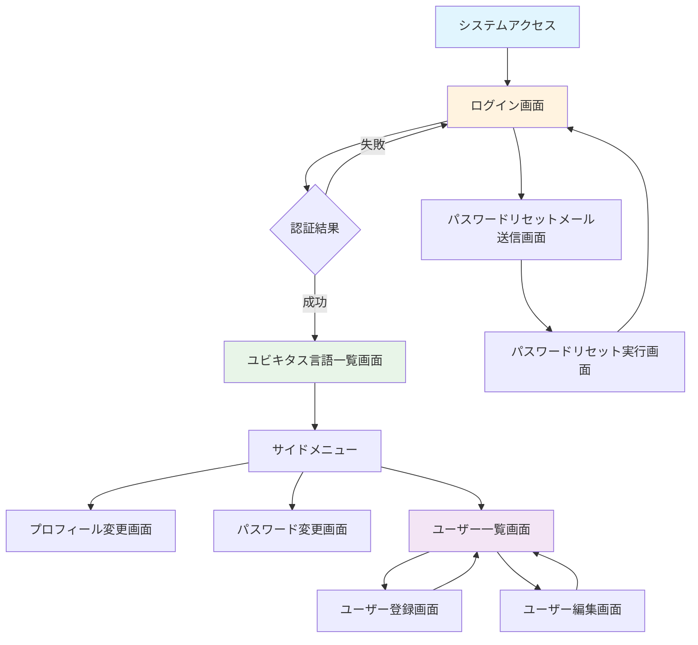
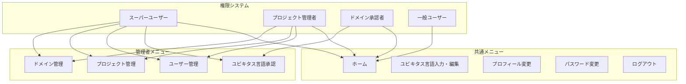

# 認証・ユーザー管理画面設計（Mermaid + 構造化ASCII Art版）

**作成日**: 2025-06-27  
**改善日**: 2025-07-06  
**対象**: ユビキタス言語管理システム  
**カテゴリ**: 認証・ユーザー管理関連画面（8画面）  

## 1. システム全体フロー（Mermaid）

### 1.1 認証・ユーザー管理フロー全体図


### 1.2 権限別メニュー表示制御


## 2. 共通レイアウト要素

### 2.1 基本レイアウト構成（デスクトップ）
```
┌──────────────────────────────────────────────────────────────┐
│                        Header Area                          │
│  🏢 ユビキタス言語管理システム           👤 田中太郎  [ログアウト] │
└──────────────────────────────────────────────────────────────┘
┌─────────────────┬────────────────────────────────────────────┐
│   Side Menu     │              Main Content                  │
│                 │                                            │
│ ☰ メニュー      │                                            │
│                 │                                            │
│ 🏠 ホーム       │                                            │
│ ✏️ 入力・編集    │                                            │
│ ✅ 承認         │              画面固有コンテンツ              │
│ 👥 ユーザー管理  │                                            │
│ 📁 プロジェクト  │                                            │
│ 🏷️ ドメイン      │                                            │
│ 👤 プロフィール  │                                            │
│ 🔒 パスワード    │                                            │
│ 🚪 ログアウト    │                                            │
│                 │                                            │
└─────────────────┴────────────────────────────────────────────┘
┌──────────────────────────────────────────────────────────────┐
│                         Footer Area                         │
│              © 2025 ユビキタス言語管理システム               │
└──────────────────────────────────────────────────────────────┘
```

### 2.2 権限別メニュー表示制御
- **全ユーザー共通**: 🏠 ホーム、✏️ 入力・編集、👤 プロフィール、🔒 パスワード、🚪 ログアウト
- **ドメイン承認者以上**: ✅ 承認（追加）
- **プロジェクト管理者以上**: 👥 ユーザー管理、📁 プロジェクト管理、🏷️ ドメイン管理（追加）

### 2.3 共通デザイン方針
- **配色**: 落ち着いた配色（エンジニア向け）
- **解像度**: PC（FullHD解像度）対応
- **フォント**: 見やすさ重視のシステムフォント
- **操作性**: 親切すぎない、エンジニア向けの実用的なUI

## 3. 画面別詳細設計

### 3.1 ログイン画面

#### 画面概要
- **目的**: システムへのユーザー認証
- **アクセス**: システムのエントリーポイント
- **レイアウト**: サイドメニューなし、シンプルなセンタリング

#### UI構成
```
┌──────────────────────────────────────────────────────────────┐
│                        Header Area                          │
│  🏢 ユビキタス言語管理システム                                │
└──────────────────────────────────────────────────────────────┘
                               
               ┌─────────────────────────┐
               │      🔐 ログイン        │
               │                         │
               │ 📧 メールアドレス        │
               │ ┌─────────────────────┐ │
               │ │                     │ │
               │ └─────────────────────┘ │
               │                         │
               │ 🔒 パスワード           │
               │ ┌─────────────────────┐ │
               │ │ ••••••••••••••••••  │ │
               │ └─────────────────────┘ │
               │                         │
               │ ☑️ ログイン状態保持      │
               │                         │
               │    🚀 [ログイン]        │
               │                         │
               │ 🔄 パスワードリセット    │
               └─────────────────────────┘
```

#### 入力項目・機能
- **メールアドレス**: 必須、バリデーション有り
- **パスワード**: 必須、マスク表示
- **ログイン状態保持**: チェックボックス、自動ログイン機能
- **パスワードリセット**: リンク、パスワードリセットメール送信画面へ遷移

#### 動作仕様
- **認証成功**: ユビキタス言語一覧画面（ホーム）へ遷移
- **認証失敗**: エラーメッセージ表示（ロックアウト機構なし）
- **バリデーション**: リアルタイムバリデーション、吹き出し型エラー表示

### 3.2 プロフィール変更画面

#### 画面概要
- **目的**: ログインユーザーの基本情報変更
- **アクセス**: サイドメニュー > プロフィール変更
- **権限**: 全ユーザー

#### UI構成
```
┌─ サイドメニュー ─┬─────────────────────────────────────────────┐
│ ☰ メニュー       │          👤 プロフィール変更                 │
│                  │                                             │
│ 🏠 ホーム        │ ┌─────────────────────────────────────────┐ │
│ ✏️ 入力・編集     │ │           📋 基本情報                   │ │
│ 👤 プロフィール   │ │                                         │ │
│ 🔒 パスワード     │ │ 👤 氏名                                 │ │
│ 🚪 ログアウト     │ │ ┌─────────────────────────────────────┐ │ │
│                  │ │ │ 田中太郎                            │ │ │
│                  │ │ └─────────────────────────────────────┘ │ │
│                  │ │                                         │ │
│                  │ │ 📧 メールアドレス（変更不可）            │ │
│                  │ │ user@example.com                        │ │
│                  │ │                                         │ │
│                  │ │      ✅ [更新]  ❌ [キャンセル]         │ │
│                  │ └─────────────────────────────────────────┘ │
└──────────────────┴─────────────────────────────────────────────┘
```

#### 入力項目・機能
- **氏名**: 変更可能、必須項目
- **メールアドレス**: 表示のみ（変更不可）
- **更新ボタン**: 変更内容の保存
- **キャンセルボタン**: 変更内容破棄、前画面に戻る

#### 動作仕様
- **保存成功**: 成功メッセージをトースター表示
- **バリデーション**: 氏名必須チェック
- **将来拡張**: プロフィール画像等の対応予定

### 3.3 パスワード変更画面

#### 画面概要
- **目的**: ログインユーザーのパスワード変更
- **アクセス**: サイドメニュー > パスワード変更
- **権限**: 全ユーザー

#### UI構成
```
┌─ サイドメニュー ─┬─────────────────────────────────────────────┐
│ ☰ メニュー       │          🔒 パスワード変更                   │
│                  │                                             │
│ 🏠 ホーム        │ ┌─────────────────────────────────────────┐ │
│ ✏️ 入力・編集     │ │           🔐 パスワード情報              │ │
│ 👤 プロフィール   │ │                                         │ │
│ 🔒 パスワード     │ │ 🔒 現在のパスワード                      │ │
│ 🚪 ログアウト     │ │ ┌─────────────────────────────────────┐ │ │
│                  │ │ │ ••••••••••••••••••••••••••••••••••• │ │ │
│                  │ │ └─────────────────────────────────────┘ │ │
│                  │ │                                         │ │
│                  │ │ 🆕 新しいパスワード                      │ │
│                  │ │ ┌─────────────────────────────────────┐ │ │
│                  │ │ │ ••••••••••••••••••••••••••••••••••• │ │ │
│                  │ │ └─────────────────────────────────────┘ │ │
│                  │ │                                         │ │
│                  │ │ ✅ 新しいパスワード（確認）              │ │
│                  │ │ ┌─────────────────────────────────────┐ │ │
│                  │ │ │ ••••••••••••••••••••••••••••••••••• │ │ │
│                  │ │ └─────────────────────────────────────┘ │ │
│                  │ │                                         │ │
│                  │ │      🔄 [変更]  ❌ [キャンセル]         │ │
│                  │ └─────────────────────────────────────────┘ │
└──────────────────┴─────────────────────────────────────────────┘
```

#### 入力項目・機能
- **現在のパスワード**: 必須、認証確認用
- **新しいパスワード**: 必須、適切な強度チェック
- **新しいパスワード（確認）**: 必須、新パスワードとの一致確認
- **変更ボタン**: パスワード更新実行
- **キャンセルボタン**: 変更キャンセル

#### 動作仕様
- **初回ログイン**: スーパーユーザー以外は必須実行
- **バリデーション**: パスワード強度、確認パスワード一致
- **変更成功**: 成功メッセージ表示、ログイン画面へ遷移

### 3.4 パスワードリセットメール送信画面

#### 画面概要
- **目的**: パスワード忘れユーザーへのリセットメール送信
- **アクセス**: ログイン画面 > パスワードリセットリンク
- **レイアウト**: サイドメニューなし

#### UI構成
```
┌──────────────────────────────────────────────────────────────┐
│                        Header Area                          │
│  🏢 ユビキタス言語管理システム                                │
└──────────────────────────────────────────────────────────────┘

               ┌─────────────────────────────┐
               │      🔄 パスワードリセット    │
               │                             │
               │ 📧 メールアドレス            │
               │ ┌─────────────────────────┐ │
               │ │                         │ │
               │ └─────────────────────────┘ │
               │                             │
               │ 💌 登録されているメール      │
               │    アドレスを入力して        │
               │    ください                 │
               │                             │
               │   📤 [送信]  🔙 [戻る]      │
               └─────────────────────────────┘
```

#### 入力項目・機能
- **メールアドレス**: 必須、登録確認
- **送信ボタン**: リセットメール送信実行
- **戻るボタン**: ログイン画面に戻る

#### 動作仕様
- **未登録メールアドレス**: エラーメッセージ表示
- **送信成功**: 送信完了メッセージ、ログイン画面に戻る
- **リンク有効期限**: 24時間（設定変更可能）

### 3.5 パスワードリセット実行画面

#### 画面概要
- **目的**: メールリンクからのパスワード再設定
- **アクセス**: リセットメール内のリンクから
- **レイアウト**: サイドメニューなし

#### UI構成
```
┌──────────────────────────────────────────────────────────────┐
│                        Header Area                          │
│  🏢 ユビキタス言語管理システム                                │
└──────────────────────────────────────────────────────────────┘

               ┌─────────────────────────────┐
               │    🔐 新しいパスワード設定   │
               │                             │
               │ 🆕 新しいパスワード          │
               │ ┌─────────────────────────┐ │
               │ │ ••••••••••••••••••••••• │ │
               │ └─────────────────────────┘ │
               │                             │
               │ ✅ パスワード（確認）        │
               │ ┌─────────────────────────┐ │
               │ │ ••••••••••••••••••••••• │ │
               │ └─────────────────────────┘ │
               │                             │
               │  🔧 [設定]  ❌ [キャンセル]  │
               └─────────────────────────────┘
```

#### 入力項目・機能
- **新しいパスワード**: 必須、強度チェック
- **パスワード（確認）**: 必須、一致確認
- **設定ボタン**: パスワード変更実行
- **キャンセルボタン**: 処理キャンセル

#### 動作仕様
- **リンク期限切れ**: エラーメッセージ、ログイン画面に遷移
- **設定成功**: 成功メッセージ、ログイン画面に遷移
- **バリデーション**: パスワード強度、確認一致

### 3.6 ユーザー一覧画面

#### 画面概要
- **目的**: システム利用ユーザーの一覧確認・管理
- **アクセス**: サイドメニュー > ユーザー管理
- **権限**: プロジェクト管理者以上

#### UI構成
```
┌─ サイドメニュー ─┬─────────────────────────────────────────────┐
│ ☰ メニュー       │           👥 ユーザー一覧                   │
│                  │                                             │
│ 🏠 ホーム        │ ┌─────────────────────────────────────────┐ │
│ ✏️ 入力・編集     │ │            🔍 検索・フィルタ             │ │
│ ✅ 承認          │ │ 👤 氏名: [______] 📁 プロジェクト:       │ │
│ 👥 ユーザー管理   │ │ [プロジェクトA ▼] [🔍 検索]              │ │
│ 📁 プロジェクト   │ │ ☐ 削除済みデータを表示                   │ │
│ 🏷️ ドメイン      │ └─────────────────────────────────────────┘ │
│ 👤 プロフィール   │                                             │
│ 🔒 パスワード     │ ┌─────────────────────────────────────────┐ │
│ 🚪 ログアウト     │ │              ➕ 新規登録                 │ │
│                  │ └─────────────────────────────────────────┘ │
│                  │                                             │
│                  │ ┌─────────────────────────────────────────┐ │
│                  │ │👤氏名    │📧メール    │🎭権限    │📁プロジェクト│ │
│                  │ ├─────────┼───────────┼─────────┼──────────┤ │
│                  │ │田中太郎   │tanaka@..   │一般      │ECサイト  │ │
│                  │ │佐藤花子   │sato@...    │承認者    │在庫管理  │ │
│                  │ │鈴木一郎   │suzuki@..   │管理者    │ECサイト  │ │
│                  │ │          │           │         │✏️[編集]🗑[削除]│ │
│                  │ └─────────────────────────────────────────┘ │
│                  │                                             │
│                  │ ┌─────────────────────────────────────────┐ │
│                  │ │   [◀ 前] 1 / 3 ページ [次 ▶]  50件/頁   │ │
│                  │ └─────────────────────────────────────────┘ │
└──────────────────┴─────────────────────────────────────────────┘
```

#### 表示項目・機能
- **一覧表示**: 氏名、メールアドレス、権限レベル、所属プロジェクト
- **検索・フィルタ**: 氏名（部分一致）、プロジェクト別フィルタ
- **削除済み表示**: 論理削除されたユーザーの表示切り替え
- **操作ボタン**: 編集（別画面遷移）、削除（論理削除）
- **新規登録**: ユーザー登録画面へ遷移

#### 動作仕様・権限制御
- **スーパーユーザー**: 全ユーザー表示・操作可能
- **プロジェクト管理者**: 担当プロジェクトのユーザーのみ表示・操作
- **ページング**: 50/100/200件選択可能な従来型ページャ
- **ソート**: 各列でのソート機能

### 3.7 ユーザー登録画面

#### 画面概要
- **目的**: 新規ユーザーの登録
- **アクセス**: ユーザー一覧画面 > 新規登録
- **権限**: プロジェクト管理者以上

#### UI構成
```
┌─ サイドメニュー ─┬─────────────────────────────────────────────┐
│ ☰ メニュー       │           ➕ ユーザー登録                   │
│                  │                                             │
│ 🏠 ホーム        │ ┌─────────────────────────────────────────┐ │
│ ✏️ 入力・編集     │ │           📋 基本情報                   │ │
│ ✅ 承認          │ │                                         │ │
│ 👥 ユーザー管理   │ │ 📧 メールアドレス（必須）                │ │
│ 📁 プロジェクト   │ │ ┌─────────────────────────────────────┐ │ │
│ 🏷️ ドメイン      │ │ │                                     │ │ │
│ 👤 プロフィール   │ │ └─────────────────────────────────────┘ │ │
│ 🔒 パスワード     │ │                                         │ │
│ 🚪 ログアウト     │ │ 👤 氏名（必須）                         │ │
│                  │ │ ┌─────────────────────────────────────┐ │ │
│                  │ │ │                                     │ │ │
│                  │ │ └─────────────────────────────────────┘ │ │
│                  │ │                                         │ │
│                  │ │ 🔐 初期パスワード（必須）                │ │
│                  │ │ ┌─────────────────────────────────────┐ │ │
│                  │ │ │ ••••••••••••••••••••••••••••••••••• │ │ │
│                  │ │ └─────────────────────────────────────┘ │ │
│                  │ │                                         │ │
│                  │ │ 🎭 ユーザーロール（必須）                │ │
│                  │ │ ○ 一般ユーザー                          │ │
│                  │ │ ○ ドメイン承認者                        │ │
│                  │ │ ○ プロジェクト管理者                     │ │
│                  │ │ ○ スーパーユーザー                      │ │
│                  │ │                                         │ │
│                  │ │ 📁 所属プロジェクト（任意）              │ │
│                  │ │ ☐ ECサイト ☐ 在庫管理 ☐ 会計システム    │ │
│                  │ │                                         │ │
│                  │ │      ✅ [登録]  ❌ [キャンセル]         │ │
│                  │ └─────────────────────────────────────────┘ │
└──────────────────┴─────────────────────────────────────────────┘
```

#### 入力項目・機能
- **メールアドレス**: 必須、ログインIDとして使用、一意性チェック
- **氏名**: 必須
- **初期パスワード**: 必須、強度チェック
- **ユーザーロール**: 必須、ラジオボタン選択
- **所属プロジェクト**: 任意、複数選択可能（チェックボックス）
- **登録ボタン**: 新規ユーザー作成
- **キャンセルボタン**: ユーザー一覧画面に戻る

#### 動作仕様・権限制御
- **プロジェクト選択肢**: 
  - スーパーユーザー: 全プロジェクト表示
  - プロジェクト管理者: 担当プロジェクトのみ表示
- **ロール選択制限**:
  - スーパーユーザー: 全ロール選択可能
  - プロジェクト管理者: 一般ユーザー・ドメイン承認者のみ選択可能
- **バリデーション**: 
  - メールアドレス必須・重複チェック・形式チェック
  - 初期パスワード強度チェック
- **登録成功**: 成功メッセージ、ユーザー一覧画面に遷移

### 3.8 ユーザー編集画面

#### 画面概要
- **目的**: 既存ユーザー情報の編集
- **アクセス**: ユーザー一覧画面 > 編集ボタン
- **権限**: スーパーユーザー・対象ユーザーの管理権限を持つプロジェクト管理者

#### UI構成
```
┌─ サイドメニュー ─┬─────────────────────────────────────────────┐
│ ☰ メニュー       │           ✏️ ユーザー編集                   │
│                  │                                             │
│ 🏠 ホーム        │ ┌─────────────────────────────────────────┐ │
│ ✏️ 入力・編集     │ │           📋 基本情報                   │ │
│ ✅ 承認          │ │                                         │ │
│ 👥 ユーザー管理   │ │ 📧 メールアドレス（変更不可）            │ │
│ 📁 プロジェクト   │ │ tanaka@example.com                      │ │
│ 🏷️ ドメイン      │ │                                         │ │
│ 👤 プロフィール   │ │ 👤 氏名（必須）                         │ │
│ 🔒 パスワード     │ │ ┌─────────────────────────────────────┐ │ │
│ 🚪 ログアウト     │ │ │ 田中太郎                            │ │ │
│                  │ │ └─────────────────────────────────────┘ │ │
│                  │ │                                         │ │
│                  │ │ 🎭 ユーザーロール（必須）                │ │
│                  │ │ ○ 一般ユーザー                          │ │
│                  │ │ ○ ドメイン承認者                        │ │
│                  │ │ ● プロジェクト管理者                     │ │
│                  │ │ ○ スーパーユーザー                      │ │
│                  │ │                                         │ │
│                  │ │ 📁 所属プロジェクト（任意）              │ │
│                  │ │ ☑ ECサイト ☐ 在庫管理 ☐ 会計システム    │ │
│                  │ │                                         │ │
│                  │ │ 📊 ステータス                           │ │
│                  │ │ ● アクティブ ○ 非アクティブ             │ │
│                  │ │                                         │ │
│                  │ │ 🔄 パスワードリセット                    │ │
│                  │ │ ┌─────────────────────────────────────┐ │ │
│                  │ │ │     🔧 新しいパスワードを設定        │ │ │
│                  │ │ └─────────────────────────────────────┘ │ │
│                  │ │                                         │ │
│                  │ │      ✅ [更新]  ❌ [キャンセル]         │ │
│                  │ └─────────────────────────────────────────┘ │
└──────────────────┴─────────────────────────────────────────────┘
```

#### 入力項目・機能
- **メールアドレス**: 表示のみ（変更不可）
- **氏名**: 必須、編集可能
- **ユーザーロール**: 必須、ラジオボタン選択
- **所属プロジェクト**: 任意、複数選択可能（プロジェクト管理者ロール選択時のみ表示）
- **ステータス**: アクティブ/非アクティブ選択
- **パスワードリセット**: 管理者による新パスワード設定
- **更新ボタン**: ユーザー情報更新
- **キャンセルボタン**: ユーザー一覧画面に戻る

#### 動作仕様・権限制御
- **初期値**: 既存データを入力欄に表示
- **プロジェクト選択肢**: 
  - スーパーユーザー: 全プロジェクト表示
  - プロジェクト管理者: 担当プロジェクトのみ表示
- **ロール選択制限**: 登録画面と同様
- **プロジェクト選択表示**: プロジェクト管理者ロール選択時のみ表示
- **バリデーション**: 
  - 氏名必須チェック
  - パスワードリセット時の強度チェック
- **更新成功**: 成功メッセージ、ユーザー一覧画面に遷移

## 4. 画面遷移図

```
ログイン画面
    ↓（認証成功）
ユビキタス言語一覧画面（ホーム）
    ↓（サイドメニュー）
┌─ プロフィール変更画面
├─ パスワード変更画面  
└─ ユーザー一覧画面
       ├─ [新規登録] → ユーザー登録画面 → [登録] → ユーザー一覧画面
       └─ [編集] → ユーザー編集画面 → [更新] → ユーザー一覧画面

ログイン画面
    ↓（パスワードリセット）
パスワードリセットメール送信画面
    ↓（メールリンク）
パスワードリセット実行画面
    ↓（完了）
ログイン画面
```

## 5. エラーハンドリング・メッセージ表示

### 5.1 バリデーションエラー
- **表示方式**: 吹き出し型ポップアップ（フォーカス時のみ表示）
- **表示色**: Firebrick（薄い赤系ハイライト付き）
- **メッセージ**: 簡潔で分かりやすい内容

### 5.2 成功・失敗メッセージ
- **表示場所**: 画面中央下部
- **表示方式**: トースター表示
- **表示時間**: 5秒間
- **タイプ**: 成功（緑系）、失敗（赤系）

### 5.3 権限エラー
- **アクセス権限なし**: 「権限がありません」メッセージ表示
- **操作権限なし**: 対象ボタン・機能の非表示制御

## 6. 技術仕様・実装指針

### 6.1 認証関連
- **セッション管理**: ASP.NET Core Identity
- **パスワード要件**: 適切な強度チェック実装
- **自動ログイン**: Cookie による永続化

### 6.2 セキュリティ
- **CSRF対策**: ASP.NET Core標準機能使用
- **SQL インジェクション対策**: Entity Framework Core使用
- **XSS対策**: Blazor Server標準のエスケープ処理

### 6.3 アクセシビリティ
- **キーボード操作**: Tab順序の適切な設定
- **スクリーンリーダー**: aria-label等の適切な設定
- **色覚サポート**: 色のみに依存しない情報伝達

---

**作成者**: Claude Code  
**改善内容**: Mermaid図表による認証フロー可視化、構造化ASCII Art（絵文字アイコン）による直感的レイアウト表現、権限別メニュー制御の明確化  
**実装準備**: ASP.NET Core Identity統合、権限ベースアクセス制御、セキュリティ要件の具体的設計完了