# 認証・ユーザー管理画面設計（Mermaid + 構造化ASCII Art版）

**作成日**: 2025-06-27  
**改善日**: 2025-07-06  
**対象**: ユビキタス言語管理システム  
**カテゴリ**: 認証・ユーザー管理関連画面（8画面）  

## 1. システム全体フロー（Mermaid）

### 1.1 認証・ユーザー管理フロー全体図
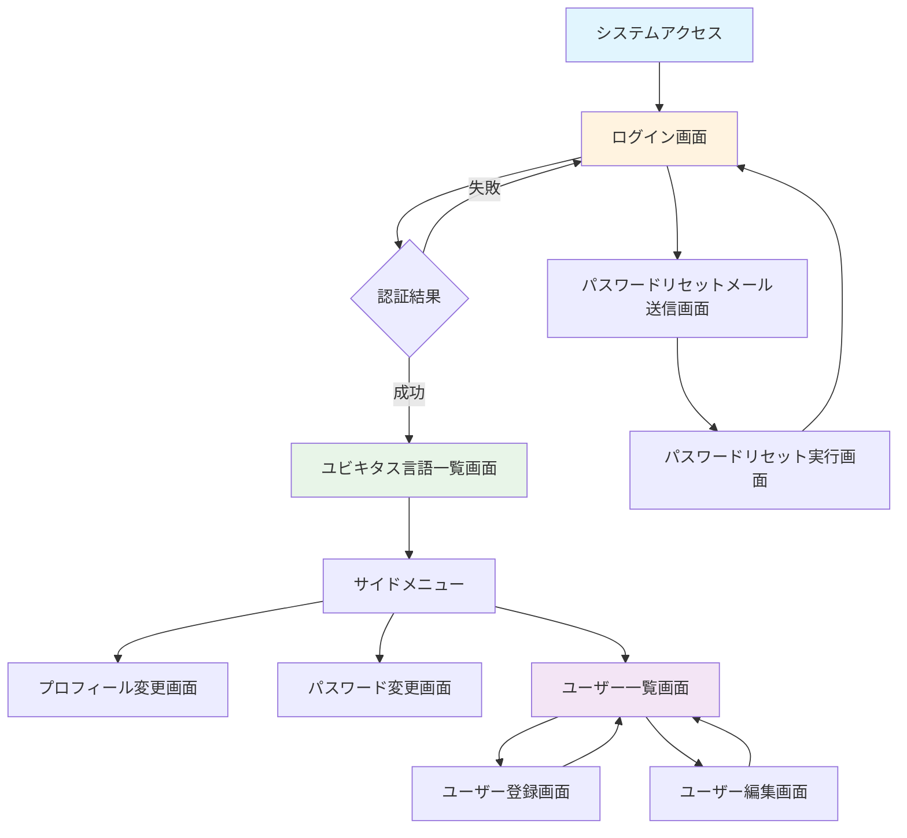

### 1.2 権限別メニュー表示制御
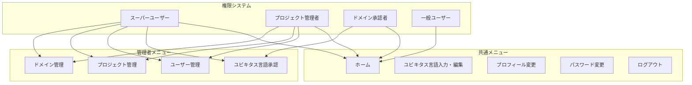

## 2. 共通レイアウト要素

### 2.1 基本レイアウト構成（デスクトップ）
```
┌──────────────────────────────────────────────────────────────┐
│                        Header Area                          │
│  🏢 ユビキタス言語管理システム           👤 田中太郎  [ログアウト] │
└──────────────────────────────────────────────────────────────┘
┌─────────────────┬────────────────────────────────────────────┐
│   Side Menu     │              Main Content                  │
│                 │                                            │
│ ☰ メニュー      │                                            │
│                 │                                            │
│ 🏠 ホーム       │                                            │
│ ✏️ 入力・編集    │                                            │
│ ✅ 承認         │              画面固有コンテンツ              │
│ 👥 ユーザー管理  │                                            │
│ 📁 プロジェクト  │                                            │
│ 🏷️ ドメイン      │                                            │
│ 👤 プロフィール  │                                            │
│ 🔒 パスワード    │                                            │
│ 🚪 ログアウト    │                                            │
│                 │                                            │
└─────────────────┴────────────────────────────────────────────┘
┌──────────────────────────────────────────────────────────────┐
│                         Footer Area                         │
│              © 2025 ユビキタス言語管理システム               │
└──────────────────────────────────────────────────────────────┘
```

### 2.2 レスポンシブ対応（モバイル）
```
┌────────────────────────────┐
│ 🏢 システム  ☰  👤 [ログアウト] │
├────────────────────────────┤
│                            │
│                            │
│       メインコンテンツ       │
│                            │
│                            │
├────────────────────────────┤
│ © 2025 システム             │
└────────────────────────────┘

ハンバーガーメニュー（展開時）:
┌────────────────────────────┐
│ 🏠 ホーム                   │
│ ✏️ 入力・編集               │
│ ✅ 承認                    │
│ 👥 ユーザー管理             │
│ 📁 プロジェクト管理          │
│ 🏷️ ドメイン管理             │
│ 👤 プロフィール変更          │
│ 🔒 パスワード変更            │
│ 🚪 ログアウト               │
└────────────────────────────┘
```

## 3. 画面別詳細設計

### 3.1 ログイン画面

#### 3.1.1 画面フロー
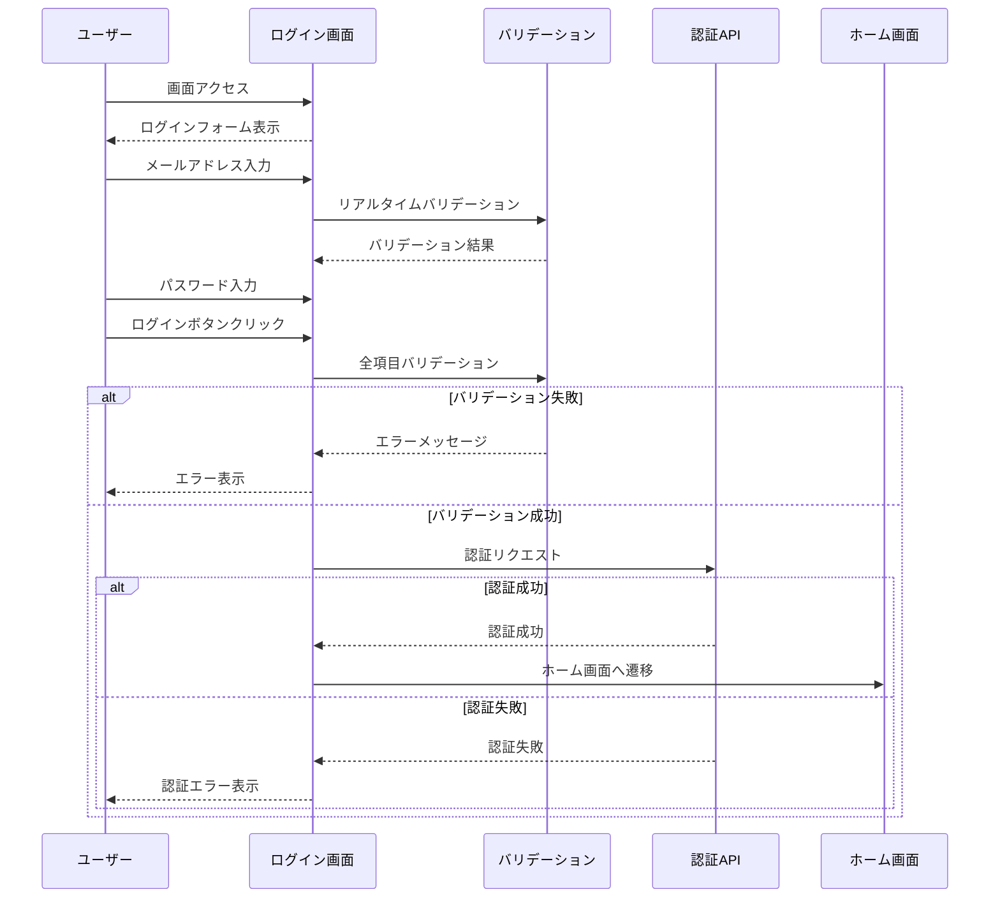

#### 3.1.2 レイアウト設計
```
┌──────────────────────────────────────────────────────────────┐
│                        Header Area                          │
│              🏢 ユビキタス言語管理システム                    │
│           Ubiquitous Language Management System             │
└──────────────────────────────────────────────────────────────┘

                     ┌─────────────────────────┐
                     │      🔐 ログイン        │
                     │                         │
                     │  📧 メールアドレス *     │
                     │  ┌─────────────────────┐ │
                     │  │                     │ │
                     │  └─────────────────────┘ │
                     │  💡 example@company.com │
                     │                         │
                     │  🔒 パスワード *         │
                     │  ┌─────────────────────┐ │
                     │  │ ••••••••••••••••    │ │
                     │  └─────────────────────┘ │
                     │  💡 8文字以上で入力      │
                     │                         │
                     │  ☐ ログイン状態を保持    │
                     │    （24時間）           │
                     │                         │
                     │  ┌─────────────────────┐ │
                     │  │      ログイン        │ │
                     │  └─────────────────────┘ │
                     │                         │
                     │  🔗 パスワードを忘れた方  │
                     └─────────────────────────┘

┌──────────────────────────────────────────────────────────────┐
│                        Footer Area                          │
│              © 2025 ユビキタス言語管理システム               │
└──────────────────────────────────────────────────────────────┘
```

#### 3.1.3 エラー状態表示
```
認証エラー表示:
┌─────────────────────────────────────────────────────────────┐
│ ⚠️  認証に失敗しました                                        │
│    メールアドレスまたはパスワードが正しくありません            │
└─────────────────────────────────────────────────────────────┘

バリデーションエラー表示:
┌─────────────────────────────────────────────────────────────┐
│ 📧 メールアドレス *                                          │
│ ┌─────────────────────────────────────────────────────────┐ │
│ │ invalid-email                                           │ │ ← 赤枠
│ └─────────────────────────────────────────────────────────┘ │
│ ❌ 正しいメールアドレス形式で入力してください                 │ ← 赤文字
└─────────────────────────────────────────────────────────────┘
```

### 3.2 プロフィール変更画面

#### 3.2.1 画面フロー
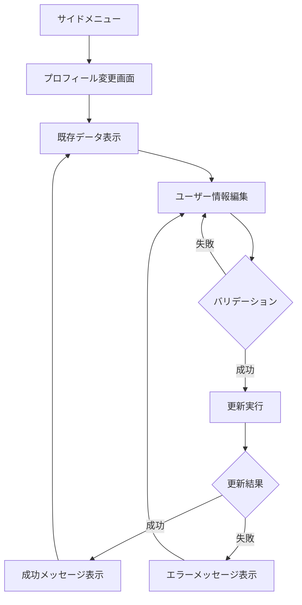

#### 3.2.2 レイアウト設計
```
┌─ サイドメニュー ─┬─────────────────────────────────────────────┐
│ ☰ メニュー       │            👤 プロフィール変更               │
│                  │                                             │
│ 🏠 ホーム        │ ┌─────────────────────────────────────────┐ │
│ ✏️ 入力・編集     │ │              基本情報                   │ │
│ 👤 プロフィール   │ │                                         │ │
│ 🔒 パスワード     │ │ 📝 氏名 *                               │ │
│ 🚪 ログアウト     │ │ ┌─────────────────────────────────────┐ │ │
│                  │ │ │ 田中太郎                            │ │ │
│                  │ │ └─────────────────────────────────────┘ │ │
│                  │ │                                         │ │
│                  │ │ 📧 メールアドレス（変更不可）            │ │
│                  │ │ tanaka@example.com                      │ │
│                  │ │                                         │ │
│                  │ │ ┌─────────────┐ ┌─────────────────────┐ │ │
│                  │ │ │   ✅ 更新   │ │    ❌ キャンセル     │ │ │
│                  │ │ └─────────────┘ └─────────────────────┘ │ │
│                  │ └─────────────────────────────────────────┘ │
└──────────────────┴─────────────────────────────────────────────┘
```

### 3.3 パスワード変更画面

#### 3.3.1 パスワード変更フロー
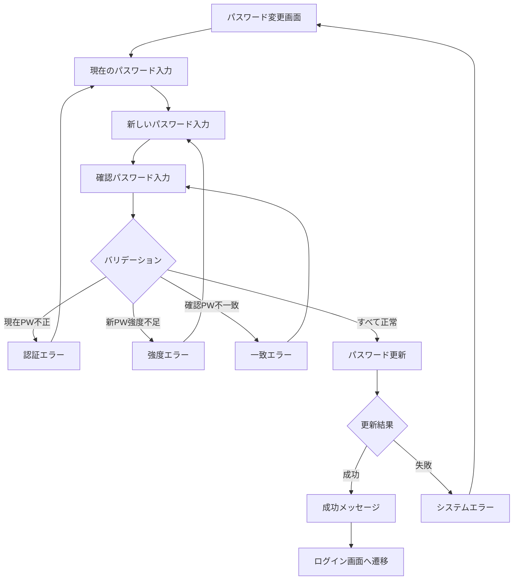

#### 3.3.2 レイアウト設計
```
┌─ サイドメニュー ─┬─────────────────────────────────────────────┐
│ ☰ メニュー       │            🔒 パスワード変更                │
│                  │                                             │
│ 🏠 ホーム        │ ┌─────────────────────────────────────────┐ │
│ ✏️ 入力・編集     │ │            パスワード情報                │ │
│ 👤 プロフィール   │ │                                         │ │
│ 🔒 パスワード     │ │ 🔐 現在のパスワード *                    │ │
│ 🚪 ログアウト     │ │ ┌─────────────────────────────────────┐ │ │
│                  │ │ │ ••••••••••••••••                    │ │ │
│                  │ │ └─────────────────────────────────────┘ │ │
│                  │ │                                         │ │
│                  │ │ 🆕 新しいパスワード *                    │ │
│                  │ │ ┌─────────────────────────────────────┐ │ │
│                  │ │ │ ••••••••••••••••                    │ │ │
│                  │ │ └─────────────────────────────────────┘ │ │
│                  │ │ 💡 8文字以上、英数字組み合わせ            │ │
│                  │ │                                         │ │
│                  │ │ 🔄 新しいパスワード（確認）*              │ │
│                  │ │ ┌─────────────────────────────────────┐ │ │
│                  │ │ │ ••••••••••••••••                    │ │ │
│                  │ │ └─────────────────────────────────────┘ │ │
│                  │ │                                         │ │
│                  │ │ ┌─────────────┐ ┌─────────────────────┐ │ │
│                  │ │ │   🔄 変更   │ │    ❌ キャンセル     │ │ │
│                  │ │ └─────────────┘ └─────────────────────┘ │ │
│                  │ └─────────────────────────────────────────┘ │
└──────────────────┴─────────────────────────────────────────────┘
```

### 3.4 パスワードリセット画面群

#### 3.4.1 パスワードリセット全体フロー
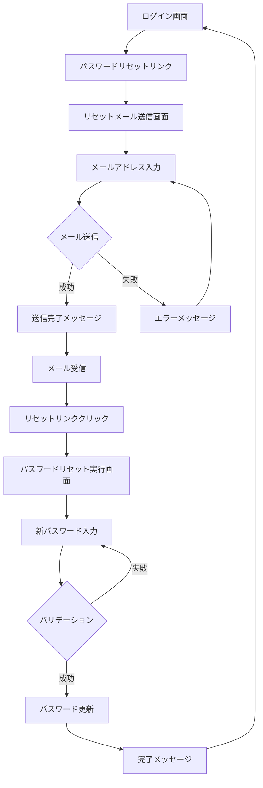

#### 3.4.2 リセットメール送信画面
```
┌──────────────────────────────────────────────────────────────┐
│              🏢 ユビキタス言語管理システム                    │
└──────────────────────────────────────────────────────────────┘

                    ┌─────────────────────────┐
                    │   📧 パスワードリセット   │
                    │                         │
                    │  メールアドレス *        │
                    │  ┌─────────────────────┐ │
                    │  │                     │ │
                    │  └─────────────────────┘ │
                    │                         │
                    │  💡 登録されているメール  │
                    │     アドレスを入力して   │
                    │     ください             │
                    │                         │
                    │  ┌─────────┐ ┌─────────┐ │
                    │  │  📤 送信  │ │ 🔙 戻る │ │
                    │  └─────────┘ └─────────┘ │
                    └─────────────────────────┘
```

#### 3.4.3 パスワードリセット実行画面
```
┌──────────────────────────────────────────────────────────────┐
│              🏢 ユビキタス言語管理システム                    │
└──────────────────────────────────────────────────────────────┘

                    ┌─────────────────────────┐
                    │  🔒 新しいパスワード設定  │
                    │                         │
                    │  新しいパスワード *      │
                    │  ┌─────────────────────┐ │
                    │  │ ••••••••••••••••    │ │
                    │  └─────────────────────┘ │
                    │  💡 8文字以上で入力      │
                    │                         │
                    │  パスワード（確認）*     │
                    │  ┌─────────────────────┐ │
                    │  │ ••••••••••••••••    │ │
                    │  └─────────────────────┘ │
                    │                         │
                    │  ┌─────────┐ ┌─────────┐ │
                    │  │ 🔄 設定  │ │❌取消   │ │
                    │  └─────────┘ └─────────┘ │
                    └─────────────────────────┘
```

### 3.5 ユーザー一覧画面

#### 3.5.1 ユーザー管理フロー
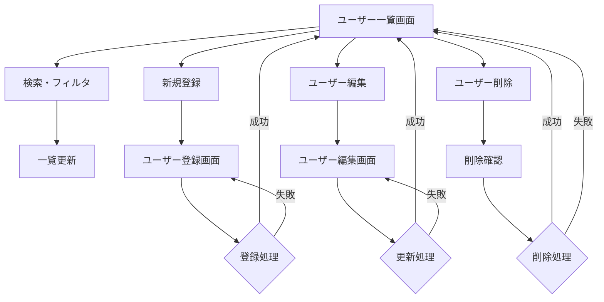

#### 3.5.2 レイアウト設計
```
┌─ サイドメニュー ─┬─────────────────────────────────────────────┐
│ ☰ メニュー       │             👥 ユーザー一覧                 │
│                  │                                             │
│ 🏠 ホーム        │ ┌─────────────────────────────────────────┐ │
│ ✏️ 入力・編集     │ │            🔍 検索・フィルタ             │ │
│ ✅ 承認          │ │ 氏名: [_________] プロジェクト:          │ │
│ 👥 ユーザー管理   │ │ [全プロジェクト ▼] [🔍 検索]            │ │
│ 📁 プロジェクト   │ │ ☐ 削除済みデータを表示                  │ │
│ 🏷️ ドメイン      │ └─────────────────────────────────────────┘ │
│ 👤 プロフィール   │                                             │
│ 🔒 パスワード     │ ┌─────────────────────────────────────────┐ │
│ 🚪 ログアウト     │ │           ➕ 新規登録                    │ │
│                  │ └─────────────────────────────────────────┘ │
│                  │                                             │
│                  │ ┌─────────────────────────────────────────┐ │
│                  │ │☑│ 氏名     │メールアドレス  │権限  │操作│ │
│                  │ ├─┼─────────┼──────────────┼──────┼────┤ │
│                  │ │☐│田中太郎   │tanaka@co...   │一般  │✏️🗑️│ │
│                  │ │☐│佐藤花子   │sato@co...     │承認者│✏️🗑️│ │
│                  │ │☐│山田次郎   │yamada@co...   │管理者│✏️🗑️│ │
│                  │ └─────────────────────────────────────────┘ │
│                  │                                             │
│                  │ ┌─────────────────────────────────────────┐ │
│                  │ │    [◀ 前] 1 / 5 ページ [次 ▶]           │ │
│                  │ └─────────────────────────────────────────┘ │
└──────────────────┴─────────────────────────────────────────────┘
```

### 3.6 ユーザー登録画面

#### 3.6.1 ユーザー登録フロー
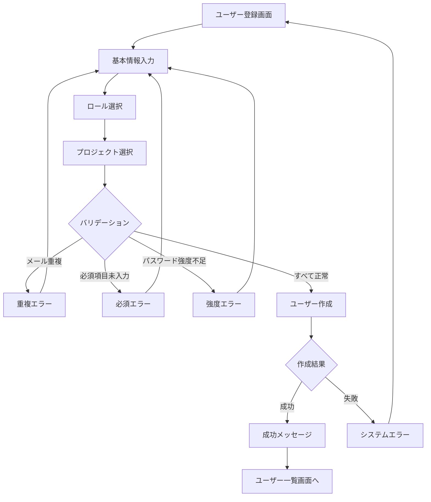

#### 3.6.2 レイアウト設計
```
┌─ サイドメニュー ─┬─────────────────────────────────────────────┐
│ ☰ メニュー       │            👤 ユーザー登録                  │
│                  │                                             │
│ 🏠 ホーム        │ ┌─────────────────────────────────────────┐ │
│ ✏️ 入力・編集     │ │              基本情報                   │ │
│ ✅ 承認          │ │                                         │ │
│ 👥 ユーザー管理   │ │ 📧 メールアドレス *                      │ │
│ 📁 プロジェクト   │ │ ┌─────────────────────────────────────┐ │ │
│ 🏷️ ドメイン      │ │ │                                     │ │ │
│ 👤 プロフィール   │ │ └─────────────────────────────────────┘ │ │
│ 🔒 パスワード     │ │                                         │ │
│ 🚪 ログアウト     │ │ 📝 氏名 *                                │ │
│                  │ │ ┌─────────────────────────────────────┐ │ │
│                  │ │ │                                     │ │ │
│                  │ │ └─────────────────────────────────────┘ │ │
│                  │ │                                         │ │
│                  │ │ 🔒 初期パスワード *                      │ │
│                  │ │ ┌─────────────────────────────────────┐ │ │
│                  │ │ │ ••••••••••••••••                    │ │ │
│                  │ │ └─────────────────────────────────────┘ │ │
│                  │ │                                         │ │
│                  │ │ 🎭 ユーザーロール *                      │ │
│                  │ │ ○ 一般ユーザー   ○ ドメイン承認者        │ │
│                  │ │ ○ プロジェクト管理者 ○ スーパーユーザー   │ │
│                  │ │                                         │ │
│                  │ │ 📁 所属プロジェクト                      │ │
│                  │ │ ☐ ECサイト ☐ 在庫管理 ☐ 会計システム    │ │
│                  │ │                                         │ │
│                  │ │ ┌─────────────┐ ┌─────────────────────┐ │ │
│                  │ │ │  ✅ 登録     │ │    ❌ キャンセル     │ │ │
│                  │ │ └─────────────┘ └─────────────────────┘ │ │
│                  │ └─────────────────────────────────────────┘ │
└──────────────────┴─────────────────────────────────────────────┘
```

### 3.7 ユーザー編集画面

#### 3.7.1 レイアウト設計
```
┌─ サイドメニュー ─┬─────────────────────────────────────────────┐
│ ☰ メニュー       │            ✏️ ユーザー編集                   │
│                  │                                             │
│ 🏠 ホーム        │ ┌─────────────────────────────────────────┐ │
│ ✏️ 入力・編集     │ │              基本情報                   │ │
│ ✅ 承認          │ │                                         │ │
│ 👥 ユーザー管理   │ │ 📧 メールアドレス（変更不可）             │ │
│ 📁 プロジェクト   │ │ tanaka@example.com                      │ │
│ 🏷️ ドメイン      │ │                                         │ │
│ 👤 プロフィール   │ │ 📝 氏名 *                                │ │
│ 🔒 パスワード     │ │ ┌─────────────────────────────────────┐ │ │
│ 🚪 ログアウト     │ │ │ 田中太郎                            │ │ │
│                  │ │ └─────────────────────────────────────┘ │ │
│                  │ │                                         │ │
│                  │ │ 🎭 ユーザーロール *                      │ │
│                  │ │ ○ 一般ユーザー   ○ ドメイン承認者        │ │
│                  │ │ ● プロジェクト管理者 ○ スーパーユーザー   │ │
│                  │ │                                         │ │
│                  │ │ 📁 所属プロジェクト                      │ │
│                  │ │ ☑ ECサイト ☐ 在庫管理 ☐ 会計システム    │ │
│                  │ │                                         │ │
│                  │ │ 🔄 ステータス                            │ │
│                  │ │ ● アクティブ ○ 非アクティブ              │ │
│                  │ │                                         │ │
│                  │ │ 🔑 パスワードリセット                    │ │
│                  │ │ ┌─────────────────────────────────────┐ │ │
│                  │ │ │ [新しいパスワードを設定]              │ │ │
│                  │ │ └─────────────────────────────────────┘ │ │
│                  │ │                                         │ │
│                  │ │ ┌─────────────┐ ┌─────────────────────┐ │ │
│                  │ │ │   🔄 更新    │ │    ❌ キャンセル     │ │ │
│                  │ │ └─────────────┘ └─────────────────────┘ │ │
│                  │ └─────────────────────────────────────────┘ │
└──────────────────┴─────────────────────────────────────────────┘
```

## 4. エラーハンドリング・メッセージ表示

### 4.1 エラー表示パターン
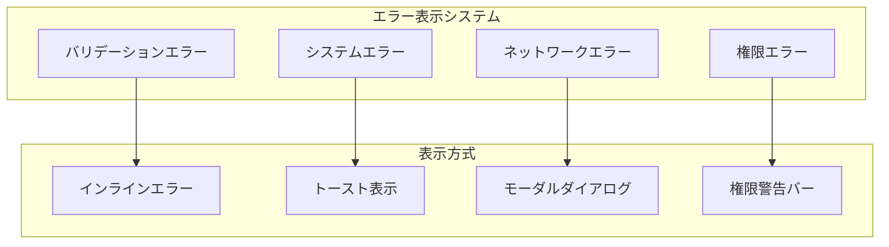

### 4.2 成功・失敗メッセージ
```
成功メッセージ（トースト）:
┌─────────────────────────────────────────────────────────────┐
│ ✅ ユーザー情報を更新しました                                 │  [✕]
└─────────────────────────────────────────────────────────────┘

エラーメッセージ（トースト）:
┌─────────────────────────────────────────────────────────────┐
│ ❌ 更新に失敗しました。再度お試しください                     │  [✕]
└─────────────────────────────────────────────────────────────┘

権限エラー（警告バー）:
┌─────────────────────────────────────────────────────────────┐
│ ⚠️  この操作を実行する権限がありません                        │
└─────────────────────────────────────────────────────────────┘
```

## 5. 状態管理とインタラクション

### 5.1 フォーム状態管理
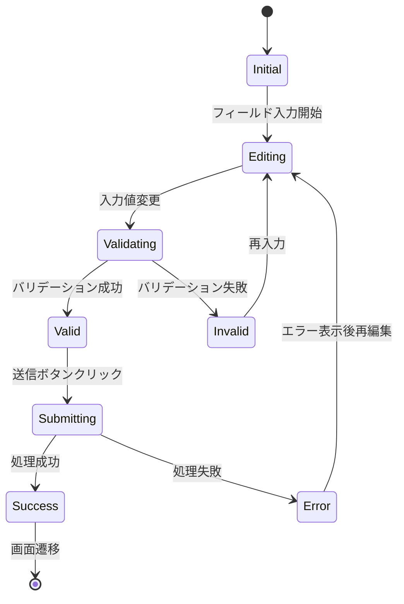

### 5.2 権限制御フロー
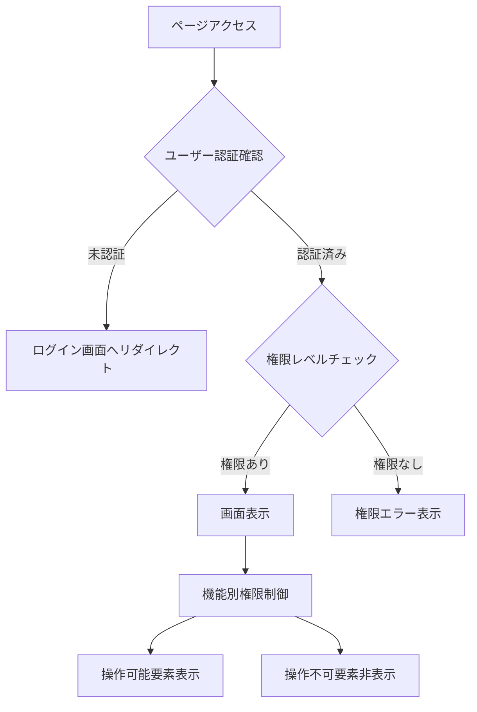

## 6. 技術仕様・注意事項

### 6.1 認証・セキュリティ
- **セッション管理**: ASP.NET Core Identity Cookie認証
- **パスワード要件**: 8文字以上、英数字組み合わせ推奨
- **自動ログイン**: Remember Me機能（24時間）
- **CSRF対策**: ASP.NET Core標準アンチフォージェリトークン
- **XSS対策**: Blazor Server標準エスケープ処理

### 6.2 アクセシビリティ
- **キーボード操作**: Tab順序の適切な設定
- **スクリーンリーダー**: aria-label、role属性の適切な設定
- **色覚サポート**: アイコン併用による情報伝達
- **コントラスト**: WCAG 2.1 AA準拠

### 6.3 レスポンシブ対応
- **ブレークポイント**: 768px（タブレット）、480px（スマートフォン）
- **レイアウト**: Flexbox・Grid Layoutによる柔軟な設計
- **タッチ操作**: 適切なタッチターゲットサイズ（44px以上）

## 7. Blazor Component実装指針

### 7.1 コンポーネント構成
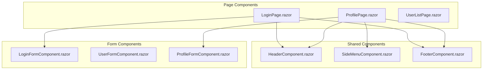

---

**作成者**: Claude Code  
**改善内容**: Mermaid図表によるフロー可視化、構造化ASCII Artによる詳細レイアウト、CSS記述除去  
**次回作業**: プロジェクト・ドメイン管理画面設計書の同様改善