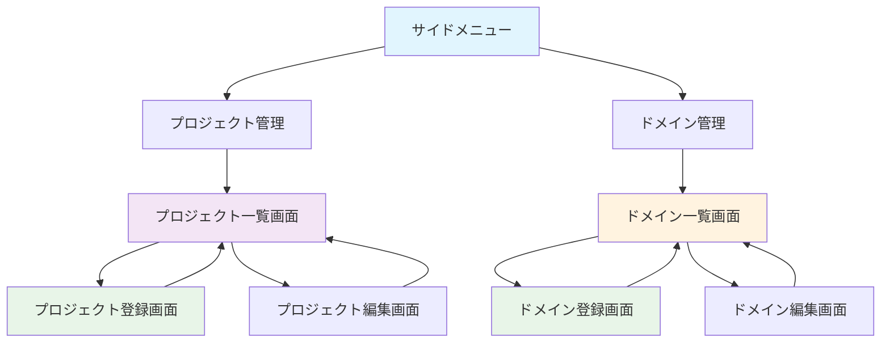
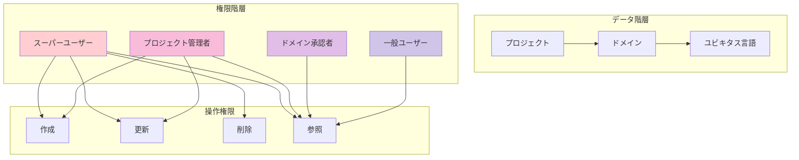
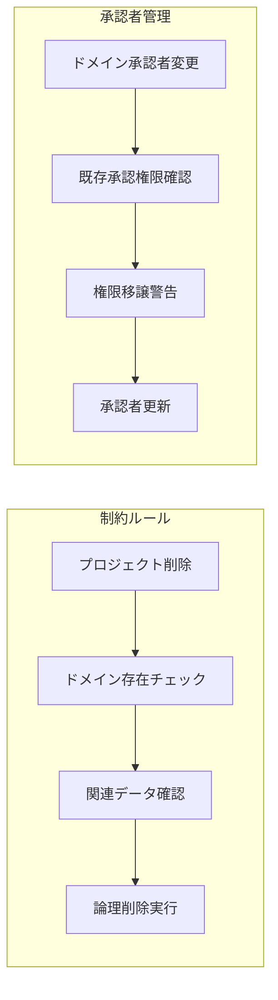

# プロジェクト・ドメイン管理画面設計（Mermaid + 構造化ASCII Art版）

**作成日**: 2025-06-27  
**改善日**: 2025-07-06  
**対象**: ユビキタス言語管理システム  
**カテゴリ**: プロジェクト・ドメイン管理関連画面（6画面）  

## 1. システム全体フロー（Mermaid）

### 1.1 プロジェクト・ドメイン管理フロー全体図


### 1.2 データ関連性・権限制御フロー


### 1.3 データ整合性・制約管理


## 2. 共通レイアウト要素

### 2.1 管理画面基本レイアウト構成
```
┌──────────────────────────────────────────────────────────────┐
│                        Header Area                          │
│  🏢 ユビキタス言語管理システム           👤 田中太郎  [ログアウト] │
└──────────────────────────────────────────────────────────────┘
┌─────────────────┬────────────────────────────────────────────┐
│   Side Menu     │              Main Content                  │
│                 │                                            │
│ ☰ メニュー      │  ┌─────────────────────────────────────┐   │
│                 │  │          🔍 検索・フィルタ           │   │
│ 🏠 ホーム       │  │  📁 プロジェクト: [ECサイト ▼]       │   │
│ ✏️ 入力・編集    │  │  📝 名称: [______] 🗑️ 削除済表示     │   │
│ ✅ 承認         │  │  [🔍 検索] [➕ 新規追加]             │   │
│ 👥 ユーザー管理  │  └─────────────────────────────────────┘   │
│ 📁 プロジェクト  │                                            │
│ 🏷️ ドメイン     │  ┌─────────────────────────────────────┐   │
│ 👤 プロフィール  │  │                                     │   │
│ 🔒 パスワード    │  │         管理データテーブル            │   │
│ 🚪 ログアウト    │  │                                     │   │
│                 │  └─────────────────────────────────────┘   │
└─────────────────┴────────────────────────────────────────────┘
┌──────────────────────────────────────────────────────────────┐
│                         Footer Area                         │
│              © 2025 ユビキタス言語管理システム               │
└──────────────────────────────────────────────────────────────┘
```

### 2.2 権限別アクセス制御
- **表示権限**: プロジェクト管理者以上のロールのみ
- **操作権限**: 
  - **スーパーユーザー**: 全プロジェクト・全ドメインの操作可能
  - **プロジェクト管理者**: 担当プロジェクト・担当ドメインのみ操作可能

### 2.3 共通操作要素
- **新規登録**: 各一覧画面から別画面遷移
- **編集**: 各一覧画面から別画面遷移
- **削除**: 論理削除、削除確認ダイアログ表示
- **削除済み表示**: 検索条件で論理削除済みデータの表示切り替え

## 3. 画面別詳細設計

### 3.1 プロジェクト一覧画面

#### 画面概要
- **目的**: システムが管理するプロジェクトの一覧確認・管理
- **アクセス**: サイドメニュー > プロジェクト管理
- **権限**: プロジェクト管理者以上

#### UI構成
```
┌─ サイドメニュー ─┬─────────────────────────────────────────────┐
│ ☰ メニュー       │           📁 プロジェクト一覧                │
│                  │                                             │
│ 🏠 ホーム        │ ┌─────────────────────────────────────────┐ │
│ ✏️ 入力・編集     │ │            🔍 検索・フィルタ             │ │
│ ✅ 承認          │ │ 📝 プロジェクト名: [________________]     │ │
│ 👥 ユーザー管理   │ │ [🔍 検索] ☐ 削除済みデータを表示         │ │
│ 📁 プロジェクト   │ └─────────────────────────────────────────┘ │
│ 🏷️ ドメイン      │                                             │
│ 👤 プロフィール   │ ┌─────────────────────────────────────────┐ │
│ 🔒 パスワード     │ │              ➕ 新規登録                 │ │
│ 🚪 ログアウト     │ └─────────────────────────────────────────┘ │
│                  │                                             │
│                  │ ┌─────────────────────────────────────────┐ │
│                  │ │📁名称    │📅作成日│👤管理者│🏷️ドメイン数│ │
│                  │ ├─────────┼───────┼───────┼──────────┤ │
│                  │ │ECサイト  │2025/01 │田中    │5個       │ │
│                  │ │在庫管理  │2025/02 │佐藤    │3個       │ │
│                  │ │会計システム│2025/03│鈴木    │2個       │ │
│                  │ │          │       │       │✏️[編集]🗑️[削除]│ │
│                  │ └─────────────────────────────────────────┘ │
│                  │                                             │
│                  │ ┌─────────────────────────────────────────┐ │
│                  │ │   [◀ 前] 1 / 2 ページ [次 ▶]  100件/頁  │ │
│                  │ └─────────────────────────────────────────┘ │
└──────────────────┴─────────────────────────────────────────────┘
```

#### 表示項目・機能
- **一覧表示項目**: 
  - プロジェクト名
  - 作成日
  - プロジェクト管理者（複数の場合は代表者表示）
  - 所属ドメイン数
  - 所属ユーザー数
- **検索・フィルタ**: 
  - プロジェクト名（部分一致）
  - 削除済みデータ表示切り替え
- **ソート機能**: プロジェクト名、作成日
- **操作ボタン**: 編集、削除（論理削除）

#### 動作仕様・権限制御
- **スーパーユーザー**: 
  - 全プロジェクト表示・操作可能
  - 削除操作可能（論理削除）
- **プロジェクト管理者**: 
  - 担当プロジェクトのみ表示・編集可能
  - 削除操作不可（削除ボタン非表示）
- **ページング**: 50/100/200件選択可能

### 3.2 プロジェクト登録画面

#### 画面概要
- **目的**: 新規プロジェクトの登録
- **アクセス**: プロジェクト一覧画面 > 新規登録
- **権限**: スーパーユーザーのみ

#### UI構成
```
┌─ サイドメニュー ─┬─────────────────────────────────────────────┐
│ ☰ メニュー       │           ➕ プロジェクト登録                 │
│                  │                                             │
│ 🏠 ホーム        │ ┌─────────────────────────────────────────┐ │
│ ✏️ 入力・編集     │ │           📋 基本情報                   │ │
│ ✅ 承認          │ │                                         │ │
│ 👥 ユーザー管理   │ │ 📝 プロジェクト名（必須）                 │ │
│ 📁 プロジェクト   │ │ ┌─────────────────────────────────────┐ │ │
│ 🏷️ ドメイン      │ │ │                                     │ │ │
│ 👤 プロフィール   │ │ └─────────────────────────────────────┘ │ │
│ 🔒 パスワード     │ │                                         │ │
│ 🚪 ログアウト     │ │ 📄 説明                                 │ │
│                  │ │ ┌─────────────────────────────────────┐ │ │
│                  │ │ │                                     │ │ │
│                  │ │ │                                     │ │ │
│                  │ │ │                                     │ │ │
│                  │ │ └─────────────────────────────────────┘ │ │
│                  │ │                                         │ │
│                  │ │      ✅ [登録]  ❌ [キャンセル]          │ │
│                  │ └─────────────────────────────────────────┘ │
└──────────────────┴─────────────────────────────────────────────┘
```

#### 入力項目・機能
- **プロジェクト名**: 必須、一意性チェック
- **説明**: 任意、複数行テキスト
- **登録ボタン**: 新規プロジェクト作成
- **キャンセルボタン**: 一覧画面に戻る

#### 動作仕様
- **管理者設定**: プロジェクト作成時は管理者無しの状態で作成
- **管理者割り当て**: 作成後にユーザー編集画面でプロジェクト管理者ロールのユーザーを所属させる
- **バリデーション**: プロジェクト名必須・重複チェック
- **登録成功**: 成功メッセージ、プロジェクト一覧画面に遷移
- **権限チェック**: スーパーユーザー以外はアクセス不可

### 3.3 プロジェクト編集画面

#### 画面概要
- **目的**: 既存プロジェクト情報の編集
- **アクセス**: プロジェクト一覧画面 > 編集ボタン
- **権限**: スーパーユーザー・対象プロジェクトの管理者

#### UI構成
```
┌─ サイドメニュー ─┬─────────────────────────────────────────────┐
│ ☰ メニュー       │           ✏️ プロジェクト編集                 │
│                  │                                             │
│ 🏠 ホーム        │ ┌─────────────────────────────────────────┐ │
│ ✏️ 入力・編集     │ │           📋 基本情報                   │ │
│ ✅ 承認          │ │                                         │ │
│ 👥 ユーザー管理   │ │ 📝 プロジェクト名（必須）                 │ │
│ 📁 プロジェクト   │ │ ┌─────────────────────────────────────┐ │ │
│ 🏷️ ドメイン      │ │ │ ECサイト                            │ │ │
│ 👤 プロフィール   │ │ └─────────────────────────────────────┘ │ │
│ 🔒 パスワード     │ │                                         │ │
│ 🚪 ログアウト     │ │ 📄 説明                                 │ │
│                  │ │ ┌─────────────────────────────────────┐ │ │
│                  │ │ │ ECサイトのユビキタス言語管理            │ │ │
│                  │ │ │ プロジェクトです                        │ │ │
│                  │ │ │                                     │ │ │
│                  │ │ └─────────────────────────────────────┘ │ │
│                  │ │                                         │ │
│                  │ │ 📊 ステータス                           │ │
│                  │ │ ● アクティブ ○ 非アクティブ              │ │
│                  │ │                                         │ │
│                  │ │      ✅ [更新]  ❌ [キャンセル]          │ │
│                  │ └─────────────────────────────────────────┘ │
└──────────────────┴─────────────────────────────────────────────┘
```

#### 入力項目・機能
- **プロジェクト名**: 必須、一意性チェック（自身除く）
- **説明**: 任意、複数行テキスト
- **ステータス**: アクティブ/非アクティブ選択
- **更新ボタン**: プロジェクト情報更新
- **キャンセルボタン**: 一覧画面に戻る

#### 動作仕様
- **初期値**: 既存データを入力欄に表示
- **管理者変更**: ユーザー編集画面でプロジェクト所属を変更することで管理
- **バリデーション**: プロジェクト名必須・重複チェック（自身除く）
- **更新成功**: 成功メッセージ、プロジェクト一覧画面に遷移
- **権限チェック**: スーパーユーザー・担当管理者のみアクセス可

### 3.4 ドメイン一覧画面

#### 画面概要
- **目的**: システムが管理するドメインの一覧確認・管理
- **アクセス**: サイドメニュー > ドメイン管理
- **権限**: プロジェクト管理者以上

#### UI構成
```
┌─ サイドメニュー ─┬─────────────────────────────────────────────┐
│ ☰ メニュー       │            🏷️ ドメイン一覧                  │
│                  │                                             │
│ 🏠 ホーム        │ ┌─────────────────────────────────────────┐ │
│ ✏️ 入力・編集     │ │            🔍 検索・フィルタ             │ │
│ ✅ 承認          │ │ 📁 プロジェクト: [ECサイト     ▼]        │ │
│ 👥 ユーザー管理   │ │ 🏷️ ドメイン名: [__________________]      │ │
│ 📁 プロジェクト   │ │ [🔍 検索] ☐ 削除済みデータを表示         │ │
│ 🏷️ ドメイン      │ └─────────────────────────────────────────┘ │
│ 👤 プロフィール   │                                             │
│ 🔒 パスワード     │ ┌─────────────────────────────────────────┐ │
│ 🚪 ログアウト     │ │              ➕ 新規登録                 │ │
│                  │ └─────────────────────────────────────────┘ │
│                  │                                             │
│                  │ ┌─────────────────────────────────────────┐ │
│                  │ │🏷️名称     │📁プロジェクト│👤承認者│📖用語数│ │
│                  │ ├──────────┼─────────┼───────┼────────┤ │
│                  │ │注文管理    │ECサイト     │田中    │15件    │ │
│                  │ │商品管理    │ECサイト     │佐藤    │8件     │ │
│                  │ │在庫管理    │在庫システム │鈴木    │12件    │ │
│                  │ │           │            │       │✏️[編集]🗑️[削除]│ │
│                  │ └─────────────────────────────────────────┘ │
│                  │                                             │
│                  │ ┌─────────────────────────────────────────┐ │
│                  │ │   [◀ 前] 1 / 3 ページ [次 ▶]  100件/頁  │ │
│                  │ └─────────────────────────────────────────┘ │
└──────────────────┴─────────────────────────────────────────────┘
```

#### 表示項目・機能
- **一覧表示項目**: 
  - ドメイン名
  - 所属プロジェクト名
  - ドメイン承認者（複数の場合は代表者表示）
  - 用語数（承認済み/ドラフト）
  - 作成日
- **検索・フィルタ**: 
  - プロジェクト選択（プルダウン）
  - ドメイン名（部分一致）
  - 削除済みデータ表示切り替え
- **ソート機能**: ドメイン名、プロジェクト名、作成日
- **操作ボタン**: 編集、削除（論理削除）

#### 動作仕様・権限制御
- **スーパーユーザー**: 
  - 全プロジェクトのドメイン表示・操作可能
  - 削除操作可能（論理削除）
- **プロジェクト管理者**: 
  - 担当プロジェクトのドメインのみ表示・操作可能
  - 削除操作可能（論理削除）

### 3.5 ドメイン登録画面

#### 画面概要
- **目的**: 新規ドメインの登録
- **アクセス**: ドメイン一覧画面 > 新規登録
- **権限**: プロジェクト管理者以上

#### UI構成
```
┌─ サイドメニュー ─┬─────────────────────────────────────────────┐
│ ☰ メニュー       │            ➕ ドメイン登録                   │
│                  │                                             │
│ 🏠 ホーム        │ ┌─────────────────────────────────────────┐ │
│ ✏️ 入力・編集     │ │           📋 基本情報                   │ │
│ ✅ 承認          │ │                                         │ │
│ 👥 ユーザー管理   │ │ 📁 プロジェクト（必須）                   │ │
│ 📁 プロジェクト   │ │ [ECサイト                      ▼]       │ │
│ 🏷️ ドメイン      │ │                                         │ │
│ 👤 プロフィール   │ │ 🏷️ ドメイン名（必須）                    │ │
│ 🔒 パスワード     │ │ ┌─────────────────────────────────────┐ │ │
│ 🚪 ログアウト     │ │ │                                     │ │ │
│                  │ │ └─────────────────────────────────────┘ │ │
│                  │ │                                         │ │
│                  │ │ 📄 説明                                 │ │
│                  │ │ ┌─────────────────────────────────────┐ │ │
│                  │ │ │                                     │ │ │
│                  │ │ │                                     │ │ │
│                  │ │ └─────────────────────────────────────┘ │ │
│                  │ │                                         │ │
│                  │ │ 👤 ドメイン承認者（必須）                 │ │
│                  │ │ ☐ 田中太郎 ☐ 佐藤花子 ☐ 鈴木一郎        │ │
│                  │ │ ☐ 高橋美香 ☐ 伊藤健太                   │ │
│                  │ │                                         │ │
│                  │ │      ✅ [登録]  ❌ [キャンセル]          │ │
│                  │ └─────────────────────────────────────────┘ │
└──────────────────┴─────────────────────────────────────────────┘
```

#### 入力項目・機能
- **プロジェクト**: 必須、プルダウン選択
- **ドメイン名**: 必須、プロジェクト内一意性チェック
- **説明**: 任意、複数行テキスト
- **ドメイン承認者**: 必須、複数選択可能（チェックボックス）
- **登録ボタン**: 新規ドメイン作成
- **キャンセルボタン**: 一覧画面に戻る

#### 動作仕様・権限制御
- **プロジェクト選択肢**: 
  - スーパーユーザー: 全プロジェクト表示
  - プロジェクト管理者: 担当プロジェクトのみ表示
- **承認者選択肢**: 選択したプロジェクトに所属するユーザーのみ表示
- **バリデーション**: 
  - ドメイン名必須・プロジェクト内重複チェック
  - 承認者最低1名選択必須

### 3.6 ドメイン編集画面

#### 画面概要
- **目的**: 既存ドメイン情報の編集
- **アクセス**: ドメイン一覧画面 > 編集ボタン
- **権限**: スーパーユーザー・対象プロジェクトの管理者

#### UI構成
```
┌─ サイドメニュー ─┬─────────────────────────────────────────────┐
│ ☰ メニュー       │            ✏️ ドメイン編集                   │
│                  │                                             │
│ 🏠 ホーム        │ ┌─────────────────────────────────────────┐ │
│ ✏️ 入力・編集     │ │           📋 基本情報                   │ │
│ ✅ 承認          │ │                                         │ │
│ 👥 ユーザー管理   │ │ 📁 プロジェクト（変更不可）               │ │
│ 📁 プロジェクト   │ │ ECサイト                                │ │
│ 🏷️ ドメイン      │ │                                         │ │
│ 👤 プロフィール   │ │ 🏷️ ドメイン名（必須）                    │ │
│ 🔒 パスワード     │ │ ┌─────────────────────────────────────┐ │ │
│ 🚪 ログアウト     │ │ │ 注文管理                            │ │ │
│                  │ │ └─────────────────────────────────────┘ │ │
│                  │ │                                         │ │
│                  │ │ 📄 説明                                 │ │
│                  │ │ ┌─────────────────────────────────────┐ │ │
│                  │ │ │ 顧客の注文処理を管理するドメイン領域    │ │ │
│                  │ │ │                                     │ │ │
│                  │ │ └─────────────────────────────────────┘ │ │
│                  │ │                                         │ │
│                  │ │ 👤 ドメイン承認者（必須）                 │ │
│                  │ │ ☑ 田中太郎 ☐ 佐藤花子 ☐ 鈴木一郎        │ │
│                  │ │ ☑ 高橋美香 ☐ 伊藤健太                   │ │
│                  │ │                                         │ │
│                  │ │ 📊 ステータス                           │ │
│                  │ │ ● アクティブ ○ 非アクティブ              │ │
│                  │ │                                         │ │
│                  │ │      ✅ [更新]  ❌ [キャンセル]          │ │
│                  │ └─────────────────────────────────────────┘ │
└──────────────────┴─────────────────────────────────────────────┘
```

#### 入力項目・機能
- **プロジェクト**: 表示のみ（変更不可）
- **ドメイン名**: 必須、プロジェクト内一意性チェック（自身除く）
- **説明**: 任意、複数行テキスト
- **ドメイン承認者**: 必須、複数選択可能
- **ステータス**: アクティブ/非アクティブ選択
- **更新ボタン**: ドメイン情報更新
- **キャンセルボタン**: 一覧画面に戻る

#### 動作仕様
- **初期値**: 既存データを入力欄に表示
- **承認者変更**: 既存承認者の承認権限に影響する旨の警告表示
- **バリデーション**: 登録画面と同様
- **更新成功**: 成功メッセージ、ドメイン一覧画面に遷移

## 4. 画面遷移図

```
サイドメニュー
├─ プロジェクト管理
│   ↓
│  プロジェクト一覧画面
│   ├─ [新規登録] → プロジェクト登録画面 → [登録] → プロジェクト一覧画面
│   └─ [編集] → プロジェクト編集画面 → [更新] → プロジェクト一覧画面
│
└─ ドメイン管理
    ↓
   ドメイン一覧画面
    ├─ [新規登録] → ドメイン登録画面 → [登録] → ドメイン一覧画面
    └─ [編集] → ドメイン編集画面 → [更新] → ドメイン一覧画面
```

## 5. データ関連性・整合性

### 5.1 プロジェクト・ドメイン関係
- **関係**: 1つのプロジェクトは複数のドメインを持つ（1対多）
- **制約**: ドメイン削除時は所属する用語への影響確認が必要
- **整合性**: プロジェクト削除時は所属ドメイン・用語も論理削除

### 5.2 ユーザー・プロジェクト・ドメイン関係
- **プロジェクト管理者**: 複数プロジェクトを担当可能（多対多）
- **ドメイン承認者**: 複数ドメインを担当可能（多対多、プロジェクト跨ぎ可）
- **データ整合性**: ユーザー削除時は管理者・承認者の引き継ぎは不要（論理削除で対応）

## 6. エラーハンドリング・バリデーション

### 6.1 一意性制約
- **プロジェクト名**: システム全体で一意
- **ドメイン名**: プロジェクト内で一意
- **エラー表示**: 吹き出し型ポップアップ（Firebrick色）

### 6.2 参照整合性エラー
- **削除制約**: 関連データ（ドメイン・用語）がある場合の削除不可
- **警告表示**: 削除前の確認ダイアログで関連データ数を表示
- **メッセージ例**: 「このプロジェクトには3つのドメインと15の用語が含まれています。削除してもよろしいですか？」

### 6.3 権限エラー
- **アクセス拒否**: 権限がない画面・操作へのアクセス時
- **表示制御**: 権限がないボタン・メニューの非表示化
- **エラーメッセージ**: 「この操作の権限がありません」

## 7. セキュリティ・パフォーマンス

### 7.1 権限チェック
- **画面レベル**: 各画面アクセス時の権限確認
- **操作レベル**: CRUD操作時の詳細権限確認
- **データフィルタ**: 表示データの権限ベースフィルタリング

### 7.2 パフォーマンス考慮
- **遅延ロード**: 大量データの段階的ロード
- **キャッシュ**: ユーザー権限情報のセッションキャッシュ
- **インデックス**: 検索条件に対応したDBインデックス設計

## 8. 技術仕様・実装注意事項

### 8.1 多対多関係の実装
- **中間テーブル**: ユーザー-プロジェクト、ユーザー-ドメインの関連管理
- **Entity Framework**: Navigation Property を活用した関係管理
- **業務ルール**: 1つのプロジェクト・ドメインに最低1名の管理者・承認者必須

### 8.2 論理削除の実装
- **削除フラグ**: IsDeleted カラムによる論理削除
- **削除日時**: DeletedAt カラムで削除タイミング記録
- **削除者**: DeletedBy カラムで削除実行者記録
- **表示制御**: デフォルトは削除済み非表示、フィルタで表示切り替え

### 8.3 監査ログ
- **変更履歴**: 重要なマスタデータの変更履歴記録
- **操作ログ**: 誰がいつ何を変更したかの記録
- **セキュリティ**: 不正操作の検出・追跡

---

**作成者**: Claude Code  
**改善内容**: Mermaid図表によるデータ関連性・権限制御フロー可視化、構造化ASCII Art（絵文字アイコン）による直感的管理画面表現、削除・承認者管理の制約ルール明確化  
**実装準備**: 多対多関係管理、論理削除機構、権限ベースアクセス制御の具体的設計完了