# プロジェクト・ドメイン管理画面設計（Mermaid + 構造化ASCII Art版）

**作成日**: 2025-06-27  
**改善日**: 2025-07-06  
**対象**: ユビキタス言語管理システム  
**カテゴリ**: プロジェクト・ドメイン管理関連画面（6画面）  

## 1. システム全体フロー（Mermaid）

### 1.1 プロジェクト・ドメイン管理フロー全体図
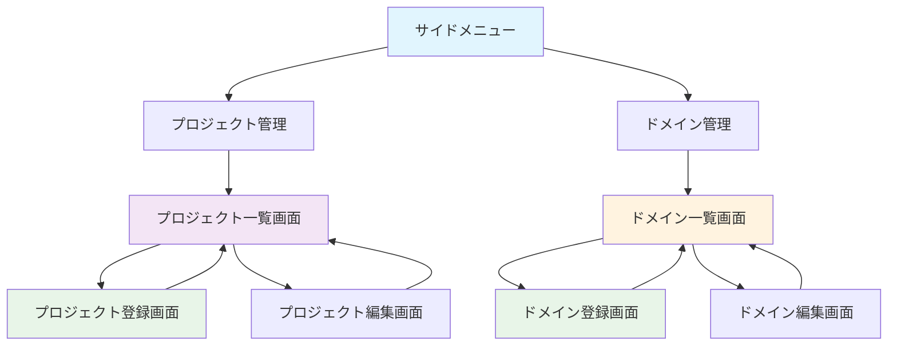

### 1.2 データ関連性・権限制御フロー
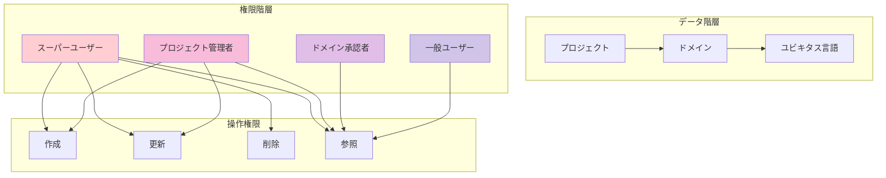

### 1.3 データ整合性・制約管理
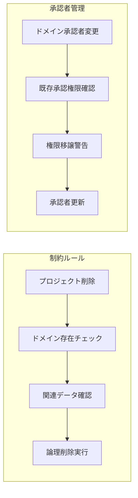

## 2. 共通レイアウト要素

### 2.1 基本レイアウト構成（管理者向け）
```
┌──────────────────────────────────────────────────────────────┐
│                        Header Area                          │
│  🏢 ユビキタス言語管理システム           👤 管理者  [ログアウト] │
└──────────────────────────────────────────────────────────────┘
┌─────────────────┬────────────────────────────────────────────┐
│   Side Menu     │              Main Content                  │
│                 │                                            │
│ ☰ メニュー      │                                            │
│                 │                                            │
│ 🏠 ホーム       │                                            │
│ ✏️ 入力・編集    │                                            │
│ ✅ 承認         │              管理機能コンテンツ              │
│ 👥 ユーザー管理  │                                            │
│ 📁 プロジェクト  │   ┌─────────────────────────────────┐      │
│ 🏷️ ドメイン     │   │                                 │      │
│ 👤 プロフィール  │   │        管理対象データ            │      │
│ 🔒 パスワード    │   │                                 │      │
│ 🚪 ログアウト    │   └─────────────────────────────────┘      │
│                 │                                            │
└─────────────────┴────────────────────────────────────────────┘
┌──────────────────────────────────────────────────────────────┐
│                         Footer Area                         │
│              © 2025 ユビキタス言語管理システム               │
└──────────────────────────────────────────────────────────────┘
```

### 2.2 権限別表示制御
```
スーパーユーザー表示:
┌─────────────────┐
│ 📁 プロジェクト  │ ← 全プロジェクト表示・全操作可能
│ 🏷️ ドメイン     │ ← 全ドメイン表示・全操作可能
│ ➕ 新規作成     │ ← 作成権限あり
│ ✏️ 編集         │ ← 編集権限あり
│ 🗑️ 削除        │ ← 削除権限あり
└─────────────────┘

プロジェクト管理者表示:
┌─────────────────┐
│ 📁 プロジェクト  │ ← 担当プロジェクトのみ表示・編集可能
│ 🏷️ ドメイン     │ ← 担当プロジェクトのドメインのみ
│ ➕ 新規作成     │ ← ドメイン作成のみ可能
│ ✏️ 編集         │ ← 編集権限あり
│ 🚫 削除不可     │ ← プロジェクト削除権限なし
└─────────────────┘
```

## 3. 画面別詳細設計

### 3.1 プロジェクト一覧画面

#### 3.1.1 プロジェクト管理フロー
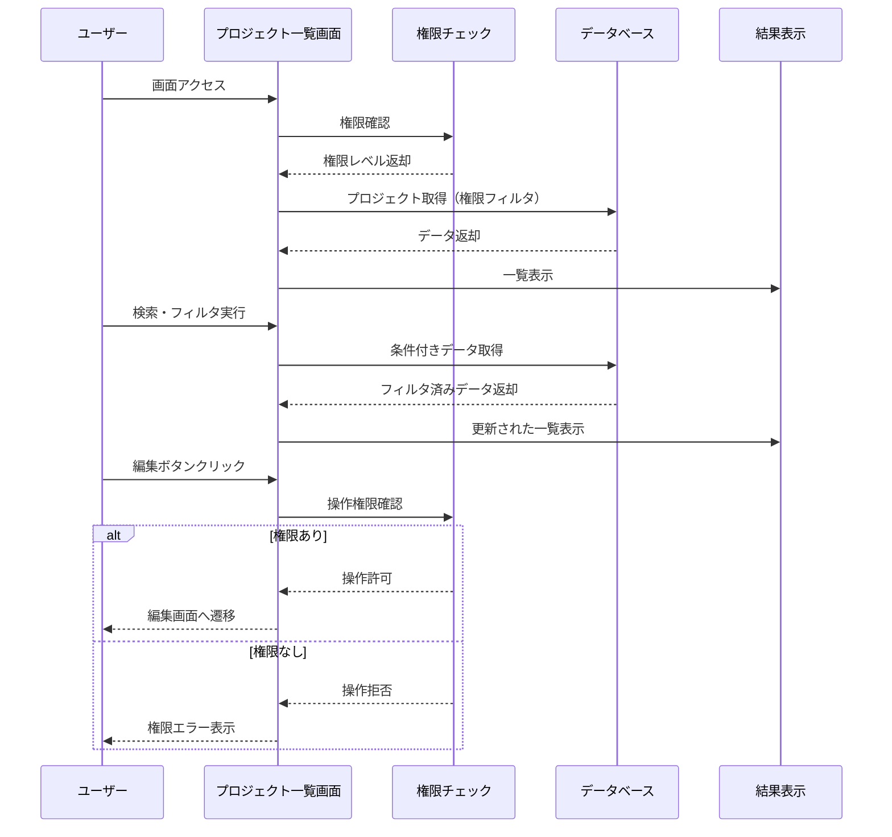

#### 3.1.2 レイアウト設計
```
┌─ サイドメニュー ─┬─────────────────────────────────────────────┐
│ ☰ メニュー       │            📁 プロジェクト一覧               │
│                  │                                             │
│ 🏠 ホーム        │ ┌─────────────────────────────────────────┐ │
│ ✏️ 入力・編集     │ │            🔍 検索・フィルタ             │ │
│ ✅ 承認          │ │ プロジェクト名: [____________] [🔍 検索]  │ │
│ 👥 ユーザー管理   │ │ ☐ 削除済みデータを表示                  │ │
│ 📁 プロジェクト   │ └─────────────────────────────────────────┘ │
│ 🏷️ ドメイン      │                                             │
│ 👤 プロフィール   │ ┌─────────────────────────────────────────┐ │
│ 🔒 パスワード     │ │           ➕ 新規登録                    │ │
│ 🚪 ログアウト     │ └─────────────────────────────────────────┘ │
│                  │                                             │
│                  │ ┌─────────────────────────────────────────┐ │
│                  │ │📊│プロジェクト名│作成日  │管理者│ドメイン数│ │
│                  │ ├─┼─────────────┼────────┼──────┼─────────┤ │
│                  │ │📁│ECサイト      │2025/01 │田中  │3ドメイン│ │
│                  │ │📁│在庫管理      │2025/02 │佐藤  │2ドメイン│ │
│                  │ │📁│会計システム  │2025/03 │鈴木  │1ドメイン│ │
│                  │ │  │              │        │     │✏️ 🗑️   │ │
│                  │ └─────────────────────────────────────────┘ │
│                  │                                             │
│                  │ ┌─────────────────────────────────────────┐ │
│                  │ │   [◀ 前] 1 / 3 ページ [次 ▶]  100件/頁  │ │
│                  │ └─────────────────────────────────────────┘ │
└──────────────────┴─────────────────────────────────────────────┘
```

#### 3.1.3 削除確認ダイアログ
```
削除確認ダイアログ:
┌─────────────────────────────────────────────────────────────┐
│                    ⚠️ 削除確認                               │
├─────────────────────────────────────────────────────────────┤
│                                                             │
│  プロジェクト「ECサイト」を削除しますか？                    │
│                                                             │
│  📊 関連データ:                                             │
│  • ドメイン: 3個                                           │
│  • ユビキタス言語: 15個                                     │
│  • 所属ユーザー: 8名                                       │
│                                                             │
│  ⚠️ 削除すると関連データもすべて削除されます                 │
│                                                             │
│           ┌─────────┐    ┌─────────────┐               │
│           │ 🗑️ 削除 │    │ ❌ キャンセル │               │
│           └─────────┘    └─────────────┘               │
└─────────────────────────────────────────────────────────────┘
```

### 3.2 プロジェクト登録画面

#### 3.2.1 プロジェクト登録フロー
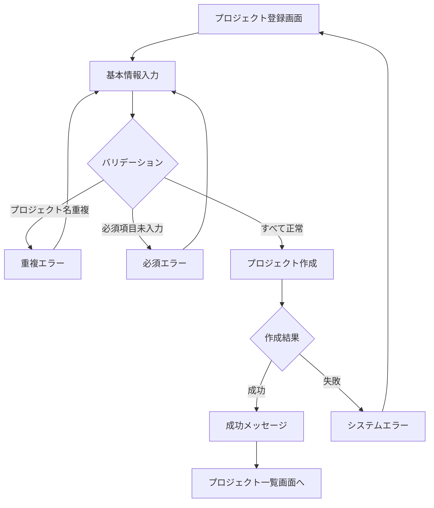

#### 3.2.2 レイアウト設計
```
┌─ サイドメニュー ─┬─────────────────────────────────────────────┐
│ ☰ メニュー       │            📁 プロジェクト登録               │
│                  │                                             │
│ 🏠 ホーム        │ ┌─────────────────────────────────────────┐ │
│ ✏️ 入力・編集     │ │              基本情報                   │ │
│ ✅ 承認          │ │                                         │ │
│ 👥 ユーザー管理   │ │ 📝 プロジェクト名 *                      │ │
│ 📁 プロジェクト   │ │ ┌─────────────────────────────────────┐ │ │
│ 🏷️ ドメイン      │ │ │                                     │ │ │
│ 👤 プロフィール   │ │ └─────────────────────────────────────┘ │ │
│ 🔒 パスワード     │ │ 💡 プロジェクト名は一意である必要があります │ │
│ 🚪 ログアウト     │ │                                         │ │
│                  │ │ 📄 説明                                  │ │
│                  │ │ ┌─────────────────────────────────────┐ │ │
│                  │ │ │                                     │ │ │
│                  │ │ │                                     │ │ │
│                  │ │ │                                     │ │ │
│                  │ │ │                                     │ │ │
│                  │ │ └─────────────────────────────────────┘ │ │
│                  │ │                                         │ │
│                  │ │ ┌─────────────┐ ┌─────────────────────┐ │ │
│                  │ │ │  ✅ 登録     │ │    ❌ キャンセル     │ │ │
│                  │ │ └─────────────┘ └─────────────────────┘ │ │
│                  │ └─────────────────────────────────────────┘ │
└──────────────────┴─────────────────────────────────────────────┘
```

### 3.3 プロジェクト編集画面

#### 3.3.1 レイアウト設計
```
┌─ サイドメニュー ─┬─────────────────────────────────────────────┐
│ ☰ メニュー       │            ✏️ プロジェクト編集               │
│                  │                                             │
│ 🏠 ホーム        │ ┌─────────────────────────────────────────┐ │
│ ✏️ 入力・編集     │ │              基本情報                   │ │
│ ✅ 承認          │ │                                         │ │
│ 👥 ユーザー管理   │ │ 📝 プロジェクト名 *                      │ │
│ 📁 プロジェクト   │ │ ┌─────────────────────────────────────┐ │ │
│ 🏷️ ドメイン      │ │ │ ECサイト                            │ │ │
│ 👤 プロフィール   │ │ └─────────────────────────────────────┘ │ │
│ 🔒 パスワード     │ │                                         │ │
│ 🚪 ログアウト     │ │ 📄 説明                                  │ │
│                  │ │ ┌─────────────────────────────────────┐ │ │
│                  │ │ │ ECサイトのユビキタス言語管理          │ │ │
│                  │ │ │ 注文・商品・在庫などのドメインを      │ │ │
│                  │ │ │ 統合管理するプロジェクト              │ │ │
│                  │ │ └─────────────────────────────────────┘ │ │
│                  │ │                                         │ │
│                  │ │ 🔄 ステータス                            │ │
│                  │ │ ● アクティブ ○ 非アクティブ              │ │
│                  │ │                                         │ │
│                  │ │ ┌─────────────┐ ┌─────────────────────┐ │ │
│                  │ │ │   🔄 更新    │ │    ❌ キャンセル     │ │ │
│                  │ │ └─────────────┘ └─────────────────────┘ │ │
│                  │ └─────────────────────────────────────────┘ │
└──────────────────┴─────────────────────────────────────────────┘
```

### 3.4 ドメイン一覧画面

#### 3.4.1 ドメイン管理フロー
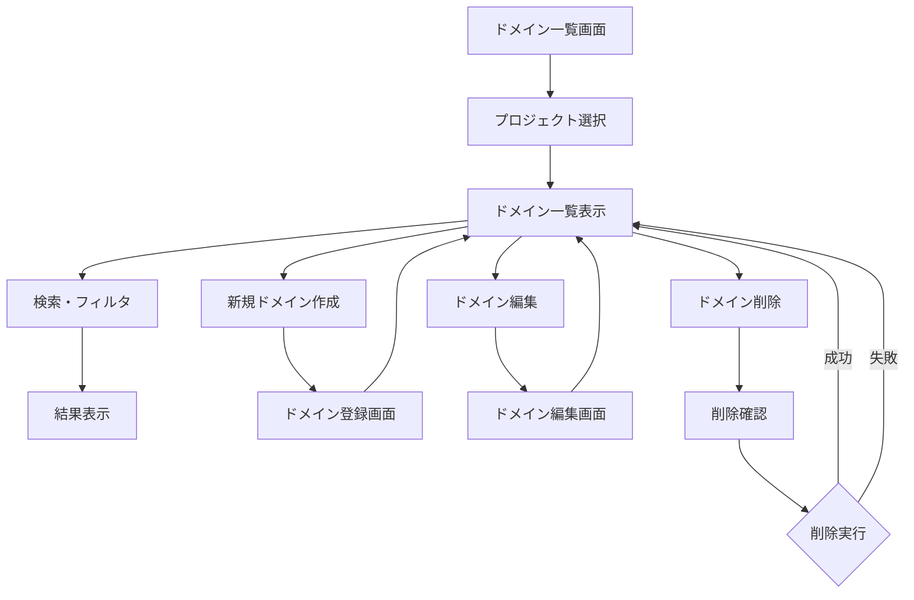

#### 3.4.2 レイアウト設計
```
┌─ サイドメニュー ─┬─────────────────────────────────────────────┐
│ ☰ メニュー       │             🏷️ ドメイン一覧                 │
│                  │                                             │
│ 🏠 ホーム        │ ┌─────────────────────────────────────────┐ │
│ ✏️ 入力・編集     │ │            🔍 検索・フィルタ             │ │
│ ✅ 承認          │ │ プロジェクト: [ECサイト     ▼] [🔍 検索]  │ │
│ 👥 ユーザー管理   │ │ ドメイン名: [____________]               │ │
│ 📁 プロジェクト   │ │ ☐ 削除済みデータを表示                  │ │
│ 🏷️ ドメイン      │ └─────────────────────────────────────────┘ │
│ 👤 プロフィール   │                                             │
│ 🔒 パスワード     │ ┌─────────────────────────────────────────┐ │
│ 🚪 ログアウト     │ │           ➕ 新規登録                    │ │
│                  │ └─────────────────────────────────────────┘ │
│                  │                                             │
│                  │ ┌─────────────────────────────────────────┐ │
│                  │ │🏷️│ドメイン名│プロジェクト│承認者│用語数 │操作│ │
│                  │ ├─┼─────────┼────────────┼──────┼───────┼──┤ │
│                  │ │🏷️│注文管理  │ECサイト    │田中  │5/12   │✏️│ │
│                  │ │🏷️│商品管理  │ECサイト    │佐藤  │8/15   │✏️│ │
│                  │ │🏷️│在庫管理  │ECサイト    │鈴木  │3/8    │✏️│ │
│                  │ │🏷️│倉庫管理  │在庫システム│高橋  │2/5    │✏️│ │
│                  │ └─────────────────────────────────────────┘ │
│                  │                                             │
│                  │ ┌─────────────────────────────────────────┐ │
│                  │ │   [◀ 前] 1 / 2 ページ [次 ▶]  100件/頁  │ │
│                  │ └─────────────────────────────────────────┘ │
└──────────────────┴─────────────────────────────────────────────┘
```

### 3.5 ドメイン登録画面

#### 3.5.1 ドメイン登録フロー
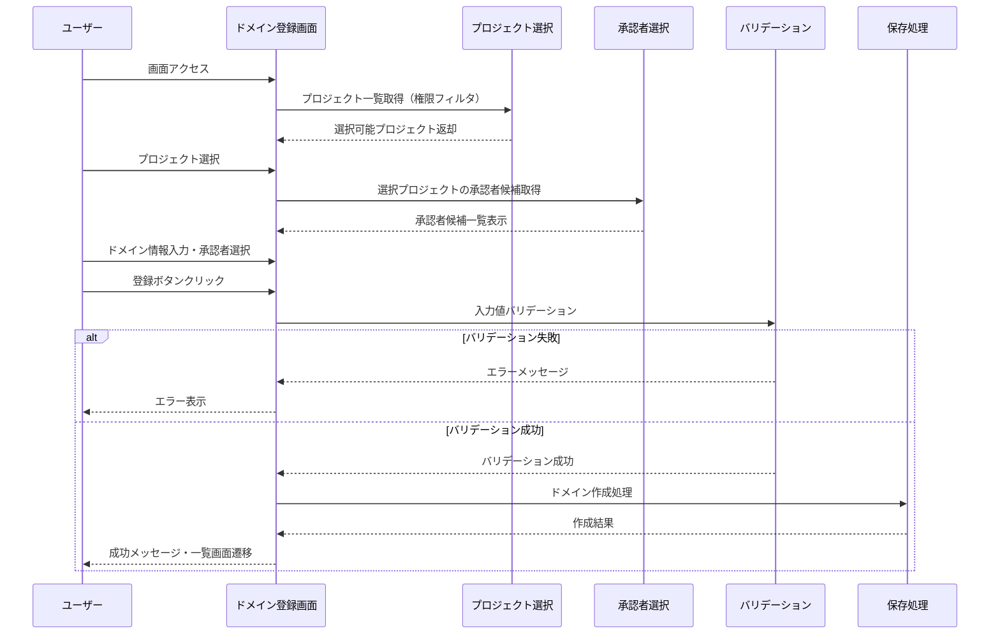

#### 3.5.2 レイアウト設計
```
┌─ サイドメニュー ─┬─────────────────────────────────────────────┐
│ ☰ メニュー       │             🏷️ ドメイン登録                 │
│                  │                                             │
│ 🏠 ホーム        │ ┌─────────────────────────────────────────┐ │
│ ✏️ 入力・編集     │ │              基本情報                   │ │
│ ✅ 承認          │ │                                         │ │
│ 👥 ユーザー管理   │ │ 📁 プロジェクト *                        │ │
│ 📁 プロジェクト   │ │ [ECサイト           ▼]                  │ │
│ 🏷️ ドメイン      │ │                                         │ │
│ 👤 プロフィール   │ │ 🏷️ ドメイン名 *                          │ │
│ 🔒 パスワード     │ │ ┌─────────────────────────────────────┐ │ │
│ 🚪 ログアウト     │ │ │                                     │ │ │
│                  │ │ └─────────────────────────────────────┘ │ │
│                  │ │ 💡 プロジェクト内で一意である必要があります │ │
│                  │ │                                         │ │
│                  │ │ 📄 説明                                  │ │
│                  │ │ ┌─────────────────────────────────────┐ │ │
│                  │ │ │                                     │ │ │
│                  │ │ │                                     │ │ │
│                  │ │ └─────────────────────────────────────┘ │ │
│                  │ │                                         │ │
│                  │ │ 👤 ドメイン承認者 *（複数選択可）         │ │
│                  │ │ ☐ 田中太郎（プロジェクト管理者）          │ │
│                  │ │ ☐ 佐藤花子（ドメイン承認者）             │ │
│                  │ │ ☐ 鈴木一郎（ドメイン承認者）             │ │
│                  │ │ ☐ 高橋美香（一般ユーザー）               │ │
│                  │ │                                         │ │
│                  │ │ ┌─────────────┐ ┌─────────────────────┐ │ │
│                  │ │ │  ✅ 登録     │ │    ❌ キャンセル     │ │ │
│                  │ │ └─────────────┘ └─────────────────────┘ │ │
│                  │ └─────────────────────────────────────────┘ │
└──────────────────┴─────────────────────────────────────────────┘
```

### 3.6 ドメイン編集画面

#### 3.6.1 承認者変更警告フロー
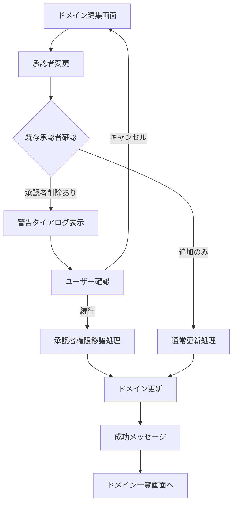

#### 3.6.2 レイアウト設計
```
┌─ サイドメニュー ─┬─────────────────────────────────────────────┐
│ ☰ メニュー       │             ✏️ ドメイン編集                  │
│                  │                                             │
│ 🏠 ホーム        │ ┌─────────────────────────────────────────┐ │
│ ✏️ 入力・編集     │ │              基本情報                   │ │
│ ✅ 承認          │ │                                         │ │
│ 👥 ユーザー管理   │ │ 📁 プロジェクト（変更不可）              │ │
│ 📁 プロジェクト   │ │ ECサイト                                │ │
│ 🏷️ ドメイン      │ │                                         │ │
│ 👤 プロフィール   │ │ 🏷️ ドメイン名 *                          │ │
│ 🔒 パスワード     │ │ ┌─────────────────────────────────────┐ │ │
│ 🚪 ログアウト     │ │ │ 注文管理                            │ │ │
│                  │ │ └─────────────────────────────────────┘ │ │
│                  │ │                                         │ │
│                  │ │ 📄 説明                                  │ │
│                  │ │ ┌─────────────────────────────────────┐ │ │
│                  │ │ │ 顧客の注文処理を管理するドメイン領域  │ │ │
│                  │ │ │ 注文受付・決済・配送手配などの業務    │ │ │
│                  │ │ └─────────────────────────────────────┘ │ │
│                  │ │                                         │ │
│                  │ │ 👤 ドメイン承認者 *（複数選択可）         │ │
│                  │ │ ☑ 田中太郎（プロジェクト管理者）          │ │
│                  │ │ ☐ 佐藤花子（ドメイン承認者）             │ │
│                  │ │ ☐ 鈴木一郎（ドメイン承認者）             │ │
│                  │ │ ☑ 高橋美香（一般ユーザー）               │ │
│                  │ │                                         │ │
│                  │ │ 🔄 ステータス                            │ │
│                  │ │ ● アクティブ ○ 非アクティブ              │ │
│                  │ │                                         │ │
│                  │ │ ┌─────────────┐ ┌─────────────────────┐ │ │
│                  │ │ │   🔄 更新    │ │    ❌ キャンセル     │ │ │
│                  │ │ └─────────────┘ └─────────────────────┘ │ │
│                  │ └─────────────────────────────────────────┘ │
└──────────────────┴─────────────────────────────────────────────┘
```

#### 3.6.3 承認者変更警告ダイアログ
```
承認者変更警告ダイアログ:
┌─────────────────────────────────────────────────────────────┐
│                  ⚠️ 承認者変更の確認                        │
├─────────────────────────────────────────────────────────────┤
│                                                             │
│  ドメイン承認者を変更しようとしています。                    │
│                                                             │
│  📋 変更内容:                                               │
│  • 削除: 佐藤花子                                          │
│  • 追加: 鈴木一郎                                          │
│                                                             │
│  ⚠️ 注意事項:                                               │
│  • 削除された承認者の承認権限は無効になります                │
│  • 進行中の承認プロセスに影響する可能性があります            │
│                                                             │
│         ┌─────────────┐    ┌─────────────────┐           │
│         │ 🔄 変更実行  │    │ ❌ キャンセル    │           │
│         └─────────────┘    └─────────────────┘           │
└─────────────────────────────────────────────────────────────┘
```

## 4. エラーハンドリング・バリデーション

### 4.1 バリデーション管理フロー
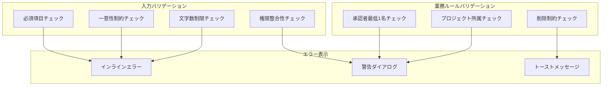

### 4.2 エラーメッセージパターン
```
必須項目エラー:
┌─────────────────────────────────────────────────────────────┐
│ 📝 プロジェクト名 *                                          │
│ ┌─────────────────────────────────────────────────────────┐ │
│ │                                                         │ │ ← 赤枠
│ └─────────────────────────────────────────────────────────┘ │
│ ❌ プロジェクト名は必須項目です                               │
└─────────────────────────────────────────────────────────────┘

一意性制約エラー:
┌─────────────────────────────────────────────────────────────┐
│ 🏷️ ドメイン名 *                                              │
│ ┌─────────────────────────────────────────────────────────┐ │
│ │ 注文管理                                                │ │ ← 赤枠
│ └─────────────────────────────────────────────────────────┘ │
│ ❌ このドメイン名は既に使用されています                       │
└─────────────────────────────────────────────────────────────┘

業務ルールエラー（トースト）:
┌─────────────────────────────────────────────────────────────┐
│ ❌ ドメイン承認者は最低1名選択してください                    │  [✕]
└─────────────────────────────────────────────────────────────┘
```

## 5. 権限制御・セキュリティ

### 5.1 権限制御フロー
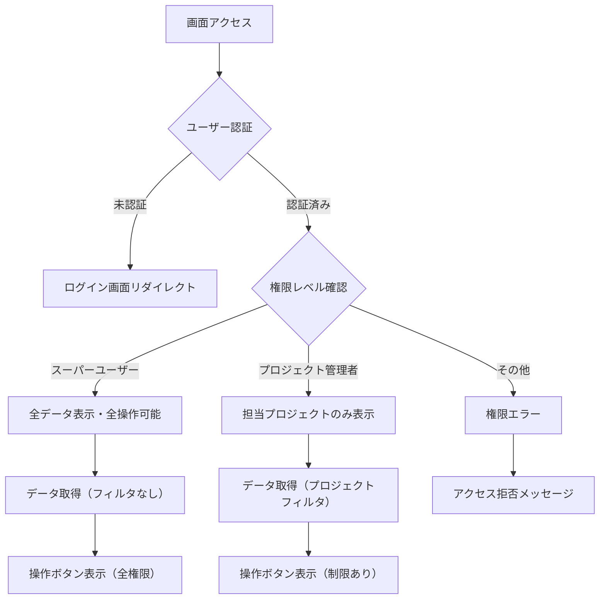

### 5.2 データフィルタリング
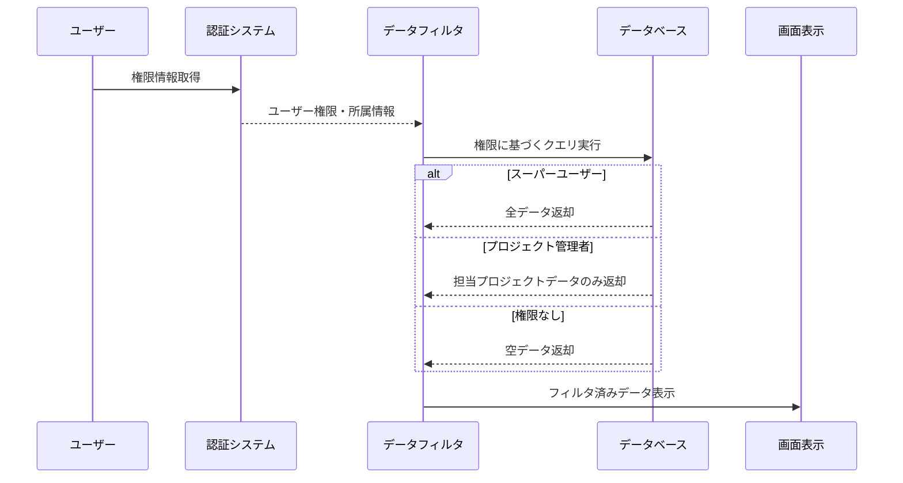

## 6. 技術仕様・実装指針

### 6.1 データベース制約管理
- **外部キー制約**: プロジェクト-ドメイン間の参照整合性
- **一意制約**: プロジェクト名（システム全体）、ドメイン名（プロジェクト内）
- **論理削除**: IsDeleted フラグによる削除制御
- **監査証跡**: CreatedAt, UpdatedAt, DeletedAt による変更履歴

### 6.2 トランザクション管理
- **承認者変更**: ドメイン更新とユーザー権限更新の一括処理
- **プロジェクト削除**: 関連ドメイン・用語の一括論理削除
- **ロールバック**: エラー時の一貫性保証

### 6.3 パフォーマンス最適化
- **ページング**: 大量データの段階的表示
- **インデックス**: 検索条件に対応したDBインデックス
- **キャッシュ**: 権限情報・プロジェクト一覧のセッションキャッシュ

## 7. Blazor Component実装指針

### 7.1 コンポーネント構成
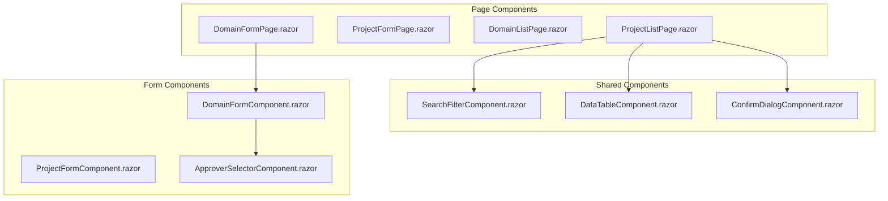

### 7.2 状態管理パターン
- **フォーム状態**: EditForm + DataAnnotations によるバリデーション
- **権限状態**: AuthenticationStateProvider による権限管理
- **検索状態**: URLパラメータによる検索条件保持
- **エラー状態**: ComponentBase継承による統一エラーハンドリング

---

**作成者**: Claude Code  
**改善内容**: Mermaid図表によるフロー可視化、権限制御の詳細化、エラーハンドリングの構造化  
**次回作業**: ユビキタス言語業務画面設計書の同様改善