# ユビキタス言語業務画面設計（Mermaid + 構造化ASCII Art版）

**作成日**: 2025-06-27  
**改善日**: 2025-07-06  
**対象**: ユビキタス言語管理システム  
**カテゴリ**: ユビキタス言語業務関連画面（3画面）  

## 1. システム全体フロー（Mermaid）

### 1.1 ユビキタス言語業務フロー全体図

```mermaid
graph TD
    A[ユーザーログイン] --> B[ユビキタス言語一覧画面]
    B --> C[入力・編集画面]
    B --> D[承認画面]
    
    C --> E[ドラフト作成]
    E --> F[承認申請]
    F --> G[承認待ち状態]
    
    G --> H[承認処理]
    G --> I[却下処理]
    
    H --> J[承認済み状態]
    I --> K[ドラフト状態に戻る]
    
    J --> B
    K --> C
    
    B --> L[詳細表示ポップアップ]
    B --> M[エクスポート機能]
    
    style A fill:#e1f5fe
    style B fill:#e8f5e8
    style C fill:#fff3e0
    style D fill:#f3e5f5
    style J fill:#c8e6c9
```


### 1.2 承認ワークフロー詳細

```mermaid
stateDiagram-v2
    [*] --> Draft
    Draft --> PendingApproval: 承認申請
    PendingApproval --> Approved: 承認
    PendingApproval --> Rejected: 却下
    Rejected --> Draft: 修正・再申請
    Approved --> [*]: 完了
    
    Draft --> Draft: 編集継続
    Approved --> Draft: 新版作成
    
    note right of PendingApproval
        承認者に通知送信
        編集不可状態
    end note
    
    note right of Rejected
        却下理由付与
        申請者に通知
    end note
```


### 1.3 権限別アクセス制御

```mermaid
graph TB
    subgraph "権限システム"
        SU[スーパーユーザー]
        PM[プロジェクト管理者]
        DA[ドメイン承認者]
        GU[一般ユーザー]
    end
    
    subgraph "業務機能"
        VIEW[一覧表示・検索]
        EDIT[入力・編集]
        APPLY[承認申請]
        APPROVE[承認・却下]
        DELETE[削除]
        EXPORT[エクスポート]
    end
    
    subgraph "データスコープ"
        ALL_PROJ[全プロジェクト]
        ASSIGNED_PROJ[担当プロジェクト]
        ASSIGNED_DOM[担当ドメイン]
    end
    
    SU --> VIEW
    PM --> VIEW
    DA --> VIEW
    GU --> VIEW
    
    SU --> EDIT
    PM --> EDIT
    DA --> EDIT
    GU --> EDIT
    
    SU --> APPROVE
    PM --> APPROVE
    DA --> APPROVE
    
    SU --> ALL_PROJ
    PM --> ASSIGNED_PROJ
    DA --> ASSIGNED_DOM
    GU --> ASSIGNED_DOM
```


## 2. 共通レイアウト要素

### 2.1 業務画面基本レイアウト
```
┌──────────────────────────────────────────────────────────────┐
│                        Header Area                          │
│  🏢 ユビキタス言語管理システム           👤 田中太郎  [ログアウト] │
└──────────────────────────────────────────────────────────────┘
┌─────────────────┬────────────────────────────────────────────┐
│   Side Menu     │              Main Content                  │
│                 │                                            │
│ ☰ メニュー      │  ┌─────────────────────────────────────┐   │
│                 │  │          🔍 検索・フィルタ           │   │
│ 🏠 ホーム       │  │  📁 プロジェクト: [ECサイト ▼]       │   │
│ ✏️ 入力・編集    │  │  🏷️ ドメイン: [注文管理 ▼]          │   │
│ ✅ 承認         │  │  📝 和名: [______] 💬 意味: [______] │   │
│ 👥 ユーザー管理  │  │  [🔍 検索] [📤 エクスポート] [📄CSV] │   │
│ 📁 プロジェクト  │  └─────────────────────────────────────┘   │
│ 🏷️ ドメイン     │                                            │
│ 👤 プロフィール  │  ┌─────────────────────────────────────┐   │
│ 🔒 パスワード    │  │                                     │   │
│ 🚪 ログアウト    │  │         業務データテーブル            │   │
│                 │  │                                     │   │
│                 │  └─────────────────────────────────────┘   │
└─────────────────┴────────────────────────────────────────────┘
┌──────────────────────────────────────────────────────────────┐
│                         Footer Area                         │
│              © 2025 ユビキタス言語管理システム               │
└──────────────────────────────────────────────────────────────┘
```

### 2.2 リアルタイム通知システム
```
通知トーストパターン:
┌─────────────────────────────────────────────────────────────┐
│ 🔔 新規承認依頼が届きました                                   │  [✕]
└─────────────────────────────────────────────────────────────┘

保存状態表示パターン:
┌─────────────────────────────────────────────────────────────┐
│ 💾 保存中...                                                │
└─────────────────────────────────────────────────────────────┘

┌─────────────────────────────────────────────────────────────┐
│ ✅ 保存完了                                                  │
└─────────────────────────────────────────────────────────────┘

┌─────────────────────────────────────────────────────────────┐
│ ❌ 保存エラー: 他のユーザーが同時編集中です                   │
└─────────────────────────────────────────────────────────────┘
```

## 3. 画面別詳細設計

### 3.1 ユビキタス言語一覧画面（ホーム画面）

#### 3.1.1 データ表示・検索フロー

```mermaid
sequenceDiagram
    participant U as ユーザー
    participant H as ホーム画面
    participant F as フィルタ
    participant D as データベース
    participant E as エクスポート
    participant P as ポップアップ
    
    U->>H: 画面アクセス
    H->>F: 権限ベースフィルタ適用
    F->>D: データ取得（承認済みのみ）
    D-->>H: 一覧データ返却
    H-->>U: 一覧表示
    
    U->>H: 検索条件変更
    H->>F: 検索条件適用
    F->>D: 絞り込みデータ取得
    D-->>H: フィルタ済みデータ返却
    H-->>U: 更新された一覧表示
    
    U->>H: 行クリック
    H->>P: 詳細ポップアップ表示
    P-->>U: 詳細情報・変更履歴表示
    
    U->>H: エクスポートボタン
    H->>E: 出力データ生成
    E-->>U: ファイルダウンロード開始
```


#### 3.1.2 レイアウト設計
```
┌─ サイドメニュー ─┬─────────────────────────────────────────────┐
│ ☰ メニュー       │            🏠 ユビキタス言語一覧             │
│                  │                                             │
│ 🏠 ホーム        │ ┌─────────────────────────────────────────┐ │
│ ✏️ 入力・編集     │ │            🔍 検索・フィルタ             │ │
│ ✅ 承認          │ │ 📁 プロジェクト: [ECサイト      ▼]       │ │
│ 👥 ユーザー管理   │ │ 🏷️ ドメイン: [全ドメイン     ▼]        │ │
│ 📁 プロジェクト   │ │ 📝 和名: [______] 💬 意味: [______]     │ │
│ 🏷️ ドメイン      │ │ [🔍 検索]                              │ │
│ 👤 プロフィール   │ └─────────────────────────────────────────┘ │
│ 🔒 パスワード     │                                             │
│ 🚪 ログアウト     │ ┌─────────────────────────────────────────┐ │
│                  │ │ [📤 AI向けエクスポート] [📄 CSV出力]     │ │
│                  │ └─────────────────────────────────────────┘ │
│                  │                                             │
│                  │ ┌─────────────────────────────────────────┐ │
│                  │ │📖│和名    │英名      │意味      │発生機会 │ │
│                  │ ├─┼────────┼──────────┼──────────┼────────┤ │
│                  │ │📖│注文    │Order     │顧客要求  │MTG     │ │
│                  │ │📖│商品    │Product   │販売対象  │要件    │ │
│                  │ │📖│顧客    │Customer  │購入者    │分析    │ │
│                  │ │📖│決済    │Payment   │支払処理  │設計    │ │
│                  │ │  │        │          │↑クリックで詳細   │ │
│                  │ └─────────────────────────────────────────┘ │
│                  │                                             │
│                  │ ┌─────────────────────────────────────────┐ │
│                  │ │   [◀ 前] 1 / 5 ページ [次 ▶]  100件/頁  │ │
│                  │ └─────────────────────────────────────────┘ │
└──────────────────┴─────────────────────────────────────────────┘
```

#### 3.1.3 詳細表示ポップアップ
```
┌─────────────────────────────────────────────────────────────┐
│                    📖 用語詳細情報                           │
├─────────────────────────────────────────────────────────────┤
│                                                             │
│  📝 和名: 注文                                              │
│  🌐 英名: Order                                             │
│  💬 意味: 顧客からの商品購入依頼                             │
│  🏷️ ドメイン: 注文管理                                      │
│  📅 発生機会: EC要件定義MTG                                  │
│  🔗 関連用語: 商品、顧客、決済                               │
│  📄 備考: 複数商品の同時注文も可能                           │
│                                                             │
│  ┌─────────────────────────────────────────────────────┐  │
│  │              📜 変更履歴（最新5件）                 │  │
│  ├─────────────────────────────────────────────────────┤  │
│  │ 📅 日時      │👤 変更者│📝 変更内容                │  │
│  ├─────────────────────────────────────────────────────┤  │
│  │ 2025/06/20   │田中     │英名を修正                │  │
│  │ 2025/06/15   │佐藤     │意味を詳細化              │  │
│  │ 2025/06/10   │鈴木     │新規作成                  │  │
│  │              │         │↓（スクロール可能）       │  │
│  └─────────────────────────────────────────────────────┘  │
│                                                             │
│                    ┌─────────────┐                       │
│                    │   ❌ 閉じる   │                       │
│                    └─────────────┘                       │
└─────────────────────────────────────────────────────────────┘
```

#### 表示項目・機能
##### 検索・フィルタ機能
- **プロジェクト**: プルダウン選択（権限により表示プロジェクト制限）
- **ドメイン**: プルダウン選択（「すべてのドメイン」含む）
- **和名**: 部分一致検索
- **意味**: 部分一致検索

##### 一覧表示項目
- **和名**: 必須項目、ソート可能
- **英名**: 必須項目、ソート可能
- **意味**: 必須項目
- **発生機会**: 任意項目

##### エクスポート機能
- **AI向けエクスポート**: Markdown形式、現在の検索条件で絞り込んだデータを出力
- **CSV出力**: CSV形式、現在の検索条件で絞り込んだデータを出力

##### 詳細表示機能
- **行クリック**: 詳細情報ポップアップ表示
- **ポップアップ内容**: 全項目 + 関連用語 + 備考 + 変更履歴

#### 権限別表示制御
- **スーパーユーザー**: 全プロジェクトを選択可能
- **プロジェクト管理者**: 担当プロジェクトのみ選択可能
- **ドメイン承認者・一般ユーザー**: 所属プロジェクトのみ選択可能

### 3.2 ユビキタス言語入力・編集画面

#### 3.2.1 Excel風編集フロー

```mermaid
graph TD
    A[編集画面アクセス] --> B[権限フィルタ適用]
    B --> C[編集可能データ表示]
    C --> D[セル編集開始]
    D --> E[リアルタイムバリデーション]
    E --> F{バリデーション結果}
    F -->|成功| G[フォーカス移動]
    F -->|失敗| H[エラー表示・編集継続]
    G --> I{フォーカス移動先}
    I -->|同一行内| D
    I -->|他行・他要素| J[自動保存実行]
    J --> K{保存結果}
    K -->|成功| L[保存完了表示]
    K -->|競合エラー| M[競合警告表示]
    K -->|その他エラー| N[エラーメッセージ表示]
    H --> D
    M --> O[画面リロード推奨]
    N --> D
```


#### 3.2.2 レイアウト設計
```
┌─ サイドメニュー ─┬─────────────────────────────────────────────┐
│ ☰ メニュー       │           ✏️ ユビキタス言語入力・編集         │
│                  │                                             │
│ 🏠 ホーム        │ ┌─────────────────────────────────────────┐ │
│ ✏️ 入力・編集     │ │            🔍 検索・フィルタ             │ │
│ ✅ 承認          │ │ 📁 プロジェクト: [ECサイト      ▼]       │ │
│ 👥 ユーザー管理   │ │ 🏷️ ドメイン: [注文管理       ▼]        │ │
│ 📁 プロジェクト   │ │ 📊 状態: [ドラフト         ▼]          │ │
│ 🏷️ ドメイン      │ │ 📝 和名: [______] [🔍 検索]             │ │
│ 👤 プロフィール   │ └─────────────────────────────────────────┘ │
│ 🔒 パスワード     │                                             │
│ 🚪 ログアウト     │ ┌─────────────────────────────────────────┐ │
│                  │ │              ➕ 新規追加                 │ │
│                  │ └─────────────────────────────────────────┘ │
│                  │                                             │
│                  │ ┌─────────────────────────────────────────┐ │
│                  │ │📝│和名*│英名  │意味*   │🏷️ドメイン*│📊状態│ │
│                  │ ├─┼────┼──────┼────────┼──────────┼─────┤ │
│                  │ │✏️│注文 │Order │購入要求 │[注文管理▼]│承認 │ │
│                  │ │✏️│商品 │[編集中]│[編集中___]│[商品管理▼]│草稿│ │
│                  │ │✏️│[新規行入力________________]│[ドメイン▼]│草稿│ │
│                  │ │  │    │      │        │[📤申請][🗑削除]│    │ │
│                  │ └─────────────────────────────────────────┘ │
│                  │                                             │
│                  │ ┌─────────────────────────────────────────┐ │
│                  │ │   [◀ 前] 1 / 3 ページ [次 ▶]  50件/頁   │ │
│                  │ └─────────────────────────────────────────┘ │
└──────────────────┴─────────────────────────────────────────────┘
```

#### 3.2.3 状態表示・操作パターン
```
編集中のセル表示:
┌─────────────────────────────────────────────────────────────┐
│ 📝│和名*│英名     │意味*      │🏷️ドメイン*│📊状態│          │
│ ├─┼────┼─────────┼───────────┼──────────┼─────┤          │
│ │✏️│注文 │Order    │購入要求    │注文管理    │承認 │          │
│ │✏️│商品 │[Product]│[編集中___] │[商品管理▼] │草稿 │ ← 編集中 │
│ │  │    │    ↑    │           │           │    │          │
│ │  │    │フォーカス │           │           │    │          │
└─────────────────────────────────────────────────────────────┘

保存状態表示:
┌─────────────────────────────────────────────────────────────┐
│ 📝│和名*│英名     │意味*      │🏷️ドメイン*│📊状態│💾保存状態 │
│ ├─┼────┼─────────┼───────────┼──────────┼─────┼─────────┤
│ │✏️│注文 │Order    │購入要求    │注文管理    │承認 │   ✅     │
│ │✏️│商品 │Product  │販売対象    │商品管理    │草稿 │ 💾保存中  │
│ │✏️│顧客 │Customer │購入者      │顧客管理    │草稿 │ ❌エラー  │
└─────────────────────────────────────────────────────────────┘

権限別操作ボタン表示:
┌─────────────────────────────────────────────────────────────┐
│                           操作ボタン                         │
├─────────────────────────────────────────────────────────────┤
│ 📊 状態: ドラフト                                            │
│ 👤 作成者: 自分   → [📤 申請] [✏️ 編集] [🗑️ 削除]           │
│ 👤 作成者: 他人   → [📤 申請] [✏️ 編集] [🚫 削除不可]        │
├─────────────────────────────────────────────────────────────┤
│ 📊 状態: 承認待ち                                            │
│ 全ユーザー       → [🚫 編集不可] [🚫 削除不可]              │
├─────────────────────────────────────────────────────────────┤
│ 📊 状態: 承認済み                                            │
│ 承認者以上       → [✏️ 新版作成] [🗑️ 削除]                  │
│ 一般ユーザー     → [✏️ 新版作成] [🚫 削除不可]              │
└─────────────────────────────────────────────────────────────┘
```

#### 3.2.4 競合エラーダイアログ
```
┌─────────────────────────────────────────────────────────────┐
│                    ⚠️ 競合エラー                            │
├─────────────────────────────────────────────────────────────┤
│                                                             │
│  他のユーザーが同じデータを同時編集中です。                  │
│                                                             │
│  💡 対処方法:                                               │
│  • ブラウザを更新（F5キー）して最新データを取得             │
│  • 編集中の内容は失われます                                 │
│                                                             │
│         ┌─────────────┐    ┌─────────────────┐           │
│         │ 🔄 更新     │    │ ❌ キャンセル    │           │
│         └─────────────┘    └─────────────────┘           │
└─────────────────────────────────────────────────────────────┘
```

#### 入力・編集機能
##### Excel風インライン編集
- **セル単位編集**: 各項目をクリックで編集モード
- **Tab移動**: 横方向のセル移動
- **Enter確定**: 編集内容確定、下のセルに移動
- **新規行追加**: テーブル最下行で新規ドラフト自動作成

##### 自動保存機能
- **保存タイミング**: 行からフォーカスが外れた際
- **保存対象**: 同一行内での移動では保存されない
- **競合処理**: 保存時に競合検知、先勝ち方式
- **保存状態表示**: 保存中・保存完了・エラーの視覚的表示

##### 表示項目・編集制御
- **和名**: 必須、編集可能
- **英名**: 任意、編集可能
- **意味**: ドラフト時任意・正式版時必須、編集可能
- **ドメイン**: 必須、プルダウン選択
- **発生機会**: 任意、編集可能
- **関連用語**: 任意、複数選択
- **備考**: 任意、複数行テキスト
- **状態**: 表示のみ（ドラフト/承認待ち/承認済み）

##### 操作ボタン・アクション
- **申請ボタン**: ドラフト状態の用語を承認申請
- **削除ボタン**: 状態・権限に応じた表示制御
- **新規追加ボタン**: 新しいドラフト行をテーブル最上部に追加

##### 削除ボタンの権限制御
- **状態がドラフトの場合**:
  - 一般ユーザー: 自身が作成したデータのみ削除可能（物理削除）
  - ドメイン承認者以上: すべてのドラフトデータ削除可能（物理削除）
- **状態が承認待ちの場合**:
  - 全ユーザー: 削除不可（削除ボタン非表示）
- **状態が承認済みの場合**:
  - ドメイン承認者以上: 削除可能（論理削除）
  - 一般ユーザー: 削除不可（削除ボタン非表示）

#### 状態管理・ワークフロー
##### 用語の状態遷移
```
新規作成 → ドラフト → 承認申請 → 承認待ち → 承認済み
                          ↓
                        却下 → ドラフト（却下理由付き）
```

##### 承認申請の条件
- **必須項目入力**: 和名、英名、意味、ドメイン
- **申請実行**: 承認申請ボタンで状態を「承認待ち」に変更
- **通知発送**: 対象ドメインの承認者にリアルタイム通知

##### 編集権限・制約
- **ドラフト**: 全ユーザーが編集可能（他人作成分も含む）
- **承認待ち**: 編集不可
- **承認済み**: 編集時は新ドラフト自動作成

### 3.3 ユビキタス言語承認画面

#### 3.3.1 承認処理フロー

```mermaid
sequenceDiagram
    participant U as 承認者
    participant A as 承認画面
    participant N as 通知システム
    participant D as データベース
    participant S as 申請者
    
    Note over A: 承認依頼発生時
    D->>N: 承認依頼通知トリガー
    N->>U: リアルタイム通知送信
    
    U->>A: 承認画面アクセス
    A->>D: 承認待ちデータ取得（権限フィルタ）
    D-->>A: 承認対象一覧返却
    A-->>U: 承認待ち一覧表示
    
    U->>A: 承認または却下実行
    alt 承認処理
        A->>D: 承認処理実行
        D-->>A: 処理成功
        A->>N: 申請者への完了通知
        N->>S: 承認完了通知送信
    else 却下処理
        A->>D: 却下処理実行（理由付き）
        D-->>A: 処理成功
        A->>N: 申請者への完了通知
        N->>S: 却下通知送信（理由含む）
    end
    
    A-->>U: 処理完了メッセージ表示
```


#### 3.3.2 レイアウト設計
```
┌─ サイドメニュー ─┬─────────────────────────────────────────────┐
│ ☰ メニュー       │            ✅ ユビキタス言語承認             │
│                  │                                             │
│ 🏠 ホーム        │ ┌─────────────────────────────────────────┐ │
│ ✏️ 入力・編集     │ │            🔍 検索・フィルタ             │ │
│ ✅ 承認          │ │ 📁 プロジェクト: [ECサイト      ▼]       │ │
│ 👥 ユーザー管理   │ │ 🏷️ ドメイン: [注文管理       ▼]        │ │
│ 📁 プロジェクト   │ │ 📝 和名: [______] 💬 意味: [______]     │ │
│ 🏷️ ドメイン      │ │ [🔍 検索]                              │ │
│ 👤 プロフィール   │ └─────────────────────────────────────────┘ │
│ 🔒 パスワード     │                                             │
│ 🚪 ログアウト     │ ┌─────────────────────────────────────────┐ │
│                  │ │ ☐ 全選択                                │ │
│                  │ │ [✅ 一括承認] [❌ 一括却下]              │ │
│                  │ └─────────────────────────────────────────┘ │
│                  │                                             │
│                  │ ┌─────────────────────────────────────────┐ │
│                  │ │☐│📝和名│🌐英名│💬意味   │👤申請者│📅日時│ │
│                  │ ├─┼─────┼─────┼─────────┼───────┼─────┤ │
│                  │ │☐│注文  │Order│購入要求  │田中    │6/25 │ │
│                  │ │☐│配送  │Ship │商品輸送  │佐藤    │6/24 │ │
│                  │ │☐│決済  │Pay  │支払処理  │鈴木    │6/23 │ │
│                  │ │ │     │     │         │[✅承認][❌却下]│ │
│                  │ └─────────────────────────────────────────┘ │
│                  │                                             │
│                  │ ┌─────────────────────────────────────────┐ │
│                  │ │   [◀ 前] 1 / 2 ページ [次 ▶]  100件/頁  │ │
│                  │ └─────────────────────────────────────────┘ │
└──────────────────┴─────────────────────────────────────────────┘
```

#### 3.3.3 承認・却下ダイアログ
```
承認確認ダイアログ:
┌─────────────────────────────────────────────────────────────┐
│                    ✅ 承認確認                              │
├─────────────────────────────────────────────────────────────┤
│                                                             │
│  選択した3件の用語を承認します。                             │
│  承認してよろしいですか？                                   │
│                                                             │
│  📋 承認対象:                                               │
│  • 注文 (Order) - 購入要求                                 │
│  • 配送 (Ship) - 商品輸送                                  │
│  • 決済 (Pay) - 支払処理                                   │
│                                                             │
│         ┌─────────────┐    ┌─────────────────┐           │
│         │ ✅ 承認実行  │    │ ❌ キャンセル    │           │
│         └─────────────┘    └─────────────────┘           │
└─────────────────────────────────────────────────────────────┘

却下理由入力ダイアログ:
┌─────────────────────────────────────────────────────────────┐
│                    ❌ 却下理由入力                          │
├─────────────────────────────────────────────────────────────┤
│                                                             │
│  却下理由を入力してください。                                │
│  申請者への通知メッセージとして使用されます。                │
│                                                             │
│  📝 却下理由 *                                              │
│  ┌─────────────────────────────────────────────────────┐  │
│  │ 意味の説明が不十分です。                             │  │
│  │ より具体的で理解しやすい定義をお願いします。          │  │
│  │                                                     │  │
│  │ 参考: 「顧客からの具体的な商品購入依頼」など         │  │
│  └─────────────────────────────────────────────────────┘  │
│                                                             │
│         ┌─────────────┐    ┌─────────────────┐           │
│         │ ❌ 却下実行  │    │ ❌ キャンセル    │           │
│         └─────────────┘    └─────────────────┘           │
└─────────────────────────────────────────────────────────────┘
```

#### 表示項目・機能
##### 検索・フィルタ機能
- **プロジェクト**: 承認者の担当プロジェクトに限定
- **ドメイン**: 承認者の担当ドメインに限定
- **和名・意味**: 部分一致検索
- **申請者**: 申請者による絞り込み

##### 承認待ち一覧表示
- **チェックボックス**: 一括操作用の選択
- **和名**: 必須項目
- **英名**: 必須項目  
- **意味**: 必須項目
- **発生機会**: 任意項目
- **関連用語**: 任意項目
- **備考**: 任意項目
- **却下理由**: 却下された場合のみ表示
- **申請者氏名**: 申請実行者
- **申請日時**: 承認申請日時

##### ソート機能
- **デフォルト**: 申請日時降順（新しい順）
- **選択可能**: 和名、英名、発生機会、申請者氏名、申請日時

#### 承認・却下処理
##### 個別操作
- **承認ボタン**: 行単位での承認実行
- **却下ボタン**: 行単位での却下実行（理由入力必須）

##### 一括操作の流れ
1. **選択**: チェックボックスで対象行を選択
2. **実行**: 「一括承認」または「一括却下」ボタン押下
3. **確認**: 確認ダイアログ表示
4. **処理**: 実行ボタンで承認・却下処理実行

#### 通知機能
##### リアルタイム通知
- **対象**: 承認権限を持つユーザーのみ
- **タイミング**: 承認申請が実行された際
- **表示方式**: 画面右下のトースター表示
- **メッセージ**: 「新規承認依頼が届きました。」（具体的内容は不要）
- **表示時間**: 5秒間

##### 通知の技術実装
- **SignalR**: Blazor Server のリアルタイム通信機能
- **対象判定**: ユーザーの承認権限・担当ドメインに基づく配信制御
- **接続管理**: ログイン中ユーザーの接続状態管理

## 4. エクスポート機能設計

### 4.1 エクスポート処理フロー

```mermaid
graph TD
    A[エクスポート要求] --> B[出力形式選択]
    B --> C{形式判定}
    C -->|AI向けMarkdown| D[Markdown生成処理]
    C -->|CSV| E[CSV生成処理]
    
    D --> F[プロジェクト・ドメイン別グループ化]
    F --> G[階層構造Markdown作成]
    G --> H[ファイル生成・ダウンロード]
    
    E --> I[検索条件適用]
    I --> J[CSV形式変換]
    J --> K[UTF-8 BOM付きファイル生成]
    K --> H
    
    H --> L[ダウンロード完了通知]
```


### 4.2 AI向けMarkdownエクスポート出力例
```markdown
# ECサイト ユビキタス言語辞書

## 📁 プロジェクト概要
- **プロジェクト名**: ECサイト
- **作成日**: 2025-07-06
- **承認済み用語数**: 25件

## 🏷️ 注文管理ドメイン

### 📖 注文 (Order)
- **定義**: 顧客からの商品購入依頼
- **発生機会**: EC要件定義MTG
- **関連用語**: 商品、顧客、決済
- **備考**: 複数商品の同時注文も可能

### 📖 商品 (Product)
- **定義**: 販売対象となるアイテム
- **発生機会**: 商品企画会議
- **関連用語**: 注文、在庫、カテゴリ

## 🏷️ 顧客管理ドメイン

### 📖 顧客 (Customer)
- **定義**: 商品を購入する個人または法人
- **発生機会**: 顧客分析会議
- **関連用語**: 注文、決済、配送先
```

### 4.3 CSV出力形式
```csv
プロジェクト,ドメイン,和名,英名,意味,発生機会,関連用語,備考
ECサイト,注文管理,注文,Order,顧客からの商品購入依頼,EC要件定義MTG,商品;顧客;決済,複数商品対応
ECサイト,商品管理,商品,Product,販売対象となるアイテム,商品企画会議,注文;在庫;カテゴリ,カテゴリ分類有り
ECサイト,顧客管理,顧客,Customer,商品を購入する個人または法人,顧客分析会議,注文;決済;配送先,法人・個人区分あり
```

#### 出力条件
- **対象データ**: 承認済み正式版のみ（AI向け）/ 現在の検索条件を適用（CSV）
- **絞り込み**: 現在の検索条件を適用
- **ファイル名**: `{プロジェクト名}-ubiquitous-language.md` / `{プロジェクト名}-ubiquitous-language-{YYYYMMDD}.csv`

## 5. エラーハンドリング・バリデーション

### 5.1 バリデーション管理フロー

```mermaid
graph TB
    subgraph "入力バリデーション"
        A[必須項目チェック]
        B[文字数制限チェック]
        C[重複チェック]
        D[関連データ整合性]
    end
    
    subgraph "業務ルールバリデーション"
        E[承認申請条件チェック]
        F[権限妥当性チェック]
        G[状態遷移妥当性チェック]
    end
    
    subgraph "競合制御"
        H[楽観ロック]
        I[同時編集検知]
        J[先勝ち制御]
    end
    
    subgraph "エラー表示"
        K[インラインエラー]
        L[ダイアログエラー]
        M[トーストメッセージ]
    end
    
    A --> K
    B --> K
    C --> K
    D --> L
    E --> L
    F --> L
    G --> L
    H --> M
    I --> M
    J --> M
```


### 5.2 エラーメッセージパターン
```
必須項目バリデーションエラー:
┌─────────────────────────────────────────────────────────────┐
│ 📝 和名 *                                                   │
│ ┌─────────────────────────────────────────────────────────┐ │
│ │                                                         │ │ ← 赤枠
│ └─────────────────────────────────────────────────────────┘ │
│ ❌ 和名は必須項目です                                        │
└─────────────────────────────────────────────────────────────┘

重複チェックエラー:
┌─────────────────────────────────────────────────────────────┐
│ 📝 和名 *                                                   │
│ ┌─────────────────────────────────────────────────────────┐ │
│ │ 注文                                                    │ │ ← オレンジ枠
│ └─────────────────────────────────────────────────────────┘ │
│ ⚠️ この用語名は既に存在します                                │
└─────────────────────────────────────────────────────────────┘

承認申請エラー（ダイアログ）:
┌─────────────────────────────────────────────────────────────┐
│                    ❌ 承認申請エラー                        │
├─────────────────────────────────────────────────────────────┤
│                                                             │
│  承認申請の条件が満たされていません。                        │
│                                                             │
│  📋 不足項目:                                               │
│  • 英名が未入力です                                         │
│  • 意味が未入力です                                         │
│                                                             │
│              ┌─────────────────┐                         │
│              │   ❌ 閉じる     │                         │
│              └─────────────────┘                         │
└─────────────────────────────────────────────────────────────┘

競合エラー（トースト）:
┌─────────────────────────────────────────────────────────────┐
│ ⚠️ 他のユーザーが同時編集中です。画面を更新してください       │  [✕]
└─────────────────────────────────────────────────────────────┘
```

### バリデーションエラー
- **必須項目未入力**: 「○○は必須項目です」
- **文字数制限**: 「○○は△△文字以内で入力してください」
- **重複チェック**: 「この用語名は既に存在します」

### 業務エラー
- **権限エラー**: 「この操作の権限がありません」
- **競合エラー**: 「他のユーザーが同時編集中です。画面を更新してください。」
- **データ不整合**: 「データの整合性エラーが発生しました」

### 成功メッセージ
- **保存成功**: 「保存しました」
- **承認成功**: 「承認が完了しました」
- **申請成功**: 「承認申請を送信しました」

## 6. 技術仕様・実装指針

### 6.1 リアルタイム通信（SignalR）

```mermaid
sequenceDiagram
    participant A as 申請者
    participant S as SignalR Hub
    participant D as データベース
    participant R as 承認者群
    
    A->>S: 承認申請実行
    S->>D: 申請データ保存
    S->>D: 対象ドメイン承認者取得
    D-->>S: 承認者リスト返却
    
    loop 承認者ごと
        S->>R: リアルタイム通知送信
        Note over R: 画面右下トースト表示
    end
    
    S-->>A: 申請完了通知
```


### 6.2 Excel風UI実装パターン
```csharp
// セル編集管理コンポーネント例
public class EditableCellComponent : ComponentBase
{
    [Parameter] public string Value { get; set; } = string.Empty;
    [Parameter] public EventCallback<string> ValueChanged { get; set; }
    [Parameter] public bool IsEditing { get; set; }
    [Parameter] public bool IsRequired { get; set; }
    
    protected override async Task OnAfterRenderAsync(bool firstRender)
    {
        // フォーカス管理・キーボードイベント処理
        await HandleKeyboardEvents();
    }
}
```

### 6.3 状態管理パターン

```mermaid
stateDiagram-v2
    [*] --> ViewMode
    ViewMode --> EditMode: セルクリック
    EditMode --> ValidatingMode: 値変更
    ValidatingMode --> EditMode: バリデーション失敗
    ValidatingMode --> SavingMode: フォーカス移動
    SavingMode --> SavedMode: 保存成功
    SavingMode --> ConflictMode: 競合エラー
    SavingMode --> ErrorMode: その他エラー
    SavedMode --> ViewMode: 完了
    ConflictMode --> ViewMode: 画面更新
    ErrorMode --> EditMode: 再編集
```


## 7. Blazor Component実装指針

### 7.1 コンポーネント構成


### 7.2 パフォーマンス最適化
- **仮想化**: 大量データのスクロール対応
- **遅延ロード**: ページング・オンデマンドデータ取得
- **キャッシュ**: プロジェクト・ドメイン情報のメモリキャッシュ
- **デバウンス**: 検索入力の遅延実行

## 8. 画面遷移図

```
ログイン画面
    ↓（認証成功）
ユビキタス言語一覧画面（ホーム）
    ↓（サイドメニュー）
┌─ ユビキタス言語入力・編集画面
│       ↓（承認申請）
└─ ユビキタス言語承認画面
       ↓（承認・却下）
   ユビキタス言語一覧画面（更新反映）

ホーム画面（一覧）
    ↓（行クリック）
詳細表示ポップアップ
    ↓（閉じる）
ホーム画面（一覧）

入力・編集画面
    ↓（エクスポートボタン）
ファイルダウンロード（自動）
```

---

**作成者**: Claude Code  
**改善内容**: Mermaid図表による業務フロー可視化、Excel風UI設計の詳細化、リアルタイム通信フローの明確化  
**実装準備**: SignalR統合・競合制御・エクスポート機能の具体的設計完了