# ユビキタス言語業務画面設計（Mermaid + 構造化ASCII Art版）

**作成日**: 2025-06-27  
**改善日**: 2025-07-06  
**対象**: ユビキタス言語管理システム  
**カテゴリ**: ユビキタス言語業務関連画面（3画面）  

## 1. システム全体フロー（Mermaid）

### 1.1 ユビキタス言語業務フロー全体図
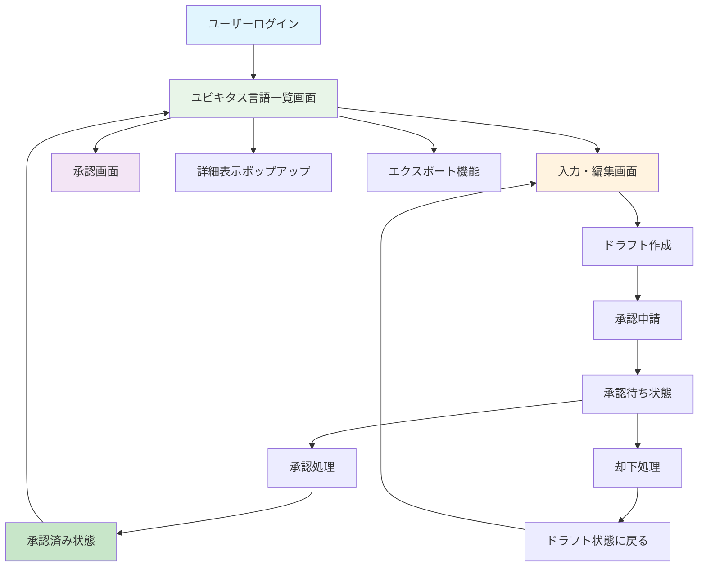

### 1.2 承認ワークフロー詳細
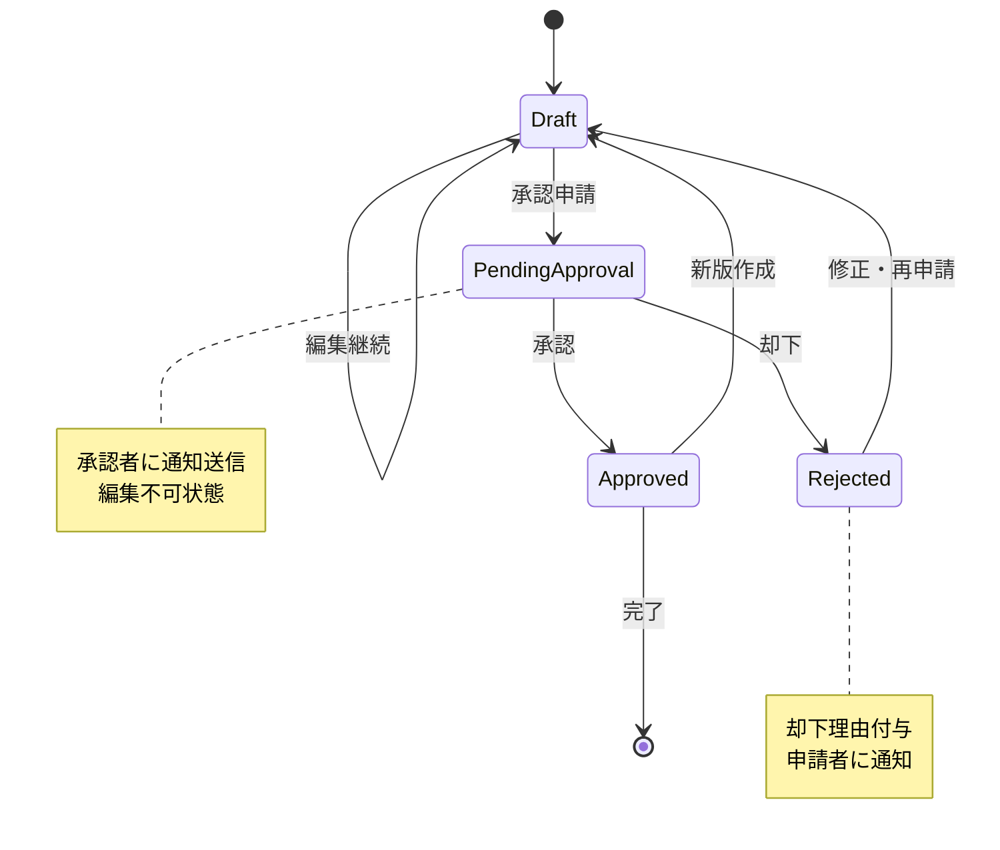

### 1.3 権限別アクセス制御
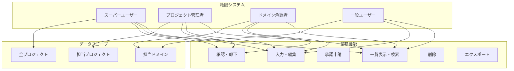

## 2. 共通レイアウト要素

### 2.1 業務画面基本レイアウト
```
┌──────────────────────────────────────────────────────────────┐
│                        Header Area                          │
│  🏢 ユビキタス言語管理システム           👤 田中太郎  [ログアウト] │
└──────────────────────────────────────────────────────────────┘
┌─────────────────┬────────────────────────────────────────────┐
│   Side Menu     │              Main Content                  │
│                 │                                            │
│ ☰ メニュー      │  ┌─────────────────────────────────────┐   │
│                 │  │          🔍 検索・フィルタ           │   │
│ 🏠 ホーム       │  │  📁 プロジェクト: [ECサイト ▼]       │   │
│ ✏️ 入力・編集    │  │  🏷️ ドメイン: [注文管理 ▼]          │   │
│ ✅ 承認         │  │  📝 和名: [______] 💬 意味: [______] │   │
│ 👥 ユーザー管理  │  │  [🔍 検索] [📤 エクスポート] [📄CSV] │   │
│ 📁 プロジェクト  │  └─────────────────────────────────────┘   │
│ 🏷️ ドメイン     │                                            │
│ 👤 プロフィール  │  ┌─────────────────────────────────────┐   │
│ 🔒 パスワード    │  │                                     │   │
│ 🚪 ログアウト    │  │         業務データテーブル            │   │
│                 │  │                                     │   │
│                 │  └─────────────────────────────────────┘   │
└─────────────────┴────────────────────────────────────────────┘
┌──────────────────────────────────────────────────────────────┐
│                         Footer Area                         │
│              © 2025 ユビキタス言語管理システム               │
└──────────────────────────────────────────────────────────────┘
```

### 2.2 リアルタイム通知システム
```
通知トーストパターン:
┌─────────────────────────────────────────────────────────────┐
│ 🔔 新規承認依頼が届きました                                   │  [✕]
└─────────────────────────────────────────────────────────────┘

保存状態表示パターン:
┌─────────────────────────────────────────────────────────────┐
│ 💾 保存中...                                                │
└─────────────────────────────────────────────────────────────┘

┌─────────────────────────────────────────────────────────────┐
│ ✅ 保存完了                                                  │
└─────────────────────────────────────────────────────────────┘

┌─────────────────────────────────────────────────────────────┐
│ ❌ 保存エラー: 他のユーザーが同時編集中です                   │
└─────────────────────────────────────────────────────────────┘
```

## 3. 画面別詳細設計

### 3.1 ユビキタス言語一覧画面（ホーム画面）

#### 3.1.1 データ表示・検索フロー
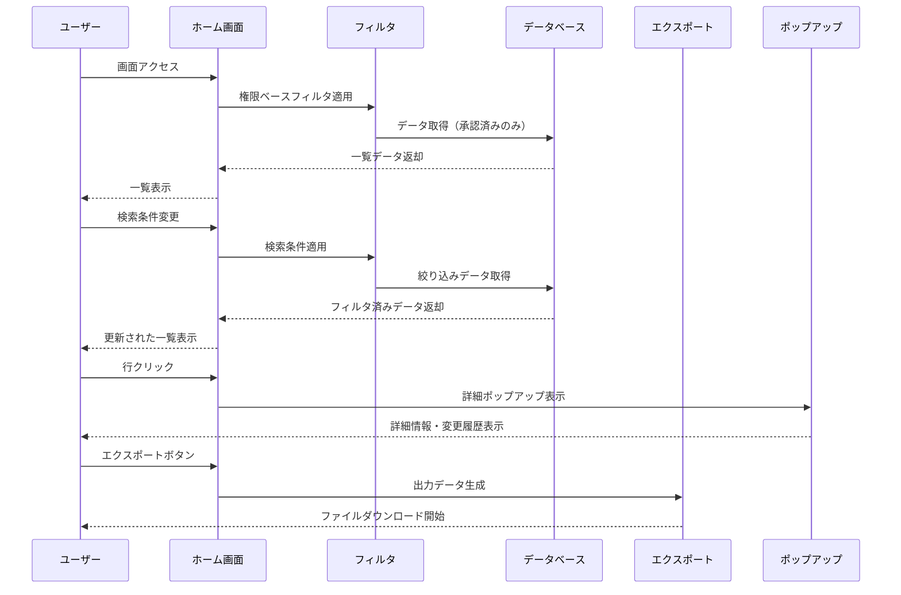

#### 3.1.2 レイアウト設計
```
┌─ サイドメニュー ─┬─────────────────────────────────────────────┐
│ ☰ メニュー       │            🏠 ユビキタス言語一覧             │
│                  │                                             │
│ 🏠 ホーム        │ ┌─────────────────────────────────────────┐ │
│ ✏️ 入力・編集     │ │            🔍 検索・フィルタ             │ │
│ ✅ 承認          │ │ 📁 プロジェクト: [ECサイト      ▼]       │ │
│ 👥 ユーザー管理   │ │ 🏷️ ドメイン: [全ドメイン     ▼]        │ │
│ 📁 プロジェクト   │ │ 📝 和名: [______] 💬 意味: [______]     │ │
│ 🏷️ ドメイン      │ │ [🔍 検索]                              │ │
│ 👤 プロフィール   │ └─────────────────────────────────────────┘ │
│ 🔒 パスワード     │                                             │
│ 🚪 ログアウト     │ ┌─────────────────────────────────────────┐ │
│                  │ │ [📤 AI向けエクスポート] [📄 CSV出力]     │ │
│                  │ └─────────────────────────────────────────┘ │
│                  │                                             │
│                  │ ┌─────────────────────────────────────────┐ │
│                  │ │📖│和名    │英名      │意味      │発生機会 │ │
│                  │ ├─┼────────┼──────────┼──────────┼────────┤ │
│                  │ │📖│注文    │Order     │顧客要求  │MTG     │ │
│                  │ │📖│商品    │Product   │販売対象  │要件    │ │
│                  │ │📖│顧客    │Customer  │購入者    │分析    │ │
│                  │ │📖│決済    │Payment   │支払処理  │設計    │ │
│                  │ │  │        │          │↑クリックで詳細   │ │
│                  │ └─────────────────────────────────────────┘ │
│                  │                                             │
│                  │ ┌─────────────────────────────────────────┐ │
│                  │ │   [◀ 前] 1 / 5 ページ [次 ▶]  100件/頁  │ │
│                  │ └─────────────────────────────────────────┘ │
└──────────────────┴─────────────────────────────────────────────┘
```

#### 3.1.3 詳細表示ポップアップ
```
┌─────────────────────────────────────────────────────────────┐
│                    📖 用語詳細情報                           │
├─────────────────────────────────────────────────────────────┤
│                                                             │
│  📝 和名: 注文                                              │
│  🌐 英名: Order                                             │
│  💬 意味: 顧客からの商品購入依頼                             │
│  🏷️ ドメイン: 注文管理                                      │
│  📅 発生機会: EC要件定義MTG                                  │
│  🔗 関連用語: 商品、顧客、決済                               │
│  📄 備考: 複数商品の同時注文も可能                           │
│                                                             │
│  ┌─────────────────────────────────────────────────────┐  │
│  │              📜 変更履歴（最新5件）                 │  │
│  ├─────────────────────────────────────────────────────┤  │
│  │ 📅 日時      │👤 変更者│📝 変更内容                │  │
│  ├─────────────────────────────────────────────────────┤  │
│  │ 2025/06/20   │田中     │英名を修正                │  │
│  │ 2025/06/15   │佐藤     │意味を詳細化              │  │
│  │ 2025/06/10   │鈴木     │新規作成                  │  │
│  │              │         │↓（スクロール可能）       │  │
│  └─────────────────────────────────────────────────────┘  │
│                                                             │
│                    ┌─────────────┐                       │
│                    │   ❌ 閉じる   │                       │
│                    └─────────────┘                       │
└─────────────────────────────────────────────────────────────┘
```

### 3.2 ユビキタス言語入力・編集画面

#### 3.2.1 Excel風編集フロー
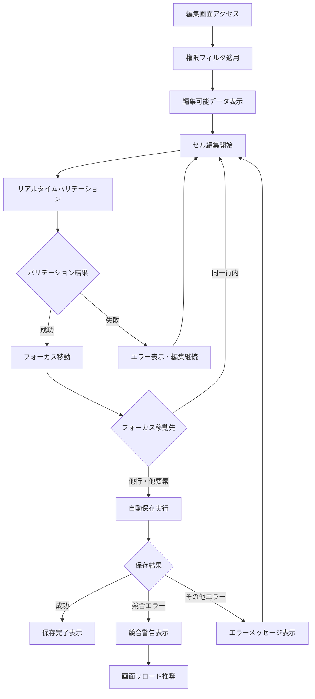

#### 3.2.2 レイアウト設計
```
┌─ サイドメニュー ─┬─────────────────────────────────────────────┐
│ ☰ メニュー       │           ✏️ ユビキタス言語入力・編集         │
│                  │                                             │
│ 🏠 ホーム        │ ┌─────────────────────────────────────────┐ │
│ ✏️ 入力・編集     │ │            🔍 検索・フィルタ             │ │
│ ✅ 承認          │ │ 📁 プロジェクト: [ECサイト      ▼]       │ │
│ 👥 ユーザー管理   │ │ 🏷️ ドメイン: [注文管理       ▼]        │ │
│ 📁 プロジェクト   │ │ 📊 状態: [ドラフト         ▼]          │ │
│ 🏷️ ドメイン      │ │ 📝 和名: [______] [🔍 検索]             │ │
│ 👤 プロフィール   │ └─────────────────────────────────────────┘ │
│ 🔒 パスワード     │                                             │
│ 🚪 ログアウト     │ ┌─────────────────────────────────────────┐ │
│                  │ │              ➕ 新規追加                 │ │
│                  │ └─────────────────────────────────────────┘ │
│                  │                                             │
│                  │ ┌─────────────────────────────────────────┐ │
│                  │ │📝│和名*│英名  │意味*   │🏷️ドメイン*│📊状態│ │
│                  │ ├─┼────┼──────┼────────┼──────────┼─────┤ │
│                  │ │✏️│注文 │Order │購入要求 │[注文管理▼]│承認 │ │
│                  │ │✏️│商品 │[編集中]│[編集中___]│[商品管理▼]│草稿│ │
│                  │ │✏️│[新規行入力________________]│[ドメイン▼]│草稿│ │
│                  │ │  │    │      │        │[📤申請][🗑削除]│    │ │
│                  │ └─────────────────────────────────────────┘ │
│                  │                                             │
│                  │ ┌─────────────────────────────────────────┐ │
│                  │ │   [◀ 前] 1 / 3 ページ [次 ▶]  50件/頁   │ │
│                  │ └─────────────────────────────────────────┘ │
└──────────────────┴─────────────────────────────────────────────┘
```

#### 3.2.3 状態表示・操作パターン
```
編集中のセル表示:
┌─────────────────────────────────────────────────────────────┐
│ 📝│和名*│英名     │意味*      │🏷️ドメイン*│📊状態│          │
│ ├─┼────┼─────────┼───────────┼──────────┼─────┤          │
│ │✏️│注文 │Order    │購入要求    │注文管理    │承認 │          │
│ │✏️│商品 │[Product]│[編集中___] │[商品管理▼] │草稿 │ ← 編集中 │
│ │  │    │    ↑    │           │           │    │          │
│ │  │    │フォーカス │           │           │    │          │
└─────────────────────────────────────────────────────────────┘

保存状態表示:
┌─────────────────────────────────────────────────────────────┐
│ 📝│和名*│英名     │意味*      │🏷️ドメイン*│📊状態│💾保存状態 │
│ ├─┼────┼─────────┼───────────┼──────────┼─────┼─────────┤
│ │✏️│注文 │Order    │購入要求    │注文管理    │承認 │   ✅     │
│ │✏️│商品 │Product  │販売対象    │商品管理    │草稿 │ 💾保存中  │
│ │✏️│顧客 │Customer │購入者      │顧客管理    │草稿 │ ❌エラー  │
└─────────────────────────────────────────────────────────────┘

権限別操作ボタン表示:
┌─────────────────────────────────────────────────────────────┐
│                           操作ボタン                         │
├─────────────────────────────────────────────────────────────┤
│ 📊 状態: ドラフト                                            │
│ 👤 作成者: 自分   → [📤 申請] [✏️ 編集] [🗑️ 削除]           │
│ 👤 作成者: 他人   → [📤 申請] [✏️ 編集] [🚫 削除不可]        │
├─────────────────────────────────────────────────────────────┤
│ 📊 状態: 承認待ち                                            │
│ 全ユーザー       → [🚫 編集不可] [🚫 削除不可]              │
├─────────────────────────────────────────────────────────────┤
│ 📊 状態: 承認済み                                            │
│ 承認者以上       → [✏️ 新版作成] [🗑️ 削除]                  │
│ 一般ユーザー     → [✏️ 新版作成] [🚫 削除不可]              │
└─────────────────────────────────────────────────────────────┘
```

#### 3.2.4 競合エラーダイアログ
```
┌─────────────────────────────────────────────────────────────┐
│                    ⚠️ 競合エラー                            │
├─────────────────────────────────────────────────────────────┤
│                                                             │
│  他のユーザーが同じデータを同時編集中です。                  │
│                                                             │
│  💡 対処方法:                                               │
│  • ブラウザを更新（F5キー）して最新データを取得             │
│  • 編集中の内容は失われます                                 │
│                                                             │
│         ┌─────────────┐    ┌─────────────────┐           │
│         │ 🔄 更新     │    │ ❌ キャンセル    │           │
│         └─────────────┘    └─────────────────┘           │
└─────────────────────────────────────────────────────────────┘
```

### 3.3 ユビキタス言語承認画面

#### 3.3.1 承認処理フロー
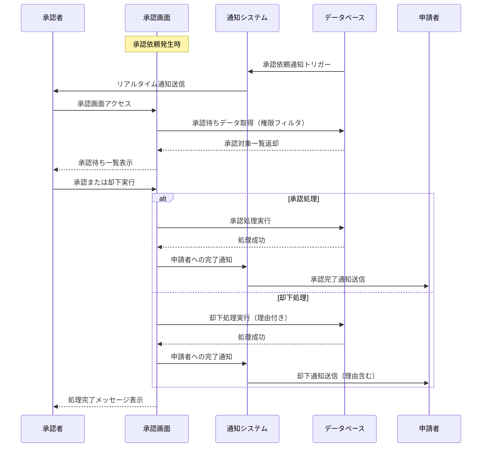

#### 3.3.2 レイアウト設計
```
┌─ サイドメニュー ─┬─────────────────────────────────────────────┐
│ ☰ メニュー       │            ✅ ユビキタス言語承認             │
│                  │                                             │
│ 🏠 ホーム        │ ┌─────────────────────────────────────────┐ │
│ ✏️ 入力・編集     │ │            🔍 検索・フィルタ             │ │
│ ✅ 承認          │ │ 📁 プロジェクト: [ECサイト      ▼]       │ │
│ 👥 ユーザー管理   │ │ 🏷️ ドメイン: [注文管理       ▼]        │ │
│ 📁 プロジェクト   │ │ 📝 和名: [______] 💬 意味: [______]     │ │
│ 🏷️ ドメイン      │ │ [🔍 検索]                              │ │
│ 👤 プロフィール   │ └─────────────────────────────────────────┘ │
│ 🔒 パスワード     │                                             │
│ 🚪 ログアウト     │ ┌─────────────────────────────────────────┐ │
│                  │ │ ☐ 全選択                                │ │
│                  │ │ [✅ 一括承認] [❌ 一括却下]              │ │
│                  │ └─────────────────────────────────────────┘ │
│                  │                                             │
│                  │ ┌─────────────────────────────────────────┐ │
│                  │ │☐│📝和名│🌐英名│💬意味   │👤申請者│📅日時│ │
│                  │ ├─┼─────┼─────┼─────────┼───────┼─────┤ │
│                  │ │☐│注文  │Order│購入要求  │田中    │6/25 │ │
│                  │ │☐│配送  │Ship │商品輸送  │佐藤    │6/24 │ │
│                  │ │☐│決済  │Pay  │支払処理  │鈴木    │6/23 │ │
│                  │ │ │     │     │         │[✅承認][❌却下]│ │
│                  │ └─────────────────────────────────────────┘ │
│                  │                                             │
│                  │ ┌─────────────────────────────────────────┐ │
│                  │ │   [◀ 前] 1 / 2 ページ [次 ▶]  100件/頁  │ │
│                  │ └─────────────────────────────────────────┘ │
└──────────────────┴─────────────────────────────────────────────┘
```

#### 3.3.3 承認・却下ダイアログ
```
承認確認ダイアログ:
┌─────────────────────────────────────────────────────────────┐
│                    ✅ 承認確認                              │
├─────────────────────────────────────────────────────────────┤
│                                                             │
│  選択した3件の用語を承認します。                             │
│  承認してよろしいですか？                                   │
│                                                             │
│  📋 承認対象:                                               │
│  • 注文 (Order) - 購入要求                                 │
│  • 配送 (Ship) - 商品輸送                                  │
│  • 決済 (Pay) - 支払処理                                   │
│                                                             │
│         ┌─────────────┐    ┌─────────────────┐           │
│         │ ✅ 承認実行  │    │ ❌ キャンセル    │           │
│         └─────────────┘    └─────────────────┘           │
└─────────────────────────────────────────────────────────────┘

却下理由入力ダイアログ:
┌─────────────────────────────────────────────────────────────┐
│                    ❌ 却下理由入力                          │
├─────────────────────────────────────────────────────────────┤
│                                                             │
│  却下理由を入力してください。                                │
│  申請者への通知メッセージとして使用されます。                │
│                                                             │
│  📝 却下理由 *                                              │
│  ┌─────────────────────────────────────────────────────┐  │
│  │ 意味の説明が不十分です。                             │  │
│  │ より具体的で理解しやすい定義をお願いします。          │  │
│  │                                                     │  │
│  │ 参考: 「顧客からの具体的な商品購入依頼」など         │  │
│  └─────────────────────────────────────────────────────┘  │
│                                                             │
│         ┌─────────────┐    ┌─────────────────┐           │
│         │ ❌ 却下実行  │    │ ❌ キャンセル    │           │
│         └─────────────┘    └─────────────────┘           │
└─────────────────────────────────────────────────────────────┘
```

## 4. エクスポート機能設計

### 4.1 エクスポート処理フロー
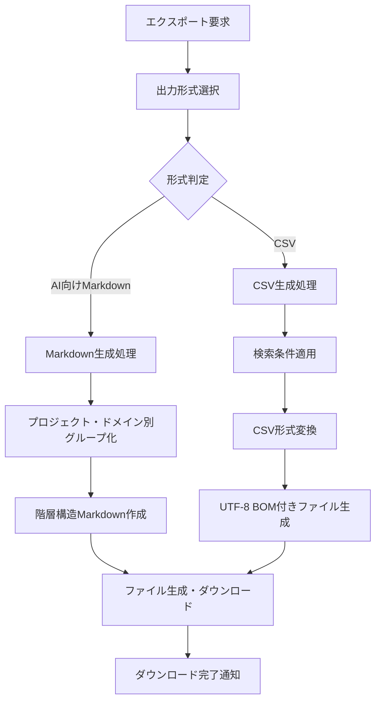

### 4.2 AI向けMarkdownエクスポート出力例
```markdown
# ECサイト ユビキタス言語辞書

## 📁 プロジェクト概要
- **プロジェクト名**: ECサイト
- **作成日**: 2025-07-06
- **承認済み用語数**: 25件

## 🏷️ 注文管理ドメイン

### 📖 注文 (Order)
- **定義**: 顧客からの商品購入依頼
- **発生機会**: EC要件定義MTG
- **関連用語**: 商品、顧客、決済
- **備考**: 複数商品の同時注文も可能

### 📖 商品 (Product)
- **定義**: 販売対象となるアイテム
- **発生機会**: 商品企画会議
- **関連用語**: 注文、在庫、カテゴリ

## 🏷️ 顧客管理ドメイン

### 📖 顧客 (Customer)
- **定義**: 商品を購入する個人または法人
- **発生機会**: 顧客分析会議
- **関連用語**: 注文、決済、配送先
```

### 4.3 CSV出力形式
```csv
プロジェクト,ドメイン,和名,英名,意味,発生機会,関連用語,備考
ECサイト,注文管理,注文,Order,顧客からの商品購入依頼,EC要件定義MTG,商品;顧客;決済,複数商品対応
ECサイト,商品管理,商品,Product,販売対象となるアイテム,商品企画会議,注文;在庫;カテゴリ,カテゴリ分類有り
ECサイト,顧客管理,顧客,Customer,商品を購入する個人または法人,顧客分析会議,注文;決済;配送先,法人・個人区分あり
```

## 5. エラーハンドリング・バリデーション

### 5.1 バリデーション管理フロー
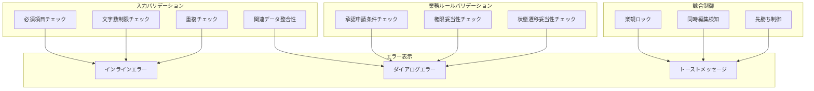

### 5.2 エラーメッセージパターン
```
必須項目バリデーションエラー:
┌─────────────────────────────────────────────────────────────┐
│ 📝 和名 *                                                   │
│ ┌─────────────────────────────────────────────────────────┐ │
│ │                                                         │ │ ← 赤枠
│ └─────────────────────────────────────────────────────────┘ │
│ ❌ 和名は必須項目です                                        │
└─────────────────────────────────────────────────────────────┘

重複チェックエラー:
┌─────────────────────────────────────────────────────────────┐
│ 📝 和名 *                                                   │
│ ┌─────────────────────────────────────────────────────────┐ │
│ │ 注文                                                    │ │ ← オレンジ枠
│ └─────────────────────────────────────────────────────────┘ │
│ ⚠️ この用語名は既に存在します                                │
└─────────────────────────────────────────────────────────────┘

承認申請エラー（ダイアログ）:
┌─────────────────────────────────────────────────────────────┐
│                    ❌ 承認申請エラー                        │
├─────────────────────────────────────────────────────────────┤
│                                                             │
│  承認申請の条件が満たされていません。                        │
│                                                             │
│  📋 不足項目:                                               │
│  • 英名が未入力です                                         │
│  • 意味が未入力です                                         │
│                                                             │
│              ┌─────────────────┐                         │
│              │   ❌ 閉じる     │                         │
│              └─────────────────┘                         │
└─────────────────────────────────────────────────────────────┘

競合エラー（トースト）:
┌─────────────────────────────────────────────────────────────┐
│ ⚠️ 他のユーザーが同時編集中です。画面を更新してください       │  [✕]
└─────────────────────────────────────────────────────────────┘
```

## 6. 技術仕様・実装指針

### 6.1 リアルタイム通信（SignalR）
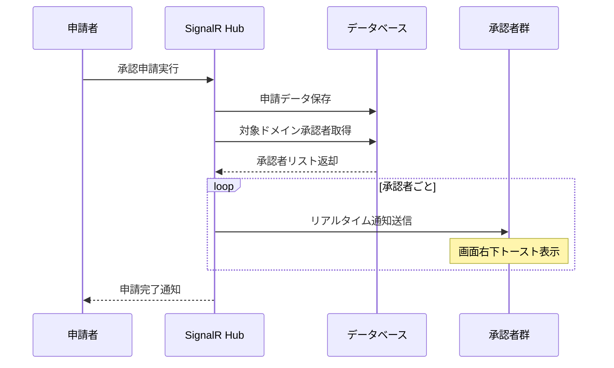

### 6.2 Excel風UI実装パターン
```csharp
// セル編集管理コンポーネント例
public class EditableCellComponent : ComponentBase
{
    [Parameter] public string Value { get; set; } = string.Empty;
    [Parameter] public EventCallback<string> ValueChanged { get; set; }
    [Parameter] public bool IsEditing { get; set; }
    [Parameter] public bool IsRequired { get; set; }
    
    protected override async Task OnAfterRenderAsync(bool firstRender)
    {
        // フォーカス管理・キーボードイベント処理
        await HandleKeyboardEvents();
    }
}
```

### 6.3 状態管理パターン
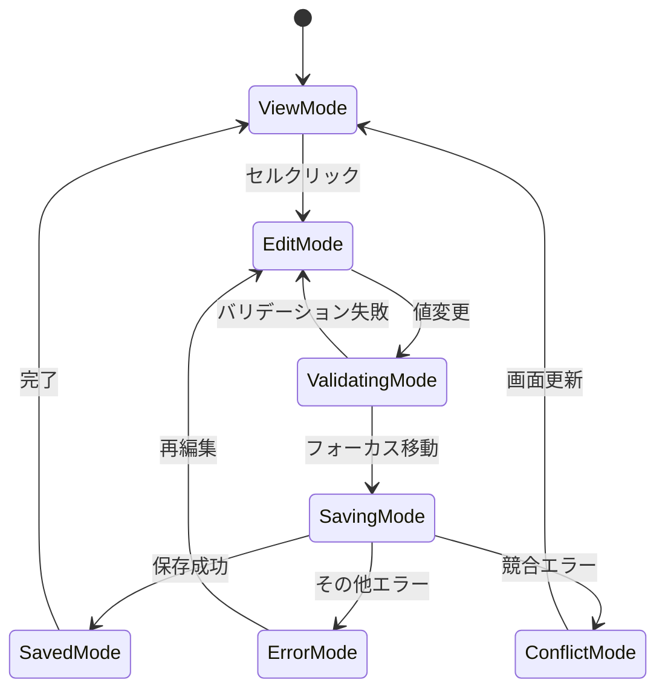

## 7. Blazor Component実装指針

### 7.1 コンポーネント構成
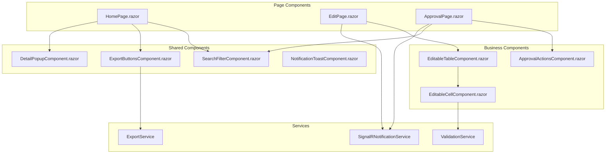

### 7.2 パフォーマンス最適化
- **仮想化**: 大量データのスクロール対応
- **遅延ロード**: ページング・オンデマンドデータ取得
- **キャッシュ**: プロジェクト・ドメイン情報のメモリキャッシュ
- **デバウンス**: 検索入力の遅延実行

---

**作成者**: Claude Code  
**改善内容**: Mermaid図表による業務フロー可視化、Excel風UI設計の詳細化、リアルタイム通信フローの明確化  
**実装準備**: SignalR統合・競合制御・エクスポート機能の具体的設計完了