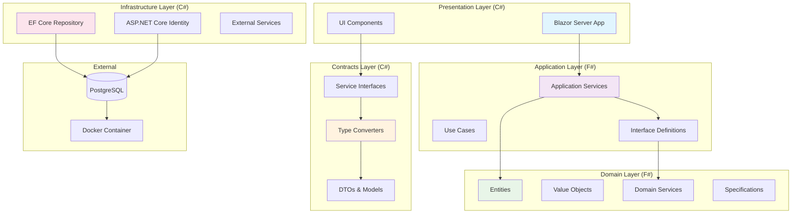
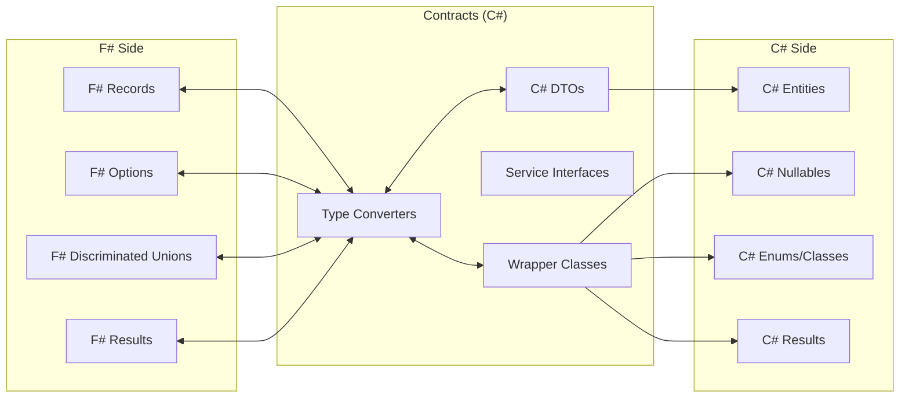
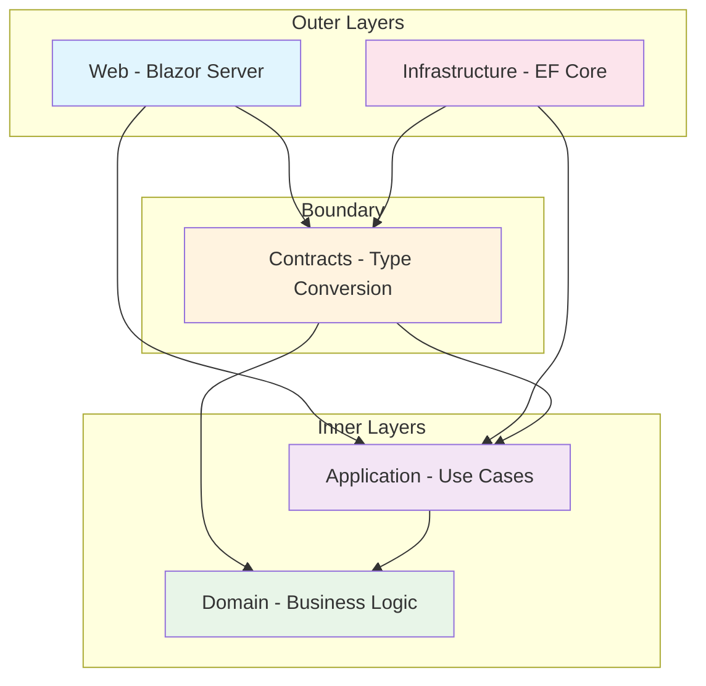
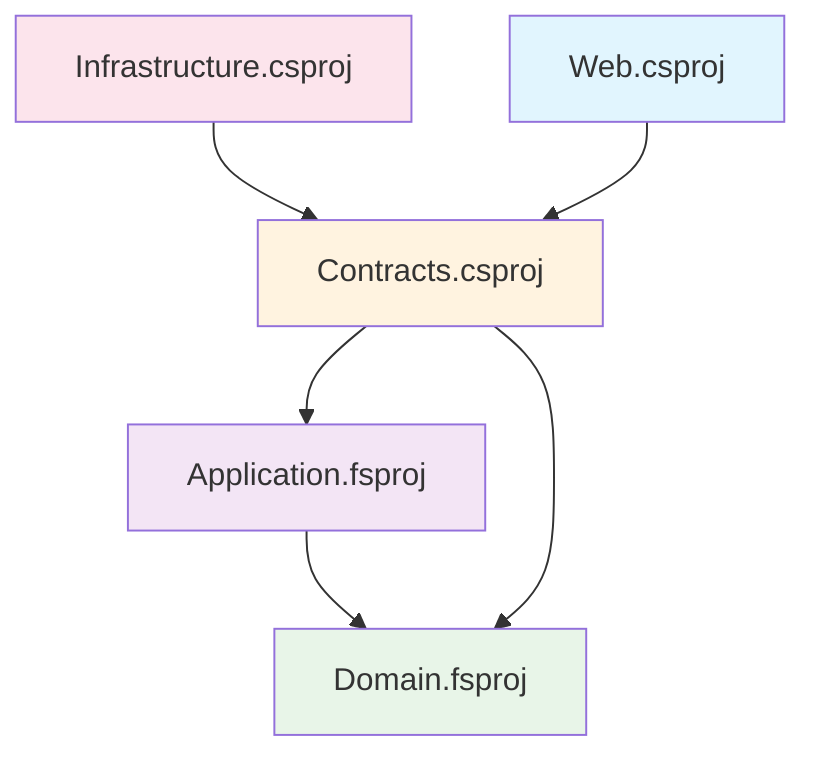
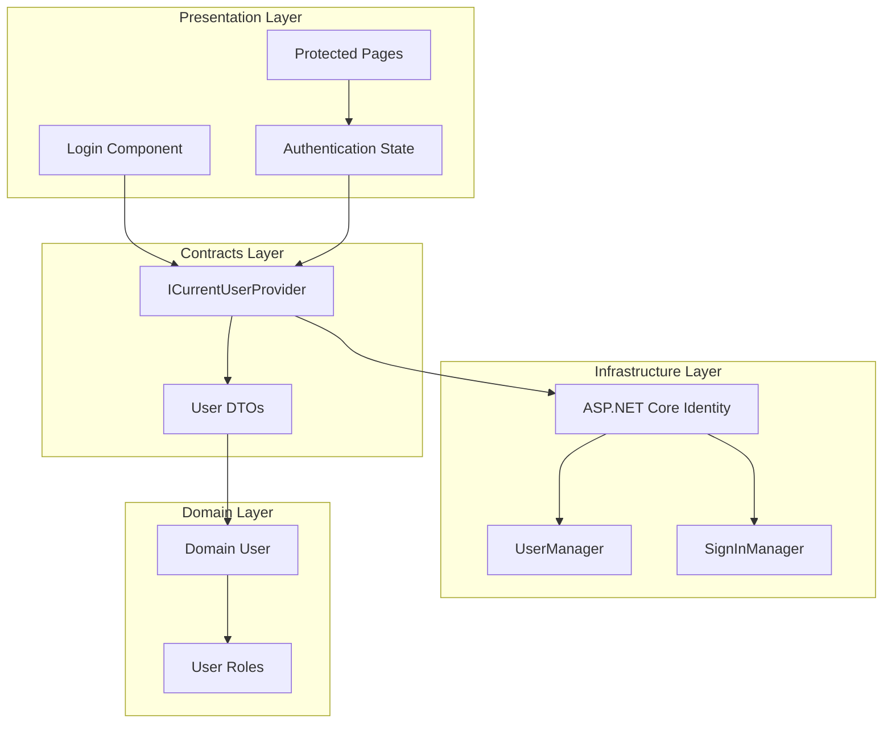
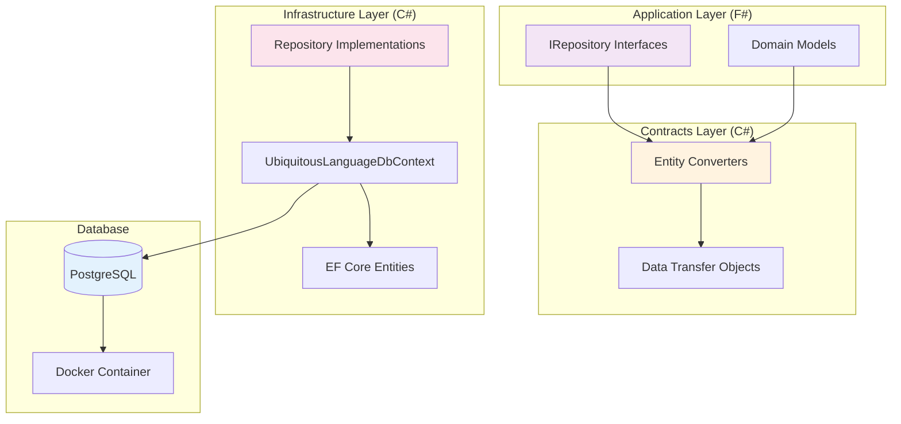
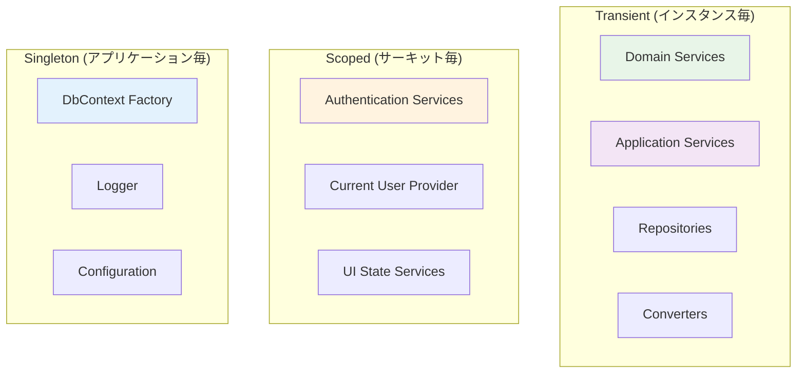

# ユビキタス言語管理システム システム設計書

**プロジェクト名**: ユビキタス言語管理システム  
**バージョン**: 1.0  
**作成日**: 2025-07-02  
**最終更新**: 2025-07-02  
**承認者**: プロジェクトオーナー  

## 目次

1. [システム概要](#1-システム概要)
2. [アーキテクチャ全体設計](#2-アーキテクチャ全体設計)
3. [F# + C# 統合アーキテクチャ](#3-f-c-統合アーキテクチャ)
4. [Clean Architecture詳細設計](#4-clean-architecture詳細設計)
5. [プロジェクト構成](#5-プロジェクト構成)
6. [認証・認可システム](#6-認証認可システム)
7. [データアクセス層設計](#7-データアクセス層設計)
8. [依存関係注入設計](#8-依存関係注入設計)
9. [エラーハンドリング設計](#9-エラーハンドリング設計)
10. [技術スタック詳細](#10-技術スタック詳細)

---

## 1. システム概要

### 1.1 設計方針

#### 基本方針
- **Clean Architecture**: 依存関係の逆転原則による保守性確保
- **ドメイン駆動設計（DDD）**: ビジネスロジックの中核化
- **F# + C# ハイブリッド**: 各言語の強みを最大化
- **PostgreSQL専用最適化**: データ移行コスト削除による効率化

#### アーキテクチャ原則
- **関心の分離**: レイヤー間の責務明確化
- **依存関係の制御**: 外側の層から内側の層への単方向依存
- **型安全性**: F#による堅牢なドメインモデル
- **統合性**: C#による豊富なエコシステム活用

### 1.2 技術的決定事項

#### 確定済み重要決定（ADR参照）
- **ADR_005**: PostgreSQL Docker Container採用（データ移行コスト削除）
- **Infrastructure層C#採用**: EF Core・ASP.NET Core Identity統合性重視
- **境界プロジェクト設計**: UbiquitousLanguageManager.Contracts.csproj による言語間疎結合
- **手動型変換方式**: AutoMapper使用せず、確実性・性能・追跡可能性重視

---

## 2. アーキテクチャ全体設計

### 2.1 システム構成図



### 2.2 レイヤー責務定義

#### Domain Layer (F#) - ビジネスロジックの中核
- **目的**: 純粋なビジネスルール・概念の表現
- **技術**: F# Records, Discriminated Unions, Pattern Matching
- **責務**:
  - エンティティ・値オブジェクトの定義
  - ドメインサービス・仕様パターン
  - ビジネスルールの実装
- **依存**: なし（他層への依存禁止）

#### Application Layer (F#) - ユースケースの制御
- **目的**: アプリケーション固有の業務フローの実装
- **技術**: F# with Railway-oriented Programming
- **責務**:
  - ユースケースの調整・実行
  - アプリケーションサービス
  - 外部システムとのインターフェース定義
- **依存**: Domain層のみ

#### Contracts Layer (C#) - 言語間境界の管理
- **目的**: F#とC#間の型変換・統合インターフェース
- **技術**: C# DTOs, Extension Methods, Static Converters
- **責務**:
  - F# ↔ C# 型変換ロジック
  - 境界サービスインターフェース
  - 統合DTOの定義
- **依存**: Application層・Domain層

#### Infrastructure Layer (C#) - 外部システム統合
- **目的**: データベース・外部API・技術基盤との統合
- **技術**: EF Core, ASP.NET Core Identity, HttpClient
- **責務**:
  - データアクセス実装
  - 認証・認可システム
  - 外部サービス連携
- **依存**: Application層・Domain層・Contracts層

#### Presentation Layer (C#) - ユーザーインターフェース
- **目的**: Webユーザーインターフェースの提供
- **技術**: Blazor Server, SignalR
- **責務**:
  - Web UI・コンポーネント
  - ユーザー入力の処理
  - 認証・セッション管理
- **依存**: Application層・Contracts層

---

## 3. F# + C# 統合アーキテクチャ

### 3.1 境界設計戦略

#### 境界プロジェクト（Contracts）の役割


#### 型変換パターン

**1. F# Option<'T> ↔ C# T?**
```csharp
// コントラクト層 - 拡張メソッド
public static class OptionExtensions
{
    public static T? ToNullable<T>(this FSharpOption<T> option) where T : struct
        => option.IsSome ? option.Value : null;
    
    public static string? ToNullable(this FSharpOption<string> option)
        => option.IsSome ? option.Value : null;
    
    public static FSharpOption<T> ToOption<T>(this T? nullable) where T : struct
        => nullable.HasValue ? FSharpOption<T>.Some(nullable.Value) : FSharpOption<T>.None;
}
```

**2. F# Result<'T, 'TError> ↔ C# Result<T>**
```csharp
// コントラクト層 - Result ラッパー
public class Result<T>
{
    public bool IsSuccess { get; init; }
    public T? Value { get; init; }
    public string? Error { get; init; }
    
    public static Result<T> Success(T value) => new() { IsSuccess = true, Value = value };
    public static Result<T> Failure(string error) => new() { IsSuccess = false, Error = error };
}

public static class ResultExtensions
{
    public static Result<T> ToCSharpResult<T>(this FSharpResult<T, string> result)
        => result.IsOk ? Result<T>.Success(result.ResultValue) : Result<T>.Failure(result.ErrorValue);
}
```

**3. F# Record ↔ C# DTO**
```csharp
// コントラクト層 - 静的コンバーター
public static class UserConverters
{
    public static UserDto ToDto(Domain.User domainUser)
    {
        return new UserDto
        {
            UserId = domainUser.UserId,
            Email = domainUser.Email,
            Name = domainUser.Name,
            UserRole = domainUser.UserRole.ToString(),
            IsActive = domainUser.IsActive
        };
    }
    
    public static Domain.User ToDomain(UserDto dto)
    {
        return Domain.User.Create(
            dto.UserId,
            dto.Email,
            dto.Name,
            Enum.Parse<Domain.UserRole>(dto.UserRole),
            dto.IsActive
        );
    }
}
```

### 3.2 言語選択理由と責務分担

#### F# 採用領域（Domain + Application）
**理由**:
- **型安全性**: Discriminated Unions による状態表現
- **不変性**: デフォルト不変によるデータ整合性
- **関数型パラダイム**: Railway-oriented Programming
- **パターンマッチング**: 複雑な業務ルールの表現力

**具体的活用**:
```fsharp
// ドメイン層 - F#
type UbiquitousLanguageStatus =
    | Editing
    | PendingApproval of submittedBy: UserId * submittedAt: DateTime
    | Rejected of reason: string * rejectedBy: UserId
    | Approved of approvedBy: UserId * approvedAt: DateTime

type DraftUbiquitousLanguage = {
    Id: DraftUbiquitousLanguageId
    DomainId: DomainId
    JapaneseName: JapaneseName
    EnglishName: EnglishName
    Description: Description
    Status: UbiquitousLanguageStatus
    UpdatedBy: UserId
    UpdatedAt: DateTime
}
```

#### C# 採用領域（Infrastructure + Presentation + Contracts）
**理由**:
- **EF Core統合**: C# Entitiesとの自然な統合
- **ASP.NET Core Identity**: 認証基盤の標準活用
- **Blazor Server**: リッチWebUIの効率的開発
- **エコシステム**: NuGetパッケージの豊富さ

**具体的活用**:
```csharp
// インフラストラクチャ層 - C#
public class DraftUbiquitousLanguageEntity
{
    public long DraftUbiquitousLanguageId { get; set; }
    public long DomainId { get; set; }
    public string JapaneseName { get; set; } = string.Empty;
    public string EnglishName { get; set; } = string.Empty;
    public string Description { get; set; } = string.Empty;
    public string Status { get; set; } = "editing";
    public long UpdatedBy { get; set; }
    public DateTime UpdatedAt { get; set; }
    
    // ナビゲーションプロパティ
    public DomainEntity Domain { get; set; } = null!;
    public UserEntity UpdatedByUser { get; set; } = null!;
}
```

---

## 4. Clean Architecture詳細設計

### 4.1 依存関係図



### 4.2 レイヤー間通信パターン

#### Presentation → Application (via Contracts)
```csharp
// プレゼンテーション層 - Blazorコンポーネント
@inject IUbiquitousLanguageService UbiquitousLanguageService

private async Task CreateUbiquitousLanguage()
{
    var request = new CreateUbiquitousLanguageRequest
    {
        DomainId = selectedDomainId,
        JapaneseName = japaneseName,
        EnglishName = englishName,
        Description = description
    };
    
    var result = await UbiquitousLanguageService.CreateAsync(request);
    
    if (result.IsSuccess)
    {
        // 成功時の処理
        await LoadUbiquitousLanguages();
    }
    else
    {
        // エラー時の処理
        errorMessage = result.Error;
    }
}
```

#### Application → Domain (F# to F#)
```fsharp
// アプリケーション層 - ユースケース
module CreateUbiquitousLanguageUseCase =
    
    type CreateCommand = {
        DomainId: DomainId
        JapaneseName: string
        EnglishName: string
        Description: string
        CreatedBy: UserId
    }
    
    let execute (repository: IUbiquitousLanguageRepository) (command: CreateCommand) =
        result {
            // ドメインバリデーション
            let! japaneseName = JapaneseName.create command.JapaneseName
            let! englishName = EnglishName.create command.EnglishName
            let! description = Description.create command.Description
            
            // ビジネスルール
            let! domain = repository.GetDomainAsync command.DomainId
            do! DomainService.validateUserCanCreateInDomain command.CreatedBy domain
            
            // エンティティ作成
            let ubiquitousLanguage = DraftUbiquitousLanguage.create {
                DomainId = command.DomainId
                JapaneseName = japaneseName
                EnglishName = englishName
                Description = description
                CreatedBy = command.CreatedBy
            }
            
            // 永続化
            return! repository.SaveAsync ubiquitousLanguage
        }
```

#### Infrastructure → Application (via Contracts)
```csharp
// インフラストラクチャ層 - リポジトリ実装
public class UbiquitousLanguageRepository : IUbiquitousLanguageRepository
{
    private readonly UbiquitousLanguageDbContext _context;
    private readonly IDbContextFactory<UbiquitousLanguageDbContext> _contextFactory;
    
    public async Task<Result<DraftUbiquitousLanguage>> SaveAsync(DraftUbiquitousLanguage domainEntity)
    {
        try
        {
            using var context = _contextFactory.CreateDbContext();
            
            // F# ドメイン → C# エンティティ変換
            var entity = DraftUbiquitousLanguageConverters.ToEntity(domainEntity);
            
            context.DraftUbiquitousLanguages.Add(entity);
            await context.SaveChangesAsync();
            
            // ドメインへの逆変換
            var savedDomain = DraftUbiquitousLanguageConverters.ToDomain(entity);
            return Result<DraftUbiquitousLanguage>.Success(savedDomain);
        }
        catch (Exception ex)
        {
            return Result<DraftUbiquitousLanguage>.Failure($"データベースエラー: {ex.Message}");
        }
    }
}
```

### 4.3 依存関係制約ルール

#### 許可される依存関係
- **Presentation** → Application, Contracts
- **Infrastructure** → Application, Contracts
- **Contracts** → Application, Domain
- **Application** → Domain
- **Domain** → なし

#### 禁止される依存関係
- **Domain** → 他のすべての層
- **Application** → Infrastructure, Presentation
- **Contracts** → Infrastructure, Presentation
- **外側の層同士** → 直接参照（Contractsを経由）

---

## 5. プロジェクト構成

### 5.1 ソリューション構造

```
UbiquitousLanguageManager.sln
├── src/
│   ├── UbiquitousLanguageManager.Domain.fsproj (F#)
│   ├── UbiquitousLanguageManager.Application.fsproj (F#)
│   ├── UbiquitousLanguageManager.Contracts.csproj (C# - Boundary)
│   ├── UbiquitousLanguageManager.Infrastructure.csproj (C#)
│   └── UbiquitousLanguageManager.Web.csproj (C# - Blazor Server)
├── tests/
│   ├── UbiquitousLanguageManager.Domain.Tests.fsproj (F#)
│   ├── UbiquitousLanguageManager.Application.Tests.fsproj (F#)
│   ├── UbiquitousLanguageManager.Contracts.Tests.csproj (C#)
│   ├── UbiquitousLanguageManager.Infrastructure.Tests.csproj (C#)
│   └── UbiquitousLanguageManager.Web.Tests.csproj (C#)
├── docs/
└── tools/
    └── docker/
        └── docker-compose.yml
```

### 5.2 プロジェクト依存関係



### 5.3 プロジェクトファイル例

#### UbiquitousLanguageManager.Domain.fsproj
```xml
<Project Sdk="Microsoft.NET.Sdk">
  <PropertyGroup>
    <TargetFramework>net8.0</TargetFramework>
    <GenerateDocumentationFile>true</GenerateDocumentationFile>
  </PropertyGroup>
  
  <ItemGroup>
    <Compile Include="ValueObjects/**.fs" />
    <Compile Include="Entities/**.fs" />
    <Compile Include="Services/**.fs" />
    <Compile Include="Specifications/**.fs" />
  </ItemGroup>
  
  <ItemGroup>
    <PackageReference Include="FSharp.Core" Version="8.0.100" />
  </ItemGroup>
</Project>
```

#### UbiquitousLanguageManager.Contracts.csproj
```xml
<Project Sdk="Microsoft.NET.Sdk">
  <PropertyGroup>
    <TargetFramework>net8.0</TargetFramework>
    <Nullable>enable</Nullable>
  </PropertyGroup>
  
  <ItemGroup>
    <ProjectReference Include="../UbiquitousLanguageManager.Domain.fsproj" />
    <ProjectReference Include="../UbiquitousLanguageManager.Application.fsproj" />
  </ItemGroup>
  
  <ItemGroup>
    <PackageReference Include="FSharp.Core" Version="8.0.100" />
  </ItemGroup>
</Project>
```

---

## 6. 認証・認可システム

### 6.1 認証アーキテクチャ

#### ASP.NET Core Identity + Cookie認証


#### 認証設定
```csharp
// インフラストラクチャ層 - 認証設定
public static class AuthenticationExtensions
{
    public static IServiceCollection AddAuthentication(
        this IServiceCollection services, 
        IConfiguration configuration)
    {
        services.AddDefaultIdentity<IdentityUser>(options =>
        {
            // パスワード設定
            options.Password.RequireDigit = true;
            options.Password.RequiredLength = 8;
            options.Password.RequireNonAlphanumeric = false;
            options.Password.RequireUppercase = true;
            options.Password.RequireLowercase = false;
            
            // ロックアウト設定
            options.Lockout.DefaultLockoutTimeSpan = TimeSpan.FromMinutes(5);
            options.Lockout.MaxFailedAccessAttempts = 5;
            options.Lockout.AllowedForNewUsers = true;
            
            // ユーザー設定
            options.User.AllowedUserNameCharacters = 
                "abcdefghijklmnopqrstuvwxyzABCDEFGHIJKLMNOPQRSTUVWXYZ0123456789-._@+";
            options.User.RequireUniqueEmail = true;
        })
        .AddEntityFrameworkStores<UbiquitousLanguageDbContext>();
        
        services.ConfigureApplicationCookie(options =>
        {
            options.Cookie.HttpOnly = true;
            options.ExpireTimeSpan = TimeSpan.FromHours(24);
            options.LoginPath = "/Account/Login";
            options.AccessDeniedPath = "/Account/AccessDenied";
            options.SlidingExpiration = true;
        });
        
        return services;
    }
}
```

### 6.2 認可システム

#### ロールベース認可
```csharp
// コントラクト層 - 現在のユーザープロバイダー
public interface ICurrentUserProvider
{
    Task<UserInfo?> GetCurrentUserAsync();
    Task<bool> IsInRoleAsync(string role);
    Task<bool> HasPermissionAsync(string permission, long? domainId = null);
}

public class UserInfo
{
    public long UserId { get; init; }
    public string Email { get; init; } = string.Empty;
    public string Name { get; init; } = string.Empty;
    public string Role { get; init; } = string.Empty;
    public bool IsActive { get; init; }
    public List<long> ProjectIds { get; init; } = new();
    public List<long> DomainIds { get; init; } = new();
}
```

#### Blazor Component認可
```csharp
// プレゼンテーション層 - 認可コンポーネント
@using Microsoft.AspNetCore.Authorization
@attribute [Authorize]

<AuthorizeView Roles="SuperUser,ProjectManager">
    <Authorized>
        <button @onclick="CreateProject">プロジェクト作成</button>
    </Authorized>
    <NotAuthorized>
        <p>プロジェクト作成権限がありません。</p>
    </NotAuthorized>
</AuthorizeView>

<AuthorizeView Policy="CanManageDomain">
    <Authorized Context="authContext">
        <button @onclick="() => EditDomain(domainId)">ドメイン編集</button>
    </Authorized>
</AuthorizeView>
```

#### ドメインレベル認可（F#）
```fsharp
// ドメイン層 - 認可サービス
module AuthorizationService =
    
    type Permission =
        | ViewProject of ProjectId
        | ManageProject of ProjectId
        | ViewDomain of DomainId
        | ManageDomain of DomainId
        | ApproveDomain of DomainId
        | CreateUbiquitousLanguage of DomainId
        | EditUbiquitousLanguage of DomainId
        | ApproveUbiquitousLanguage of DomainId
    
    let hasPermission (user: User) (permission: Permission) : Result<unit, AuthorizationError> =
        match user.Role, permission with
        | SuperUser, _ -> Ok ()
        | ProjectManager, ViewProject projectId when user.ProjectIds |> List.contains projectId -> Ok ()
        | ProjectManager, ManageProject projectId when user.ProjectIds |> List.contains projectId -> Ok ()
        | DomainApprover, ApproveDomain domainId when user.DomainIds |> List.contains domainId -> Ok ()
        | GeneralUser, CreateUbiquitousLanguage domainId when user.DomainIds |> List.contains domainId -> Ok ()
        | _ -> Error (InsufficientPermissions (sprintf "User %d lacks permission for %A" user.Id permission))
```

---

## 7. データアクセス層設計

### 7.1 PostgreSQL統合アーキテクチャ

#### EF Core + PostgreSQL構成


#### DbContext設定
```csharp
// インフラストラクチャ層 - DbContext
public class UbiquitousLanguageDbContext : IdentityDbContext<IdentityUser>
{
    public UbiquitousLanguageDbContext(DbContextOptions<UbiquitousLanguageDbContext> options)
        : base(options) { }
    
    // ドメインエンティティ
    public DbSet<UserEntity> Users { get; set; } = null!;
    public DbSet<ProjectEntity> Projects { get; set; } = null!;
    public DbSet<DomainEntity> Domains { get; set; } = null!;
    public DbSet<FormalUbiquitousLanguageEntity> FormalUbiquitousLanguages { get; set; } = null!;
    public DbSet<DraftUbiquitousLanguageEntity> DraftUbiquitousLanguages { get; set; } = null!;
    public DbSet<RelatedUbiquitousLanguageEntity> RelatedUbiquitousLanguages { get; set; } = null!;
    public DbSet<FormalUbiquitousLanguageHistoryEntity> FormalUbiquitousLanguageHistories { get; set; } = null!;
    
    protected override void OnModelCreating(ModelBuilder modelBuilder)
    {
        base.OnModelCreating(modelBuilder);
        
        // PostgreSQL固有の設定
        modelBuilder.HasDefaultSchema("public");
        
        // エンティティ設定の適用
        modelBuilder.ApplyConfigurationsFromAssembly(typeof(UbiquitousLanguageDbContext).Assembly);
        
        // PostgreSQL用の命名規則
        foreach (var entity in modelBuilder.Model.GetEntityTypes())
        {
            entity.SetTableName(entity.GetTableName()?.ToSnakeCase());
            
            foreach (var property in entity.GetProperties())
            {
                property.SetColumnName(property.GetColumnName()?.ToSnakeCase());
            }
        }
    }
}
```

### 7.2 Repository Pattern実装

#### Repository Interface（F#）
```fsharp
// アプリケーション層 - リポジトリインターフェース
type IUbiquitousLanguageRepository =
    abstract member GetByIdAsync: UbiquitousLanguageId -> Task<Result<UbiquitousLanguage option, RepositoryError>>
    abstract member GetByDomainAsync: DomainId -> Task<Result<UbiquitousLanguage list, RepositoryError>>
    abstract member SaveAsync: UbiquitousLanguage -> Task<Result<UbiquitousLanguage, RepositoryError>>
    abstract member DeleteAsync: UbiquitousLanguageId -> Task<Result<unit, RepositoryError>>

type RepositoryError =
    | EntityNotFound of string
    | DatabaseError of string
    | ConcurrencyError of string
```

#### Repository Implementation（C#）
```csharp
// インフラストラクチャ層 - リポジトリ実装
public class UbiquitousLanguageRepository : IUbiquitousLanguageRepository
{
    private readonly IDbContextFactory<UbiquitousLanguageDbContext> _contextFactory;
    private readonly ILogger<UbiquitousLanguageRepository> _logger;
    
    public UbiquitousLanguageRepository(
        IDbContextFactory<UbiquitousLanguageDbContext> contextFactory,
        ILogger<UbiquitousLanguageRepository> logger)
    {
        _contextFactory = contextFactory;
        _logger = logger;
    }
    
    public async Task<Result<FSharpOption<UbiquitousLanguage>, RepositoryError>> GetByIdAsync(
        UbiquitousLanguageId id)
    {
        try
        {
            using var context = _contextFactory.CreateDbContext();
            
            var entity = await context.FormalUbiquitousLanguages
                .Include(u => u.Domain)
                .FirstOrDefaultAsync(u => u.FormalUbiquitousLanguageId == id.Value);
            
            if (entity == null)
            {
                return Result<FSharpOption<UbiquitousLanguage>, RepositoryError>
                    .Success(FSharpOption<UbiquitousLanguage>.None);
            }
            
            var domainModel = UbiquitousLanguageConverters.ToDomain(entity);
            return Result<FSharpOption<UbiquitousLanguage>, RepositoryError>
                .Success(FSharpOption<UbiquitousLanguage>.Some(domainModel));
        }
        catch (Exception ex)
        {
            _logger.LogError(ex, "Error retrieving ubiquitous language with ID {Id}", id.Value);
            return Result<FSharpOption<UbiquitousLanguage>, RepositoryError>
                .Failure(RepositoryError.NewDatabaseError(ex.Message));
        }
    }
    
    public async Task<Result<UbiquitousLanguage, RepositoryError>> SaveAsync(
        UbiquitousLanguage domainEntity)
    {
        try
        {
            using var context = _contextFactory.CreateDbContext();
            
            var entity = UbiquitousLanguageConverters.ToEntity(domainEntity);
            
            if (entity.FormalUbiquitousLanguageId == 0)
            {
                context.FormalUbiquitousLanguages.Add(entity);
            }
            else
            {
                context.FormalUbiquitousLanguages.Update(entity);
            }
            
            await context.SaveChangesAsync();
            
            var savedDomain = UbiquitousLanguageConverters.ToDomain(entity);
            return Result<UbiquitousLanguage, RepositoryError>.Success(savedDomain);
        }
        catch (DbUpdateConcurrencyException ex)
        {
            _logger.LogWarning(ex, "Concurrency error saving ubiquitous language");
            return Result<UbiquitousLanguage, RepositoryError>
                .Failure(RepositoryError.NewConcurrencyError("Entity was modified by another user"));
        }
        catch (Exception ex)
        {
            _logger.LogError(ex, "Error saving ubiquitous language");
            return Result<UbiquitousLanguage, RepositoryError>
                .Failure(RepositoryError.NewDatabaseError(ex.Message));
        }
    }
}
```

### 7.3 Entity Configuration

#### PostgreSQL専用Entity設定
```csharp
// インフラストラクチャ層 - エンティティ設定
public class FormalUbiquitousLanguageConfiguration : IEntityTypeConfiguration<FormalUbiquitousLanguageEntity>
{
    public void Configure(EntityTypeBuilder<FormalUbiquitousLanguageEntity> builder)
    {
        builder.ToTable("formal_ubiquitous_languages");
        
        builder.HasKey(e => e.FormalUbiquitousLanguageId);
        
        builder.Property(e => e.FormalUbiquitousLanguageId)
            .HasColumnName("formal_ubiquitous_language_id")
            .ValueGeneratedOnAdd();
        
        builder.Property(e => e.JapaneseName)
            .HasColumnName("japanese_name")
            .HasMaxLength(30)
            .IsRequired();
        
        builder.Property(e => e.EnglishName)
            .HasColumnName("english_name")
            .HasMaxLength(50)
            .IsRequired();
        
        builder.Property(e => e.Description)
            .HasColumnName("description")
            .HasColumnType("TEXT")
            .IsRequired();
        
        builder.Property(e => e.UpdatedAt)
            .HasColumnName("updated_at")
            .HasColumnType("TIMESTAMPTZ")
            .HasDefaultValueSql("NOW()");
        
        builder.Property(e => e.IsDeleted)
            .HasColumnName("is_deleted")
            .HasDefaultValue(false);
        
        // 外部キー
        builder.HasOne(e => e.Domain)
            .WithMany(d => d.FormalUbiquitousLanguages)
            .HasForeignKey(e => e.DomainId)
            .OnDelete(DeleteBehavior.Restrict);
        
        // ユニーク制約
        builder.HasIndex(e => new { e.DomainId, e.JapaneseName })
            .IsUnique()
            .HasFilter("is_deleted = false");
        
        // パフォーマンス用インデックス
        builder.HasIndex(e => e.DomainId)
            .HasFilter("is_deleted = false");
        
        builder.HasIndex(e => e.UpdatedAt)
            .IsDescending()
            .HasFilter("is_deleted = false");
    }
}
```

---

## 8. 依存関係注入設計

### 8.1 DI構成

#### Blazor Server + F#サービス対応DI
```csharp
// Web層 - Program.cs
var builder = WebApplication.CreateBuilder(args);

// PostgreSQL DbContext
builder.Services.AddDbContextFactory<UbiquitousLanguageDbContext>(options =>
    options.UseNpgsql(builder.Configuration.GetConnectionString("DefaultConnection")));

// 認証
builder.Services.AddAuthentication(builder.Configuration);

// アプリケーションサービス (F#)
builder.Services.AddTransient<IUbiquitousLanguageApplicationService, UbiquitousLanguageApplicationService>();
builder.Services.AddTransient<IDomainApplicationService, DomainApplicationService>();
builder.Services.AddTransient<IProjectApplicationService, ProjectApplicationService>();

// インフラストラクチャサービス (C#)
builder.Services.AddTransient<IUbiquitousLanguageRepository, UbiquitousLanguageRepository>();
builder.Services.AddTransient<IDomainRepository, DomainRepository>();
builder.Services.AddTransient<IProjectRepository, ProjectRepository>();

// コントラクトサービス (C#)
builder.Services.AddScoped<ICurrentUserProvider, CurrentUserProvider>();
builder.Services.AddTransient<IUbiquitousLanguageService, UbiquitousLanguageService>();

// ドメインサービス (F#)
builder.Services.AddTransient<IDomainService, DomainService>();
builder.Services.AddTransient<IUbiquitousLanguageValidationService, UbiquitousLanguageValidationService>();

// Blazor Server
builder.Services.AddRazorPages();
builder.Services.AddServerSideBlazor();

// ログ出力
builder.Services.AddSerilog((services, configuration) =>
    configuration.ReadFrom.Configuration(builder.Configuration));

var app = builder.Build();
```

### 8.2 サービスライフサイクル設計

#### ライフサイクル戦略


#### F#サービス登録パターン
```csharp
// コントラクト層 - F# サービス登録拡張
public static class FSharpServiceExtensions
{
    public static IServiceCollection AddFSharpDomainServices(this IServiceCollection services)
    {
        // F# ドメインサービス
        services.AddTransient<IDomainService>(provider =>
            DomainService.create());
        
        services.AddTransient<IUbiquitousLanguageValidationService>(provider =>
            UbiquitousLanguageValidationService.create());
        
        return services;
    }
    
    public static IServiceCollection AddFSharpApplicationServices(this IServiceCollection services)
    {
        // F# アプリケーションサービス
        services.AddTransient<IUbiquitousLanguageApplicationService>(provider =>
        {
            var repository = provider.GetRequiredService<IUbiquitousLanguageRepository>();
            var domainService = provider.GetRequiredService<IDomainService>();
            return UbiquitousLanguageApplicationService.create(repository, domainService);
        });
        
        return services;
    }
}
```

### 8.3 DbContext管理

#### IDbContextFactory活用
```csharp
// インフラストラクチャ層 - DbContextファクトリー使用
public class BaseRepository
{
    protected readonly IDbContextFactory<UbiquitousLanguageDbContext> ContextFactory;
    protected readonly ILogger Logger;
    
    protected BaseRepository(
        IDbContextFactory<UbiquitousLanguageDbContext> contextFactory,
        ILogger logger)
    {
        ContextFactory = contextFactory;
        Logger = logger;
    }
    
    protected async Task<TResult> ExecuteWithContextAsync<TResult>(
        Func<UbiquitousLanguageDbContext, Task<TResult>> operation)
    {
        try
        {
            using var context = ContextFactory.CreateDbContext();
            return await operation(context);
        }
        catch (Exception ex)
        {
            Logger.LogError(ex, "Database operation failed");
            throw;
        }
    }
    
    protected async Task ExecuteWithContextAsync(
        Func<UbiquitousLanguageDbContext, Task> operation)
    {
        try
        {
            using var context = ContextFactory.CreateDbContext();
            await operation(context);
        }
        catch (Exception ex)
        {
            Logger.LogError(ex, "Database operation failed");
            throw;
        }
    }
}
```

---

## 9. エラーハンドリング設計

### 9.1 F# Result型活用

#### エラー分類体系
```fsharp
// ドメイン層 - エラー型
type DomainError =
    | ValidationError of string
    | BusinessRuleViolation of string
    | EntityNotFound of string
    | ConcurrencyError of string

type ApplicationError =
    | DomainError of DomainError
    | AuthorizationError of string
    | ExternalServiceError of string
    | ConfigurationError of string

type InfrastructureError =
    | DatabaseError of string
    | NetworkError of string
    | FileSystemError of string
    | ExternalApiError of string * int // message, status code
```

#### Railway-Oriented Programming
```fsharp
// アプリケーション層 - エラーハンドリング付きユースケース
module CreateUbiquitousLanguageUseCase =
    
    let execute (deps: Dependencies) (command: CreateCommand) : Task<Result<UbiquitousLanguageId, ApplicationError>> =
        task {
            return!
                result {
                    // バリデーション
                    let! japaneseName = 
                        JapaneseName.create command.JapaneseName
                        |> Result.mapError (ValidationError >> DomainError)
                    
                    let! englishName = 
                        EnglishName.create command.EnglishName
                        |> Result.mapError (ValidationError >> DomainError)
                    
                    // 認可
                    let! currentUser = deps.GetCurrentUser()
                    do! AuthorizationService.canCreateInDomain currentUser command.DomainId
                        |> Result.mapError AuthorizationError
                    
                    // ビジネスロジック
                    let! domain = 
                        deps.DomainRepository.GetByIdAsync command.DomainId
                        |> Task.map (Result.mapError (fun e -> DomainError e))
                    
                    let ubiquitousLanguage = UbiquitousLanguage.create {
                        DomainId = command.DomainId
                        JapaneseName = japaneseName
                        EnglishName = englishName
                        Description = command.Description
                        CreatedBy = currentUser.Id
                    }
                    
                    // 永続化
                    let! savedEntity = 
                        deps.UbiquitousLanguageRepository.SaveAsync ubiquitousLanguage
                        |> Task.map (Result.mapError (fun e -> DomainError e))
                    
                    return savedEntity.Id
                }
        }
```

### 9.2 境界での例外変換

#### C# Exception → F# Result変換
```csharp
// コントラクト層 - 例外からResult型への変換
public static class ExceptionHandlers
{
    public static async Task<Result<T>> HandleExceptionsAsync<T>(Func<Task<T>> operation)
    {
        try
        {
            var result = await operation();
            return Result<T>.Success(result);
        }
        catch (DbUpdateConcurrencyException ex)
        {
            return Result<T>.Failure($"同時実行エラー: {ex.Message}");
        }
        catch (DbUpdateException ex)
        {
            return Result<T>.Failure($"データベースエラー: {ex.InnerException?.Message ?? ex.Message}");
        }
        catch (UnauthorizedAccessException ex)
        {
            return Result<T>.Failure($"認可エラー: {ex.Message}");
        }
        catch (ArgumentException ex)
        {
            return Result<T>.Failure($"バリデーションエラー: {ex.Message}");
        }
        catch (Exception ex)
        {
            return Result<T>.Failure($"予期しないエラー: {ex.Message}");
        }
    }
    
    public static Result<T> ToFSharpResult<T>(this Task<Result<T>> taskResult)
    {
        try
        {
            return taskResult.GetAwaiter().GetResult();
        }
        catch (Exception ex)
        {
            return Result<T>.Failure($"タスク実行エラー: {ex.Message}");
        }
    }
}
```

### 9.3 UI層でのエラー表示

#### Blazor Component Error Handling
```csharp
// プレゼンテーション層 - エラーハンドリングコンポーネント
@inject ILogger<UbiquitousLanguageList> Logger

<div class="container">
    @if (errorMessage != null)
    {
        <div class="alert alert-danger" role="alert">
            <i class="fas fa-exclamation-triangle"></i>
            @errorMessage
            <button type="button" class="btn-close" @onclick="ClearError"></button>
        </div>
    }
    
    @if (isLoading)
    {
        <div class="d-flex justify-content-center">
            <div class="spinner-border" role="status">
                <span class="visually-hidden">読み込み中...</span>
            </div>
        </div>
    }
    else
    {
        <!-- コンテンツ -->
    }
</div>

@code {
    private string? errorMessage;
    private bool isLoading = false;
    
    protected override async Task OnInitializedAsync()
    {
        await LoadDataWithErrorHandling();
    }
    
    private async Task LoadDataWithErrorHandling()
    {
        try
        {
            isLoading = true;
            errorMessage = null;
            
            var result = await UbiquitousLanguageService.GetAllAsync();
            
            if (result.IsSuccess)
            {
                ubiquitousLanguages = result.Value ?? new List<UbiquitousLanguageDto>();
            }
            else
            {
                errorMessage = result.Error;
                Logger.LogWarning("Failed to load ubiquitous languages: {Error}", result.Error);
            }
        }
        catch (Exception ex)
        {
            errorMessage = "予期しないエラーが発生しました。管理者にお問い合わせください。";
            Logger.LogError(ex, "Unexpected error in LoadDataWithErrorHandling");
        }
        finally
        {
            isLoading = false;
        }
    }
    
    private void ClearError()
    {
        errorMessage = null;
    }
}
```

---

## 10. 技術スタック詳細

### 10.1 採用技術一覧

#### 開発プラットフォーム
- **.NET 8.0**: LTS版による長期サポート保証
- **F# 8.0**: Domain・Application層の関数型プログラミング
- **C# 12.0**: Infrastructure・Presentation・Contracts層

#### Webフレームワーク
- **ASP.NET Core 8.0**: Webアプリケーション基盤
- **Blazor Server**: リアルタイムUIとサーバーサイドレンダリング
- **SignalR**: Blazor Serverによる自動統合

#### データベース
- **PostgreSQL 15+**: 本番・開発共通データベース
- **Entity Framework Core 8.0**: ORM・マイグレーション
- **Docker**: 開発環境PostgreSQL Container

#### 認証・認可
- **ASP.NET Core Identity**: 認証基盤
- **Cookie認証**: Blazor Serverに最適化
- **ロールベースアクセス制御**: 階層的権限管理

#### 開発・運用
- **Serilog**: 構造化ログ出力
- **System.Text.Json**: JSON シリアライゼーション
- **Docker Compose**: 開発環境オーケストレーション

### 10.2 アーキテクチャ特徴

#### 技術選定理由
1. **F# + C# ハイブリッド**: 各言語の強みを適材適所で活用
2. **PostgreSQL専用**: データ移行コスト削除・高性能機能活用
3. **Clean Architecture**: 保守性・テスタビリティ・拡張性確保
4. **Blazor Server**: リッチUIと開発効率の両立

#### 非機能要件対応
- **性能**: PostgreSQL最適化・EF Core・適切なインデックス
- **保守性**: Clean Architecture・型安全性・明確な責務分離
- **拡張性**: DI・インターフェース分離・レイヤー独立性
- **セキュリティ**: ASP.NET Core Identity・Cookie認証・認可制御

### 10.3 開発環境構成

#### Docker Compose構成
```yaml
# tools/docker/docker-compose.yml
version: '3.8'

services:
  postgres:
    image: postgres:15
    container_name: ubiquitous-lang-db
    environment:
      POSTGRES_DB: ubiquitous_lang_db
      POSTGRES_USER: dev_user
      POSTGRES_PASSWORD: dev_password
    ports:
      - "5432:5432"
    volumes:
      - postgres_data:/var/lib/postgresql/data
      - ./init.sql:/docker-entrypoint-initdb.d/init.sql
    networks:
      - ubiquitous-lang-network

  adminer:
    image: adminer
    container_name: ubiquitous-lang-adminer
    ports:
      - "8080:8080"
    networks:
      - ubiquitous-lang-network

volumes:
  postgres_data:

networks:
  ubiquitous-lang-network:
    driver: bridge
```

#### 接続文字列設定
```json
// appsettings.Development.json
{
  "ConnectionStrings": {
    "DefaultConnection": "Server=localhost;Port=5432;Database=ubiquitous_lang_db;User Id=dev_user;Password=dev_password;"
  },
  "Logging": {
    "LogLevel": {
      "Default": "Information",
      "Microsoft.AspNetCore": "Warning",
      "Microsoft.EntityFrameworkCore": "Information"
    }
  },
  "Serilog": {
    "MinimumLevel": "Information",
    "WriteTo": [
      {
        "Name": "Console"
      },
      {
        "Name": "File",
        "Args": {
          "path": "logs/app-.log",
          "rollingInterval": "Day"
        }
      }
    ]
  }
}
```

---

## 実装ガイドライン

### 開発フェーズ
1. **Phase 1**: Domain・Application層（F#）実装
2. **Phase 2**: Infrastructure層（C#）・PostgreSQL統合
3. **Phase 3**: Contracts層（C#）・型変換実装
4. **Phase 4**: Presentation層（C#）・Blazor Server UI
5. **Phase 5**: 認証・認可統合・テスト

### 品質保証
- **型安全性**: F# Domain層での堅牢なモデリング
- **テスタビリティ**: DI・インターフェース分離による単体テスト容易性
- **パフォーマンス**: PostgreSQL最適化・適切なインデックス戦略
- **保守性**: Clean Architecture・明確な責務分離

---

**設計完了日**: 2025-07-02  
**設計者**: Claude Code  
**承認予定**: プロジェクトオーナー  
**実装開始**: システム設計書承認後