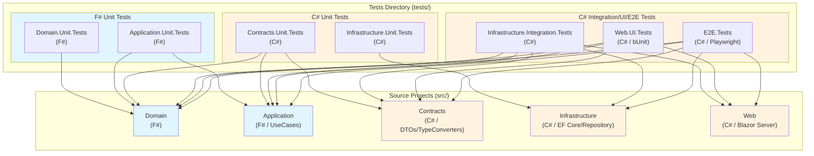
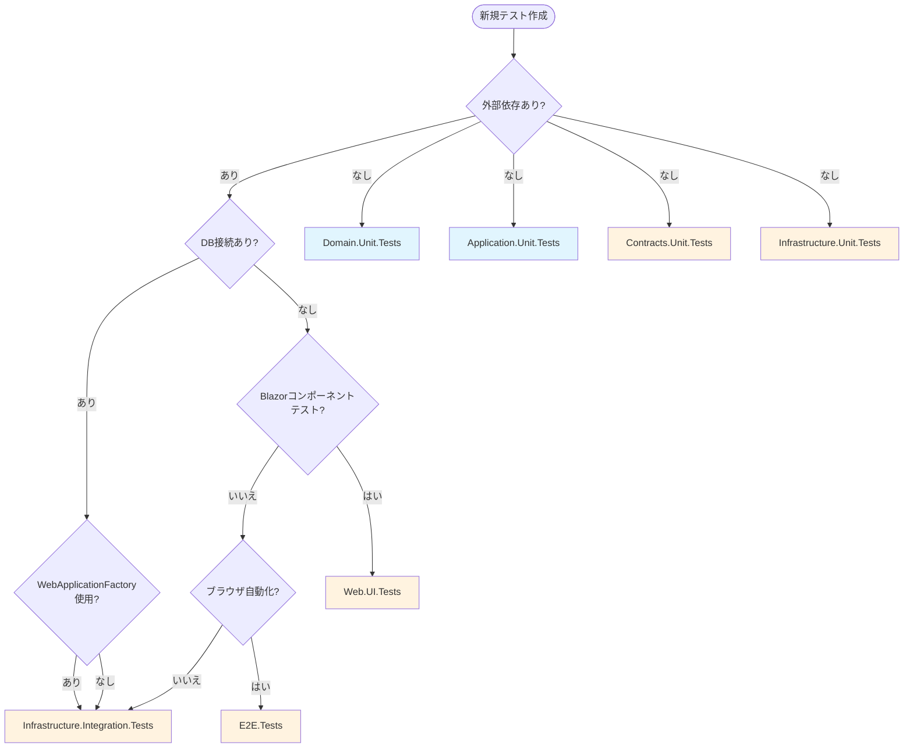

# テストアーキテクチャ設計書

**作成日**: 2025-10-13
**最終更新**: 2025-10-13
**対象システム**: ユビキタス言語管理システム
**Phase**: Phase B-F1完了時（Issue #40 Phase 1-3完了）
**関連ADR**: [ADR_020_テストアーキテクチャ決定](../07_Decisions/ADR_020_テストアーキテクチャ決定.md)

---

## 🎯 目的・スコープ

### 目的
本設計書は、ユビキタス言語管理システムのテストアーキテクチャ全体構成を定義し、以下の目的を達成します：

1. **テストプロジェクト構成の標準化**: レイヤー別×テストタイプ別分離方式の明確化
2. **新規テストプロジェクト作成時の指針提供**: 命名規則・参照関係・言語選択の標準提供
3. **Issue #40類似問題の再発防止**: テストアーキテクチャ整合性維持の基盤確立
4. **Phase B2以降の拡張性確保**: E2E Tests・Playwright統合の基盤構築

### スコープ
- **対象**: tests/ディレクトリ配下の全テストプロジェクト
- **適用範囲**: テストプロジェクト構成・命名規則・参照関係原則・言語選択ガイドライン
- **除外**: ソースコード層（src/）の構成・ビルド設定の詳細

---

## 📊 テストプロジェクト構成図

### 7プロジェクト構成と参照関係



### プロジェクト構成サマリー

| プロジェクト名 | 言語 | テストタイプ | 説明 |
|--------------|------|------------|------|
| Domain.Unit.Tests | F# | Unit | Domainモデル単体テスト |
| Application.Unit.Tests | F# | Unit | UseCases単体テスト |
| Contracts.Unit.Tests | C# | Unit | DTOs/TypeConverters単体テスト |
| Infrastructure.Unit.Tests | C# | Unit | Repository単体テスト |
| Infrastructure.Integration.Tests | C# | Integration | DB統合テスト（WebApplicationFactory/Testcontainers） |
| Web.UI.Tests | C# | UI | Blazorコンポーネント UIテスト（bUnit） |
| E2E.Tests | C# | E2E | エンドツーエンド テスト（Playwright） |

**合計**: 7プロジェクト構成

---

## 📝 命名規則

### 基本フォーマット
```
{ProjectName}.{Layer}.{TestType}.Tests
```

### 構成要素

#### ProjectName（固定）
- **値**: `UbiquitousLanguageManager`
- **理由**: プロジェクト名の統一・ソリューション内での一貫性

#### Layer（レイヤー名）
| Layer値 | 対象ソースプロジェクト | 説明 |
|---------|---------------------|------|
| `Domain` | UbiquitousLanguageManager.Domain | F# ドメインモデル・ビジネスルール |
| `Application` | UbiquitousLanguageManager.Application | F# UseCases・アプリケーションサービス |
| `Contracts` | UbiquitousLanguageManager.Contracts | C# DTOs・TypeConverters（F#↔C#境界） |
| `Infrastructure` | UbiquitousLanguageManager.Infrastructure | C# EF Core・Repository・外部サービス連携 |
| `Web` | UbiquitousLanguageManager.Web | C# Blazor Server・UI |

#### TestType（テストタイプ）
| TestType値 | 説明 | 実行時間目安 | 使用フレームワーク |
|-----------|------|------------|-----------------|
| `Unit` | 単体テスト（外部依存なし） | < 1秒/test | xUnit + FsUnit/FluentAssertions |
| `Integration` | 統合テスト（DB接続・WebApplicationFactory） | 1-10秒/test | xUnit + Testcontainers.PostgreSql |
| `UI` | UIテスト（Blazorコンポーネント） | 1-5秒/test | bUnit + bUnit.web |
| `E2E` | エンドツーエンドテスト（ブラウザ自動化） | 10-60秒/test | Playwright + Playwright MCP |

### 命名例

```
✅ 正しい命名例:
UbiquitousLanguageManager.Domain.Unit.Tests
UbiquitousLanguageManager.Application.Unit.Tests
UbiquitousLanguageManager.Contracts.Unit.Tests
UbiquitousLanguageManager.Infrastructure.Unit.Tests
UbiquitousLanguageManager.Infrastructure.Integration.Tests
UbiquitousLanguageManager.Web.UI.Tests
UbiquitousLanguageManager.E2E.Tests

❌ 誤った命名例:
UbiquitousLanguageManager.Tests                    (Layer・TestTypeの欠落)
UbiquitousLanguageManager.Domain.Tests             (TestTypeの欠落)
UbiquitousLanguageManager.UnitTests                (Layerの欠落)
UbiquitousLanguageManager.Domain.Application.Tests (複数Layer混在)
```

### 例外ケース

**E2E.Testsの命名理由**:
- **Layer省略**: E2Eテストは全層をまたがるため、特定のLayer名を付与しない
- **フォーマット**: `{ProjectName}.E2E.Tests`
- **理由**: エンドツーエンドシナリオテストは特定レイヤーに属さない横断的なテスト

---

## 🔗 参照関係原則

### 基本原則（ADR_020準拠）

#### 1. Unit Tests: テスト対象レイヤーのみ参照

**原則**: テスト対象のレイヤープロジェクトのみを参照し、他の依存層は参照しない

**理由**:
- 単体テストの独立性保証
- 高速なテスト実行（依存関係最小化）
- テスト失敗時の影響範囲明確化

**参照パターンマトリックス**:

| Unit Testプロジェクト | 参照可能なプロジェクト | 参照禁止 |
|---------------------|---------------------|---------|
| Domain.Unit.Tests | Domain のみ | Application / Contracts / Infrastructure / Web |
| Application.Unit.Tests | Application + Domain | Contracts / Infrastructure / Web |
| Contracts.Unit.Tests | Contracts + Domain + Application | Infrastructure / Web |
| Infrastructure.Unit.Tests | Infrastructure のみ | Application / Domain / Contracts / Web |

**例外**: Application.Unit.TestsはDomainを参照可能（Application層がDomain層に依存するため）

#### 2. Integration Tests: 必要な依存層のみ参照

**原則**: 統合テストに必要な最小限の依存層を参照

**Infrastructure.Integration.Tests参照関係**:
```xml
<ItemGroup>
  <ProjectReference Include="..\..\src\UbiquitousLanguageManager.Infrastructure\*.csproj" />
  <ProjectReference Include="..\..\src\UbiquitousLanguageManager.Application\*.fsproj" />
  <ProjectReference Include="..\..\src\UbiquitousLanguageManager.Domain\*.fsproj" />
  <ProjectReference Include="..\..\src\UbiquitousLanguageManager.Web\*.csproj" />
  <ProjectReference Include="..\..\src\UbiquitousLanguageManager.Contracts\*.csproj" />
</ItemGroup>
```

**理由**:
- WebApplicationFactory使用のためWeb層参照が必要
- Repository統合テストのためInfrastructure + Application + Domain参照が必要
- F#↔C#境界テストのためContracts参照が必要

#### 3. UI Tests: Web層 + 必要な依存層を参照

**Web.UI.Tests参照関係**:
```xml
<ItemGroup>
  <ProjectReference Include="..\..\src\UbiquitousLanguageManager.Web\*.csproj" />
  <ProjectReference Include="..\..\src\UbiquitousLanguageManager.Contracts\*.csproj" />
  <ProjectReference Include="..\..\src\UbiquitousLanguageManager.Application\*.fsproj" />
  <ProjectReference Include="..\..\src\UbiquitousLanguageManager.Domain\*.fsproj" />
</ItemGroup>
```

**理由**:
- Blazor Serverコンポーネントテストのため、Web層 + モック用依存層参照が必要

#### 4. E2E Tests: 全層参照可能

**E2E.Tests参照関係**:
```xml
<ItemGroup>
  <!-- 全層参照可能 -->
  <ProjectReference Include="..\..\src\UbiquitousLanguageManager.Web\*.csproj" />
  <ProjectReference Include="..\..\src\UbiquitousLanguageManager.Infrastructure\*.csproj" />
  <ProjectReference Include="..\..\src\UbiquitousLanguageManager.Application\*.fsproj" />
  <ProjectReference Include="..\..\src\UbiquitousLanguageManager.Domain\*.fsproj" />
  <ProjectReference Include="..\..\src\UbiquitousLanguageManager.Contracts\*.csproj" />
</ItemGroup>
```

**理由**:
- エンドツーエンドシナリオテストは全層をまたがるため、制限なし

---

## 📍 配置ルール・判断基準

### 配置ルール

#### 1. ディレクトリ配置
```
ubiquitous-lang-mng/
├── src/                      # ソースコード
│   ├── Domain/
│   ├── Application/
│   ├── Contracts/
│   ├── Infrastructure/
│   └── Web/
└── tests/                    # テストプロジェクト（全て配下に配置）
    ├── Domain.Unit.Tests/
    ├── Application.Unit.Tests/
    ├── Contracts.Unit.Tests/
    ├── Infrastructure.Unit.Tests/
    ├── Infrastructure.Integration.Tests/
    ├── Web.UI.Tests/
    └── E2E.Tests/
```

#### 2. ソリューションファイル登録
- 全テストプロジェクトは `UbiquitousLanguageManager.sln` に登録必須
- 登録コマンド: `dotnet sln add tests/{ProjectName}`

### テストタイプ判断基準

#### 判断フローチャート



#### 判断基準詳細

| 判断ポイント | Unit | Integration | UI | E2E |
|------------|------|-------------|-----|-----|
| **外部依存（DB/API/File）** | なし | あり | あり（モック化） | あり（実環境） |
| **実行時間目安** | < 1秒 | 1-10秒 | 1-5秒 | 10-60秒 |
| **並列実行可能性** | 高 | 中（DB制約あり） | 高 | 低（ブラウザリソース） |
| **テスト対象** | 1クラス/1関数 | 複数層統合 | Blazorコンポーネント | UIインタラクション |
| **使用フレームワーク** | xUnit | xUnit + Testcontainers | bUnit | Playwright |

---

## 🔤 言語選択ガイドライン

### 基本原則

**原則**: テスト対象レイヤーと同じ言語を選択

**理由**:
- F#プロジェクトでのC#ファイルコンパイル不可（F#コンパイラの制約）
- テストコードとソースコードの言語統一による可読性向上

### 言語選択マトリックス

| レイヤー | テスト対象言語 | テストプロジェクト言語 | テストフレームワーク |
|---------|--------------|---------------------|------------------|
| Domain | F# | F# | xUnit + FsUnit.xUnit |
| Application | F# | F# | xUnit + FsUnit.xUnit |
| Contracts | C# | C# | xUnit + FluentAssertions |
| Infrastructure | C# | C# | xUnit + FluentAssertions |
| Web | C# | C# | bUnit + bUnit.web |

### F#推奨ケース
- Domain層のテスト（F#プロジェクトのため）
- Application層のテスト（F#プロジェクトのため）

### C#推奨ケース
- Contracts層のテスト（C#プロジェクトのため）
- Infrastructure層のテスト（C#プロジェクトのため）
- Web層のテスト（C#プロジェクト + bUnitはC#専用）

### 混在禁止
- ❌ F#プロジェクトにC#テストファイルを含めない
- ❌ C#プロジェクトにF#テストファイルを含めない

---

## 📦 NuGetパッケージ標準構成

### F# Unit Tests標準パッケージ

**対象**: Domain.Unit.Tests / Application.Unit.Tests

```xml
<ItemGroup>
  <!-- xUnit Core -->
  <PackageReference Include="xunit" Version="2.9.0" />
  <PackageReference Include="xunit.runner.visualstudio" Version="2.8.2" />
  <PackageReference Include="Microsoft.NET.Test.Sdk" Version="17.11.1" />

  <!-- F# Testing -->
  <PackageReference Include="FsUnit.xUnit" Version="6.0.1" />

  <!-- Mocking -->
  <PackageReference Include="NSubstitute" Version="5.1.0" />
</ItemGroup>
```

### C# Unit Tests標準パッケージ

**対象**: Contracts.Unit.Tests / Infrastructure.Unit.Tests

```xml
<ItemGroup>
  <!-- xUnit Core -->
  <PackageReference Include="xunit" Version="2.9.0" />
  <PackageReference Include="xunit.runner.visualstudio" Version="2.8.2" />
  <PackageReference Include="Microsoft.NET.Test.Sdk" Version="17.11.1" />

  <!-- Assertions -->
  <PackageReference Include="FluentAssertions" Version="6.12.1" />

  <!-- Mocking -->
  <PackageReference Include="Moq" Version="4.20.72" />
  <PackageReference Include="NSubstitute" Version="5.1.0" />
</ItemGroup>
```

### Integration Tests標準パッケージ

**対象**: Infrastructure.Integration.Tests

```xml
<ItemGroup>
  <!-- xUnit Core -->
  <PackageReference Include="xunit" Version="2.9.0" />
  <PackageReference Include="xunit.runner.visualstudio" Version="2.8.2" />
  <PackageReference Include="Microsoft.NET.Test.Sdk" Version="17.11.1" />

  <!-- Integration Testing -->
  <PackageReference Include="Microsoft.AspNetCore.Mvc.Testing" Version="8.0.10" />
  <PackageReference Include="Microsoft.EntityFrameworkCore.InMemory" Version="8.0.10" />

  <!-- Testcontainers -->
  <PackageReference Include="Testcontainers.PostgreSql" Version="3.10.0" />
</ItemGroup>
```

### UI Tests標準パッケージ

**対象**: Web.UI.Tests

```xml
<ItemGroup>
  <!-- xUnit Core -->
  <PackageReference Include="xunit" Version="2.9.0" />
  <PackageReference Include="xunit.runner.visualstudio" Version="2.8.2" />
  <PackageReference Include="Microsoft.NET.Test.Sdk" Version="17.11.1" />

  <!-- bUnit -->
  <PackageReference Include="bunit" Version="1.32.7" />
  <PackageReference Include="bunit.web" Version="1.32.7" />

  <!-- Mocking -->
  <PackageReference Include="Moq" Version="4.20.72" />
  <PackageReference Include="NSubstitute" Version="5.1.0" />
</ItemGroup>
```

### E2E Tests標準パッケージ

**対象**: E2E.Tests

```xml
<ItemGroup>
  <!-- xUnit Core -->
  <PackageReference Include="xunit" Version="2.9.0" />
  <PackageReference Include="xunit.runner.visualstudio" Version="2.8.2" />
  <PackageReference Include="Microsoft.NET.Test.Sdk" Version="17.11.1" />

  <!-- Playwright -->
  <PackageReference Include="Microsoft.Playwright" Version="1.48.0" />
  <PackageReference Include="Microsoft.AspNetCore.Mvc.Testing" Version="8.0.10" />
</ItemGroup>
```

---

## ✅ ADR_020準拠確認

### 決定事項との整合性マトリックス

| ADR_020決定事項 | 本設計書での実装 | 準拠状況 |
|---------------|----------------|---------|
| **レイヤー別×テストタイプ別分離** | 7プロジェクト構成（Domain.Unit / Application.Unit / Contracts.Unit / Infrastructure.Unit / Infrastructure.Integration / Web.UI / E2E） | ✅ 完全準拠 |
| **命名規則: `{ProjectName}.{Layer}.{TestType}.Tests`** | 全プロジェクトで統一適用（例外: E2E.Tests） | ✅ 完全準拠 |
| **参照関係原則: Unit Tests = テスト対象レイヤーのみ参照** | Unit Tests参照関係マトリックス定義（Domain.Unit → Domain のみ） | ✅ 完全準拠 |
| **言語別分離: F# (Domain/Application) / C# (その他)** | 言語選択ガイドライン策定 | ✅ 完全準拠 |
| **業界標準準拠: .NET Clean Architecture 2024** | Microsoft eShopOnWebパターン採用・Testcontainers/bUnit/Playwright標準使用 | ✅ 完全準拠 |

### ADR_020参照リンク
詳細は [ADR_020_テストアーキテクチャ決定](../07_Decisions/ADR_020_テストアーキテクチャ決定.md) を参照してください。

---

## 📚 関連ドキュメント

### 設計・決定記録
- [ADR_020_テストアーキテクチャ決定](../07_Decisions/ADR_020_テストアーキテクチャ決定.md) - 本設計書の技術的根拠
- [ADR_019_namespace設計規約](../07_Decisions/ADR_019_namespace設計規約.md) - namespace階層化の決定事項
- [データベース設計書](./データベース設計書.md) - DB統合テストの参照仕様

### 組織・運用ドキュメント
- [新規テストプロジェクト作成ガイドライン](../08_Organization/Rules/新規テストプロジェクト作成ガイドライン.md) - 新規プロジェクト作成時の標準手順
- [組織管理運用マニュアル](../08_Organization/Rules/組織管理運用マニュアル.md) - Phase/Step完了時のテストアーキテクチャ整合性確認

---

**作成日**: 2025-10-13
**作成者**: Claude Code
**承認者**: プロジェクトオーナー
