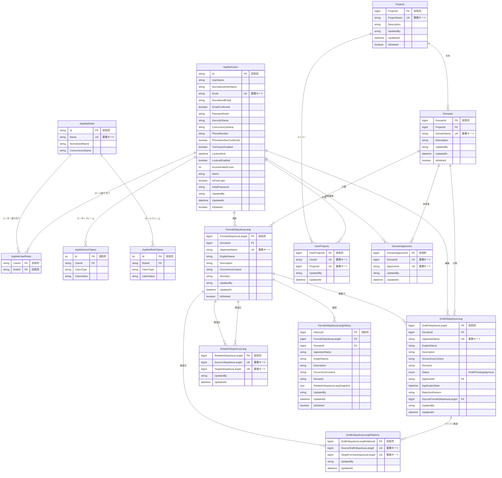
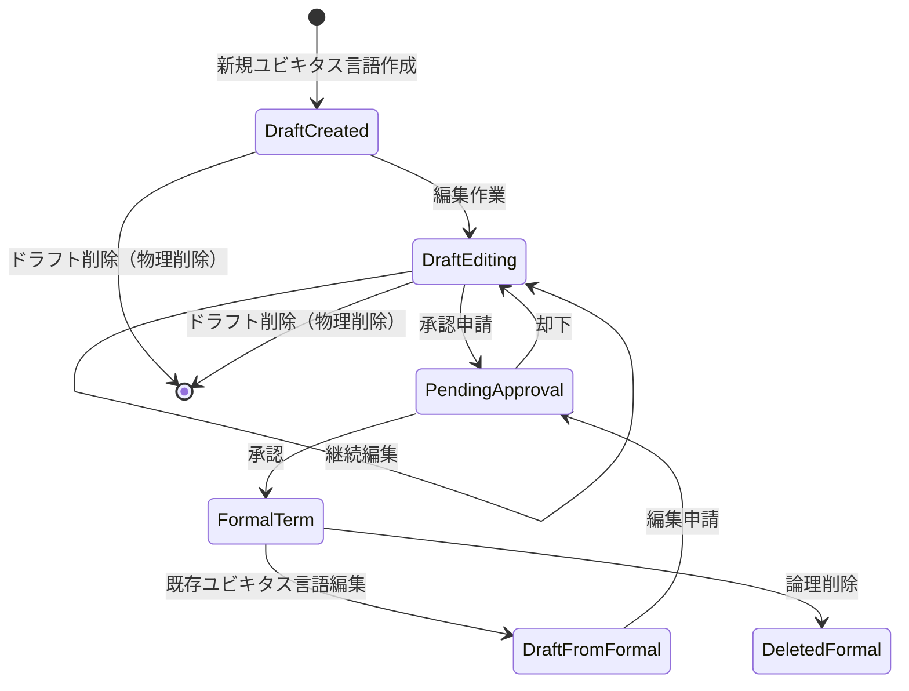
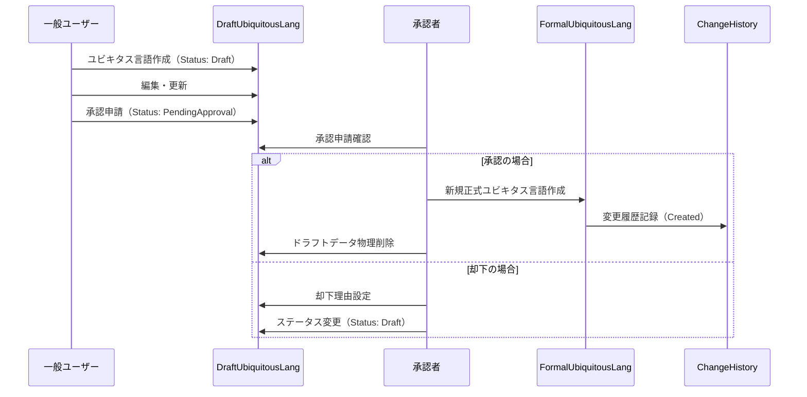

# ユビキタス言語管理システム データベース設計書

**プロジェクト名**: ユビキタス言語管理システム  
**バージョン**: 1.1  
**作成日**: 2025-06-29  
**最終更新**: 2025-08-12  
**承認者**: プロジェクトオーナー  

## 目次

1. [データベース概要](#1-データベース概要)
2. [基本エンティティ設計](#2-基本エンティティ設計)
3. [関連エンティティ設計](#3-関連エンティティ設計)
4. [ER図](#4-er図)
5. [テーブル詳細設計](#5-テーブル詳細設計)
6. [データライフサイクル](#6-データライフサイクル)
7. [インデックス設計](#7-インデックス設計)
8. [パフォーマンス・制約事項](#8-パフォーマンス制約事項)

---

## 1. データベース概要

### 1.1 設計方針

#### 基本方針
- **Clean Architecture**: レイヤード構造による依存関係の整理
- **従来型CRUD**: シンプルで保守性の高いデータアクセス
- **論理削除と物理削除の使い分け**: データの性質に応じた適切な削除方式

#### データベース技術
- **全環境共通**: PostgreSQL（Docker Container → クラウドDBサービス）
- **データ移行**: 不要（全環境PostgreSQL統一により）

#### 主要な設計原則
- **正規化**: 3NF準拠による冗長性排除
- **参照整合性**: 外部キー制約による整合性確保
- **楽観ロック**: UpdatedAt（TIMESTAMPTZ）による競合制御
- **監査証跡**: 変更履歴とJSONB活用による透明性確保
- **PostgreSQL最適化**: TIMESTAMPTZ、JSONB、GINインデックス等固有機能活用

### 1.2 システム構成

#### データ階層構造
```
組織 (Organizations) [将来拡張]
├── プロジェクト (Projects)
│   ├── ドメイン (Domains)
│   │   ├── ドラフトユビキタス言語 (DraftUbiquitousLang)
│   │   ├── 正式ユビキタス言語 (FormalUbiquitousLang)
│   │   └── 関連ユビキタス言語 (RelatedUbiquitousLang)
│   └── ユーザー所属 (UserProjects)
└── ユーザー (AspNetUsers)
    └── 権限・ロール (UserRoles)
```

#### 主要エンティティ群
1. **ユーザー・権限管理**: AspNetUsers, AspNetRoles, AspNetUserRoles, AspNetUserClaims, AspNetRoleClaims, UserProjects, DomainApprovers
2. **プロジェクト・ドメイン管理**: Projects, Domains
3. **ユビキタス言語管理**: DraftUbiquitousLang, FormalUbiquitousLang, RelatedUbiquitousLang
4. **履歴管理**: ChangeHistory

---

## 2. 基本エンティティ設計

### 2.1 ユーザー管理 (AspNetUsers)

#### 概要
システム利用者の情報と認証・権限管理を担当するマスターエンティティ。

#### 主要項目
- **認証情報**: メールアドレス（ログインID）、パスワードハッシュ
- **基本情報**: 氏名、ユーザーロール
- **状態管理**: アクティブ/非アクティブ、初回ログインフラグ
- **セキュリティ**: パスワードリセットトークン、有効期限

#### ユーザーロール
1. **SuperUser**: システム全体管理者
2. **ProjectManager**: プロジェクト管理者
3. **DomainApprover**: ドメイン承認者
4. **GeneralUser**: 一般ユーザー

### 2.2 プロジェクト管理 (Projects)

#### 概要
ユビキタス言語管理の最上位組織単位。業務プロジェクト・製品・サービス単位での管理。

#### 主要項目
- **基本情報**: プロジェクト名（一意）、説明
- **管理情報**: 作成者、作成日時、最終更新情報
- **状態管理**: 論理削除フラグ

#### ビジネスルール
- プロジェクト名はシステム内で一意
- 削除時は関連データを含めて論理削除
- デフォルトドメイン「共通」が自動作成される

### 2.3 ドメイン管理 (Domains)

#### 概要
プロジェクト内でのビジネスドメイン分類。用語管理と承認権限の単位。

#### 主要項目
- **基本情報**: ドメイン名、説明
- **階層情報**: 所属プロジェクトID
- **管理情報**: 承認者設定、作成・更新情報
- **状態管理**: 論理削除フラグ

#### ビジネスルール
- ドメイン名は同一プロジェクト内で一意
- 最低1名の承認者設定が必須
- デフォルトドメイン「共通」は削除不可

### 2.4 ドラフトユビキタス言語管理 (DraftUbiquitousLang)

#### 概要
作業中・承認申請中のユビキタス言語を管理。編集・申請・却下の状態遷移を持つ。

#### 主要項目
- **ユビキタス言語情報**: 和名、英名、意味・説明、発生機会、備考
- **分類情報**: 所属ドメインID
- **状態情報**: ドラフト/承認申請
- **ワークフロー**: 申請者、申請日時、却下理由
- **システム項目**: 競合制御（RowVersion）、更新情報

#### 状態遷移
```
ドラフト → 承認申請 → (承認時)正式ユビキタス言語に移行 + 物理削除
         ↓         ↓ (却下時)ドラフトに戻る
```

### 2.5 正式ユビキタス言語管理 (FormalUbiquitousLang)

#### 概要
承認済みの確定ユビキタス言語を管理。システムの最終的な成果物となるデータ。

#### 主要項目
- **ユビキタス言語情報**: 和名、英名、意味・説明、発生機会、備考（全項目必須）
- **分類情報**: 所属ドメインID
- **承認情報**: 承認者ID、承認日時
- **管理情報**: 最終更新者、最終更新日時
- **論理削除**: 削除フラグ、削除者、削除日時

#### ビジネスルール
- 同一プロジェクト・ドメイン内での和名重複禁止
- 編集時は新規ドラフト作成による承認フロー
- 削除は論理削除による履歴保持

---

## 3. 関連エンティティ設計

### 3.1 ユーザー・プロジェクト関連 (UserProjects)

#### 概要
ユーザーとプロジェクトの多対多関連を管理。権限制御の基盤。

#### 主要項目
- **関連情報**: ユーザーID、プロジェクトID
- **管理情報**: 追加日時、追加者

#### ビジネスルール
- 1ユーザーが複数プロジェクトに所属可能
- 1プロジェクトに複数ユーザーが所属可能
- プロジェクト管理者は担当プロジェクトの管理権限を持つ

### 3.2 ドメイン承認者管理 (DomainApprovers)

#### 概要
ドメイン承認権限の管理。承認フローの権限制御に使用。

#### 主要項目
- **関連情報**: ドメインID、承認者ユーザーID
- **管理情報**: 追加日時、追加者

#### ビジネスルール
- 1ドメインに複数の承認者設定可能
- 1ユーザーが複数ドメインの承認者になれる
- 最低1名の承認者必須

### 3.3 関連ユビキタス言語管理 (RelatedUbiquitousLang)

#### 概要
ユビキタス言語間の関連性を管理。意味的な繋がりや類義語関係の表現。

#### 主要項目
- **関連情報**: 元ユビキタス言語ID、関連ユビキタス言語ID
- **関連種別**: 類義語、上位概念、下位概念等（将来拡張）
- **管理情報**: 登録日時、登録者

#### ビジネスルール
- 正式ユビキタス言語のみ関連付け可能
- 相互関連（双方向）の自動設定
- 削除済みユビキタス言語への関連は自動削除

### 3.4 変更履歴管理 (ChangeHistory)

#### 概要
正式ユビキタス言語の変更履歴を保持。監査証跡とデータガバナンスを提供。

#### 主要項目
- **対象情報**: ユビキタス言語ID、変更種別（作成/更新/削除）
- **変更内容**: 変更前データ、変更後データ（JSON形式）
- **実行情報**: 実行者、実行日時、承認者、承認日時
- **備考**: 変更理由、却下理由

#### ビジネスルール
- 正式ユビキタス言語の全変更を記録
- データはJSON形式で柔軟に格納
- 論理削除による永続保持

---

## 4. ER図

### 4.1 概念ER図

**記法ルール**: 
- `PK "技術的"`: サロゲートキー（技術的主キー）
- `UK "業務キー⭐"`: 業務キー（自然キー・一意制約）
- ⭐マークにより業務的識別子を視覚的に強調



### 4.2 物理ER図の補足説明

#### 主要な制約
- **一意制約**: Email（AspNetUsers）、ProjectName（Projects）、DomainName（Domains, プロジェクト内）
- **外部キー制約**: 参照整合性を全関連で設定
- **チェック制約**: UserRole列、Status列、ChangeType列等でENUM値制限
- **NOT NULL制約**: 必須項目での厳密な制御

#### インデックス戦略
- **主キー**: 全テーブルで自動インデックス
- **外部キー**: 結合性能向上のためのインデックス
- **検索対象**: JapaneseName、EnglishName、Description等
- **複合インデックス**: プロジェクト+ドメイン、ドメイン+用語名等

---

## 5. テーブル詳細設計

**依存関係順序でのテーブル記載**:
1. AspNetUsers, AspNetRoles (独立)
2. AspNetUserRoles (AspNetUsers, AspNetRoles依存)
3. AspNetUserClaims (AspNetUsers依存)
4. AspNetRoleClaims (AspNetRoles依存)
5. Projects (独立)  
6. UserProjects (AspNetUsers, Projects依存)
7. Domains (Projects依存)
8. DomainApprovers (Domains, AspNetUsers依存)
9. FormalUbiquitousLang (Domains, AspNetUsers依存)
10. DraftUbiquitousLang (Domains, AspNetUsers, FormalUbiquitousLang依存)
11. RelatedUbiquitousLang (FormalUbiquitousLang依存)
12. DraftUbiquitousLangRelations (DraftUbiquitousLang, FormalUbiquitousLang依存)
13. FormalUbiquitousLangHistory (FormalUbiquitousLang依存)

### 5.1 ASP.NET Core Identity テーブル群

#### 5.1.1 AspNetUsers テーブル

#### 目的
ASP.NET Core Identity統合による認証・権限情報とユーザー基本情報の管理

#### カラム定義

| カラム名 | データ型 | 制約 | 説明 |
|---------|----------|------|------|
| Id | VARCHAR(450) | PK | ユーザーID（主キー、GUID文字列） |
| UserName | VARCHAR(256) | NULL | ユーザー名 |
| NormalizedUserName | VARCHAR(256) | NULL | 正規化ユーザー名 |
| Email | VARCHAR(256) | NULL | メールアドレス |
| NormalizedEmail | VARCHAR(256) | NULL | 正規化メールアドレス |
| EmailConfirmed | BOOLEAN | NOT NULL, DEFAULT false | メールアドレス確認フラグ |
| PasswordHash | TEXT | NULL | パスワードハッシュ値 |
| SecurityStamp | TEXT | NULL | セキュリティスタンプ |
| ConcurrencyStamp | TEXT | NULL | 同時実行制御スタンプ |
| LockoutEnd | TIMESTAMPTZ | NULL | ロックアウト終了日時 |
| LockoutEnabled | BOOLEAN | NOT NULL, DEFAULT false | ロックアウト有効フラグ |
| AccessFailedCount | INTEGER | NOT NULL, DEFAULT false | アクセス失敗回数 |
| Name | VARCHAR(50) | NOT NULL | ユーザー氏名 |
| IsFirstLogin | BOOLEAN | NOT NULL, DEFAULT true | 初回ログインフラグ |
| UpdatedAt | TIMESTAMPTZ | NOT NULL, DEFAULT NOW() | 最終更新日時 |
| IsDeleted | BOOLEAN | NOT NULL, DEFAULT false | 論理削除フラグ |
| InitialPassword | VARCHAR(100) | NULL | 初期パスワード（平文・一時的） |
| PasswordResetToken | TEXT | NULL | パスワードリセットトークン |
| PasswordResetExpiry | TIMESTAMPTZ | NULL | リセットトークン有効期限 |

#### 制約・ルール
- **一意制約**: NormalizedUserName, NormalizedEmail
- **ビジネスルール**: 
  - 論理削除時はIsDeleted=trueに設定
  - 初回ログイン後にInitialPasswordはNULLに設定
  - パスワードリセット時のトークン有効期限は24時間

#### インデックス
- PRIMARY KEY (Id)
- UNIQUE INDEX IX_AspNetUsers_NormalizedUserName (NormalizedUserName)
- INDEX IX_AspNetUsers_NormalizedEmail (NormalizedEmail)
- INDEX IX_AspNetUsers_IsDeleted (IsDeleted)
- INDEX IX_AspNetUsers_IsFirstLogin (IsFirstLogin)

#### 5.1.2 AspNetRoles テーブル

#### 目的
システム内の権限ロール管理

#### カラム定義

| カラム名 | データ型 | 制約 | 説明 |
|---------|----------|------|------|
| Id | VARCHAR(450) | PK | ロールID（主キー） |
| Name | VARCHAR(256) | NULL | ロール名 |
| NormalizedName | VARCHAR(256) | NULL | 正規化ロール名 |
| ConcurrencyStamp | TEXT | NULL | 同時実行制御スタンプ |

#### 制約・ルール
- **一意制約**: NormalizedName
- **初期データ**: SuperUser, ProjectManager, DomainApprover, GeneralUser

#### インデックス
- PRIMARY KEY (Id)
- UNIQUE INDEX IX_AspNetRoles_NormalizedName (NormalizedName)

#### 5.1.3 AspNetUserRoles テーブル

#### 目的
ユーザーとロールの多対多関連管理

#### カラム定義

| カラム名 | データ型 | 制約 | 説明 |
|---------|----------|------|------|
| UserId | VARCHAR(450) | PK, FK | ユーザーID |
| RoleId | VARCHAR(450) | PK, FK | ロールID |

#### 制約・ルール
- **複合主キー**: (UserId, RoleId)
- **外部キー**: UserId → AspNetUsers.Id, RoleId → AspNetRoles.Id
- **ビジネスルール**: 1ユーザーが複数ロール所属可能

#### インデックス
- PRIMARY KEY (UserId, RoleId)
- INDEX IX_AspNetUserRoles_RoleId (RoleId)

#### 5.1.4 AspNetUserClaims テーブル

#### 目的
ユーザー固有のクレーム（追加属性・権限）情報の管理

#### カラム定義

| カラム名 | データ型 | 制約 | 説明 |
|---------|----------|------|------|
| Id | SERIAL | PK | クレームID（主キー） |
| UserId | VARCHAR(450) | NOT NULL, FK | ユーザーID |
| ClaimType | TEXT | NULL | クレーム種別 |
| ClaimValue | TEXT | NULL | クレーム値 |

#### 制約・ルール
- **外部キー**: UserId → AspNetUsers.Id (CASCADE DELETE)
- **ビジネスルール**: 1ユーザーが複数のクレームを持つことが可能
- **使用例**: カスタム権限、部門情報、拡張属性など

#### インデックス
- PRIMARY KEY (Id)
- INDEX IX_AspNetUserClaims_UserId (UserId)

#### 5.1.5 AspNetRoleClaims テーブル

#### 目的
ロール固有のクレーム（権限グループ）情報の管理

#### カラム定義

| カラム名 | データ型 | 制約 | 説明 |
|---------|----------|------|------|
| Id | SERIAL | PK | クレームID（主キー） |
| RoleId | VARCHAR(450) | NOT NULL, FK | ロールID |
| ClaimType | TEXT | NULL | クレーム種別 |
| ClaimValue | TEXT | NULL | クレーム値 |

#### 制約・ルール
- **外部キー**: RoleId → AspNetRoles.Id (CASCADE DELETE)
- **ビジネスルール**: 1ロールが複数のクレームを持つことが可能
- **使用例**: ロール別機能権限、アクセス制御など

#### インデックス
- PRIMARY KEY (Id)
- INDEX IX_AspNetRoleClaims_RoleId (RoleId)

### 5.2 Projects テーブル

#### 目的
プロジェクト情報の管理とユーザー・ドメインとの関連制御

#### カラム定義

| カラム名 | データ型 | 制約 | 説明 |
|---------|----------|------|------|
| ProjectId | BIGSERIAL | PK | プロジェクトID（主キー） |
| ProjectName | VARCHAR(50) | NOT NULL, UNIQUE | プロジェクト名 |
| Description | TEXT | NULL | プロジェクト説明 |
| UpdatedBy | VARCHAR(450) | NOT NULL | 最終更新者ID |
| UpdatedAt | TIMESTAMPTZ | NOT NULL, DEFAULT NOW() | 最終更新日時 |
| IsDeleted | BOOLEAN | NOT NULL, DEFAULT false | 論理削除フラグ |

#### 制約・ルール
- **一意制約**: ProjectName（削除済み含む）
- **ビジネスルール**: 作成時に「共通」ドメイン自動作成

#### インデックス
- PRIMARY KEY (ProjectId)
- UNIQUE INDEX IX_Projects_ProjectName (ProjectName)
- INDEX IX_Projects_IsDeleted (IsDeleted)

### 5.3 UserProjects テーブル

#### 目的
ユーザーとプロジェクトの多対多関連を管理、権限制御の基盤

#### カラム定義

| カラム名 | データ型 | 制約 | 説明 |
|---------|----------|------|------|
| UserProjectId | BIGSERIAL | PK | ユーザープロジェクトID（主キー） |
| UserId | VARCHAR(450) | NOT NULL, FK | ユーザーID |
| ProjectId | BIGINT | NOT NULL, FK | プロジェクトID |
| UpdatedBy | VARCHAR(450) | NOT NULL | 最終更新者ID |
| UpdatedAt | TIMESTAMPTZ | NOT NULL, DEFAULT NOW() | 最終更新日時 |

#### 制約・ルール
- **複合一意制約**: (UserId, ProjectId) ユーザー・プロジェクト組み合わせ一意
- **外部キー**: UserId → AspNetUsers.Id, ProjectId → Projects.ProjectId
- **ビジネスルール**: 1ユーザーが複数プロジェクト所属可能、1プロジェクトに複数ユーザー所属可能

#### インデックス
- PRIMARY KEY (UserProjectId)
- UNIQUE INDEX IX_UserProjects_UserProject (UserId, ProjectId)
- INDEX IX_UserProjects_ProjectId (ProjectId)
- INDEX IX_UserProjects_UserId (UserId)

### 5.4 Domains テーブル

#### 目的
プロジェクト内ドメイン分類と承認権限の管理単位

#### カラム定義

| カラム名 | データ型 | 制約 | 説明 |
|---------|----------|------|------|
| DomainId | BIGSERIAL | PK | ドメインID（主キー） |
| ProjectId | BIGINT | NOT NULL, FK | 所属プロジェクトID |
| DomainName | VARCHAR(30) | NOT NULL | ドメイン名 |
| Description | TEXT | NULL | ドメイン説明 |
| UpdatedBy | VARCHAR(450) | NOT NULL | 最終更新者ID |
| UpdatedAt | TIMESTAMPTZ | NOT NULL, DEFAULT NOW() | 最終更新日時 |
| IsDeleted | BOOLEAN | NOT NULL, DEFAULT false | 論理削除フラグ |

#### 制約・ルール
- **複合一意制約**: (ProjectId, DomainName) プロジェクト内ドメイン名一意
- **外部キー**: ProjectId → Projects.ProjectId
- **ビジネスルール**: プロジェクト作成時に「共通」ドメインを自動作成

#### インデックス
- PRIMARY KEY (DomainId)
- UNIQUE INDEX IX_Domains_ProjectDomain (ProjectId, DomainName)
- INDEX IX_Domains_ProjectId (ProjectId)
- INDEX IX_Domains_IsDeleted (IsDeleted)

### 5.5 DomainApprovers テーブル

#### 目的
ドメイン承認権限の管理、承認フローの権限制御に使用

#### カラム定義

| カラム名 | データ型 | 制約 | 説明 |
|---------|----------|------|------|
| DomainApproverId | BIGINT | PK, BIGSERIAL | ドメイン承認者ID（主キー） |
| DomainId | BIGINT | NOT NULL, FK | ドメインID |
| ApproverId | VARCHAR(450) | NOT NULL, FK | 承認者ユーザーID |
| UpdatedBy | VARCHAR(450) | NOT NULL | 最終更新者ID |
| UpdatedAt | TIMESTAMPTZ | NOT NULL | 最終更新日時 |

#### 制約・ルール
- **複合一意制約**: (DomainId, ApproverId) ドメイン・承認者組み合わせ一意
- **外部キー**: DomainId → Domains.DomainId, ApproverId → AspNetUsers.Id
- **ビジネスルール**: 1ドメインに複数承認者設定可能、1ユーザーが複数ドメインの承認者になれる、最低1名承認者必須

#### インデックス
- PRIMARY KEY (DomainApproverId)
- UNIQUE INDEX IX_DomainApprovers_DomainApprover (DomainId, ApproverId)
- INDEX IX_DomainApprovers_DomainId (DomainId)
- INDEX IX_DomainApprovers_ApproverId (ApproverId)

### 5.6 FormalUbiquitousLang テーブル

#### 目的
承認済み確定ユビキタス言語の管理と外部連携用データ提供

#### カラム定義

| カラム名 | データ型 | 制約 | 説明 |
|---------|----------|------|------|
| FormalUbiquitousLangId | BIGINT | PK, BIGSERIAL | 正式ユビキタス言語ID（主キー） |
| DomainId | BIGINT | NOT NULL, FK | 所属ドメインID |
| JapaneseName | VARCHAR(30) | NOT NULL | 和名 |
| EnglishName | VARCHAR(50) | NOT NULL | 英名 |
| Description | TEXT | NOT NULL | 意味・説明（改行可能） |
| OccurrenceContext | VARCHAR(50) | NULL | 発生機会 |
| Remarks | TEXT | NULL | 備考（改行可能） |
| UpdatedBy | VARCHAR(450) | NOT NULL | 最終更新者ID |
| UpdatedAt | TIMESTAMPTZ | NOT NULL | 最終更新日時 |
| IsDeleted | BOOLEAN | NOT NULL, DEFAULT false | 論理削除フラグ |

#### 制約・ルール
- **複合一意制約**: (DomainId, JapaneseName) ドメイン内和名一意（削除済み除外）
- **外部キー**: DomainId → Domains.DomainId
- **ビジネスルール**: 編集時は新規ドラフト作成→承認フロー

#### インデックス
- PRIMARY KEY (FormalUbiquitousLangId)
- UNIQUE INDEX IX_FormalUbiquitousLang_DomainJapaneseName (DomainId, JapaneseName) WHERE IsDeleted = 0
- INDEX IX_FormalUbiquitousLang_DomainId (DomainId)
- INDEX IX_FormalUbiquitousLang_JapaneseName (JapaneseName)
- INDEX IX_FormalUbiquitousLang_EnglishName (EnglishName)
- INDEX IX_FormalUbiquitousLang_IsDeleted (IsDeleted)

### 5.7 DraftUbiquitousLang テーブル

#### 目的
編集中・承認申請中のユビキタス言語管理とワークフロー制御

#### カラム定義

| カラム名 | データ型 | 制約 | 説明 |
|---------|----------|------|------|
| DraftUbiquitousLangId | BIGINT | PK, BIGSERIAL | ドラフトユビキタス言語ID（主キー） |
| DomainId | BIGINT | NOT NULL, FK | 所属ドメインID |
| JapaneseName | VARCHAR(30) | NOT NULL | 和名 |
| EnglishName | VARCHAR(50) | NULL | 英名 |
| Description | TEXT | NULL | 意味・説明（改行可能） |
| OccurrenceContext | VARCHAR(50) | NULL | 発生機会 |
| Remarks | TEXT | NULL | 備考（改行可能） |
| Status | VARCHAR(20) | NOT NULL, CHECK | 状態（Draft/PendingApproval） |
| ApplicantId | VARCHAR(450) | NULL, FK | 申請者ID |
| ApplicationDate | TIMESTAMPTZ | NULL | 申請日時 |
| RejectionReason | TEXT | NULL | 却下理由 |
| SourceFormalUbiquitousLangId | BIGINT | NULL, FK | 編集元正式ユビキタス言語ID |
| UpdatedBy | VARCHAR(450) | NOT NULL | 最終更新者ID |
| UpdatedAt | TIMESTAMPTZ | NOT NULL | 最終更新日時 |

#### 制約・ルール
- **チェック制約**: Status IN ('Draft', 'PendingApproval')
- **外部キー**: DomainId → Domains.DomainId, ApplicantId, UpdatedBy → AspNetUsers.Id, SourceFormalUbiquitousLangId → FormalUbiquitousLang.FormalUbiquitousLangId
- **ビジネスルール**: 承認時に物理削除、正式ユビキタス言語テーブルに移行

#### インデックス
- PRIMARY KEY (DraftUbiquitousLangId)
- INDEX IX_DraftUbiquitousLang_DomainId (DomainId)
- INDEX IX_DraftUbiquitousLang_Status (Status)
- INDEX IX_DraftUbiquitousLang_JapaneseName (JapaneseName)
- INDEX IX_DraftUbiquitousLang_ApplicantId (ApplicantId)

### 5.8 RelatedUbiquitousLang テーブル

#### 目的
ユビキタス言語間の関連性を管理、意味的な繋がりや類義語関係の表現

#### カラム定義

| カラム名 | データ型 | 制約 | 説明 |
|---------|----------|------|------|
| RelatedUbiquitousLangId | BIGINT | PK, BIGSERIAL | 関連ユビキタス言語ID（主キー） |
| SourceUbiquitousLangId | BIGINT | NOT NULL, FK | 関連元ユビキタス言語ID |
| TargetUbiquitousLangId | BIGINT | NOT NULL, FK | 関連先ユビキタス言語ID |
| UpdatedBy | VARCHAR(450) | NOT NULL | 最終更新者ID |
| UpdatedAt | TIMESTAMPTZ | NOT NULL | 最終更新日時 |

#### 制約・ルール
- **複合一意制約**: (SourceUbiquitousLangId, TargetUbiquitousLangId) 同一関連の重複防止
- **外部キー**: SourceUbiquitousLangId, TargetUbiquitousLangId → FormalUbiquitousLang.FormalUbiquitousLangId
- **ビジネスルール**: 正式ユビキタス言語のみ関連付け可能、相互関連（双方向）の自動設定、削除済みユビキタス言語への関連は自動削除

#### インデックス
- PRIMARY KEY (RelatedUbiquitousLangId)
- UNIQUE INDEX IX_RelatedUbiquitousLang_SourceTarget (SourceUbiquitousLangId, TargetUbiquitousLangId)
- INDEX IX_RelatedUbiquitousLang_SourceUbiquitousLangId (SourceUbiquitousLangId)
- INDEX IX_RelatedUbiquitousLang_TargetUbiquitousLangId (TargetUbiquitousLangId)

### 5.9 DraftUbiquitousLangRelations テーブル

#### 目的
ドラフトユビキタス言語と正式ユビキタス言語の関連性を管理、編集中の用語の関連情報を保持

#### カラム定義

| カラム名 | データ型 | 制約 | 説明 |
|---------|----------|------|------|
| DraftUbiquitousLangRelationId | BIGINT | PK, BIGSERIAL | ドラフト関連ID（主キー） |
| DraftUbiquitousLangId | BIGINT | NOT NULL, FK | ドラフトユビキタス言語ID |
| FormalUbiquitousLangId | BIGINT | NOT NULL, FK | 関連正式ユビキタス言語ID |
| UpdatedBy | VARCHAR(450) | NOT NULL | 最終更新者ID |
| UpdatedAt | TIMESTAMPTZ | NOT NULL | 最終更新日時 |

#### 制約・ルール
- **複合一意制約**: (DraftUbiquitousLangId, FormalUbiquitousLangId) 同一関連の重複防止
- **外部キー**: DraftUbiquitousLangId → DraftUbiquitousLang.DraftUbiquitousLangId, FormalUbiquitousLangId → FormalUbiquitousLang.FormalUbiquitousLangId
- **ビジネスルール**: ドラフトが正式版になった時に物理削除、関連先の正式ユビキタス言語が削除されたら自動削除

#### インデックス
- PRIMARY KEY (DraftUbiquitousLangRelationId)
- UNIQUE INDEX IX_DraftUbiquitousLangRelations_DraftFormal (DraftUbiquitousLangId, FormalUbiquitousLangId)
- INDEX IX_DraftUbiquitousLangRelations_DraftUbiquitousLangId (DraftUbiquitousLangId)
- INDEX IX_DraftUbiquitousLangRelations_FormalUbiquitousLangId (FormalUbiquitousLangId)

### 5.10 FormalUbiquitousLangHistory テーブル

#### 目的
正式ユビキタス言語の変更履歴を保持、変更前のFormalUbiquitousLangと関連ユビキタス言語情報をスナップショットとして保存

#### カラム定義

| カラム名 | データ型 | 制約 | 説明 |
|---------|----------|------|------|
| HistoryId | BIGSERIAL | PK | 履歴ID（主キー） |
| FormalUbiquitousLangId | BIGINT | NOT NULL | 元の正式ユビキタス言語ID |
| DomainId | BIGINT | NOT NULL, FK | 所属ドメインID |
| JapaneseName | VARCHAR(30) | NOT NULL | 和名 |
| EnglishName | VARCHAR(50) | NOT NULL | 英名 |
| Description | TEXT | NOT NULL | 意味・説明（改行可能） |
| OccurrenceContext | VARCHAR(50) | NULL | 発生機会 |
| Remarks | TEXT | NULL | 備考（改行可能） |
| RelatedUbiquitousLangSnapshot | JSONB | NULL | 関連ユビキタス言語スナップショット（PostgreSQL最適化） |
| UpdatedBy | VARCHAR(450) | NOT NULL | 最終更新者ID |
| UpdatedAt | TIMESTAMPTZ | NOT NULL, DEFAULT NOW() | 最終更新日時 |
| IsDeleted | BOOLEAN | NOT NULL, DEFAULT false | 論理削除フラグ |

#### 制約・ルール
- **外部キー**: DomainId → Domains.DomainId
- **ビジネスルール**: FormalUbiquitousLang更新時に変更前データと関連ユビキタス言語情報をJSON形式でコピー保存、永続保持（物理削除なし）
- **JSONB構造**: RelatedUbiquitousLangSnapshotには履歴作成時点での関連ユビキタス言語情報を`{"relatedUbiquitousLangs":[{"relationId":123,"targetUbiquitousLangId":456,"targetJapaneseName":"顧客","targetEnglishName":"Customer","relationType":"related"}]}`形式で保存
- **PostgreSQL最適化**: JSONB型による高速検索・GINインデックス活用、バイナリ形式でパフォーマンス向上

#### インデックス
- PRIMARY KEY (HistoryId)
- INDEX IX_FormalUbiquitousLangHistory_FormalUbiquitousLangId (FormalUbiquitousLangId)
- INDEX IX_FormalUbiquitousLangHistory_UpdatedAt (UpdatedAt DESC)
- INDEX IX_FormalUbiquitousLangHistory_DomainId (DomainId)


---

## 6. データライフサイクル

### 6.1 ユビキタス言語管理ライフサイクル



### 6.2 データ保持・削除ポリシー

#### 物理削除対象
- **DraftUbiquitousLang**: 作業用データのため履歴不要
- **RelatedUbiquitousLang**: 参照先削除時の自動削除
- **UserProjects, DomainApprovers**: 関連設定変更時

#### 論理削除対象
- **AspNetUsers**: 作成データとの関連保持のため
- **Projects**: 関連データ全体の整合性のため
- **Domains**: プロジェクト構造の履歴保持のため
- **FormalUbiquitousLang**: 正式データの変更履歴のため

#### 変更履歴保持
- **ChangeHistory**: 永続保持（将来的にアーカイブ検討）

### 6.3 承認ワークフローのデータ遷移



---

## 7. インデックス設計

### 7.1 パフォーマンス重視インデックス

#### 検索性能向上
```sql
-- ユビキタス言語検索用（部分一致対応）
CREATE INDEX IX_FormalUbiquitousLang_JapaneseName_Partial 
ON FormalUbiquitousLang (JapaneseName) 
WHERE IsDeleted = 0;

-- 複合検索用
CREATE INDEX IX_FormalUbiquitousLang_Domain_Japanese 
ON FormalUbiquitousLang (DomainId, JapaneseName) 
WHERE IsDeleted = 0;

-- フィルタ・ソート用
CREATE INDEX IX_FormalUbiquitousLang_Domain_UpdatedAt 
ON FormalUbiquitousLang (DomainId, UpdatedAt DESC) 
WHERE IsDeleted = 0;
```

#### 結合性能向上
```sql
-- プロジェクト・ドメイン結合用
CREATE INDEX IX_Domains_ProjectId_NotDeleted 
ON Domains (ProjectId) 
WHERE IsDeleted = 0;

-- ユーザー権限結合用
CREATE INDEX IX_UserProjects_ProjectUser 
ON UserProjects (ProjectId, UserId);

-- 承認者権限結合用
CREATE INDEX IX_DomainApprovers_Domain_User 
ON DomainApprovers (DomainId, ApproverId);
```

### 7.2 整合性確保インデックス

#### 一意性制約インデックス
```sql
-- メールアドレス一意性
CREATE UNIQUE INDEX IX_AspNetUsers_Email_Unique 
ON AspNetUsers (Email);

-- プロジェクト名一意性
CREATE UNIQUE INDEX IX_Projects_Name_Unique 
ON Projects (ProjectName);

-- ドメイン名プロジェクト内一意性
CREATE UNIQUE INDEX IX_Domains_ProjectName_Unique 
ON Domains (ProjectId, DomainName);

-- 正式ユビキタス言語ドメイン内一意性
CREATE UNIQUE INDEX IX_FormalUbiquitousLang_DomainJapanese_Unique 
ON FormalUbiquitousLang (DomainId, JapaneseName) 
WHERE IsDeleted = 0;
```

### 7.3 監査・履歴用インデックス

#### 変更履歴検索用
```sql
-- 特定ユビキタス言語の履歴検索
CREATE INDEX IX_ChangeHistory_UbiquitousLangId_ExecutedAt 
ON ChangeHistory (FormalUbiquitousLangId, ExecutedAt DESC);

-- 期間別変更検索
CREATE INDEX IX_ChangeHistory_ExecutedAt_Type 
ON ChangeHistory (ExecutedAt, ChangeType);
```

---

## 8. パフォーマンス・制約事項

### 8.1 性能要件

#### 応答時間目標
- **通常操作**: 3秒以内
- **検索・一覧表示**: 5秒以内
- **承認・更新処理**: 2秒以内

#### 同時接続・データ容量
- **最大同時ユーザー**: 50ユーザー
- **初期データ容量**: 1万件のユビキタス言語管理
- **プロジェクト想定**: 10プロジェクト、各5-10ドメイン

### 8.2 技術制約

#### データベース仕様
- **PostgreSQL統一**: 全環境共通でPostgreSQL使用
- **データ移行**: 不要（全環境PostgreSQL統一により）
- **文字エンコード**: UTF-8対応必須

#### 接続・トランザクション
- **接続プール**: Entity Framework Core標準設定
- **トランザクション分離レベル**: Read Committed
- **デッドロック対策**: 楽観ロック優先、必要時のみ悲観ロック

### 8.3 スケーラビリティ考慮

#### 将来拡張対応
- **データ増加**: インデックス最適化による対応
- **ユーザー増加**: 接続プール調整、読み取り専用レプリカ検討
- **機能拡張**: 新規テーブル追加による対応

#### モニタリング・最適化
- **クエリ性能**: Entity Framework Core ログ監視
- **インデックス効果**: 使用統計の定期確認
- **ボトルネック**: Application Insights連携

### 8.4 データ整合性・制約事項

#### 参照整合性
- **CASCADE DELETE**: 親削除時の子データ自動削除（UserProjects等）
- **RESTRICT**: 子データ存在時の親削除禁止（Projects, Domains）
- **SET NULL**: 参照先削除時のNULL設定（任意外部キー）

#### ビジネスルール制約
- **ドメイン承認者**: 最低1名必須（アプリケーション制御）
- **デフォルトドメイン**: 削除不可（アプリケーション制御）
- **ユビキタス言語名重複**: 同一ドメイン内禁止（データベース制約）

---

**作成責任者**: Claude Code  
**レビュー**: 設計チーム  
**承認**: プロジェクトオーナー  

**関連文書**:
- 要件定義書: `/Doc/01_Requirements/要件定義書.md`
- 機能仕様書: `/Doc/01_Requirements/機能仕様書.md`
- ユーザーストーリー: `/Doc/01_Requirements/ユーザーストーリー.md`

**次工程**:
- システム設計書作成: `/Doc/02_Design/システム設計書.md`
- 技術PoC実施: `/Doc/05_Research/PoC結果/`
- API設計書作成: `/Doc/02_Design/API設計書.md`