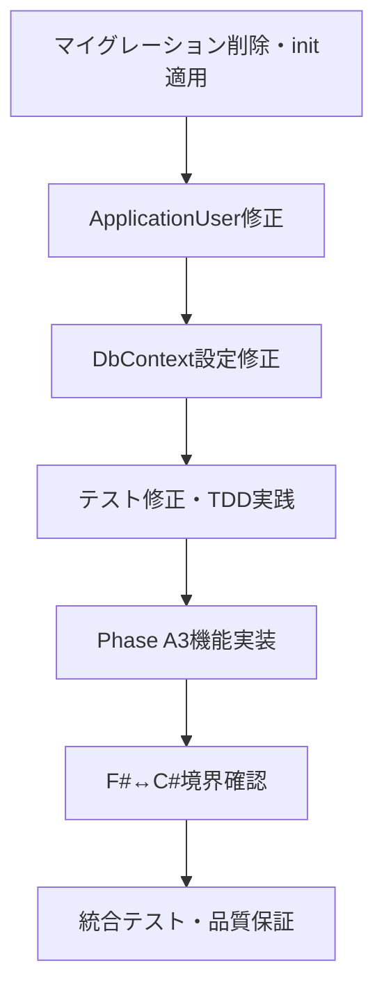

# データベース設計・実装整合性調査結果

**調査対象**: Phase A1～A3 データベース設計書 vs 実装整合性  
**調査日**: 2025-07-28  
**調査者**: Claude Code  
**重要度**: 🚨 Critical（実装継続に影響する重大問題）  

## 🔍 調査結果サマリ

### 発見された重大問題
1. **データベーススキーマ不整合**: AspNetUsersテーブル列定義が設計書と完全不一致
2. **重複テーブル問題**: 不正なUsersテーブルが作成されている
3. **エンティティ定義不整合**: ApplicationUserクラスが設計書と不一致
4. **Phase A3機能未完成**: パスワードリセット機能のデータベース列不足
5. **テスト影響**: 上記問題により関連テストの修正が必須

## 📊 詳細調査結果

### 1. AspNetUsersテーブル不整合詳細

#### ❌ 設計書に存在するが実装で不足している列
```sql
-- Phase A3パスワードリセット機能で必要
PasswordResetToken TEXT NULL
PasswordResetExpiry TIMESTAMPTZ NULL
```

#### ❌ 実装に存在するが設計書にない余計な列
```csharp
// ApplicationUser.cs内の余計なプロパティ
CreatedAt (DateTime)
CreatedBy (string)
UpdatedBy (string)
IsActive (bool) - IsDeletedの逆転プロパティ
Role (string) - UserRoleの別名プロパティ
```

#### ❌ マイグレーション vs 初期スキーマ不整合
- **現状**: `20250719112634_InitialIdentityIntegration.cs`が両方のテーブル（AspNetUsers + Users）を作成
- **正解**: `init/01_create_schema.sql`の定義のみが正しい
- **問題**: マイグレーションファイルが設計書と完全不整合

### 2. Clean Architecture層実装状況

#### ✅ レイヤー構成は正しく実装
```
Domain (F#)      → UbiquitousLanguageManager.Domain.fsproj ✅
Application (F#) → UbiquitousLanguageManager.Application.fsproj ✅
Contracts (C#)   → UbiquitousLanguageManager.Contracts.csproj ✅
Infrastructure (C#) → UbiquitousLanguageManager.Infrastructure.csproj ✅
Web (C#)         → UbiquitousLanguageManager.Web.csproj ✅
```

#### ⚠️ F#↔C#境界実装状況要確認
- Contracts層の実装詳細未確認
- F# Domain/Application層の実装詳細未確認
- 型変換ロジックの実装状況未確認

### 3. UI実装状況（Blazor）

#### ✅ Phase A1-A2 UI実装は概ね完了
- ログイン画面: `Pages/Auth/Login.razor` ✅
- ユーザー管理画面: `Pages/Admin/UserManagement.razor` ✅
- 共通レイアウト: `Shared/MainLayout.razor`, `Shared/NavMenu.razor` ✅

#### ❌ Phase A3 UI実装未確認
- パスワードリセット画面の実装状況要確認
- プロフィール変更画面の実装状況要確認
- Remember Me機能の実装状況要確認

### 4. 機能仕様準拠状況

#### ✅ Phase A1 (基本認証): 95%完了
- ASP.NET Core Identity統合完了
- ログイン機能実装完了
- データベース整合性修正のみ必要

#### ⚠️ Phase A2 (ユーザー管理): 80%完了
- UI実装完了
- Repository実装がプレースホルダー状態
- 実際のデータベースCRUD操作要実装

#### ❌ Phase A3 (認証拡張): 40%完了
- パスワードリセット: データベース列不足により未完成
- Remember Me: 実装状況要確認
- メール送信: smtp4dev連携実装状況要確認

## 🎯 必要な対応作業

### 優先度1: データベーススキーマ修正（Critical）

#### 1.1 マイグレーション完全置換
```bash
# 既存マイグレーション削除
rm -rf src/UbiquitousLanguageManager.Infrastructure/Data/Migrations/*

# init/01_create_schema.sql 適用
# PostgreSQLデータベースに直接適用
```

#### 1.2 ApplicationUser エンティティ修正
```csharp
// 削除が必要なプロパティ
- public DateTime CreatedAt { get; set; }
- public string CreatedBy { get; set; }
- public string UpdatedBy { get; set; }
- public bool IsActive { get; set; }
- public string Role { get; set; }

// 追加が必要なプロパティ
+ public string? PasswordResetToken { get; set; }
+ public DateTime? PasswordResetExpiry { get; set; }
```

#### 1.3 DbContext設定修正
```csharp
// UbiquitousLanguageDbContext.cs
// 削除: public new DbSet<ApplicationUser> Users { get; set; }
// 追加: PasswordResetToken/PasswordResetExpiry列設定
```

### 優先度2: テスト修正戦略

#### 2.1 影響を受けるテスト領域
- ApplicationUserエンティティ関連テスト
- UserRepository関連テスト
- データベース統合テスト
- マイグレーションテスト

#### 2.2 TDD実践計画
```
Red Phase: 修正対象の失敗テスト作成
Green Phase: ApplicationUser修正によるテスト成功
Refactor Phase: コード品質向上・テスト継続成功
```

### 優先度3: Phase A3機能完全実装

#### 3.1 パスワードリセット機能
- データベース列追加後のサービス実装
- パスワードリセット申請画面実装
- リセット実行画面実装
- メール送信機能統合

#### 3.2 Remember Me機能
- ASP.NET Core Identity Cookie設定
- ログイン画面チェックボックス実装
- セキュリティ設定調整

#### 3.3 メール送信機能
- smtp4dev統合テスト実行
- メール送信サービス完全実装
- メールテンプレート管理実装

### 優先度4: F#↔C#境界確認・完全実装

#### 4.1 Contracts層実装確認
- Result型実装状況確認
- DTO定義完全性確認
- 型変換ロジック実装確認

#### 4.2 F# Domain/Application層実装確認
- Domainエンティティ実装確認
- Applicationサービス実装確認
- Clean Architecture準拠確認

## 📋 実装順序・依存関係



## 🚨 技術的リスク・制約

### データ移行リスク
- 既存データベースが存在する場合の移行手順要検討
- マイグレーション削除による既存データ影響要確認

### テスト破綻リスク
- ApplicationUser変更による大量のテスト破綻予想
- TDD実践によるテスト修正工数要考慮

### Phase A3実装リスク
- パスワードリセット機能の複雑性（セキュリティ要件）
- メール送信機能の外部依存関係（smtp4dev）

## ✅ 成功基準

### 技術的成功基準
1. ✅ データベーススキーマが設計書と100%一致
2. ✅ ApplicationUserエンティティが設計書定義と100%一致
3. ✅ 全テストが成功状態でStep完了
4. ✅ Phase A3機能（パスワードリセット・Remember Me・メール送信）が100%実装
5. ✅ F#↔C#境界が正しく実装・動作確認

### 品質成功基準
1. ✅ テストカバレッジ80%以上維持
2. ✅ 仕様準拠マトリックス100%達成
3. ✅ 技術負債の適切な記録・管理
4. ✅ Clean Architecture原則100%準拠

## 📚 関連ドキュメント

- `/Doc/02_Design/データベース設計書.md` - 絶対的真実のデータベース設計
- `/Doc/01_Requirements/機能仕様書.md` - Phase A1-A3機能要件
- `/Doc/02_Design/システム設計書.md` - Clean Architecture設計
- `/Doc/02_Design/Application層インターフェース設計書.md` - F#↔C#境界設計
- `/init/01_create_schema.sql` - 正しいデータベーススキーマ定義