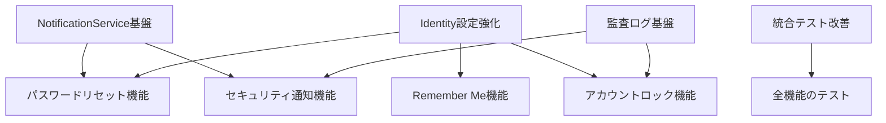

# Phase A3 Step1 統合分析結果

**作成日**: 2025-07-22  
**Phase**: A3（認証機能拡張）  
**Step**: 1（並列技術分析）  

## 📊 統合分析サマリー

### 技術的依存関係の整理

### 実装優先順位

1. **高優先度（基盤構築）**
   - NotificationService基盤構築（メール送信）
   - Identity設定強化（Lockout、Cookie設定）
   - 監査ログ基盤構築

2. **中優先度（機能実装）**
   - パスワードリセット機能
   - Remember Me機能
   - アカウントロック・セキュリティ通知

3. **低優先度（品質向上）**
   - 統合テスト環境改善
   - E2Eテスト追加

## 🔧 技術選定結果

### メール送信基盤
- **SMTPライブラリ**: MailKit（推奨）
- **開発環境SMTP**: Smtp4dev（Windows環境向け）
- **テンプレートエンジン**: Razor（既存技術活用）
- **非同期処理**: BackgroundService + Channel<T>

### セキュリティ設定
- **Lockout設定**: MaxFailedAccessAttempts=5、DefaultLockoutTimeSpan=5分
- **Cookie設定**: ExpireTimeSpan=14日、SlidingExpiration=true
- **監査ログ**: EF Core（AuditEventsテーブル）+ Serilog

### テスト環境
- **DB**: SQLite In-Memory（当面）→ Testcontainers（将来）
- **DBリセット**: Respawn（SQLite移行後）
- **認証モック**: TestAuthHandler
- **エラーデバッグ**: UseDeveloperExceptionPage

## 📋 実装順序決定

### Step 2: NotificationService基盤構築（90分）
- IEmailSenderインターフェース定義（Application層）
- MailKitEmailSender実装（Infrastructure層）
- SmtpSettings設定管理
- BackgroundEmailQueueサービス実装

### Step 3: パスワードリセット機能実装（120分）
- UserManager拡張メソッド実装
- ForgotPassword.razor作成
- ResetPassword.razor作成
- メールテンプレート作成
- トークン管理・検証ロジック

### Step 4: 自動ログイン・基本セキュリティ実装（90分）
- Remember Me UI実装
- Identity Cookie設定
- Lockout機能設定
- 基本的な監査ログ実装

### Step 5: セキュリティ強化機能実装（120分）
- AuditEventsテーブル追加
- IAuditLogger実装
- セキュリティ通知メール実装
- 包括的な監査ログ記録

### Step 6: 統合テスト環境改善（90分）
- SQLite In-Memory移行
- TestAuthHandler実装
- WebApplicationFactory改善
- 既存テスト修正

### Step 7: 統合・品質保証・運用準備（60分）
- 全機能の統合テスト
- セキュリティ脆弱性チェック
- 運用ドキュメント作成
- Phase総括

## 🚨 技術的リスク・課題

### 識別されたリスク

1. **メール送信環境構築**
   - リスク: 開発環境でのSMTPサーバー設定
   - 対策: Smtp4devの事前セットアップガイド作成

2. **統合テスト複雑性**
   - リスク: Identity + EF Core統合の既存問題
   - 対策: 段階的改善（In-Memory → SQLite → Testcontainers）

3. **セキュリティ実装の網羅性**
   - リスク: OWASP要件の見落とし
   - 対策: セキュリティチェックリスト作成・レビュー強化

### 技術的前提条件

- ASP.NET Core 8.0以上
- MailKit 4.0以上
- Serilog.AspNetCore 8.0以上
- xUnit 2.6以上
- Respawn 6.0以上

## 📚 参考資料・調査結果詳細

### Team 1: 認証機能拡張
- UserManager.GeneratePasswordResetTokenAsync/ResetPasswordAsyncの詳細仕様
- WebEncoders.Base64UrlEncodeによるトークンエンコーディング
- DataProtectionTokenProviderOptionsによる有効期限管理

### Team 2: メール連携
- MailKit vs System.Net.Mail比較（MailKit推奨）
- Smtp4dev vs MailHog比較（環境別推奨）
- Clean ArchitectureでのIEmailSender配置（Application層）

### Team 3: セキュリティ強化
- Identity Lockout機能の内部動作（AccessFailedCount、LockoutEnd）
- 監査ログパターン（認証イベント、権限変更、アカウント管理）
- OWASP A07:2021準拠チェックリスト

### Team 4: 統合テスト
- In-Memory DB問題点（リレーショナル機能欠如、スコープ問題）
- SQLite In-Memory代替案の実装方法
- Respawnによる高速DBリセット
- TestAuthHandlerによる認証モック実装

---

**次のアクション**: Step2以降の詳細計画策定・組織構成調整