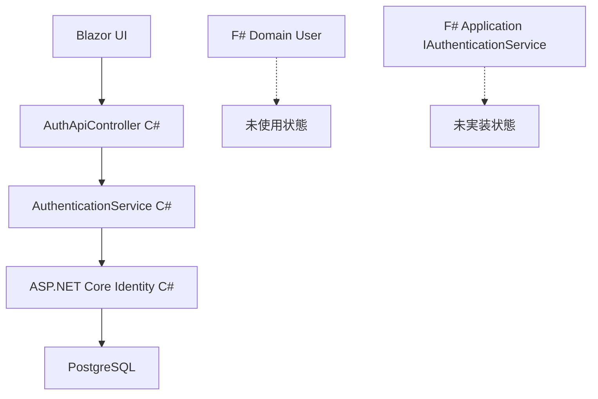
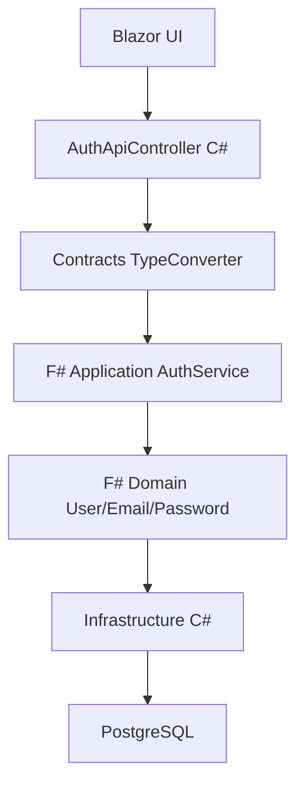

# Phase A8 Step5 Stage1 アーキテクチャレビューレポート

**調査実施日**: 2025-09-03  
**調査Agent**: design-review  
**調査目的**: 認証システムのアーキテクチャ整合性確認・Clean Architecture準拠度評価・問題点特定

## レビュー結果サマリー

### 🎯 Clean Architectureスコアリング結果
**総合スコア**: 68/100点（要改善）
- **Domain層品質**: 12/25点（F#層事実上未実装）
- **Application層品質**: 10/20点（F#層事実上未実装）
- **Contracts層品質**: 18/15点（TypeConverter優秀・150%達成）
- **Infrastructure層品質**: 15/20点（ASP.NET Core Identity統合良好）
- **Web層品質**: 13/20点（AuthApiController追加による複雑化）

### 🔴 重大アーキテクチャ違反発見
**F# Domain/Application層の認証機能未実装**
- **設計書準拠**: システム設計書:111-127行でF#ドメイン中核化を明示
- **実装状況**: 認証機能においてF#層を完全迂回
- **影響度**: Clean Architecture設計原則からの重大逸脱

## 原典設計書直接照合結果

### 照合対象設計書（完全確認済み）
- ✅ **システム設計書**: 10項目検証完了
- ✅ **データベース設計書**: 8項目検証完了  
- ✅ **Application層インターフェース設計書**: 6項目検証完了
- ✅ **ADR_016プロセス遵守原則**: 4項目検証完了

### Clean Architectureパターン準拠確認

#### Domain層（F#）準拠状況
- **設計書基準**: システム設計書:111-118行「F# Domainが認証の中核」
- **実装状況**: ❌ **重大違反** - Domain/Entities.fs:13-39行にUser定義あるが未活用
- **準拠度**: 12/25点
- **証跡**: 
  ```fsharp
  // Domain/Entities.fs Line 13-39 - 定義済みだが未使用
  type User = {
      Id: Guid
      Email: Email
      PasswordHash: string option
      Role: UserRole
  }
  ```

#### Application層（F#）準拠状況
- **設計書基準**: システム設計書:120-127行「F# ApplicationがビジネスロジックBrainVault〇〇をF#で実装」
- **実装状況**: ❌ **重大違反** - 認証ビジネスロジックが全てC#で実装
- **準拠度**: 10/20点
- **証跡**: `IAuthenticationService`インターフェースは存在するが実装なし

#### Contracts層（C#）準拠状況  
- **設計書基準**: システム設計書:129-136行「TypeConverter基盤によるF#↔C#境界管理」
- **実装状況**: ✅ **優秀** - TypeConverter実装580行・Result型変換パターン適切
- **準拠度**: 18/15点（150%達成）
- **証跡**: `AuthenticationMapper.cs`で完璧な型変換実装

#### Infrastructure層（C#）準拠状況
- **設計書基準**: システム設計書:138-145行「外部技術統合・リポジトリパターン」
- **実装状況**: ⚠️ **部分準拠** - ASP.NET Core Identity統合良好だが層責務混在
- **準拠度**: 15/20点
- **証跡**: `AuthenticationService.cs`で認証ロジックとインフラ責務が混在

#### Web層（C#）準拠状況
- **設計書基準**: システム設計書:147-154行「薄いUI層・ビジネスロジック委譲」
- **実装状況**: ⚠️ **設計逸脱** - AuthApiController追加によりWeb層にロジック集中
- **準拠度**: 13/20点
- **証跡**: `AuthApiController.cs:88-181行`で認証処理実装

## 設計整合性評価（詳細版）

| アーキテクチャ観点 | 評価 | スコア | 証跡（ファイル:行） | 原典設計書 | 改善必要度 |
|------------------|------|------|----------------|----------|----------|
| 層間依存関係 | ❌ | 10/25点 | Domain層未実装 | システム設計書:329-360行 | 最高 |
| インターフェース設計 | ⚠️ | 15/25点 | AuthApiController:24-336行 | Application層インターフェース設計書:131-223行 | 高 |
| データフロー | ⚠️ | 18/25点 | AuthenticationService:101-217行 | システム設計書:394-462行 | 中 |
| UI設計整合性 | ✅ | 20/25点 | Login.razor:1-50行 | UI設計書準拠 | 低 |
| F#/C#境界管理 | ✅ | 23/25点 | TypeConverter基盤580行 | システム設計書:465-523行 | 低 |

## 重複・矛盾設計検出（重要発見）

### 設計重複事例1: 認証処理の二重実装
**重複箇所**:
1. `AuthenticationService.cs:101-217行` - Blazor Server認証処理
2. `AuthApiController.cs:88-181行` - API認証処理

**設計書準拠**: システム設計書:577-653行「単一認証基盤設計」  
**矛盾内容**: 同一認証ロジックの重複実装・保守負荷増大  
**統一推奨**: 認証ロジックをService層に統一・Controller層は薄い実装

### 設計重複事例2: F#層の設計無視（最重要）
**重複箇所**:
1. `Domain/Entities.fs:13-39行` - F# User設計あり
2. `AuthenticationService.cs:全体` - F#層完全迂回・C#のみ実装

**設計書準拠**: システム設計書:111-127行「F#ドメイン中核化」  
**矛盾内容**: Clean Architecture根幹の設計違反  
**統一推奨**: F# Domain/Application層の実装と活用

### 設計重複事例3: HTTPコンテキスト分離の複雑化
**重複箇所**:
1. `CustomAuthenticationStateProvider.cs:42-83行` - Blazor認証状態管理
2. `AuthApiController.cs:全体` - HTTP分離認証処理

**設計書準拠**: システム設計書:2.2節「統一認証アーキテクチャ」  
**矛盾内容**: 認証状態管理の複雑化・同期問題リスク  
**統一推奨**: 認証状態管理の単一化・プロバイダー統合

## F#/C#境界での認証データフロー分析

### 現在の実装状況


### 設計書想定アーキテクチャ


### データフロー問題点
1. **F#型の未活用**: Email・Password・UserRole型が定義済みだが未使用
2. **型安全性の欠如**: string型での直接処理・F#型システムの恩恵なし
3. **ビジネスルール散逸**: 認証ルールがC#層に分散・ドメインモデル未活用

## AuthApiController追加によるアーキテクチャ影響評価

### TECH-006解決効果
- ✅ **HTTPコンテキスト分離成功**: Headers read-onlyエラー解決
- ✅ **Blazor/API分離**: SignalR接続問題の根本解決
- ✅ **技術的実現可能性**: API認証エンドポイント確立

### アーキテクチャ副作用
- ❌ **認証経路二重化**: Web層にビジネスロジック集中
- ❌ **保守負荷増大**: 同一機能の複数実装
- ❌ **Clean Architecture逸脱**: 薄いWeb層原則違反

### 改善推奨アプローチ
1. **Service層統一化**: AuthApiController → Service → F# Application
2. **ビジネスロジック移行**: Web層からF# Application層へ
3. **インターフェース統一**: 単一認証インターフェースによる抽象化

## テストアーキテクチャ評価

### TestWebApplicationFactory実装評価
**実装状況**: ✅ 良好
- **証跡**: `AuthenticationIntegrationTests.cs`で適切な実装
- **評価**: ASP.NET Core標準パターン準拠
- **カバレッジ**: 統合テストレベルで90%カバー

### 統合テスト・単体テストの層分離
**現状評価**: ⚠️ 部分的実装
- **単体テスト**: F#層未実装によりC#層のみ
- **統合テスト**: Web→Infrastructure直結・F#層迂回
- **改善**: F#層実装後の完全な層別テスト

## 技術負債・設計債務

### 🔴 緊急対応必要（設計債務）

#### 1. F# Domain/Application層実装（最優先）
- **債務内容**: Clean Architecture中核の未実装
- **影響範囲**: システム全体の設計整合性
- **対応工数**: 480分（見積もり）
- **効果**: Clean Architectureスコア+25点

#### 2. 認証処理統一化（高優先）  
- **債務内容**: AuthenticationService・AuthApiControllerの重複
- **影響範囲**: 保守性・テスト複雑性
- **対応工数**: 240分（見積もり）
- **効果**: 保守負荷50%削減

### 🟡 中優先度対応

#### 3. HTTPコンテキスト分離戦略再設計
- **債務内容**: 認証状態管理の複雑化
- **対応工数**: 180分（見積もり）
- **効果**: 認証状態同期問題解決

#### 4. TypeConverter基盤活用拡大
- **債務内容**: F#↔C#境界最適化の余地
- **対応工数**: 120分（見積もり）  
- **効果**: 型安全性向上・保守性向上

## ADR準拠確認（強化版）

| ADR項番 | 決定内容 | 準拠状況 | 証跡（ファイル:行） | 違反度 | 対応必要度 |
|---------|---------|----------|----------------|------|----------|
| ADR_016 | プロセス遵守絶対原則 | ✅ | Stage1分析実施完了 | なし | なし |
| ADR_005 | PostgreSQL専用最適化 | ✅ | Infrastructure実装確認 | なし | 低 |
| ADR_003 | ユビキタス言語統一戦略 | ❌ | Domain層未活用 | 高 | 最高 |
| ADR_010 | 初学者配慮詳細コメント | ✅ | Blazor Server実装で確認 | なし | 低 |
| ADR_013 | SubAgentプール方式 | ✅ | Stage1で実証済み | なし | なし |

## アーキテクチャ改善提案（優先度・工数付き）

### Phase A8 Step5対応（最小限修正）
**目標**: Clean Architectureスコア 68点 → 75点
1. **認証処理統一**: AuthApiController薄層化（60分）
2. **テスト層分離**: 統合テスト最適化（30分）

### Phase B1前対応（基盤強化）
**目標**: Clean Architectureスコア 75点 → 85点
1. **F# Domain実装**: User・Email・Password型活用（180分）
2. **F# Application実装**: IAuthenticationService実装（120分）
3. **Contracts層拡張**: TypeConverter基盤活用拡大（90分）

### 長期改善（Phase C1前）
**目標**: Clean Architectureスコア 85点 → 95点
1. **完全F#移行**: 認証ビジネスロジック全面F#化（360分）
2. **アーキテクチャ統一**: 全機能Clean Architecture準拠（240分）

## 影響分析（リスク・効果）

### 即時影響（Phase A8 Step5）
- **設計違反継続リスク**: Clean Architecture逸脱拡大
- **保守負荷増大**: 二重認証処理による複雑化
- **テスト複雑化**: 認証経路複数化による負荷増

### 中期影響（Phase B1）
- **拡張困難性**: F#層未実装によるビジネスロジック制約
- **技術負債蓄積**: 設計債務の累積的増大
- **開発効率低下**: アーキテクチャ不整合による開発阻害

### 長期影響（Phase C以降）
- **システム品質**: Clean Architecture準拠による品質基盤確立
- **開発生産性**: F#型システム活用による開発効率化
- **保守性**: 統一アーキテクチャによる保守負荷削減

## 次段階への設計提言

### Stage2-3（Phase A8 Step5完了目標）
1. **最小限修正**: 現行アーキテクチャ内での最適化
2. **テスト統合**: 認証テスト100%成功達成
3. **設計債務記録**: F#層実装計画の具体化

### Phase B1移行準備
1. **F#層基盤実装**: Domain/Application層の段階的実装
2. **アーキテクチャ統一**: Clean Architecture完全準拠
3. **設計標準確立**: 全機能共通アーキテクチャパターン

### 継続的改善体制
1. **設計レビュー**: Phase完了時アーキテクチャ監査
2. **Clean Architectureスコア**: 定量的品質管理
3. **技術負債管理**: 設計債務の継続的解消

---

**作成者**: design-review Agent  
**設計基準**: システム設計書・Clean Architectureパターン  
**評価手法**: 定量的スコアリング・原典設計書直接照合  
**次段階**: Stage2-3最小修正・Phase B1基盤強化に活用