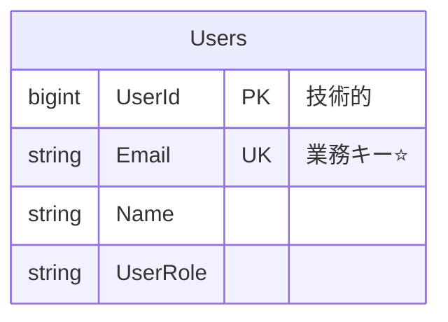
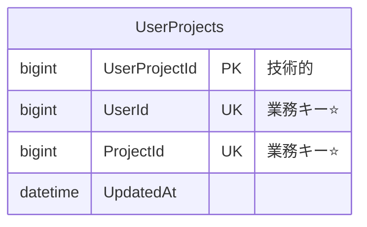
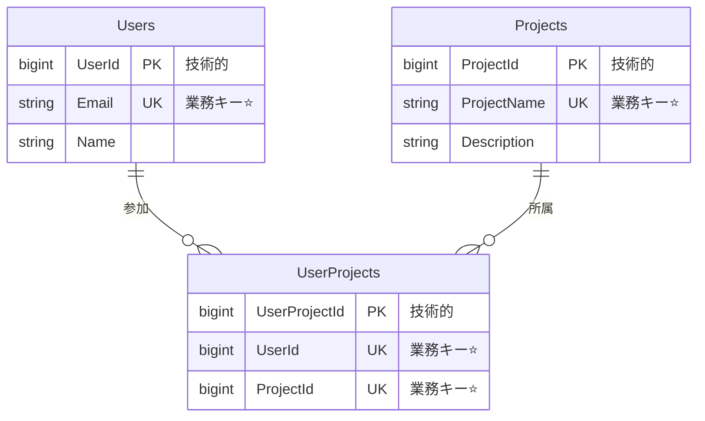

# ADR_002: MermaidによるER図記法統一

**日付**: 2025-06-29  
**ステータス**: 採用  
**決定者**: プロジェクトオーナー  

## コンテキスト

データベース設計においてサロゲートキー（技術的主キー）と業務キー（自然キー・一意制約）の両方を使用する設計を採用している。ER図上でエンティティの本質（業務的な主要識別子）を視覚的に理解しやすくするため、MermaidでのER図描画ルールを統一する必要がある。

## 課題

- PKは技術的なサロゲートキーだが、業務的には意味を持たない
- 業務キーは一意制約として定義されるが、ER図上ではPKより目立たない
- エンジニアがER図を見た際に、各エンティティの業務的本質を即座に理解できない

## 決定事項

### MermaidER図記法ルール

#### 1. 業務キー表示ルール

**ルール**：
- **業務キー列**: `UK "業務キー⭐"` で表示
- **技術的主キー**: `PK "技術的"` で表示
- **⭐マーク**: 業務キーの視覚的識別子として必須

#### 2. 複合業務キーの場合

**ルール**：
- 複合業務キーの場合、構成する全列に`UK "業務キー⭐"`を付与

#### 3. エンティティ間関連の表示

#### 4. 列コメント表記ルール
- **技術的主キー**: `PK "技術的"`
- **業務キー（単一）**: `UK "業務キー⭐"`
- **業務キー（複合の一部）**: `UK "業務キー⭐"`
- **通常列**: コメントなし、または必要に応じて説明

#### 5. データ型表記
- **文字列**: `string`
- **整数**: `bigint`, `int`
- **日時**: `datetime`
- **真偽値**: `boolean`
- **テキスト**: `text`

### 適用対象

1. **データベース設計書内のER図**
2. **README.md等のドキュメント内ER図**
3. **GitHub Issue・PR内の設計説明図**
4. **設計レビュー資料**

### 記法統一の目的

1. **業務理解の促進**: ⭐マークにより業務キーを即座に識別
2. **設計意図の明確化**: 技術的キーと業務キーの区別を視覚化
3. **レビュー効率向上**: エンティティの本質を素早く把握
4. **ドキュメント品質向上**: 統一記法による可読性向上

## 代替案

### 検討された他の記法
1. **色分け**: Mermaidの制限により困難
2. **アイコン使用**: 📧、👤等のアイコン（可読性の観点で⭐に劣る）
3. **フォント変更**: Mermaidでは対応困難

### 他ツールとの比較
- **PlantUML**: `<<UK,業務キー>>`記法も検討したが、GitHub表示の観点でMermaidを優先
- **A5:SQL**: 列コメントでの業務キー明示と併用

## 影響範囲

### 更新が必要なファイル
1. `/Doc/02_Design/データベース設計書.md` - ER図部分
2. 今後作成する全設計ドキュメント

### 開発チームへの影響
- 新記法の学習コスト（軽微）
- ER図作成時の記法確認が必要

## 実装

### 即座に実施
- データベース設計書のER図を新記法で更新

### 継続的に実施
- 今後のER図作成時に新記法を適用
- 既存ドキュメントの段階的更新

## 成功の指標

1. **理解速度向上**: レビュー時のエンティティ本質理解時間短縮
2. **記法統一**: プロジェクト内全ER図での記法一貫性
3. **品質向上**: 業務キー設計に対する意識向上

---

**関連ADR**: ADR_001（Mermaid記法採用）  
**記録者**: Claude Code  
**承認日**: 2025-06-29