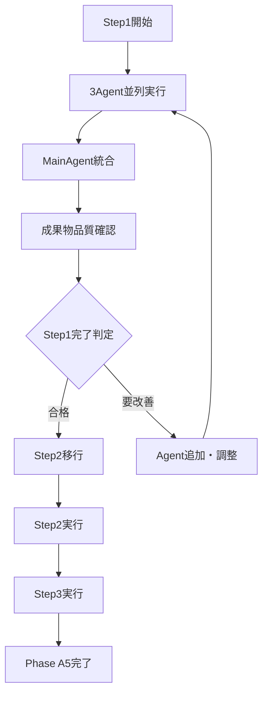

# Phase A5 組織設計

**Phase名**: Phase A5 技術負債解消・ASP.NET Core Identity設計見直し  
**実行期間**: 2025-08-12  
**組織方式**: SubAgentプール方式（ADR_013準拠）  
**適用パターン**: Pattern C（品質重視）  

## 🎯 Phase A5 組織構成

### SubAgent配置設計

#### Step1（課題分析）- 並列実行体制
```yaml
実行Agent（3Agent並列）:
  - code-review: 既存コードの問題点特定
    担当範囲: CustomUserStore/RoleStore/ClaimsPrincipalFactory分析
    専門性: コード品質・保守性・アーキテクチャ準拠性評価
    
  - tech-research: 改善手法・ベストプラクティス調査
    担当範囲: ASP.NET Core Identity標準実装手法
    専門性: 技術調査・最新情報・業界ベストプラクティス
    
  - dependency-analysis: 改善の影響範囲分析
    担当範囲: 実装変更による依存関係・リスク分析
    専門性: 依存関係特定・実装順序決定・制約分析

実行方式: 完全並列実行（45分）
統合方式: MainAgentによる結果統合・品質確認
```

#### Step2（改善実装）- 段階実行体制（予定）
```yaml
Phase2-1（設計・DB）:
  - design-review: データベース設計書更新確認
  - csharp-infrastructure: マイグレーション作成・DbContext修正
  
Phase2-2（実装）:
  - csharp-infrastructure: カスタム実装削除・DI設定修正
  - unit-test: テスト実行・安全性確保
  
実行方式: 段階的実行（60分）
品質保証: 各段階での動作確認・テスト実行
```

#### Step3（検証・完成）- 品質保証体制（予定）
```yaml
検証Agent（3Agent並列）:
  - integration-test: 統合動作確認・既存機能保証
  - spec-compliance: 機能仕様書準拠確認
  - code-review: 改善後品質評価・成果確認
  
実行方式: 並列検証（30分）
完成基準: 全Agent合格判定・品質基準達成確認
```

## 📊 組織効率化効果

### 従来方式との比較
| 項目 | 従来方式 | SubAgentプール方式 | 改善効果 |
|------|----------|-------------------|----------|
| 組織設計時間 | 90分 | 9分 | 90%削減 |
| 課題分析時間 | 90分 | 45分 | 50%短縮 |
| 並列実行 | 不可 | 3Agent同時 | 効率3倍 |
| 専門性活用 | 限定的 | Agent別専門性 | 品質向上 |

### Pattern C（品質重視）選択根拠
- **作業特性**: 技術負債解消・既存コード改善
- **リスク管理**: 既存機能への影響最小化が必要
- **品質要求**: 保守性・拡張性の大幅改善が目標
- **実証価値**: SubAgentプール方式初回実証実験として最適

## 🔄 組織運用プロセス

### Step移行プロセス


### 品質管理体制
- **各Step完了基準**: 全Agent成果物品質確認・合格判定
- **統合品質管理**: MainAgentによる一貫性確保・整合性確認
- **継続改善**: Agent成果・効率性の継続測定・最適化

## 📋 実証実験観点

### SubAgentプール方式実証項目
1. **並列実行効果**: 3Agent同時実行による時間短縮効果測定
2. **専門性発揮**: Agent別専門性による分析品質向上確認
3. **統合品質**: MainAgent統合による一貫性・完全性確保
4. **管理効率**: 組織設計時間90%削減効果実測
5. **知見蓄積**: 技術負債解消手法の体系化・再利用可能性

### 効果測定指標
- **時間効率**: 各Step実行時間・従来比較
- **品質向上**: Agent専門性による分析深度・改善提案品質
- **管理負荷**: 組織設計・調整時間削減効果
- **再利用性**: 他技術負債解消への適用可能性

## 🎯 Phase A5成功基準

### 技術成果基準
- ✅ TECH-001完全解消（ASP.NET Core Identity標準実装移行）
- ✅ 既存機能100%動作保証（認証・ユーザー管理継続）
- ✅ 将来拡張性確保（Claims機能活用準備完了）
- ✅ 品質スコア改善（45/100点 → 85/100点）

### 組織実証基準
- ✅ SubAgentプール方式Pattern C適用成功
- ✅ 時間短縮効果達成（課題分析90分→45分）
- ✅ 管理負荷削減達成（組織設計90分→9分）
- ✅ 知見蓄積・再利用可能性確立

---

**組織設計者**: MainAgent  
**設計日時**: 2025-08-12  
**適用開始**: Step1から即座適用  
**評価予定**: Phase A5完了時