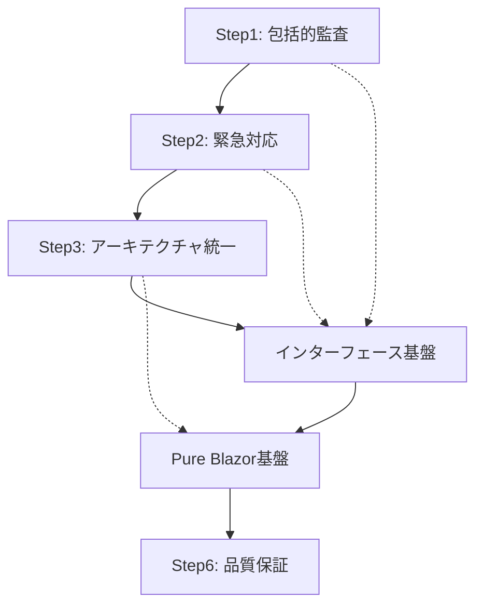

# Phase A7 Step間依存関係マトリックス

## 📊 依存関係概要
- **目的**: セッション跨ぎでのStep継続性確保・取りこぼし防止
- **機能**: 各Stepの前提条件・成果物・引き継ぎ事項明確化
- **活用場面**: セッション断絶後のStep再開時

## 🔄 Step依存関係図

## 📋 Step別依存関係詳細

### Step1: 包括的監査・課題分析
**状態**: ✅ **完了済み**

#### 前提条件
- [ ] Phase A1-A6実装完了
- [ ] GitHub Issues #5・#6確認済み
- [ ] SubAgent群実行環境確認

#### 成果物（完了済み）
- ✅ `spec_compliance_audit.md` - 仕様準拠監査（75%準拠・5項目逸脱）
- ✅ `spec_deviation_analysis.md` - MVC/Blazor混在詳細分析
- ✅ `architecture_review.md` - アーキテクチャ整合性（78/100点）
- ✅ `dependency_analysis.md` - 技術的依存関係分析
- ✅ Phase_Summary.md Step構成決定

#### 次Stepへの引き継ぎ
- **Step2**: AccountController未実装詳細・緊急対応要件
- **Step3**: MVC削除対象リスト・Pure Blazor Server要件詳細
- **Step4**: TypeConverter・FirstLoginRedirectMiddleware不整合詳細
- **Step5**: UI設計書未実装項目・用語統一対象
- **Step6**: 要件準拠基準・品質目標値

---

### Step2: 緊急対応・基盤整備
**状態**: 🔄 **実施予定**

#### 前提条件
- ✅ Step1完了: 課題特定・優先度決定済み
- [ ] 現在のビルド状態確認（0 Warning, 0 Error）
- [ ] AccountController未実装による404エラー状況確認

#### 実施タスク
1. **AccountController緊急実装**
   - パス: `src/UbiquitousLanguageManager.Web/Controllers/AccountController.cs`
   - ViewModelクラス: `src/UbiquitousLanguageManager.Web/Models/ChangePasswordViewModel.cs`
   - 依存関係: UserManager, SignInManager, ILogger

2. **Blazorパスワード変更画面実装**  
   - パス: `src/UbiquitousLanguageManager.Web/Pages/Auth/ChangePassword.razor`
   - ルート: `@page "/change-password"`
   - DTO: ChangePasswordRequestDto

3. **Application層インターフェース基盤実装**
   - IUbiquitousLanguageService: `src/UbiquitousLanguageManager.Application/Interfaces/`
   - IProjectService: 同上
   - IDomainService: 同上

#### 完了判定基準
- [ ] `/Account/ChangePassword` アクセス時404エラー解消
- [ ] `/change-password` 正常表示・動作
- [ ] MVC版・Blazor版パスワード変更両方動作
- [ ] `dotnet build` 成功（0 Warning, 0 Error）

#### Step3への引き継ぎ事項
- **重要**: AccountController暫定実装完了（Step3削除予定）
- **重要**: /change-password実装完了（MVC削除準備OK）
- **注意**: Views/Account/ChangePassword.cshtml残存（Step3削除予定）
- **基盤**: Application層インターフェース実装済み（Step4拡張基盤）

#### 阻害要因・注意点
- ❌ **AccountController削除禁止**: Step3でMVC統一削除まで保持必要
- ⚠️ **MVC/Blazor併存期間**: 一時的に2つのパスワード変更画面併存
- ⚠️ **テスト確認**: 両方の画面の動作確認必須

---

### Step3: アーキテクチャ完全統一  
**状態**: 🔄 **Step2完了後実施予定**

#### 前提条件
- ✅ Step2完了: AccountController・/change-password実装済み
- [ ] Step2完了確認: 両方のパスワード変更画面動作確認済み
- [ ] MVC削除マスターリスト確認

#### 実施タスク
1. **Controllers完全削除**
   - HomeController.cs削除
   - AccountController.cs削除（Step2作成→Step3削除）

2. **Views完全削除**
   - Views/Home/* 削除
   - Views/Account/* 削除  
   - Views/Shared/* 削除
   - Views/_ViewImports.cshtml・_ViewStart.cshtml削除

3. **Program.cs MVC設定削除**
   - AddControllersWithViews()削除
   - MapControllerRoute()削除

4. **Blazor統一実装**
   - App.razor認証分岐実装
   - Pages/Index.razor実装（ルート/の認証分岐）

5. **エラーハンドリング統一**
   - ResultMapper.cs実装（F#→C#変換）
   - DomainException定義
   - ErrorBoundary.razor実装

#### 完了判定基準
- [ ] Controllers/・Views/ディレクトリ完全削除
- [ ] Program.cs MVC設定完全削除
- [ ] 全URL Blazor Server動作（/・/login・/change-password・/admin/users）
- [ ] 認証フロー完全動作（ログイン→管理画面→ログアウト）
- [ ] `dotnet build` 成功・`dotnet test` 成功

#### Step4への引き継ぎ事項
- **基盤**: Pure Blazor Serverアーキテクチャ実現完了
- **基盤**: /change-password実装完了（FirstLoginRedirectMiddleware統合準備OK）
- **基盤**: エラーハンドリング統一基盤確立（TypeConverter拡張準備OK）
- **確認**: MVC要素0件・アーキテクチャ設計要件100%準拠

#### 阻害要因・注意点
- ❌ **Step2未完了時の実施禁止**: 機能停止リスク
- ⚠️ **段階的削除必須**: 一括削除による問題特定困難化回避
- ⚠️ **都度確認**: 各削除段階でのビルド・動作確認必須

---

### Step4: Contracts層・型変換完全実装
**状態**: 🔄 **Step3完了後実施予定**

#### 前提条件  
- ✅ Step3完了: Pure Blazor Serverアーキテクチャ実現
- [ ] /change-password 正常動作確認
- [ ] エラーハンドリング統一基盤動作確認

#### 実施タスク
1. **TypeConverter完全実装**
   - UbiquitousLanguageTypeConverter.cs
   - ProjectTypeConverter.cs
   - DomainTypeConverter.cs

2. **FirstLoginRedirectMiddleware統合**
   - Middleware修正: `/change-password` 統一
   - 初回ログインフロー完全統合

3. **F#/C#境界エラーハンドリング完成**
   - ResultMapper完全実装
   - DomainException統一利用

#### 完了判定基準
- [ ] 全TypeConverter実装完了・単体テスト成功
- [ ] FirstLoginRedirectMiddleware→/change-password正常リダイレクト
- [ ] 初回ログイン→パスワード変更フロー完全動作
- [ ] F#↔C#型変換エラーハンドリング統一

#### Step5への引き継ぎ事項
- **基盤**: F#/C#境界完全実装（UI機能拡張基盤確立）
- **基盤**: 認証フロー完全統合（プロフィール変更画面統合基盤）
- **確認**: TypeConverter・Middleware統合完了

#### 阻害要因・注意点
- ⚠️ **Step3依存**: Pure Blazor統一未完了時は実施不可
- ⚠️ **初回ログインテスト**: 実際の初回ログインフロー動作確認必須

---

### Step5: UI機能完成・用語統一
**状態**: 🔄 **Step4完了後実施予定**

#### 前提条件
- ✅ Step4完了: Contracts層・認証フロー完全統合
- [ ] TypeConverter完全動作確認
- [ ] /change-password完全動作確認

#### 実施タスク
1. **プロフィール変更画面実装**
   - Pages/Auth/Profile.razor実装
   - ProfileUpdateDto実装
   - UserManager統合

2. **用語統一完全実装**
   - 全コード内「用語」→「ユビキタス言語」置換
   - ADR_003完全準拠確認

3. **UI設計書完全準拠**
   - 認証関連8画面完全実装確認
   - レイアウト統一確認

#### 完了判定基準
- [ ] /profile 画面正常表示・更新機能動作
- [ ] UI設計書3.2節完全準拠
- [ ] 全コード内「ユビキタス言語」統一完了
- [ ] ADR_003完全準拠確認

#### Step6への引き継ぎ事項
- **完成**: UI機能完成・8画面実装完了
- **完成**: 用語統一完了・ADR_003準拠
- **確認**: UI設計書100%準拠達成

#### 阻害要因・注意点
- ⚠️ **Step4依存**: Contracts層未完成時はプロフィール更新機能制約
- ⚠️ **用語統一範囲**: 全ファイルでの一貫した置換確認必要

---

### Step6: 統合品質保証・完了確認
**状態**: 🔄 **Step5完了後実施予定**

#### 前提条件
- ✅ Step5完了: UI機能完成・用語統一完了
- [ ] 全Step成果物確認完了

#### 実施タスク
1. **テスト更新・統合テスト実施**
   - MVC関連テスト削除・Blazor版実装
   - 全認証フロー・全画面統合テスト

2. **仕様準拠最終監査**  
   - 要件準拠90%以上確認
   - アーキテクチャ品質85/100以上確認

3. **GitHub Issues最終確認**
   - Issue #5・#6完全解決確認
   - Phase B1移行基盤確立確認

#### 完了判定基準
- [ ] 全認証フロー・全画面完全動作
- [ ] `dotnet build` 0 Warning, 0 Error
- [ ] `dotnet test` 全テスト成功  
- [ ] 要件準拠度90%以上・アーキテクチャ品質85/100以上
- [ ] GitHub Issues #5・#6クローズ可能

#### Phase A7完了・次Phaseへの引き継ぎ
- **達成**: Pure Blazor Serverアーキテクチャ完全実現
- **達成**: 要件逸脱完全解消・設計書100%準拠
- **達成**: UI機能完成・認証システム完全統合
- **準備**: Phase B1（プロジェクト管理機能実装）基盤確立

## 🚨 セッション跨ぎ重要チェックポイント

### セッション開始時確認事項
1. **前Step完了状況確認**
   - 各Step詳細実装カード確認
   - 完了判定基準チェック
   - 次Step前提条件確認

2. **現在状況確認**
   - `dotnet build` 状況確認
   - 主要URL動作確認（/・/login・/change-password・/admin/users）
   - GitHub Issues状況確認

3. **作業環境確認**  
   - 必要SubAgent確認
   - 技術詳細メモリ確認（`phase_a7_technical_details`）
   - MVC削除マスターリスト確認

### 緊急時回避手順
- **Step実施中断必要時**: 現在Step完了まで継続
- **重大問題発生時**: 前Step状態への回復手順実施
- **知識欠損発生時**: Phase_Summary.md・各詳細カード・技術メモリ確認

### 品質維持確認項目（各Step共通）
- [ ] ビルド成功維持（0 Warning, 0 Error）
- [ ] 認証フロー動作維持
- [ ] 既存機能回帰なし
- [ ] セキュリティ水準維持

---

**マトリックス作成日**: 2025-08-19  
**Phase A7開始**: セッション跨ぎ対応完了後  
**活用方法**: 各Step開始時の前提確認・完了時の引き継ぎ確認