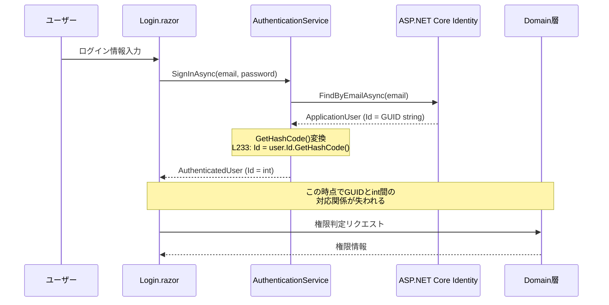
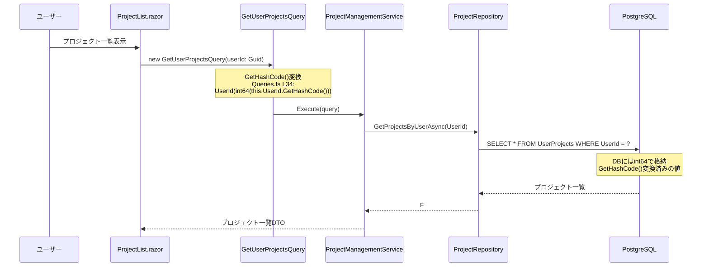
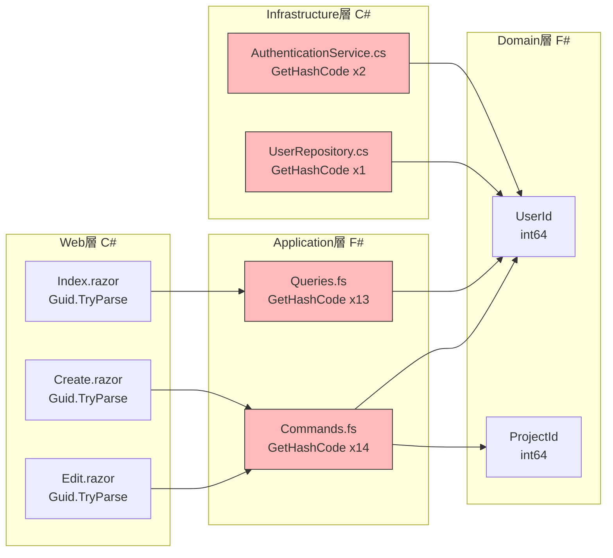
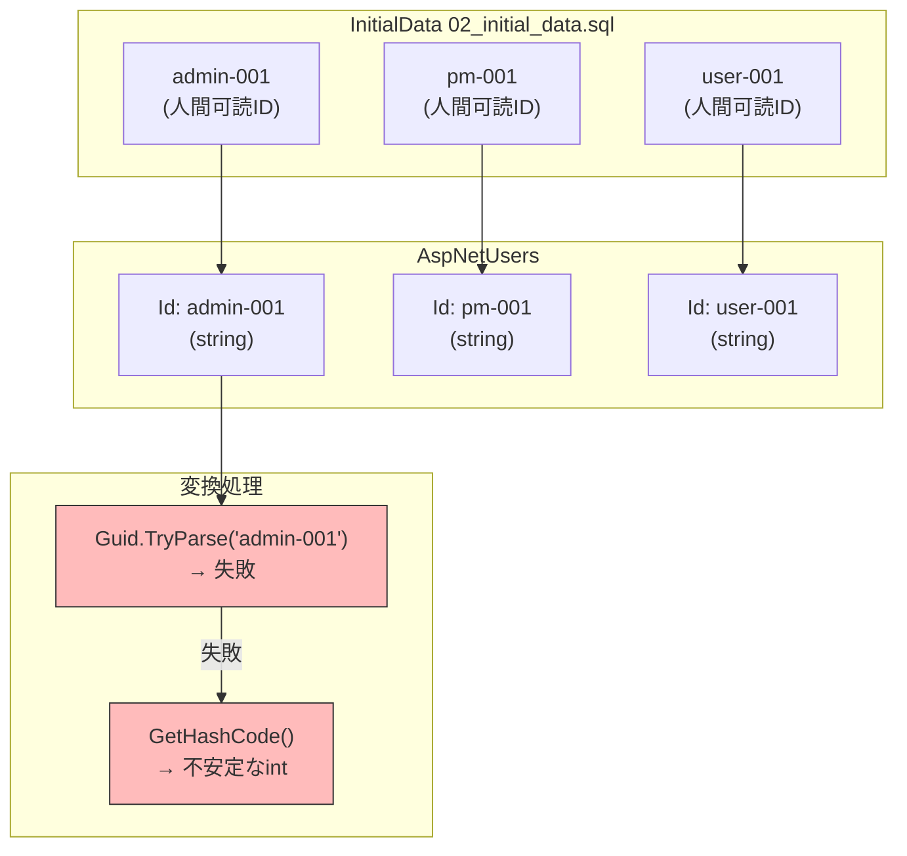
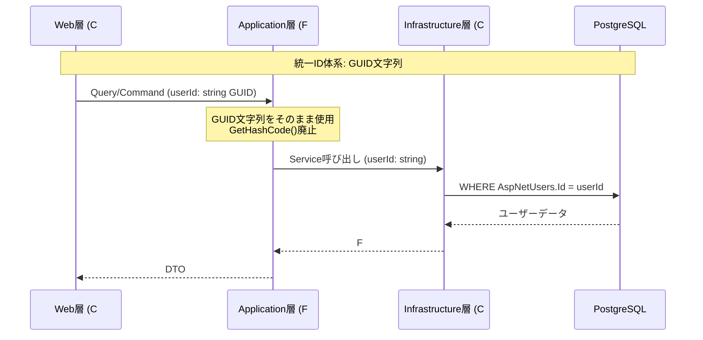
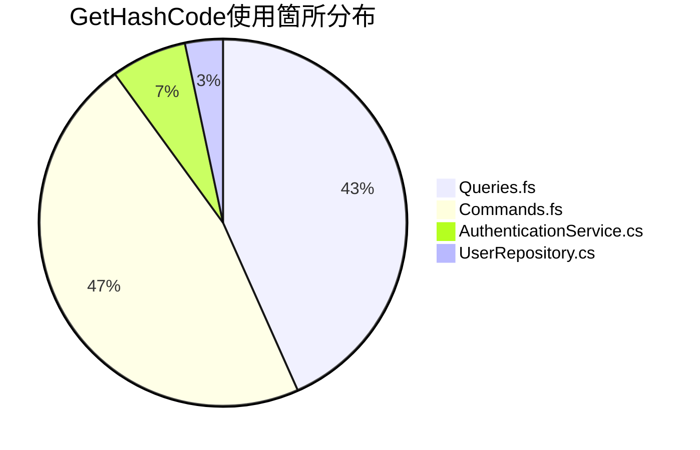

# ID変換フロー図

**作成日**: 2025-12-07
**目的**: GitHub Issue #79「ID体系統一リファクタリング」準備

---

## 1. 現状のID体系概要

```mermaid
graph TB
    subgraph "ASP.NET Core Identity層"
        A[ApplicationUser.Id<br/>string GUID]
    end

    subgraph "Infrastructure層 C#"
        B[AuthenticatedUser.Id<br/>int]
        C[UserRepository<br/>Guid → long変換]
    end

    subgraph "Domain層 F#"
        D[UserId<br/>int64 Single-Case DU]
        E[ProjectId<br/>int64 Single-Case DU]
    end

    A -->|GetHashCode| B
    A -->|GetHashCode| C
    C -->|int64()| D

    style A fill:#f9f,stroke:#333
    style B fill:#bbf,stroke:#333
    style C fill:#bbf,stroke:#333
    style D fill:#bfb,stroke:#333
    style E fill:#bfb,stroke:#333
```

---

## 2. 認証フロー（Login → UserId取得 → 権限判定）



### 2.1 問題点

1. **GetHashCode()変換（L233）**: GUID → int変換でハッシュ衝突リスク
2. **対応関係喪失**: 変換後、元のGUIDへの逆算不可能
3. **プロセス間不整合**: GetHashCode()は.NETランタイム毎に異なる値を返す可能性

---

## 3. ユーザー作成フロー

```mermaid
sequenceDiagram
    participant Admin as 管理者
    participant Create as Create.razor
    participant Service as UserManagementService
    participant Auth as AuthenticationService
    participant Identity as ASP.NET Core Identity
    participant DB as PostgreSQL

    Admin->>Create: ユーザー情報入力
    Create->>Service: CreateUserAsync(dto)
    Service->>Auth: RegisterUserAsync(email, password)
    Auth->>Identity: CreateAsync(ApplicationUser)

    Note over Identity: 新規GUID生成<br/>Id = Guid.NewGuid().ToString()

    Identity->>DB: INSERT AspNetUsers
    Identity-->>Auth: IdentityResult + ApplicationUser

    Note over Auth: GetHashCode()変換<br/>L1333: UserId.NewUserId((long)Id.GetHashCode())

    Auth-->>Service: F# User (UserId = int64)
    Service-->>Create: 作成結果
```

### 3.1 問題点

1. **L1333**: 新規ユーザー作成時にGetHashCode()でUserId生成
2. **衝突リスク**: 大量ユーザー作成時にハッシュ衝突確率上昇
3. **追跡困難**: ユーザーIDからGUIDへの逆引き不可

---

## 4. プロジェクト参照フロー



### 4.1 問題点

1. **Query層変換**: 毎回GetHashCode()でGUID → int64変換
2. **DB格納値**: 既にGetHashCode()変換済みの値が格納
3. **一貫性**: 同じGUIDでも異なるプロセスで異なる値になる可能性

---

## 5. 変換箇所マッピング



---

## 6. InitialDataとの関連



### 6.1 問題点

1. **人間可読ID**: `admin-001`等はGUID形式ではない
2. **Guid.TryParse失敗**: Web層でGUIDとしてパースできない
3. **GetHashCode依存**: 結果としてGetHashCode()での変換に依存

---

## 7. 理想的なID変換フロー（修正後）



### 7.1 修正方針

1. **GUID文字列統一**: 全層でGUID文字列をそのまま使用
2. **GetHashCode廃止**: 全30箇所から排除
3. **InitialData修正**: 人間可読ID → GUID文字列に変更
4. **型定義見直し**: `UserId of int64` → `UserId of string` 検討

---

## 8. 修正影響範囲



---

**作成日**: 2025-12-07
**作成者**: MainAgent
