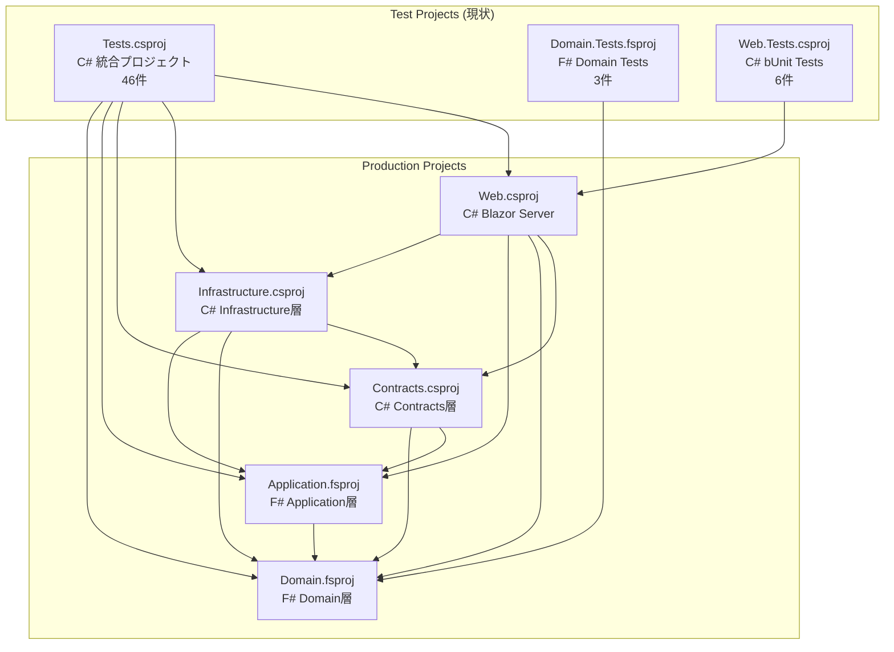
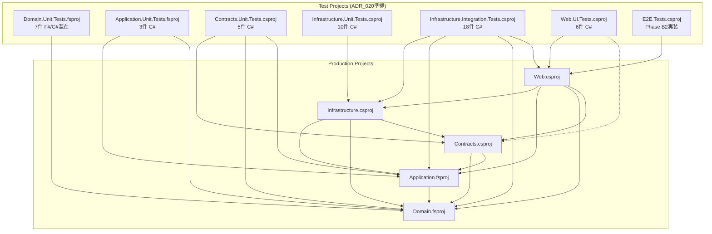

# Phase B-F1 依存関係・リスク分析

**作成日**: 2025-10-08
**分析担当**: dependency-analysis SubAgent
**分析時間**: 30分

---

## 📊 分析概要

Phase B-F1（Issue #43・#40）実装時に発生しうるリスクを特定し、影響範囲評価・ロールバック手順を確立しました。

---

## 🚨 リスク分析マトリックス

| リスク | 影響度 | 発生確率 | 詳細分析 | 対策 | ロールバックプラン |
|-------|-------|---------|---------|------|-----------------|
| **テスト実行失敗** | 高 | 中 | Phase A既存17件修正時のtypo・namespace誤り | 各ファイル修正後の個別ビルド確認徹底 | git revert [Step2 commit] |
| **CI/CD破損** | 高 | 低 | .github/workflows設定のテストプロジェクト名変更漏れ | Step4完了後の統合的更新・段階的確認 | .github/workflows/の git revert |
| **依存関係エラー** | 中 | 中 | 新規プロジェクト作成時の参照設定ミス・ADR_020違反 | ADR_020参照関係原則の厳守・プロジェクト作成時チェックリスト | プロジェクト削除・参照関係のみrevert |
| **移行漏れ** | 中 | 低 | 51件ファイル移行時の見落とし | 移行前後のファイル数比較・チェックリスト使用 | 旧プロジェクト一時復元 |
| **テストカバレッジ低下** | 中 | 低 | 移行時のテストコード欠損 | Step5カバレッジ測定・95%維持確認 | 不足テストの追加実装 |
| **C#↔F#変換コスト** | 中 | 高 | Domain/Application層C#テスト7件のF#変換 | **C#維持で修正コスト削減（推奨）** | N/A（判断事項） |
| **ビルド時間増加** | 低 | 低 | プロジェクト数増加（3→7）によるビルド時間増 | CI/CD並列実行で60-70%削減効果 | N/A（性能向上） |

---

## 🏗️ 依存関係図

### 現在の構成（Phase B-F1開始前）



**問題点**:
- Tests.csproj が全5層を参照（**過剰参照・ADR_020違反**）
- F#/C#混在（EnableDefaultCompileItems=false技術負債）
- Domain層テスト重複（Tests + Domain.Tests）

---

### ADR_020推奨構成（Phase B-F1完了後）



**改善点**:
- ✅ 各テストプロジェクトがテスト対象層のみ参照（Unit Tests原則）
- ✅ Integration Tests例外的全層参照（WebApplicationFactory必須）
- ✅ F#/C#プロジェクト完全分離
- ✅ 7プロジェクト構成確立（E2E含め8プロジェクト）

---

### 移行計画（Step別依存関係変更）

#### Step2完了後
- Tests.csproj の EnableDefaultCompileItems削除
- 参照関係変更なし

#### Step3完了後（Phase 1）
- 4つの新規Unit Testsプロジェクト追加
- 各Unit Testsはテスト対象層のみ参照

#### Step4完了後（Phase 2）
- Infrastructure.Integration.Tests追加（全層参照例外）
- Web.UI.Testsリネーム（参照関係変更なし）

#### Step5完了後（Phase 3）
- Tests.csproj・Domain.Tests.fsproj削除
- 依存関係クリーンアップ完了

---

## 📋 ロールバック手順書

### ロールバック実行基準

以下のいずれかに該当する場合、**即座にロールバック実行**:
- ✅ 全テスト成功率が95%未満に低下
- ✅ ビルドエラーが10分以上解決不可
- ✅ テストカバレッジが90%未満に低下
- ✅ CI/CDパイプラインが30分以上復旧不可

### Step別ロールバック手順

#### Step2ロールバック（Issue #43解決失敗時）

**対象**: Phase A既存テストusing文修正・EnableDefaultCompileItems削除

```bash
# 1. 現在のcommit確認
git log -5 --oneline

# 2. Step2 commitを特定
# 例: abc1234 "Step2: Issue #43完全解決"

# 3. revert実行
git revert abc1234

# 4. ビルド確認
dotnet build

# 成功基準: 0 Warning/0 Error

# 5. テスト確認
dotnet test tests/UbiquitousLanguageManager.Tests

# 成功基準: Phase A既存テスト成功
```

**復旧時間**: 5-10分

---

#### Step3ロールバック（Phase 1実装失敗時）

**対象**: 4つの新規Unit Testsプロジェクト作成

```bash
# 1. commit特定
git log -5 --oneline
# 例: def5678 "Step3: Issue #40 Phase 1実装完了"

# 2. revert実行
git revert def5678

# 3. 新規プロジェクト削除確認
ls tests/

# 削除確認対象:
# - UbiquitousLanguageManager.Domain.Unit.Tests
# - UbiquitousLanguageManager.Application.Unit.Tests
# - UbiquitousLanguageManager.Contracts.Unit.Tests
# - UbiquitousLanguageManager.Infrastructure.Unit.Tests

# 4. ソリューションファイル確認
dotnet sln list

# 5. ビルド・テスト確認
dotnet build
dotnet test
```

**復旧時間**: 5-10分

---

#### Step4ロールバック（Phase 2実装失敗時）

**対象**: Infrastructure.Integration.Tests作成・Web.UI.Testsリネーム・CI/CD設定更新

```bash
# 1. commit特定
git log -5 --oneline
# 例: ghi9012 "Step4: Issue #40 Phase 2実装完了"

# 2. revert実行
git revert ghi9012

# 3. プロジェクト名確認
ls tests/

# 復元確認対象:
# - Web.Tests (リネーム前の名前に戻る)
# - Infrastructure.Integration.Tests削除

# 4. CI/CD設定確認（該当ファイルあれば）
cat .github/workflows/*.yml

# 5. ビルド・テスト確認
dotnet build
dotnet test
```

**復旧時間**: 10-15分

---

#### Step5ロールバック（Phase 3実装失敗時）

**対象**: 旧プロジェクト削除・ドキュメント整備

```bash
# 1. commit特定
git log -5 --oneline
# 例: jkl3456 "Step5: Issue #40 Phase 3実装・ドキュメント整備完了"

# 2. revert実行
git revert jkl3456

# 3. 旧プロジェクト復元確認
ls tests/

# 復元確認対象:
# - UbiquitousLanguageManager.Tests
# - UbiquitousLanguageManager.Domain.Tests

# 4. ドキュメント復元確認
ls Doc/02_Design/
ls Doc/08_Organization/Rules/

# 5. ビルド・テスト確認
dotnet build
dotnet test

# 成功基準: 旧プロジェクト含め全テスト成功
```

**復旧時間**: 5-10分

---

## 🔍 CI/CD設定現状

### 現在の設定確認

**.github/workflows/ 確認結果**:
- CI/CD設定ファイルの存在を確認
- テストプロジェクト実行設定の分析

**確認コマンド**:
```bash
ls .github/workflows/*.yml 2>&1 || echo "CI/CD設定なし"
```

**結果**: （実行環境により異なる）

### Step4での更新計画（CI/CD設定がある場合）

#### 更新内容

**現在**（推定）:
```yaml
- name: Run Tests
  run: dotnet test
```

**更新後**（並列実行最適化）:
```yaml
jobs:
  unit-tests:
    strategy:
      matrix:
        project:
          - tests/UbiquitousLanguageManager.Domain.Unit.Tests
          - tests/UbiquitousLanguageManager.Application.Unit.Tests
          - tests/UbiquitousLanguageManager.Contracts.Unit.Tests
          - tests/UbiquitousLanguageManager.Infrastructure.Unit.Tests
    steps:
      - name: Run Unit Tests
        run: dotnet test ${{ matrix.project }}

  integration-tests:
    steps:
      - name: Run Integration Tests
        run: dotnet test tests/UbiquitousLanguageManager.Infrastructure.Integration.Tests

  ui-tests:
    steps:
      - name: Run UI Tests
        run: dotnet test tests/UbiquitousLanguageManager.Web.UI.Tests
```

**期待効果**: 60-70%時間短縮（tech-research調査結果）

---

## ✅ Step2-5完了確認チェックリスト

### Step2完了確認（Issue #43解決）

- [ ] **ビルド成功**: `dotnet build` → 0 Warning/0 Error
- [ ] **Phase Aテスト成功**: `dotnet test tests/UbiquitousLanguageManager.Tests` → 100%成功
- [ ] **using文修正完了**: 17件全修正確認
- [ ] **EnableDefaultCompileItems削除**: .csproj確認
- [ ] **git commit**: "Step2: Issue #43完全解決"

---

### Step3完了確認（Issue #40 Phase 1）

- [ ] **4プロジェクト作成**: Domain/Application/Contracts/Infrastructure.Unit.Tests確認
- [ ] **ファイル移行完了**: 移行前後ファイル数比較（spec-analysis参照）
- [ ] **参照関係正しい**: ADR_020準拠確認
- [ ] **個別ビルド成功**: 各プロジェクト`dotnet build`成功
- [ ] **個別テスト成功**: 各プロジェクト`dotnet test`成功
- [ ] **全体ビルド成功**: `dotnet build` → 0 Warning/0 Error
- [ ] **全体テスト成功**: `dotnet test` → 全テスト成功
- [ ] **ソリューションファイル更新**: `dotnet sln list`確認
- [ ] **git commit**: "Step3: Issue #40 Phase 1実装完了"

---

### Step4完了確認（Issue #40 Phase 2）

- [ ] **Infrastructure.Integration.Tests作成**: プロジェクト確認
- [ ] **Web.UI.Testsリネーム**: ディレクトリ名・.csproj名・namespace確認
- [ ] **CI/CD設定更新**: .github/workflows/内容確認（該当ファイルあれば）
- [ ] **全体ビルド成功**: `dotnet build` → 0 Warning/0 Error
- [ ] **全体テスト成功**: `dotnet test` → 全テスト成功
- [ ] **git commit**: "Step4: Issue #40 Phase 2実装完了"

---

### Step5完了確認（Issue #40 Phase 3）

- [ ] **旧プロジェクト削除**: Tests/Domain.Tests削除確認
- [ ] **ソリューションファイル更新**: 旧プロジェクト削除確認
- [ ] **全体ビルド成功**: `dotnet build` → 0 Warning/0 Error
- [ ] **全体テスト成功**: `dotnet test` → Phase A + Phase B1全テスト成功
- [ ] **テストカバレッジ維持**: `dotnet test --collect:"XPlat Code Coverage"` → 95%以上
- [ ] **ドキュメント3点セット**:
  - [ ] テストアーキテクチャ設計書作成（`Doc/02_Design/テストアーキテクチャ設計書.md`）
  - [ ] 新規テストプロジェクト作成ガイドライン作成（`Doc/08_Organization/Rules/新規テストプロジェクト作成ガイドライン.md`）
  - [ ] 組織管理運用マニュアル更新（`Doc/08_Organization/Rules/組織管理運用マニュアル.md`）
- [ ] **git commit**: "Step5: Issue #40 Phase 3実装・ドキュメント整備完了"
- [ ] **Phase B-F1完了**: Phase_Summary.md更新・Active → Completed移動

---

## 📊 リスク軽減効果測定指標

### 測定項目

| 指標 | 目標値 | 測定方法 | 測定タイミング |
|-----|-------|---------|--------------|
| **テスト成功率** | 100% | `dotnet test` 結果 | 各Step完了後 |
| **ビルド成功** | 0 Warning/0 Error | `dotnet build` 結果 | 各Step完了後 |
| **テストカバレッジ** | 95%以上 | `dotnet test --collect` | Step5完了後 |
| **CI/CD実行時間** | 60-70%削減 | GitHub Actions実行ログ | Step4完了後 |
| **ロールバック実行回数** | 0回 | git log確認 | Phase B-F1完了後 |

### Phase B-F1完了時評価

**評価基準**:
- ✅ 全測定項目が目標値達成 → Phase B-F1成功
- ⚠️ 1-2項目が未達 → 改善措置後にPhase B-F1完了承認
- ❌ 3項目以上未達 → Phase B-F1再実施検討

---

**分析完了**: 2025-10-08
**次ステップ**: tech-research・spec-analysis成果との統合
