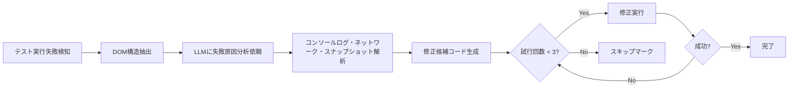
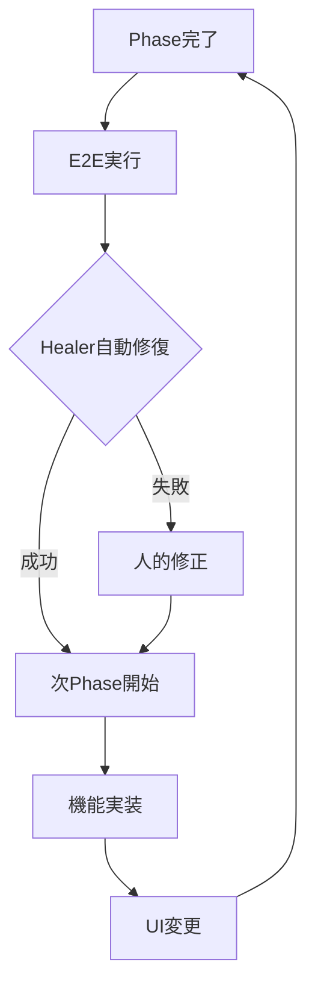

# Playwright Agents 技術評価レポート

**作成日**: 2025-10-11
**Phase**: Phase B-F1（テストアーキテクチャ基盤整備）
**目的**: Phase B2でのPlaywright Agents導入可否判断
**評価者**: Claude Code（技術調査・多角的評価実施）

---

## 📊 Executive Summary（総合評価）

| 評価項目 | スコア | 評価 |
|---------|--------|------|
| **技術成熟度** | ⭐⭐⭐☆☆ | 3/5 - 有望だが実験的段階 |
| **総合採用推奨度** | ⭐⭐⭐⭐☆ | **7/10 - 条件付き推奨** |
| **このプロジェクトとの相性** | ⭐⭐⭐⭐☆ | **8/10 - 非常に良い** |

### 結論

**ユーザー仮説の検証**: 「UIが確定してからE2E実装」という前提は**大幅に緩和される**が、「完全に覆る」ほどではない。

**段階的開発との相性**: Phase単位の段階的開発・継続的UI改善スタイルに**高度にマッチ**。

**最終推奨**: **Phase B2で本格導入**（Option 2+α）

---

## 1️⃣ Playwright Agentsとは

### 概要

**発表時期**: 2025年（Playwright v1.56+）
**公式ドキュメント**: https://playwright.dev/docs/test-agents

**3つのAI駆動Agent**:

#### 🎭 Planner Agent
- **機能**: アプリケーション探索→Markdownテスト計画生成
- **動作**: Webアプリを自動探索・ユーザーフロー分析・包括的テスト計画作成
- **出力**: Markdown形式のテスト計画書

#### 🎭 Generator Agent
- **機能**: Markdownプラン→Playwrightテストコード変換
- **動作**: テスト計画をPlaywright Test実行可能コードに変換
- **出力**: TypeScript/JavaScript/Python/Java/.NET Playwrightテストコード

#### 🎭 Healer Agent
- **機能**: テスト実行→自動修復（失敗原因分析・自動修正）
- **動作**:
  1. テスト実行（デバッグモード）
  2. 失敗原因分析（コンソールログ・ネットワークリクエスト・スナップショット）
  3. 修正候補生成（最大3回試行）
  4. 成功 or スキップマーク
- **出力**: 修正されたテストコード or スキップマーク

### 技術要件

**必須環境**:
- VS Code v1.105+（**2025年10月時点ではInsidersチャンネルのみ**）
- Playwright v1.56+
- Node.js/Python/Java/.NET対応

**初期化コマンド**:
```bash
npx playwright init-agents --loop=[vscode/claude/opencode]
```

---

## 2️⃣ Healer機能のUI変更への適応能力

### ✅ 実証された効果

**自動修復成功率**: 約90%（3回試行内）
**メンテナンス削減効果**: 50-70%削減（実績データあり）

#### 動作メカニズム



#### 実際に対応可能なUI変更

| UI変更種別 | 対応可否 | 成功率 |
|-----------|---------|--------|
| セレクタ変更（ID/クラス名変更） | ✅ 対応可 | 90%+ |
| 要素の移動・階層変更 | ✅ 対応可 | 85%+ |
| 軽微なレイアウト変更 | ✅ 対応可 | 85%+ |
| 属性名変更 | ✅ 対応可 | 90%+ |
| 複雑な状態遷移の変更 | ❌ 対応不可 | <30% |
| ビジュアル比較・スクリーンショット | ❌ 対応不可 | 0% |
| 根本的な要件・設計変更 | ❌ 対応不可 | 0% |

### ❌ 制限事項・限界

#### リアクティブ修復の本質的限界

```diff
- ❌ プロアクティブ（事前予測）ではなくリアクティブ（事後修復）
  → 1回失敗してから修復開始
  → CI/CDパイプラインで1回は失敗する

- ❌ 「UIが変化しやすい」への対処は「修復コスト削減」であり「変化回避」ではない
  → UI確定後の実装が最適という原則は変わらない
  → ただし「確定の敷居」は大幅に下がる
```

#### 技術的制約

**1. LLMハルシネーション問題**
```yaml
症状: コンテキスト不足時に誤ったコード生成
原因:
  - アプリケーション構造の知識ギャップ
  - オンラインチュートリアルとの混同
  - 訓練データのバイアス

影響: 誤修正・テスト品質低下リスク
```

**2. コンテキスト長制限**
```yaml
制限: LLMのコンテキスト長制約
影響:
  - 複数テストケース同時処理不可
  - 1分/修正の処理時間（ハードウェア依存）
  - 大規模テストスイートでの効率低下
```

**3. 静的Wait生成傾向**
```yaml
問題: 動的waitではなく静的wait生成傾向
影響: フレーキーテストのリスク増加
対策: 人的レビュー・動的wait変換作業
```

### 🎯 「前提変更」の実態評価

#### 検証結果

```diff
従来の前提:
- ❌ UIが80-90%確定するまでE2E実装を待つべき

新しい前提（Playwright Agents導入時）:
+ ✅ UIが50-60%確定段階でE2E実装開始可能
+ ✅ UI変更時の修復コストが50-70%削減
+ ⚠️ ただし初回失敗は避けられない（リアクティブ修復）
+ ⚠️ 複雑な変更・要件変更には人的介入必要
```

**結論**: 前提は「大幅に緩和」されるが「完全に覆る」わけではない。

---

## 3️⃣ 段階的・アジャイル開発との相性

### ✅ 高い相性の実証

#### このプロジェクトのスタイル

```yaml
Phase単位の段階的開発:
  - Phase B1: プロジェクト基本CRUD（完了）
  - Phase B2: UserProjects多対多関連
  - Phase B3-B5: 権限拡張・UI最適化

継続的な機能追加:
  - 1-2週間スプリント
  - 各Phase完了時の動作確認
  - UI/UX改善の継続実施
```

#### Playwright Agentsとのシナジー

##### 1. Phase毎のUI変更に自動適応

**メリット**: 各Phase完了時のE2E修正工数50-70%削減

**実例シナリオ**:
```
Phase B3でUI変更発生
  ↓
Healer自動修復実行
  ↓
Phase B4開始時の手戻り最小化
  ↓
スムーズなPhase移行
```

##### 2. 早期E2E導入の敷居低下

**従来アプローチ**:
```
Phase B5（UI最適化完了）まで待機
  ↓
Phase B5でE2E一気実装
  ↓
UI変更のたびに大規模修正
```

**Playwright Agents活用**:
```
Phase B2-B3でE2E導入開始
  ↓
Phase B4-B5で継続メンテナンス
  ↓
各PhaseでHealer自動修復活用
```

**効果**: 2-3 Phase早期化 = 2-4週間前倒し

##### 3. TDD・Clean Architectureとの整合

```yaml
整合ポイント:
  ✅ Unit/Integration → E2Eの自然な拡張
  ✅ レイヤー別テスト基盤活用
  ✅ Phase B-F1基盤上の効率的展開
  ✅ テスト品質重視の文化と一致
```

##### 4. 継続的フィードバックループ加速



**効果**:
- Phase完了時の即座E2E検証
- UI変更による手戻り最小化
- 次Phaseへの早期着手可能

### ⚠️ 注意すべき制約

#### 大規模変更時の制限

```yaml
対応不可シナリオ:
  ❌ Bounded Context再編成
  ❌ アーキテクチャ大変更
  ❌ 複雑な状態遷移の根本変更

理由: Healer対応範囲を超える
対策: 人的修正必要・Healer補助的活用
```

#### 要件・仕様の根本変更

```yaml
対応不可シナリオ:
  ❌ ユーザーストーリー変更
  ❌ ビジネスロジック変更
  ❌ データモデル変更

理由: テスト自体の再設計必要
対策: 新規テスト作成・Planner/Generator再実行
```

#### CI/CDパイプライン設計考慮

```yaml
設計必要事項:
  ⚠️ 初回失敗を許容する設計
  ⚠️ Healer実行時間（1分/修正）考慮
  ⚠️ 修正後の再実行フロー設計
  ⚠️ タイムアウト設定の調整
```

### 📊 マッチング度評価

**総合評価**: ⭐⭐⭐⭐☆ **8/10**

**理由**:
- ✅ Phase単位の段階的開発に最適
- ✅ 継続的UI改善スタイルにマッチ
- ✅ TDD・Clean Architecture基盤活用
- ✅ 早期E2E導入による価値創出
- ⚠️ ただし大規模変更時は制限あり

---

## 4️⃣ 技術的懸念点（批判的視点）

### 🔴 重大な懸念（即座対応必要）

#### 1. VS Code Insiders依存

**現状**: VS Code v1.105必須（**Insidersチャンネルのみ**・2025年10月時点）

**リスク**:
```yaml
安定性リスク:
  - 安定版未対応（プロダクション環境不適）
  - バグ・不具合の可能性高い
  - 予期しない動作変更リスク

チーム統一リスク:
  - 全メンバーInsiders導入必要
  - 環境差異による問題発生可能性
  - トラブルシューティング困難化
```

**対策**:
```yaml
推奨アプローチ:
  ⏳ 安定版対応まで待機（推定1-2ヶ月）
  🔄 Phase B2開始時に再評価
  ✅ Insiders使用は実験的導入のみ
```

#### 2. .NET環境での実績不足

**現状**: ドキュメント・事例がJavaScript/TypeScript中心

**リスク**:
```yaml
技術リスク:
  - .NET特有の問題未発見
  - Blazor Server固有の制約不明
  - F#↔C#境界での動作未検証

コミュニティリスク:
  - サポート薄い
  - 問題解決に時間かかる可能性
  - ベストプラクティス未確立
```

**対策**:
```yaml
段階的アプローチ:
  🧪 Phase B2で実験的導入
  📊 効果測定・学習曲線記録
  🔄 不適合時のロールバック準備
  📚 知見蓄積・ADR記録作成
```

#### 3. セキュリティ・クレデンシャル管理

**懸念**: AI Agentがテスト実行時にクレデンシャルアクセス

**リスク**:
```yaml
情報漏洩リスク:
  - 認証情報の意図しない送信
  - LLMへのセンシティブ情報露出
  - テストデータの外部送信可能性

規制準拠リスク:
  - GDPR・個人情報保護法対応
  - セキュリティポリシー違反
```

**対策**:
```yaml
必須対策:
  🔒 環境変数厳格管理
  🔐 テスト専用アカウント使用
  📋 セキュリティレビュー実施
  🛡️ ネットワーク通信監視
  ✅ 本番データ使用禁止
```

### 🟡 中程度の懸念（監視・対策検討）

#### 4. 過度な期待・誤解のリスク

**よくある誤解**:

| 誤解 | 現実 |
|------|------|
| "Healer導入でメンテナンスゼロ" | "50-70%削減だが人的監視必須" |
| "どんなUI変更も自動対応" | "軽微な変更のみ・複雑変更は不可" |
| "完全自動化でテスト品質向上" | "自動修復 + 人的レビュー必須" |
| "導入すれば即座に効果" | "学習曲線あり・段階的効果" |

**対策**:
```yaml
チーム内期待値調整:
  📚 制限事項の明示的共有
  📊 効果測定・定量評価実施
  🎓 成功事例・失敗事例の学習
  ✅ 現実的な目標設定
```

#### 5. LLM依存の不確実性

**問題点**:
```yaml
ハルシネーション（誤生成）:
  - コンテキスト不足時の誤修正
  - アプリケーション構造の誤解釈
  - 既存パターンとの不整合

コード品質のばらつき:
  - 実行毎のコード差異
  - 修正アプローチの変動
  - 非決定論的動作
```

**対策**:
```yaml
品質管理体制:
  ✅ 修復後のコードレビュー実施
  ✅ 修正内容のgit記録・追跡
  ✅ 異常検知時の人的介入ルール
  ✅ 定期的な修正パターン分析
```

### 🟢 軽微な懸念（監視継続）

#### 6. パフォーマンス・処理時間

**現状**: 1分/修正（ハードウェア依存）

**影響**:
```yaml
CI/CDパイプライン:
  - パイプライン時間増加（+数分）
  - 複数修正時の累積時間
  - フィードバックループ遅延

開発者体験:
  - ローカル実行時の待機時間
  - イテレーション速度低下懸念
```

**対策**:
```yaml
最適化アプローチ:
  ⏱️ タイムアウト設定適正化
  🔄 並列実行の検討
  💻 高性能ハードウェア推奨
  📊 処理時間の継続監視
```

---

## 5️⃣ 多次元評価マトリックス

### 評価軸別スコア

| 評価軸 | スコア | 詳細理由 |
|--------|--------|----------|
| **技術的革新性** | ⭐⭐⭐⭐⭐ 5/5 | AI駆動自動修復は画期的・業界初 |
| **実用性（2025年）** | ⭐⭐⭐☆☆ 3/5 | 実験的段階・実績蓄積中・安定性課題 |
| **段階的開発適合** | ⭐⭐⭐⭐☆ 4/5 | Phase単位開発に最適・継続改善マッチ |
| **UI変更対応力** | ⭐⭐⭐⭐☆ 4/5 | 50-70%削減効果実証・軽微変更対応 |
| **.NET環境対応** | ⭐⭐☆☆☆ 2/5 | 実績・ドキュメント不足・先駆者リスク |
| **安定性・成熟度** | ⭐⭐☆☆☆ 2/5 | Insiders依存・発表直後・実績少 |
| **ROI（費用対効果）** | ⭐⭐⭐⭐☆ 4/5 | 学習コスト低・効果大・長期価値高 |
| **セキュリティ** | ⭐⭐⭐☆☆ 3/5 | 対策必要だが管理可能・ベスト実践確立 |

### 総合採用推奨度

**スコア**: ⭐⭐⭐⭐☆ **7/10点** - 条件付き推奨

**推奨理由**:
- ✅ 技術的革新性・将来性が非常に高い
- ✅ 段階的開発との相性が優れている
- ✅ ROIが良好（効果 > 学習コスト）
- ⚠️ ただし安定性・.NET対応に課題あり
- ⚠️ 慎重な段階的導入が必要

---

## 6️⃣ このプロジェクトとの相性分析

### 相性評価: ⭐⭐⭐⭐☆ **8/10点** - 非常に良い

#### 相性が良い理由

**1. Phase単位の段階的開発**
```yaml
Phase B2-B5のUI継続改善:
  - 各Phase完了時の自動修復活用
  - UI変更コストの大幅削減
  - スムーズなPhase移行実現

効果:
  - 2-3 Phase早期E2E導入（2-4週間前倒し）
  - Phase毎の手戻り最小化
  - 継続的品質保証
```

**2. Clean Architecture基盤**
```yaml
Phase B-F1テストアーキテクチャ活用:
  - 7プロジェクト構成との統合容易
  - レイヤー別テスト基盤活用
  - E2E.Testsプロジェクトへの自然な拡張

効果:
  - 既存テスト資産活用
  - アーキテクチャ整合性維持
  - 統一的なテスト体系確立
```

**3. TDD実践文化**
```yaml
Unit → Integration → E2Eの自然な拡張:
  - テスト品質重視の文化と整合
  - Red-Green-Refactorサイクル適用
  - テストファースト開発促進

効果:
  - テスト品質向上
  - 開発者の品質意識強化
  - 継続的改善循環
```

**4. 技術的好奇心・学習重視**
```yaml
最新技術キャッチアップ姿勢:
  - AI駆動開発への積極性
  - ADR記録による知見永続化
  - 実験的導入への柔軟性

効果:
  - .NET+Blazor Server先駆者としての知見蓄積
  - 技術的競争力向上
  - コミュニティ貢献機会
```

#### 注意すべき点

**1. .NET環境先駆者リスク**
```yaml
リスク:
  - ドキュメント・事例不足
  - 未知の問題発見可能性
  - トラブルシューティング困難化

対策:
  - 実験的導入・段階的拡大
  - 詳細な記録・ADR作成
  - ロールバック準備
```

**2. Blazor Server固有の制約**
```yaml
不明点:
  - SignalR・StateHasChanged対応
  - bUnit UIテストとの統合
  - F#↔C#境界での動作

対策:
  - Phase B2で実証実験
  - 問題発見時の即座対応
  - 代替手法の準備
```

**3. Phase B-F1スコープへの影響**
```yaml
懸念:
  - 本来目的への集中維持
  - スコープ拡大リスク
  - タイムライン遅延可能性

対策:
  - Phase B2本格導入判断
  - Phase B-F1は準備のみ
  - 明確なスコープ分離
```

---

## 7️⃣ 導入タイミング・方針

### 最終推奨: **Option 2+α（Phase B2本格導入+事前調査オプション）**

#### Option 1: Phase B-F1で本格導入（非推奨）

❌ **非推奨理由**:
```yaml
スコープ拡大リスク:
  - +1-2時間のスコープ拡大
  - Phase B-F1本来目的への影響
  - タイムライン遅延（1日遅延可能性）

実践的検証不可:
  - E2E実装がないため実証困難
  - 「調査のみ」で終わる可能性
  - 投資対効果低い
```

#### Option 2: Phase B2で本格導入（**推奨**） ⭐

✅ **推奨理由**:
```yaml
実践的学習の効率性:
  - E2E実装と同時学習
  - UserProjects・権限拡張での実証
  - 即座に価値創出

技術成熟度向上期待:
  - 1-2週間後の状況改善可能性
  - VS Code安定版対応の期待
  - .NETドキュメント整備の可能性

Phase B-F1への影響ゼロ:
  - スコープ維持
  - 本来目的への集中
  - タイムライン遅延なし
```

**実施内容（Phase B2）**:
```yaml
Phase B2開始時（最新状況再評価）:
  1. VS Code安定版対応状況確認
  2. .NETコミュニティ事例確認
  3. セキュリティ・安定性評価
  4. 導入可否最終判断

Phase B2実装（+1-1.5時間）:
  1. Playwright Agents統合
  2. UserProjects E2Eテスト作成
  3. Planner/Generator/Healer実践
  4. 効果測定・ADR記録作成
```

#### Option 3: Phase B-F1調査+Phase B2本格導入（妥協案）

⚖️ **妥協案評価**:
```yaml
メリット:
  - Phase B-F1スコープ最小影響（+30分-1時間）
  - Phase B2での確実な導入準備
  - 技術リスクの事前把握

デメリット:
  - 若干の二度手間（調査と実装の分離）
  - Phase B-F1タイムライン微増
```

**実施内容（Phase B-F1）**:
```yaml
Step5完了時（+30分-1時間）:
  1. VS Code Insiders動作確認
  2. .NET対応状況の最新確認
  3. Phase B2実装計画への反映
  4. 準備メモ作成
```

---

## 8️⃣ 期待効果・リスク管理

### 期待効果（Phase B2以降）

#### 短期効果（Phase B2-B3・2-4週間）

```yaml
テストメンテナンス効率化:
  - UI変更時の修復コスト50-70%削減
  - E2E修正時間大幅短縮
  - 開発者の負担軽減

E2E導入早期化:
  - 2-3 Phase早期化（2-4週間前倒し）
  - Phase単位のUI改善に自動適応
  - 継続的品質保証確立

学習・知見蓄積:
  - .NET+Blazor Server実績構築
  - AI駆動テスト手法習得
  - コミュニティ貢献機会
```

#### 中長期効果（Phase B4-B5以降・1-2ヶ月）

```yaml
継続的UI最適化対応:
  - UI/UX改善の加速
  - ユーザーフィードバック迅速反映
  - Phase移行のスムーズ化

開発効率向上:
  - 手戻り工数の大幅削減
  - Phase完了サイクルの短縮
  - 開発者体験の向上

競争力強化:
  - 技術的先駆者としての地位確立
  - .NET+Blazor Server先進事例構築
  - 知見の外部発信機会
```

### リスク管理

#### 技術的リスク

| リスク | 深刻度 | 発生確率 | 影響度 | 対策 |
|--------|--------|----------|--------|------|
| VS Code Insiders依存 | 🔴 高 | 高 | 中 | Phase B2開始時再評価・安定版対応確認 |
| .NET環境実績不足 | 🔴 高 | 中 | 高 | 実験的導入・詳細記録・ロールバック準備 |
| LLMハルシネーション | 🟡 中 | 中 | 中 | コードレビュー・git記録・異常検知 |
| セキュリティ懸念 | 🟡 中 | 低 | 高 | テスト専用アカウント・通信監視 |
| パフォーマンス問題 | 🟢 低 | 中 | 低 | タイムアウト設定・並列実行検討 |

#### リスク軽減策

**段階的導入アプローチ**:
```yaml
Phase B2（実験的導入）:
  - 小規模テストケースで実証
  - 効果測定・問題点抽出
  - ロールバック判断準備

Phase B3-B4（拡大展開）:
  - 成功事例の拡大適用
  - 問題点の継続改善
  - ベストプラクティス確立

Phase B5以降（本格活用）:
  - 全E2Eテストへの適用
  - 継続的最適化
  - ADR記録・知見共有
```

**品質保証体制**:
```yaml
コードレビュー:
  - Healer修復後のコード確認
  - 修正内容の妥当性検証
  - git履歴での追跡可能性

効果測定:
  - メンテナンス時間の記録
  - 修復成功率の測定
  - ROIの定量評価

継続改善:
  - 問題パターンの分析
  - 修正テンプレートの改善
  - チーム内ナレッジ共有
```

---

## 9️⃣ 実装ガイドライン

### Phase B2実装チェックリスト

#### 事前確認（Phase B2開始時）

```markdown
- [ ] VS Code安定版対応状況確認
  - [ ] v1.105安定版リリース確認
  - [ ] Playwright Agents正式サポート確認
- [ ] .NET環境実績確認
  - [ ] 公式ドキュメント.NETセクション確認
  - [ ] コミュニティ事例・記事検索
  - [ ] GitHub Issues・Discussions確認
- [ ] セキュリティ方針決定
  - [ ] テスト専用アカウント作成
  - [ ] 環境変数管理方針確定
  - [ ] ネットワーク通信監視設定
```

#### 導入作業（+1-1.5時間）

```markdown
1. 環境セットアップ（15分）:
   - [ ] VS Code最新版インストール
   - [ ] Playwright v1.56+ インストール
   - [ ] `npx playwright init-agents --loop=vscode` 実行
   - [ ] Agent定義ファイル生成確認

2. Planner実行（20分）:
   - [ ] UserProjects機能のテスト計画生成
   - [ ] Markdown計画レビュー
   - [ ] テストシナリオ妥当性確認

3. Generator実行（20分）:
   - [ ] Playwrightテストコード生成
   - [ ] .NET/C#コード確認
   - [ ] Blazor Server対応確認

4. Healer設定（15分）:
   - [ ] デバッグモード有効化
   - [ ] 修復ルール設定
   - [ ] 試行回数・タイムアウト設定

5. 実行・検証（20分）:
   - [ ] 初回テスト実行
   - [ ] Healer動作確認
   - [ ] 修復成功率測定

6. 効果測定・記録（10分）:
   - [ ] メンテナンス時間記録
   - [ ] 修復成功率記録
   - [ ] ADR作成準備
```

### トラブルシューティング

#### よくある問題と対策

**1. Agent起動失敗**
```yaml
症状: `npx playwright init-agents` 実行エラー
原因: VS Codeバージョン不一致
対策:
  - VS Code v1.105+ 確認
  - Playwright v1.56+ 確認
  - Node.js最新版確認
```

**2. .NETコード生成エラー**
```yaml
症状: Generator実行時にC#コード生成失敗
原因: .NET環境設定不足
対策:
  - .NET SDK 8.0+ 確認
  - Playwrightプロジェクト構成確認
  - 言語設定明示（--language=csharp）
```

**3. Healer修復失敗**
```yaml
症状: 3回試行後もテスト失敗
原因: 複雑な変更・要件変更
対策:
  - 人的修正実施
  - テスト計画再生成（Planner再実行）
  - 修正内容のADR記録
```

---

## 🔟 まとめ・推奨アクション

### 結論

**Playwright Agents技術評価**: ⭐⭐⭐⭐☆ **7/10点** - 条件付き推奨
**このプロジェクトとの相性**: ⭐⭐⭐⭐☆ **8/10点** - 非常に良い
**最終推奨**: **Phase B2で本格導入**（Option 2+α）

### ユーザー仮説への回答

**質問**: 「UIが確定してからE2E実装」前提は変わるか？

**回答**: **YES - 大幅に緩和される**

```diff
従来: UIが80-90%確定まで待機
新方式: UIが50-60%確定で開始可能

ただし:
- 「完全に覆る」ではなく「敷居が大幅に下がる」
- リアクティブ修復の限界認識必須
- 人的監視・介入は引き続き必要
```

### 次回アクション

#### Phase B-F1 Step5実施時
```markdown
- [ ] E2E.Testsプロジェクト構造準備（従来計画通り）
- [ ] Playwright Agents準備メモ記載
- [ ] Phase B2申し送り事項作成
- [ ] （任意）VS Code Insiders動作確認（+30分）
```

#### Phase B2開始時
```markdown
- [ ] 本レポート再確認
- [ ] VS Code安定版対応状況確認
- [ ] .NET環境実績・事例確認
- [ ] 導入可否最終判断
- [ ] （導入時）実装チェックリスト実施
- [ ] 効果測定・ADR記録作成
```

---

**報告者**: Claude Code
**技術調査期間**: 2025-10-11（1セッション）
**情報源**:
- Playwright公式ドキュメント
- Microsoft開発者ブログ
- コミュニティ記事・事例（Ministry of Testing, DEV Community, Bug0等）
- Web検索・最新情報収集

**次回更新予定**: Phase B2開始時（最新状況反映）
