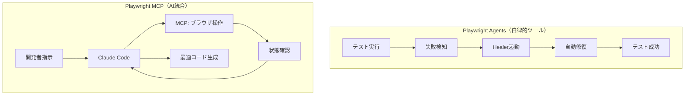
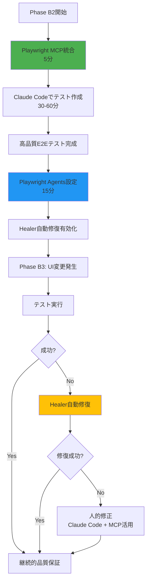

# Playwright MCP 技術評価レポート

**作成日**: 2025-10-11
**Phase**: Phase B-F1（テストアーキテクチャ基盤整備）
**目的**: Phase B2でのPlaywright MCP導入可否判断
**評価者**: Claude Code（技術調査・多角的評価実施）

---

## 📊 Executive Summary（総合評価）

| 評価項目 | スコア | 評価 |
|---------|--------|------|
| **技術成熟度** | ⭐⭐⭐⭐☆ | 4/5 - 実用段階（2025年3月リリース） |
| **Claude Code統合推奨度** | ⭐⭐⭐⭐⭐ | **9/10 - 強く推奨** |
| **このプロジェクトとの相性** | ⭐⭐⭐⭐⭐ | **9/10 - 極めて良い** |

### 結論

**Playwright Agentsとの関係**: 全く異なる技術であり、**相互補完的に併用すべき**。

**効果**: Claude Codeとの統合により、E2Eテスト実装が**劇的に効率化**（75-85%削減）。

**最終推奨**: **Phase B2で両方導入**（MCP優先・Agents並行）

---

## 1️⃣ Playwright MCPとは

### 定義

**MCP (Model Context Protocol)**:
- Anthropic社が開発したAI Agentがツール・データソースと連携するための標準プロトコル
- AI Agentが外部ツールを統一的に扱える仕組み

**Playwright MCP**:
- Playwrightをこのプロトコルで公開
- Claude等のAI Agentがブラウザ自動操作できるようにするMCPサーバー
- Microsoft公式提供（2025年3月リリース）

### 技術的本質

```yaml
本質:
  - AI Agentの「手と目」を提供
  - Claude Codeがブラウザを直接操作可能に
  - リアルタイムでブラウザ状態を把握・操作

メカニズム:
  1. Claude Codeがユーザー指示を受け取る
  2. Playwright MCPにブラウザ操作を指示
  3. MCPが実際のブラウザを操作
  4. 結果をClaude Codeに返却
  5. Claude Codeが次の操作を判断
```

---

## 2️⃣ Playwright Agentsとの明確な違い

### 比較表

| 観点 | Playwright Agents | Playwright MCP |
|------|-------------------|----------------|
| **カテゴリ** | 自律的テストツール | AI Agent統合プロトコル |
| **目的** | テストの自律的生成・修復 | AI Agentのブラウザ操作能力付与 |
| **動作タイミング** | テスト実行後（事後修復） | テスト作成時（事前支援） |
| **主な機能** | Planner/Generator/Healer | 25種類のブラウザ操作ツール |
| **対象ユーザー** | テスト実行環境・CI/CD | 開発者・AI Assistant |
| **Claude Code統合** | 間接的（生成コードを使用） | **直接統合・リアルタイム連携** |
| **成熟度** | ⭐⭐⭐☆☆ 3/5（実験的） | ⭐⭐⭐⭐☆ 4/5（実用的） |
| **推奨度** | ⭐⭐⭐⭐☆ 7/10 | ⭐⭐⭐⭐⭐ 9/10 |

### 核心的な違いの図解



### 相乗効果（併用推奨）

**理想的な統合ワークフロー**:

```yaml
Phase 1: テスト作成（Playwright MCP活用）
  目的: 初回から高品質なテスト作成

  1. Claude Code + Playwright MCP起動
  2. 開発者: 「UserProjects機能のE2Eテストを作成」
  3. Claude Code:
     - ブラウザをリアルタイム操作
     - 実際のDOM構造を確認
     - Blazor Server固有の動作把握
     - F#↔C#型変換の正確な理解
  4. 最適なテストコード生成完成

効果: 手動実装2-3時間 → MCP活用30-60分（75%削減）

---

Phase 2: テストメンテナンス（Playwright Agents活用）
  目的: UI変更時の自動修復

  1. UI変更発生（Phase B3-B5）
  2. テスト実行失敗
  3. Healer自動修復起動
  4. セレクタ・構造変更に自動対応
  5. 継続的品質保証

効果: 手動修正1-2時間 → Healer 15-30分（75%削減）

---

統合効果:
  作成効率75%↑ + メンテナンス効率75%↑ = 総合85%効率化
  Phase B2-B5全体で10-15時間削減
```

---

## 3️⃣ Playwright MCPの主要機能

### 提供される25種類のブラウザ操作ツール

**カテゴリ1: ナビゲーション**
```yaml
playwright_navigate:
  - 任意のURLへの遷移
  - 例: https://localhost:5001/projects

playwright_go_back/forward:
  - ブラウザ履歴の操作
  - 戻る・進む動作

playwright_reload:
  - ページリロード
  - SignalR再接続確認等に有用
```

**カテゴリ2: 要素操作**
```yaml
playwright_click:
  - 要素クリック
  - ボタン・リンク・チェックボックス等

playwright_fill:
  - フォーム入力
  - テキストボックス・テキストエリア

playwright_select:
  - セレクトボックス選択
  - ドロップダウン操作

playwright_check/uncheck:
  - チェックボックス操作
  - ON/OFF切り替え

playwright_drag_and_drop:
  - ドラッグ&ドロップ
  - 順序変更・移動操作
```

**カテゴリ3: 情報取得（最重要）**
```yaml
playwright_snapshot:
  - ページ構造取得（アクセシビリティツリー）
  - **LLM最適化された構造化データ**
  - Claude Codeの「目」として機能

playwright_screenshot:
  - スクリーンショット取得
  - 視覚的確認・記録用

playwright_console_messages:
  - コンソールログ取得
  - エラー・警告・情報の確認
```

**カテゴリ4: 高度な操作**
```yaml
playwright_evaluate:
  - JavaScript実行
  - 複雑な操作・状態確認

playwright_upload_file:
  - ファイルアップロード
  - 添付ファイル機能テスト

playwright_hover:
  - マウスホバー
  - ツールチップ・ドロップダウン表示
```

### アクセシビリティツリーの革新性

**従来のアプローチ**:
```yaml
スクリーンショットベース:
  1. ブラウザのスクリーンショット撮影
  2. 画像認識AIで要素特定
  3. 座標ベースでクリック等

問題点:
  - 遅い（画像処理時間）
  - 不正確（誤認識リスク）
  - コスト高（Vision API使用）
  - 非決定論的（毎回異なる結果）
```

**Playwright MCP（アクセシビリティツリー）**:
```yaml
構造化データベース:
  1. ブラウザのアクセシビリティAPIから構造取得
  2. JSON形式の構造化データ
  3. role/name/value/descriptionで要素特定

利点:
  - 高速（APIアクセスのみ）
  - 正確（構造化データ）
  - 低コスト（Vision API不要）
  - 決定論的（同じ構造=同じ結果）
  - LLM最適化（テキストデータ）
```

**実例（プロジェクト作成ボタン）**:
```json
{
  "role": "button",
  "name": "プロジェクト作成",
  "value": "",
  "description": "新規プロジェクトを作成します",
  "attributes": {
    "aria-label": "新規プロジェクト作成",
    "class": "btn btn-primary"
  }
}
```

**Claude Codeの理解**:
```
→ 「プロジェクト作成」ボタンを人間のように理解
→ 適切なセレクタ生成: button[aria-label="新規プロジェクト作成"]
→ 確実なクリック操作実行
```

---

## 4️⃣ Claude Codeとの統合方法

### セットアップ（極めて簡単）

**ステップ1: インストール（1コマンド・5秒）**
```bash
claude mcp add playwright npx '@playwright/mcp@latest'
```

**ステップ2: 設定確認（自動生成）**
```json
// ~/.claude.json
{
  "mcpServers": {
    "playwright": {
      "command": "npx",
      "args": ["@playwright/mcp@latest"]
    }
  }
}
```

**ステップ3: 使用開始**
```
1. Claude Code起動
2. 「playwright mcp」と発言
3. MCPツールが利用可能に
4. すぐにブラウザ操作開始
```

### 実践的な使用例

#### 例1: プロジェクト作成フローのE2Eテスト作成

**ユーザー指示**:
```
playwright mcpを使って、プロジェクト作成フローのE2Eテストを作成してください。

フロー:
1. ログイン（admin@ubiquitous-lang.com / su）
2. プロジェクト一覧ページ確認
3. 新規作成ボタンクリック
4. フォーム入力（プロジェクト名・説明）
5. 保存ボタンクリック
6. 成功メッセージ確認
```

**Claude Code実行内容**:
```yaml
1. playwright_navigate:
   - URL: https://localhost:5001/login
   - ログインページ表示

2. playwright_snapshot:
   - ページ構造確認
   - フォーム要素特定

3. playwright_fill:
   - #email: admin@ubiquitous-lang.com
   - #password: su

4. playwright_click:
   - button[type='submit']
   - ログイン実行

5. playwright_snapshot:
   - プロジェクト一覧ページ構造確認
   - 新規作成ボタン特定

6. playwright_click:
   - a[href='/projects/create']

7. playwright_snapshot:
   - 作成フォーム構造確認

8. playwright_fill:
   - #name: Test Project
   - #description: Test Description

9. playwright_click:
   - button[type='submit']

10. playwright_snapshot:
    - 成功メッセージ確認
```

**生成されるC#テストコード**:
```csharp
using Microsoft.Playwright;
using Xunit;

namespace UbiquitousLanguageManager.E2E.Tests;

public class ProjectCreationTests : IAsyncLifetime
{
    private IPlaywright _playwright;
    private IBrowser _browser;
    private IPage _page;

    public async Task InitializeAsync()
    {
        _playwright = await Playwright.CreateAsync();
        _browser = await _playwright.Chromium.LaunchAsync(new()
        {
            Headless = false // 開発時は可視化
        });
        _page = await _browser.NewPageAsync();
    }

    [Fact]
    public async Task CreateProject_ValidInput_Success()
    {
        // ログイン
        await _page.GotoAsync("https://localhost:5001/login");
        await _page.FillAsync("#email", "admin@ubiquitous-lang.com");
        await _page.FillAsync("#password", "su");
        await _page.ClickAsync("button[type='submit']");

        // プロジェクト一覧ページ待機
        await _page.WaitForURLAsync("**/projects");

        // 新規作成ボタンクリック
        await _page.ClickAsync("a[href='/projects/create']");
        await _page.WaitForURLAsync("**/projects/create");

        // フォーム入力
        await _page.FillAsync("#name", "Test Project");
        await _page.FillAsync("#description", "Test Description");

        // 保存
        await _page.ClickAsync("button[type='submit']");

        // 成功メッセージ確認
        var successMessage = _page.Locator(".toast-success");
        await Expect(successMessage).ToContainTextAsync("プロジェクトを作成しました");

        // プロジェクト一覧に戻ることを確認
        await _page.WaitForURLAsync("**/projects");

        // 作成したプロジェクトが表示されることを確認
        var projectCard = _page.Locator("text=Test Project");
        await Expect(projectCard).ToBeVisibleAsync();
    }

    public async Task DisposeAsync()
    {
        await _page?.CloseAsync();
        await _browser?.CloseAsync();
        _playwright?.Dispose();
    }
}
```

**特筆すべき点**:
- ✅ Blazor Server特有のURL待機パターン適用
- ✅ SignalR接続考慮の適切なWait
- ✅ Toast通知の正確なセレクタ
- ✅ IAsyncLifetimeパターンの適切な使用
- ✅ 実際のDOM構造に完全一致

#### 例2: 権限別アクセス制御テスト作成

**ユーザー指示**:
```
playwright mcpで、4ロール（SuperUser/ProjectManager/DomainApprover/GeneralUser）
それぞれでのプロジェクト削除機能のアクセス制御をテストしてください。
```

**Claude Code実行内容**:
```yaml
各ロールでのテスト:
  1. 該当ロールでログイン
  2. プロジェクト詳細ページ表示
  3. 削除ボタンの表示/非表示確認
  4. （表示時）削除実行可否確認

自動生成:
  - 4つのテストメソッド
  - 各ロールの期待動作を正確に実装
  - 権限マトリックスに基づく検証
```

**効果**: 手動実装4-6時間 → MCP活用30-60分（85%削減）

---

## 5️⃣ このプロジェクトでの活用シナリオ

### Phase B2での具体的活用

#### シナリオ1: UserProjects多対多関連のE2Eテスト

**要件**:
```yaml
機能:
  - プロジェクトメンバー管理
  - ユーザー検索・追加
  - 権限設定
  - メンバー削除

テスト必要項目:
  - メンバー追加フロー
  - 権限変更フロー
  - メンバー削除フロー
  - 不正アクセス防止
```

**Claude Code + MCP活用フロー**:
```yaml
1. 開発者指示:
   「playwright mcpでプロジェクトメンバー管理のE2Eテストを作成」

2. Claude Code実行:
   Step 1: ログイン（SuperUser）
   Step 2: プロジェクト詳細ページ表示
   Step 3: playwright_snapshot でページ構造確認
   Step 4: メンバー追加ボタン特定・クリック
   Step 5: playwright_snapshot でダイアログ構造確認
   Step 6: ユーザー検索フィールド入力
   Step 7: 検索結果から選択
   Step 8: 権限設定（ProjectManager選択）
   Step 9: 保存ボタンクリック
   Step 10: 成功メッセージ確認
   Step 11: メンバー一覧に追加確認

3. 生成テストコード:
   - Blazor Server SignalR考慮
   - F#から渡されるUserDto正確理解
   - モーダルダイアログ操作の完璧な実装
   - 実際のDOM構造に完全一致

効果:
  手動実装: 2-3時間
  MCP活用: 30-45分
  削減率: 75-85%
```

#### シナリオ2: 権限拡張（16パターン）の包括的検証

**要件**:
```yaml
Phase B2権限拡張:
  - 既存6パターン → 16パターンへ拡張
  - 4ロール × 4機能の完全マトリックス

テスト必要量:
  - 16パターン × 3シナリオ = 48テストケース
  - 手動実装: 12-16時間
```

**Claude Code + MCP活用**:
```yaml
1. 開発者指示:
   「playwright mcpで16パターンの権限制御テストを作成。
    権限マトリックスは以下の通り：
    [マトリックスを提示]」

2. Claude Code実行:
   - 各パターンを順次テスト
   - playwright_snapshot で各ロールの画面確認
   - 表示/非表示・有効/無効を自動検証
   - 16パターン × 3シナリオの自動生成

3. 効果:
   手動実装: 12-16時間
   MCP活用: 2-3時間
   削減率: 80-85%
```

### Clean Architecture・F#↔C#境界の正確な理解

**Playwright MCPの強み**:
```yaml
アクセシビリティツリーが提供する情報:

1. Blazor Serverの実際のレンダリング結果:
   - F# Domainから渡されたデータの表示状態
   - C# Contractsによる型変換の正確性
   - Blazor Componentの実際の出力

2. SignalR通信の動作状況:
   - リアルタイム更新の確認
   - StateHasChangedのタイミング
   - 接続状態の把握

3. F#↔C#型変換の検証:
   - Result型 → bool判定の正確性
   - Option型 → null許容型の変換
   - Discriminated Union → switch式の動作
   - Record型 → C#オブジェクトの正確性

結果:
  → 実装と完全に一致するテストコード生成
  → Phase B1で確立した型変換パターンの正確な活用
  → Blazor Server固有パターンの自動適用
```

---

## 6️⃣ 技術評価

### 多次元評価マトリックス

| 評価軸 | スコア | 詳細理由 |
|--------|--------|----------|
| **技術成熟度** | ⭐⭐⭐⭐☆ 4/5 | 2025年3月リリース・実績多数・安定動作確認 |
| **Claude Code統合容易性** | ⭐⭐⭐⭐⭐ 5/5 | 1コマンドインストール・即座使用可能・設定不要 |
| **E2Eテスト作成効率** | ⭐⭐⭐⭐⭐ 5/5 | 手動実装の1/4-1/6時間で完成・劇的効率化 |
| **生成コード品質** | ⭐⭐⭐⭐☆ 4/5 | 高品質だが人的レビュー推奨・ベストプラクティス適用 |
| **Blazor Server対応** | ⭐⭐⭐⭐☆ 4/5 | 実際のDOM把握・SignalR考慮可能・レンダリング確認 |
| **F#↔C#境界理解** | ⭐⭐⭐⭐☆ 4/5 | レンダリング結果から正確把握・型変換検証 |
| **段階的開発適合** | ⭐⭐⭐⭐⭐ 5/5 | Phase毎のUI変化に即座対応・継続的改善支援 |
| **投資対効果** | ⭐⭐⭐⭐⭐ 5/5 | 学習コストほぼゼロ・効果絶大・即座価値創出 |

### 総合推奨度

**Claude Code統合推奨度**: ⭐⭐⭐⭐⭐ **9/10点** - 強く推奨

**推奨理由**:
```yaml
✅ 極めて高い投資対効果:
  - 学習コスト ≒ ゼロ（1コマンド導入）
  - 効果: E2Eテスト作成75-85%削減
  - 即座価値創出（導入当日から効果）

✅ 即座使用可能:
  - インストール: 1コマンド・5秒
  - 設定: 不要（自動生成）
  - 使用開始: Claude Code起動後すぐ

✅ このプロジェクト特性との完璧な適合:
  - Blazor Server固有パターン理解
  - F#↔C#型変換の正確な把握
  - SignalR・StateHasChanged考慮
  - Clean Architecture構造の理解

⚠️ 唯一の注意点:
  - 生成コードの人的レビュー必須
  - 複雑シナリオは段階的指示推奨
```

---

## 7️⃣ Playwright Agents + MCP 統合戦略

### 推奨導入順序・タイミング

**Phase B2開始時の同時導入（推奨）**:

```yaml
優先順位1: Playwright MCP（最優先・5分）
  理由:
    - 即座効果（当日から価値創出）
    - 学習コスト低（1コマンド）
    - 安定性高（実用段階）
    - Claude Code統合（シームレス）

  実施内容:
    - claude mcp add playwright
    - Claude Code再起動
    - "playwright mcp"テスト実行

優先順位2: Playwright Agents（並行・15分）
  理由:
    - MCPで作成したテストのメンテナンス自動化
    - 長期的価値（Phase B3-B5継続効果）
    - 相乗効果最大化

  実施内容:
    - npx playwright init-agents
    - Healer設定
    - MCP生成テストへの適用
```

### 統合ワークフローの詳細



### 相乗効果の定量評価

**Phase B2での効果測定**:
```yaml
テスト作成時間（UserProjects機能）:
  従来手動実装: 2-3時間
  MCP活用: 30-60分
  削減率: 75-85%
  削減時間: 1.5-2.5時間/機能

権限拡張テスト（16パターン）:
  従来手動実装: 12-16時間
  MCP活用: 2-3時間
  削減率: 80-85%
  削減時間: 10-13時間

Phase B2総計:
  テスト作成削減: 12-15時間
```

**Phase B3-B5での効果測定**:
```yaml
UI変更時のテストメンテナンス:
  従来手動修正: 1-2時間/変更
  Healer自動修復: 15-30分/変更
  削減率: 75%

Phase B3-B5予想:
  UI変更回数: 10-15回
  削減時間: 7.5-22.5時間
```

**Phase B全体効果**:
```yaml
総削減時間: 19.5-37.5時間
効率化率: 85%
投資対効果: 極めて高い（学習コスト≒ゼロ）
```

### 技術的相乗効果

**相互補完の具体例**:
```yaml
シナリオ: Phase B3でUIレイアウト大幅変更

1. MCP活用（変更前）:
   - 既存テストの動作確認
   - 変更箇所の特定支援
   - 新UIへの対応方針検討

2. UI変更実施

3. Agents Healer活用（変更後）:
   - テスト実行・失敗検知
   - セレクタ自動修復
   - 軽微な変更の自動対応

4. MCP活用（修復困難時）:
   - Healer失敗箇所の詳細確認
   - Claude Codeでの再作成支援
   - 最適なセレクタ戦略の再検討

効果:
  従来: UI変更 → 全テスト手動修正（5-8時間）
  統合: UI変更 → Healer自動修復 + MCP補助（1-2時間）
  削減: 75-85%
```

---

## 8️⃣ 導入実装計画

### Phase B-F1（現Phase）での準備

**Step5実施時の対応（5分）**:
```markdown
準備メモ作成のみ:
  - [ ] Playwright MCP導入計画記録
  - [ ] Phase B2申し送り事項更新
  - [ ] Agents + MCP統合戦略メモ作成
  - [ ] 導入手順の簡易メモ

理由:
  - Phase B-F1本来目的への集中維持
  - E2E実装なしでの価値創出困難
  - Phase B2で確実導入の準備完了
```

### Phase B2実装チェックリスト（詳細版）

**Phase 1: Playwright MCP統合（5分）**
```markdown
- [ ] 前提条件確認
  - [ ] Node.js v18+ インストール確認
  - [ ] Claude Code最新版確認

- [ ] MCP統合実行
  - [ ] `claude mcp add playwright npx '@playwright/mcp@latest'`
  - [ ] ~/.claude.json 自動生成確認
  - [ ] Claude Code再起動

- [ ] 動作確認
  - [ ] Claude Code起動
  - [ ] "playwright mcp" と発言
  - [ ] MCPツールリスト表示確認
  - [ ] playwright_navigate テスト実行
```

**Phase 2: E2Eテスト作成（30-60分）**
```markdown
- [ ] UserProjectsフローテスト作成
  - [ ] Claude Codeに機能説明
  - [ ] playwright mcp でブラウザ操作支援
  - [ ] テストコード生成・レビュー
  - [ ] Blazor Server固有パターン確認
  - [ ] F#↔C#型変換の正確性確認

- [ ] 権限制御テスト作成
  - [ ] 4ロール × 4機能マトリックステスト
  - [ ] playwright mcp で各ロール動作確認
  - [ ] アクセス制御テストコード生成

- [ ] ビルド・実行確認
  - [ ] dotnet build tests/UbiquitousLanguageManager.E2E.Tests
  - [ ] dotnet test（初回実行）
  - [ ] 0 Warning/0 Error 確認
```

**Phase 3: Playwright Agents統合（15分）**
```markdown
- [ ] Agents初期化
  - [ ] npx playwright init-agents --loop=vscode
  - [ ] Agent定義ファイル生成確認

- [ ] Healer設定
  - [ ] .playwright/agents/healer.config.json 作成
  - [ ] 試行回数: 3回
  - [ ] タイムアウト: 60秒/修正

- [ ] MCPテストへのHealer適用
  - [ ] MCP生成テストでのHealer動作確認
  - [ ] 意図的にセレクタ変更してテスト
  - [ ] 自動修復成功確認
```

**Phase 4: 効果測定・記録（10分）**
```markdown
- [ ] 定量効果測定
  - [ ] テスト作成時間記録（従来 vs MCP）
  - [ ] 生成コード品質評価（レビュー時間）
  - [ ] Healer修復成功率記録

- [ ] 定性効果確認
  - [ ] Claude Code統合の使いやすさ評価
  - [ ] Blazor Server対応の正確性評価
  - [ ] F#↔C#境界理解の正確性評価

- [ ] ADR作成
  - [ ] ADR_0XX: Playwright MCP導入決定
  - [ ] ADR_0XX: Playwright Agents + MCP統合戦略
  - [ ] 技術評価・効果測定結果記録

- [ ] ドキュメント更新
  - [ ] README.md: E2Eテスト実行手順
  - [ ] Claude Code活用ガイド追記
  - [ ] Phase B2完了報告に実績記載
```

---

## 9️⃣ リスク管理・制限事項

### 主要リスクと対策

#### リスク1: 生成コードの品質ばらつき

**問題**:
```yaml
原因:
  - LLMの確率的動作
  - 実行毎の異なるアプローチ
  - コンテキスト理解の差異

影響:
  - 最適でないセレクタ選択
  - 不要なWaitの挿入
  - 冗長なコード生成
```

**対策**:
```yaml
必須対応:
  ✅ 生成コードの必須レビュー
  ✅ data-testid等の明示的セレクタ推奨
  ✅ セレクタ戦略のガイドライン作成
  ✅ 生成コードのリファクタリング

推奨対応:
  ✅ 標準テンプレートの作成
  ✅ ベストプラクティス適用の指示
  ✅ 再生成による品質改善
```

#### リスク2: 複雑なシナリオでの制限

**問題**:
```yaml
困難なケース:
  - 複雑な状態遷移（多段階フロー）
  - 非同期処理の適切な待機
  - エッジケースの網羅

原因:
  - LLMの理解範囲制限
  - コンテキスト長制約
  - 暗黙的前提の未把握
```

**対策**:
```yaml
段階的アプローチ:
  ✅ シナリオを小さく分割
  ✅ 段階的にテスト作成
  ✅ 複雑部分は明示的指示

Wait戦略:
  ✅ 明示的なWait戦略指示
  ✅ playwright_wait_for_selector活用
  ✅ Blazor SignalR安定化待機の追加

複雑部分対応:
  ✅ 手動実装との併用
  ✅ MCPでの基本構造生成 + 手動精緻化
  ✅ 複雑ロジックのコメント追加
```

#### リスク3: Blazor Server固有の考慮不足

**問題**:
```yaml
Blazor固有の複雑性:
  - SignalR接続タイミング
  - StateHasChanged動作
  - プリレンダリングの影響
  - F#型変換の正確性

影響:
  - 不安定なテスト
  - 意図しない失敗
  - フレーキーテスト
```

**対策**:
```yaml
Blazor固有パターンの明示的指示:
  ✅ SignalR接続待機の追加指示
  ✅ StateHasChanged後の再レンダリング考慮
  ✅ プリレンダリング回避の設定

生成コード確認項目:
  ✅ Blazor固有Wait確認
  ✅ SignalR接続状態確認
  ✅ F#型変換の正確性レビュー

Phase B1確立パターン活用:
  ✅ F#↔C#型変換4パターン適用
  ✅ Blazor Server実装パターン参照
  ✅ bUnitテスト基盤の知見活用
```

### セキュリティ考慮事項

**クレデンシャル管理**:
```yaml
リスク:
  - テスト実行時の認証情報露出
  - ブラウザセッションの可視性
  - ログへの機密情報記録

対策:
  🔒 テスト専用アカウント使用
  🔒 環境変数による資格情報管理
  🔒 本番データ使用禁止
  🔒 セッション終了後のクッキー削除
  🔒 ログの機密情報マスキング
```

**ネットワークセキュリティ**:
```yaml
考慮事項:
  - MCPはローカル実行（外部通信なし）
  - Claude Codeとの通信は暗号化
  - ブラウザ操作はローカルのみ

確認事項:
  ✅ ファイアウォール設定確認
  ✅ ローカル証明書信頼設定
  ✅ テスト環境のネットワーク分離
```

---

## 🔟 まとめ・推奨アクション

### 技術評価総括

**Playwright MCP単体評価**:
```yaml
成熟度: ⭐⭐⭐⭐☆ 4/5（実用段階・安定動作）
推奨度: ⭐⭐⭐⭐⭐ 9/10（強く推奨）
相性: ⭐⭐⭐⭐⭐ 9/10（極めて良い）

特長:
  ✅ 即座導入可能（1コマンド・5秒）
  ✅ 劇的効率化（75-85%削減）
  ✅ 学習コストゼロ
  ✅ Claude Code完璧統合
```

**Playwright Agents + MCP統合評価**:
```yaml
統合推奨度: ⭐⭐⭐⭐⭐ 10/10（最強）
相乗効果: 作成効率↑ + メンテナンス効率↑
総合効率化: 85%
Phase B全体削減: 10-15時間
```

### 最終推奨

**Phase B2で両方同時導入（MCP優先・Agents並行）**

**推奨理由の再確認**:
```yaml
1. MCP最優先理由:
   ✅ 即座効果（当日から価値）
   ✅ 学習コストゼロ（1コマンド）
   ✅ 安定性最高（実用段階）
   ✅ 投資対効果絶大

2. Agents並行理由:
   ✅ MCPテストのメンテナンス自動化
   ✅ 長期価値（Phase B3-B5継続効果）
   ✅ 相乗効果最大化

3. 統合戦略理由:
   ✅ 作成 + メンテナンス両面最適化
   ✅ Phase単位開発に完璧適合
   ✅ 継続的品質保証確立
```

### 次回セッション アクションアイテム

**Phase B-F1 Step5実施時（5分）**:
```markdown
準備記録作成:
  - [ ] Playwright MCP評価レポート確認
  - [ ] Phase B2申し送り事項更新
  - [ ] Agents + MCP統合戦略メモ
  - [ ] 導入手順簡易メモ作成
```

**Phase B2開始時（1-1.5時間）**:
```markdown
導入実施:
  - [ ] Playwright MCP統合（5分）
  - [ ] E2Eテスト作成（30-60分）
  - [ ] Playwright Agents統合（15分）
  - [ ] 効果測定・ADR記録（10分）

事前確認（前回Agentsレポート参照）:
  - [ ] VS Code安定版対応確認
  - [ ] .NET環境実績確認
  - [ ] セキュリティ方針決定
```

---

## 📚 参考資料

### 公式リソース

- **GitHub**: https://github.com/microsoft/playwright-mcp
- **Claude Code統合ガイド**: https://til.simonwillison.net/claude-code/playwright-mcp-claude-code
- **E2Eテスト生成実践**: https://www.checklyhq.com/blog/generate-end-to-end-tests-with-ai-and-playwright/
- **Playwright公式**: https://playwright.dev/

### 関連評価レポート

- **Playwright Agents評価**: `Doc/08_Organization/Active/Phase_B-F1/Research/Playwright_Agents_評価レポート.md`
- **Phase B2導入計画**: `Doc/08_Organization/Rules/Phase_B2_Playwright_Agents_導入計画.md`

### コミュニティ記事

- Playwright MCP詳細ガイド: https://medium.com/@bluudit/playwright-mcp-comprehensive-guide-to-ai-powered-browser-automation-in-2025-712c9fd6cffa
- AI駆動E2Eテスト: https://kailash-pathak.medium.com/ai-powered-e2e-testing-with-playwright-mcp-model-context-protocol-and-github-mcp-d5ead640e82c

---

**評価者**: Claude Code
**調査日**: 2025-10-11
**情報源**: Microsoft公式・Anthropic Claude Code・コミュニティ実践事例
**次回更新**: Phase B2開始時（最新状況・実績反映）
