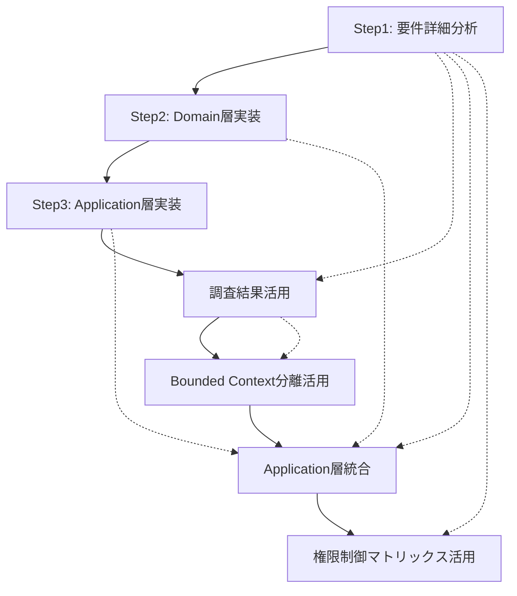

# Phase B1 Step間依存関係マトリックス

## 📊 依存関係概要
- **目的**: セッション跨ぎでのStep継続性確保・取りこぼし防止
- **機能**: 各Stepの前提条件・成果物・引き継ぎ事項明確化
- **活用場面**: セッション断絶後のStep再開時・Phase B1実装全体の理解

## 🔄 Step依存関係図

## 📋 Step別依存関係詳細

### Step1: 要件詳細分析・技術調査
**状態**: ✅ **完了済み**（2025-09-25）

#### 前提条件
- [x] Phase A1-A6実装完了（認証・ユーザー管理完成）
- [x] Clean Architecture 97点品質基盤確立
- [x] TypeConverter基盤・F#↔C#境界最適化完了

#### 成果物（完了済み）
- ✅ `Step01_Requirements_Analysis.md` - 機能仕様書3.1章詳細分析・権限制御マトリックス
- ✅ `Technical_Research_Results.md` - F# Railway-oriented Programming・EF Core技術調査
- ✅ `Design_Review_Results.md` - Clean Architecture整合性レビュー（97点維持確認）
- ✅ `Dependency_Analysis_Results.md` - 実装順序・並列化計画策定
- ✅ `Step01_Integrated_Analysis.md` - 統合分析結果・Step2準備完了確認

#### 次Stepへの引き継ぎ
- **Step2**: F# Railway-oriented Programming実装パターン・ProjectDomainService設計
- **Step3**: IProjectManagementService仕様・Command/Query分離パターン
- **Step4**: Domain層リファクタリング調査結果・Phase C/D成長予測
- **Step5**: EF Core多対多関連最適実装・Repository設計指針
- **Step6**: 権限制御マトリックス（4ロール×4機能）・Blazor Server権限制御

---

### Step2: Domain層実装
**状態**: ✅ **完了済み**（2025-09-29）

#### 前提条件
- ✅ Step1完了: F# Railway-oriented Programming実装パターン確認済み
- ✅ Clean Architecture基盤確認: 97点品質・循環依存ゼロ
- ✅ TDD実践環境確認: Red-Green-Refactorサイクル準備完了

#### 実施内容（完了済み）
1. **Project Aggregate実装完了**
   - パス: `src/UbiquitousLanguageManager.Domain/`
   - ValueObjects: ProjectName・ProjectDescription・ProjectId
   - Entities: Project
   - Smart Constructor: 制約ルール実装

2. **ProjectDomainService実装完了**
   - Railway-oriented Programming完全適用
   - デフォルトドメイン自動作成・原子性保証
   - 失敗時ロールバック実装

3. **TDD Red Phase達成**
   - 32テスト作成・意図的失敗確認
   - ビジネスルール・制約のテストケース設計完了

#### 完了判定基準（2025-09-29達成済み）
- [x] Project Aggregate完全実装
- [x] ProjectDomainService・Railway-oriented Programming適用
- [x] TDD Red Phase達成（32テスト作成）
- [x] Clean Architecture 97点品質維持
- [x] `dotnet build` 成功（0 Warning, 0 Error）

#### Step3への引き継ぎ事項
- **重要**: ProjectDomainService実装完了（Application層統合準備OK）
- **重要**: Railway-oriented Programming実装パターン確立（Result型パイプライン）
- **基盤**: TDD Red Phase完了（Step3でGreen Phase実施）
- **品質**: Clean Architecture 97点維持・0 Warning/0 Error達成

#### 阻害要因・注意点
- ⚠️ **F#関数型パラダイム**: 初学者対応のため詳細コメント必須
- ⚠️ **Railway-oriented Programming**: Result型パイプライン理解必須
- ⚠️ **コンパイル順序**: F#の宣言順序依存に注意

---

### Step3: Application層実装
**状態**: ✅ **完了済み**（2025-09-30）**🏆 満点品質達成**

#### 前提条件
- ✅ Step2完了: Domain層実装・ProjectDomainService完成
- ✅ Railway-oriented Programming基盤確立
- ✅ TDD Red Phase完了（32テスト作成済み）

#### 実施内容（完了済み）
1. **IProjectManagementService実装完了**
   - パス: `src/UbiquitousLanguageManager.Application/ProjectManagement/`
   - Command/Query分離実装
   - 権限制御マトリックス（4ロール×4機能）完全実装

2. **Contracts層Application DTOs実装完了**
   - ApplicationDtos.cs: Command/Query用8クラス
   - ProjectCommandConverters.cs: F#↔C#型変換
   - ProjectQueryConverters.cs: Query型変換・権限制御統合

3. **TDD Green Phase達成**
   - 52テスト100%成功（Domain32+Application20）
   - ⭐⭐⭐⭐⭐ 5/5優秀評価

#### 完了判定基準（2025-09-30達成済み）
- [x] IProjectManagementService完全実装
- [x] 権限制御マトリックス完全実装（4ロール×4機能）
- [x] TDD Green Phase達成（52テスト100%成功）
- [x] 🏆 **仕様準拠度100/100点満点達成**
- [x] `dotnet build` 成功（0 Warning, 0 Error）

#### Step4への引き継ぎ事項
- **重要**: Domain層・Application層実装完了（Infrastructure層未実装）
- **重要**: リファクタリング最適タイミング（影響範囲最小化）
- **基盤**: TDD基盤確立（52テスト100%成功・品質保証体制完成）
- **品質**: 仕様準拠度100点満点・Clean Architecture 97点維持

#### 阻害要因・注意点
- ⚠️ **Step4前提**: Domain層リファクタリングはInfrastructure層実装前が最適
- ⚠️ **影響範囲**: Infrastructure層・Web層実装後のリファクタリングは工数3-5倍増加

---

### Step4: Domain層リファクタリング（**新規追加**）
**状態**: 🔄 **Step3完了後実施予定**（即座実行可能）

#### 前提条件
- ✅ Step3完了: Domain層・Application層実装完了
- ✅ Infrastructure層未実装（影響範囲最小化）
- ✅ TDD基盤確立（52テスト100%成功状態）
- [ ] Domain層リファクタリング調査結果確認
- [ ] GitHub Issue #41確認

#### 実施タスク
1. **Bounded Context別ディレクトリ構造作成**
   - Common/（共通定義: CommonTypes・CommonValueObjects）
   - Authentication/（認証境界文脈: User・Email・Password等）
   - ProjectManagement/（プロジェクト管理境界文脈: Project・ProjectName等）

2. **ファイル分割実装**
   - ValueObjects分割: 354行 → 各境界文脈100-150行
   - Entities分割: 545行 → 各境界文脈100-250行
   - DomainServices分割: 290行 → 各境界文脈100-150行

3. **F#コンパイル順序調整**
   - .fsprojファイル更新
   - Common → Authentication → ProjectManagement順
   - 依存関係確認・循環参照排除

4. **テストコード修正**（15-20分）
   - Domain.Tests 3ファイル修正（ProjectDomainServiceTests.fs等）
   - Application.Tests 1ファイル修正（ProjectManagementServiceTests.fs）
   - module参照調整（`open UbiquitousLanguageManager.Domain.ProjectDomainService`等）
   - `dotnet test`で52テスト100%成功確認

5. **品質保証・テスト検証**
   - 0 Warning/0 Error維持
   - 52テスト100%成功継続
   - namespace変更なし（後方互換性維持）

#### 完了判定基準
- [ ] Bounded Context別ディレクトリ構造完成
- [ ] 全ファイル分割完了（ValueObjects/Entities/DomainServices/Errors）
- [ ] .fsprojコンパイル順序調整完了
- [ ] **テストコード修正完了（4-6ファイル）**
- [ ] `dotnet build` 成功（0 Warning, 0 Error）
- [ ] **`dotnet test` 成功（52テスト100%成功）** ← 最重要確認
- [ ] Clean Architecture 97点品質維持

#### Step5への引き継ぎ事項
- **完成**: Bounded Context明確化されたDomain層構造
- **準備**: Infrastructure層実装準備完了（Repository・EF Core統合基盤）
- **品質**: 0 Warning/0 Error・52テスト100%成功継続
- **将来**: Phase C/D実装時の最適構造確立

#### 阻害要因・注意点
- ❌ **Step3未完了時の実施禁止**: Domain層・Application層未完成時は実施不可
- ⚠️ **F#コンパイル順序**: 宣言順序依存・前方参照不可に注意
- ⚠️ **段階的実装必須**: Common → Authentication → ProjectManagement順厳守
- ⚠️ **テスト確認**: 各フェーズ完了後のビルド・テスト実行必須

---

### Step5: Domain層namespace階層化（**新規追加・GitHub Issue #42**）
**状態**: 🔄 **Step4完了後即座実施**

#### 前提条件
- ✅ Step4完了: Domain層Bounded Context別ディレクトリ分離完了
- ✅ Step3完了: Application層実装完了・サブnamespace使用中
- [ ] GitHub Issue #42確認
- [ ] Application層namespace構造確認（整合性検証）

#### 実施タスク
1. **Domain層namespace変更**（60分）
   - Common層: `UbiquitousLanguageManager.Domain.Common`
   - Authentication層: `UbiquitousLanguageManager.Domain.Authentication`
   - ProjectManagement層: `UbiquitousLanguageManager.Domain.ProjectManagement`
   - .fsproj更新

2. **Application層修正**（30分）
   - ProjectManagementService.fs等open文修正（5-8ファイル）
   - AuthenticationServices.fs等open文修正

3. **Contracts層修正**（20分）
   - TypeConverters.cs等using文修正（3-5ファイル）
   - DTOs.cs等参照修正

4. **Infrastructure層修正**（40分）
   - Repository実装open文修正（10-15ファイル）
   - EF Core Configurations修正

5. **テストコード修正**（30分）
   - Domain.Tests: 3ファイルopen文修正
   - Application.Tests: 2-3ファイルopen文修正
   - Infrastructure.Tests: 1-2ファイルopen文修正

6. **統合ビルド・テスト検証**（30分）
   - `dotnet build`（0 Warning/0 Error確認）
   - `dotnet test`（52テスト100%成功確認）
   - Clean Architecture整合性確認

7. **完了処理・再発防止策（ADR作成）**（40-55分）
   - **ADR_019作成**: namespace設計規約明文化
   - **ADR_010更新**: namespace規約参照追加
   - **関連ドキュメント更新**: Phase_Summary.md等

#### 完了判定基準
- [ ] Domain層サブnamespace導入完了
- [ ] Application層・Contracts層・Infrastructure層open文修正完了
- [ ] **テストコード修正完了（6-8ファイル）**
- [ ] `dotnet build` 成功（0 Warning, 0 Error）
- [ ] **`dotnet test` 成功（52テスト100%成功）** ← 最重要確認
- [ ] Application層との整合性確保完了
- [ ] F#ベストプラクティス準拠確認
- [ ] **ADR_019作成完了（namespace規約明文化）** ← 再発防止

#### Step6への引き継ぎ事項
- **完成**: Domain層サブnamespace階層化完了
- **準備**: Infrastructure層実装準備完了（namespace統一・参照整合性確保）
- **品質**: 0 Warning/0 Error・52テスト100%成功継続
- **整合性**: Application層との完全整合性確保
- **再発防止**: ADR_019作成完了・namespace規約確立

#### 阻害要因・注意点
- ❌ **Step4未完了時の実施禁止**: Bounded Context別ディレクトリ分離未完成時は実施不可
- ⚠️ **全層影響**: Domain層のみならず全層修正必要・影響範囲大
- ⚠️ **SubAgent並列実行**: fsharp-domain + fsharp-application + contracts-bridge + csharp-infrastructure必須
- ⚠️ **テスト確認**: 各フェーズ完了後のビルド・テスト実行必須

---

### Step6: Infrastructure層実装（**旧Step5から繰り下げ**）
**状態**: 🔄 **Step5完了後実施予定**

#### 前提条件
- ✅ Step4完了: Domain層Bounded Context別ディレクトリ分離完了
- ✅ Step5完了: Domain層namespace階層化完了・全層整合性確保
- [ ] 最適化されたDomain層構造確認
- [ ] ProjectDomainService統合方針確認
- [ ] EF Core・Repository設計確認

#### 実施タスク
1. **ProjectRepository実装**
   - パス: `src/UbiquitousLanguageManager.Infrastructure/Repositories/`
   - CRUD操作実装
   - 権限フィルタリング実装
   - Application層統合（IProjectManagementService実装）

2. **EF Core Configurations・マイグレーション**
   - ProjectConfiguration.cs実装
   - DomainConfiguration.cs実装
   - Migration作成・適用

3. **原子性保証実装**
   - BeginTransaction統合
   - デフォルトドメイン同時作成・失敗時ロールバック
   - ProjectDomainService統合

4. **統合テスト実装**
   - WebApplicationFactory統合テスト
   - データベース統合テスト
   - トランザクション動作確認

#### 完了判定基準
- [ ] ProjectRepository完全実装
- [ ] EF Core Configurations・Migration完成
- [ ] 原子性保証動作確認（トランザクション・ロールバック）
- [ ] 統合テスト成功（WebApplicationFactory）
- [ ] `dotnet build` 成功・`dotnet test` 成功

#### Step6への引き継ぎ事項
- **完成**: Infrastructure層完全実装・Repository基盤確立
- **準備**: Web層実装準備完了（Blazor Server・API統合基盤）
- **確認**: 原子性保証動作・権限フィルタリング完成
- **品質**: 統合テスト成功・0 Warning/0 Error維持

#### 阻害要因・注意点
- ❌ **Step4未完了時の実施禁止**: Domain層リファクタリング未完了時は実施不可
- ⚠️ **Domain層統合**: 最適化されたDomain層構造との統合確認必須
- ⚠️ **トランザクション**: 原子性保証・失敗時ロールバック動作確認必須

---

### Step7: Web層実装（**旧Step6から繰り下げ**）
**状態**: 🔄 **Step6完了後実施予定**

#### 前提条件
- ✅ Step6完了: Infrastructure層実装完了
- [ ] Repository基盤動作確認
- [ ] Application層統合動作確認
- [ ] 権限制御マトリックス実装確認

#### 実施タスク
1. **Blazor Serverプロジェクト管理画面実装**
   - Pages/Projects/Index.razor（プロジェクト一覧）
   - Pages/Projects/Create.razor（プロジェクト作成）
   - Pages/Projects/Edit.razor（プロジェクト編集）
   - Pages/Projects/Delete.razor（プロジェクト削除）

2. **権限ベース表示制御実装**
   - 4ロール×4機能マトリックス実装
   - ボタン・メニュー表示制御
   - 権限不足時のエラーハンドリング

3. **SignalR統合・リアルタイム更新**
   - プロジェクト一覧自動更新
   - 他ユーザー操作の即座反映
   - 接続管理・エラーハンドリング

4. **UI/UX最適化**
   - Bootstrap 5スタイル統一
   - レスポンシブデザイン対応
   - ユーザビリティ改善

#### 完了判定基準
- [ ] 4画面完全実装（一覧・作成・編集・削除）
- [ ] 権限ベース表示制御完全実装（4ロール×4機能）
- [ ] SignalR統合・リアルタイム更新動作確認
- [ ] UI設計書完全準拠確認
- [ ] E2Eテスト成功・全機能動作確認

#### Phase B1完了・次Phaseへの引き継ぎ
- **達成**: プロジェクト管理機能完全実装（CRUD・権限制御）
- **達成**: 仕様準拠度100点維持・Clean Architecture 97点維持
- **達成**: Domain層Bounded Context別構造確立（Phase C/D最適基盤）
- **準備**: Phase B2（プロジェクト機能拡張）基盤確立

#### 阻害要因・注意点
- ❌ **Step5未完了時の実施禁止**: Infrastructure層未完成時は実施不可
- ⚠️ **権限制御**: 4ロール×4機能マトリックス完全実装確認必須
- ⚠️ **SignalR**: 接続管理・エラーハンドリング・セキュリティ確認必須

---

## 🚨 セッション跨ぎ重要チェックポイント

### セッション開始時確認事項
1. **前Step完了状況確認**
   - 各Step詳細実装カード確認（Step01_Analysis.md等）
   - 完了判定基準チェック
   - 次Step前提条件確認

2. **現在状況確認**
   - `dotnet build` 状況確認（0 Warning, 0 Error維持）
   - `dotnet test` 状況確認（52テスト100%成功維持）
   - GitHub Issues状況確認（Issue #41等）

3. **作業環境確認**
   - 必要SubAgent確認（fsharp-domain, csharp-infrastructure等）
   - Step1成果物確認（Research/配下5ファイル）
   - Domain層リファクタリング調査結果確認

### 緊急時回避手順
- **Step実施中断必要時**: 現在Step完了まで継続
- **重大問題発生時**: 前Step状態への回復手順実施
- **知識欠損発生時**: Phase_Summary.md・各詳細カード・Serenaメモリ確認

### 品質維持確認項目（各Step共通）
- [ ] ビルド成功維持（0 Warning, 0 Error）
- [ ] テスト成功維持（52テスト100%成功→Phase B1完了時100+テスト）
- [ ] Clean Architecture 97点維持
- [ ] 仕様準拠度100点維持（Step3達成済み）
- [ ] 既存機能回帰なし

---

**マトリックス作成日**: 2025-09-30
**Phase B1開始**: 2025-09-25
**Step構成**: 6 Step（Domain層リファクタリング追加により再構成）
**活用方法**: 各Step開始時の前提確認・完了時の引き継ぎ確認・Phase B1全体理解