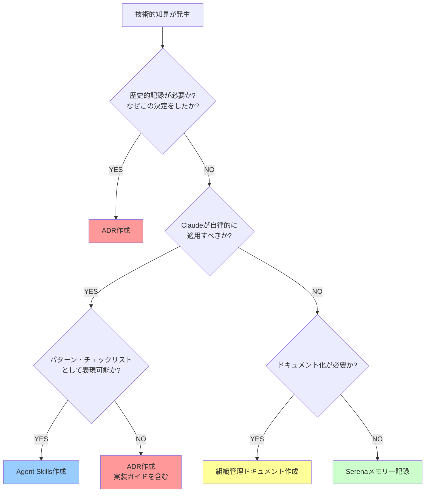

# ADRとAgent Skills判断ガイドライン

**作成日**: 2025-10-26
**目的**: ADRとAgent Skillsの使い分け判断基準を明確化
**対象**: 全Phase・全Step・全技術決定

---

## 1. 目的

このガイドラインは、プロジェクトで発生する技術的知見を**ADR（Architectural Decision Record）**として記録すべきか、**Agent Skills**として実装すべきかを判断するための基準を提供します。

### なぜこのガイドラインが必要か

- **一貫性の確保**: 技術決定の記録方法を統一
- **効率的な知見管理**: 適切な形式で知見を保存・活用
- **将来の混乱防止**: 新メンバー・将来の自分が迷わないための指針
- **プロジェクト成熟度向上**: 知見の体系的な蓄積

---

## 2. 定義

### ADR（Architectural Decision Record）の役割

| 項目 | 内容 |
|-----|------|
| **目的** | 「**なぜ**その技術決定をしたか」を記録 |
| **性質** | 歴史的文書・技術選定の根拠 |
| **内容** | Context（背景）、Decision（決定）、Consequences（結果）、Risks（リスク） |
| **参照タイミング** | 技術選定の振り返り・新メンバーのオンボーディング・将来の技術変更時 |
| **記録対象** | 重要な技術的意思決定・アーキテクチャ選択・プロセス決定 |
| **形式** | Markdown文書（`Doc/07_Decisions/ADR_XXX_*.md`） |

**ADRの本質**: 「過去の意思決定の記録」であり、「なぜこの道を選んだか」を後世に伝える

---

### Agent Skills の役割

| 項目 | 内容 |
|-----|------|
| **目的** | 「**どう**実装すべきか」をガイド |
| **性質** | 実行可能な知見・自律的適用 |
| **内容** | パターン・判断基準・チェックリスト |
| **参照タイミング** | Claudeが自律的に判断して使用（ユーザーの明示的呼び出し不要） |
| **記録対象** | 実装パターン・コーディング規約・自動チェック可能な判断基準 |
| **形式** | SKILL.md + 詳細パターンファイル（`.claude/skills/*/`） |

**Skillsの本質**: 「実行可能な知見」であり、「Claudeが自律的に適用できるパターン」

---

## 3. 判断フロー（30秒チェック）

### 判断の4つの質問

1. **歴史的記録が必要か？**
   → YES: ADR（なぜこの決定をしたかを記録）

2. **Claudeが自律的に適用すべきか？**
   → YES: Skills（実装時に自動適用）

3. **技術選定の根拠か？**
   → YES: ADR（技術選択の背景・理由を記録）

4. **実装パターン・チェックリストか？**
   → YES: Skills（パターンとして自動適用）

---

## 4. 判断基準マトリックス（5W1H比較）

| 観点 | ADR | Agent Skills |
|-----|-----|--------------|
| **What（何を）** | 技術決定・アーキテクチャ選択・プロセス決定 | 実装パターン・判断基準・チェックリスト |
| **Why（なぜ）** | 意思決定の根拠を記録・将来の参照 | 実装品質向上・自動適用・効率化 |
| **When（いつ）** | 重要な技術選定時・アーキテクチャ変更時 | コード実装時・エラー発生時・品質チェック時 |
| **Who（誰が）** | 人間（プロジェクトメンバー） | Claude Code（自律的判断） |
| **Where（どこで）** | `Doc/07_Decisions/` | `.claude/skills/` |
| **How（どのように）** | Context-Decision-Consequences形式 | SKILL.md + パターンファイル形式 |

---

## 5. ADR適用例

### 例1: ADR_016（プロセス遵守違反防止策）

**背景**: Claude Codeが手順違反・虚偽報告を犯した重大問題

**決定**: プロセス遵守の絶対化・必須チェックプロセス確立

**理由**:
- ❌ Skillsに不適: チェックリストはあるが、「なぜこのプロセスが必要か」の歴史的記録が重要
- ✅ ADRに適合: 問題発生の経緯・決定の根拠・結果を記録

**判断ポイント**: 「過去の失敗から学んだ教訓」は歴史的文書として残すべき

---

### 例2: ADR_020（テストアーキテクチャ決定）

**背景**: テストプロジェクト構造の問題点（混在・非効率）

**決定**: レイヤー別×テストタイプ別分離方式

**理由**:
- ❌ Skillsに不適: 「どう実装するか」より「なぜこの構造を選んだか」が重要
- ✅ ADRに適合: ベストプラクティスとの比較・評価・決定根拠を記録

**判断ポイント**: 「アーキテクチャ選択の根拠」は将来の変更時に参照する歴史的文書

---

### 例3: ADR_005（PostgreSQL Docker Container採用）

**背景**: データベース環境の選定

**決定**: PostgreSQL 16をDocker Containerで運用

**理由**:
- ❌ Skillsに不適: 技術選定の「なぜ」が重要
- ✅ ADRに適合: 選定理由・代替案との比較・リスク評価を記録

**判断ポイント**: 「技術スタック選定」は意思決定の根拠として残すべき

---

## 6. Agent Skills適用例

### 例1: fsharp-csharp-bridge

**内容**: F#↔C#型変換パターン（Result/Option/DU/Record）

**理由**:
- ✅ Skillsに適合: 実装パターンとして自律適用可能
- ✅ パターンとして表現可能: 4つの変換パターンを体系化
- ✅ Claude自律判断: 型変換エラー発生時に自動参照

**判断ポイント**: 「繰り返し使う実装パターン」はSkillsとして自動適用

---

### 例2: clean-architecture-guardian

**内容**: Clean Architecture準拠性チェック（レイヤー分離・namespace階層等）

**理由**:
- ✅ Skillsに適合: チェックリストとして自律適用可能
- ✅ 自動判定可能: レイヤー分離・namespace規約を自動チェック
- ✅ Claude自律判断: 新規実装時・リファクタリング時に自動参照

**判断ポイント**: 「品質チェック基準」はSkillsとして自動監視

---

### 例3: playwright-e2e-patterns

**内容**: Playwright MCP活用によるE2Eテスト作成パターン

**理由**:
- ✅ Skillsに適合: E2Eテスト実装パターンとして自律適用可能
- ✅ パターンとして表現可能: data-testid設計・SignalR対応パターン
- ✅ Claude自律判断: E2Eテスト実装時に自動参照

**判断ポイント**: 「テスト実装パターン」はSkillsとして自動適用

---

## 7. ADR→Skills移行事例

### 事例1: ADR_019（namespace設計規約）→ clean-architecture-guardian

**移行前（ADR_019）**:
- namespace階層化ルールをADRとして記録
- 内容: なぜこのnamespace設計を選んだか + どう設計するか

**移行後（clean-architecture-guardian）**:
- 「どう設計するか」の部分をSkills化
- ADR_019は`backup/`に移動（歴史的記録として保持）

**移行理由**:
- ✅ 実装パターンとして自律適用可能
- ✅ namespace設計時に自動チェック可能
- ✅ ADRの「決定根拠」部分は不要（実装ルールが重要）

**重要な考察**:
- ADRとSkillsは**排他的ではない**
- 「決定根拠（なぜ）」と「実装ルール（どう）」を**分離**することが重要
- ADR_019の場合、「どう」の部分が明確だったためSkills化
- 将来的に「なぜこのnamespace設計にしたか」を振り返る必要があればADR復活も検討

---

### 事例2: ADR_010（実装規約）→ clean-architecture-guardian

**移行前（ADR_010）**:
- Clean Architecture実装規約をADRとして記録
- 内容: レイヤー分離原則・依存関係制約

**移行後（clean-architecture-guardian）**:
- レイヤー分離・依存関係チェックをSkills化
- ADR_010は`backup/`に移動

**移行理由**:
- ✅ チェックリストとして自動適用可能
- ✅ 新規実装時・リファクタリング時に自動監視
- ✅ Phase B1で97点品質達成した知見の自動維持

---

## 8. 迷った時のチェックリスト

### ADRかSkillsか判断に迷った場合

以下の質問に答えてください（YESが多い方を選択）：

#### ADRチェック（5問）

- [ ] この決定は**1年後に「なぜこの決定をしたか」を知る必要**がありますか？
- [ ] この決定は**複数の選択肢から選んだ**ものですか？（代替案との比較が必要）
- [ ] この決定は**プロジェクト全体のアーキテクチャに影響**しますか？
- [ ] この決定は**リスク・トレードオフを含む**ものですか？
- [ ] この決定は**新メンバーのオンボーディング時に説明が必要**ですか？

**3問以上YES → ADR作成推奨**

---

#### Skillsチェック（5問）

- [ ] この知見は**繰り返し使う実装パターン**ですか？
- [ ] この知見は**自動チェック・自動適用可能**ですか？
- [ ] この知見は**Claudeが状況に応じて自律判断すべき**ものですか？
- [ ] この知見は**コード品質向上に直結する**ものですか？
- [ ] この知見は**パターン・チェックリストとして表現可能**ですか？

**3問以上YES → Skills作成推奨**

---

### 両方に該当する場合（ハイブリッドアプローチ）

**アプローチ**: ADR（決定根拠） + Skills（実装パターン）の併用

**例**:
- **ADR**: なぜこのアーキテクチャを選んだか（背景・選定理由・リスク）
- **Skills**: どう実装するか（パターン・チェックリスト・自動適用）

**具体例**:
- ADR_020（テストアーキテクチャ決定）: なぜレイヤー×テストタイプ分離にしたか
- 将来的なSkills: テストプロジェクト作成時の自動チェック（命名規則・参照関係）

---

### どちらにも該当しない場合

**選択肢**:
1. **組織管理ドキュメント**: `Doc/08_Organization/Rules/` 配下に記録
2. **Serenaメモリー**: セッション開始時に参照すべき情報として記録
3. **一時的メモ**: `Doc/04_Daily/` 配下のセッション記録として残す

---

## 9. 関連ドキュメント

### ADR関連
- **ADRディレクトリ**: `Doc/07_Decisions/`
- **ADRバックアップ**: `Doc/07_Decisions/backup/README.md`
- **ADR作成テンプレート**: （Phase B完了後に作成予定）

### Agent Skills関連
- **Skillsディレクトリ**: `.claude/skills/`
- **Skills README**: `.claude/skills/README.md`
- **効果測定**: `Doc/08_Organization/Active/AgentSkills_Phase1_効果測定.md`

### Serenaメモリー関連
- **development_guidelines**: ADR vs Skills判断基準（30秒チェック）
- **project_overview**: Agent Skills Phase 1導入記録

### プロジェクト指示書
- **CLAUDE.md**: Agent Skillsセクションに判断ガイドライン参照

---

## 10. 更新履歴

| 日付 | 内容 | 更新者 |
|------|------|--------|
| 2025-10-26 | 初版作成 | Claude Code |

---

**最終更新**: 2025-10-26
