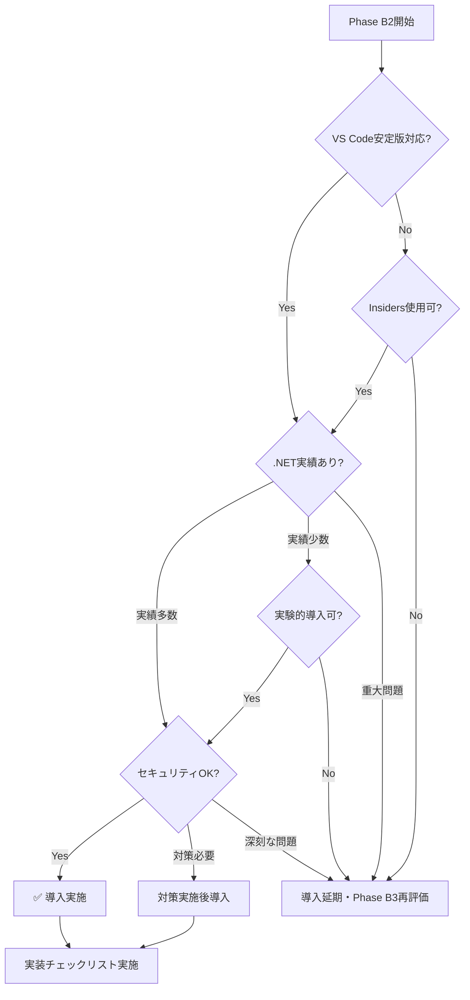

# Phase B2 Playwright Agents導入計画

**策定日**: 2025-10-11
**対象Phase**: Phase B2（UserProjects多対多関連・権限拡張）
**導入方針**: Option 2+α（Phase B2本格導入+事前調査オプション）
**技術評価**: 7/10点（条件付き推奨）

---

## 📋 導入スコープ

### 対象機能

**Phase B2実装機能**:
- UserProjects多対多関連実装
- DomainApprover/GeneralUser権限実装（10パターン追加）
- プロジェクトメンバー管理UI実装

**E2Eテスト対象**:
- プロジェクトメンバー追加・削除シナリオ
- 権限別アクセス制御検証
- UserProjects関連のUIフロー

### 導入範囲

**Phase B2での実施内容**:
```yaml
1. Playwright Agents統合（+1-1.5時間）:
   - Planner: UserProjects機能のテスト計画生成
   - Generator: Playwrightテストコード生成
   - Healer: 自動修復機能設定

2. E2Eテスト作成:
   - プロジェクトメンバー管理フロー
   - 権限別アクセステスト
   - UI変更時の自動修復検証

3. 効果測定・記録:
   - メンテナンス時間測定
   - 修復成功率記録
   - ADR作成（技術決定記録）
```

---

## 🎯 Phase B2開始時の事前確認

### 必須確認事項（Phase B2開始時実施）

#### 1. VS Code安定版対応状況確認

**確認内容**:
```markdown
- [ ] VS Code安定版v1.105+リリース確認
  - 確認方法: https://code.visualstudio.com/updates
  - リリースノート確認: Playwright Agents正式サポート記載確認
- [ ] Playwright Agents機能の安定版移行確認
  - 確認方法: https://playwright.dev/docs/release-notes
- [ ] Insiders版使用の必要性判断
  - 安定版未対応の場合: Insiders版使用判断
  - チーム全体での統一方針決定
```

**判断基準**:
- ✅ 安定版対応済み → 導入推奨度UP（8/10点）
- ⚠️ Insiders版必須 → 導入推奨度維持（7/10点）・実験的導入

#### 2. .NET環境実績確認

**確認内容**:
```markdown
- [ ] 公式ドキュメント確認
  - Playwright for .NETドキュメント: https://playwright.dev/dotnet/
  - Agents機能の.NET対応明記確認
- [ ] コミュニティ事例検索
  - GitHub: "Playwright Agents" + ".NET" or "Blazor Server"
  - Stack Overflow・Reddit・Dev.to等での事例確認
- [ ] GitHub Issues/Discussions確認
  - 既知の問題・制限事項確認
  - .NET特有の問題報告確認
```

**判断基準**:
- ✅ 実績多数・ドキュメント充実 → 導入推奨度UP（8-9/10点）
- ⚠️ 実績少数・ドキュメント不足 → 導入推奨度維持（7/10点）・慎重な実験
- ❌ 重大な問題報告あり → 導入延期・Phase B3以降に再評価

#### 3. セキュリティ・安定性評価

**確認内容**:
```markdown
- [ ] セキュリティレビュー実施
  - AI Agentのデータアクセス範囲確認
  - クレデンシャル管理方針決定
  - ネットワーク通信の監視方法確認
- [ ] 安定性評価
  - バグレポート確認（GitHub Issues）
  - クラッシュ・エラー報告確認
  - パフォーマンス問題確認
```

**判断基準**:
- ✅ セキュリティリスク管理可能 → 導入推奨度維持
- ⚠️ 懸念あるが対策可能 → 対策実施後導入
- ❌ 深刻なセキュリティ問題 → 導入延期

### 導入可否判断フローチャート



---

## 🛠️ 実装チェックリスト

### Phase 1: 環境セットアップ（15分）

```markdown
- [ ] 前提条件確認
  - [ ] .NET SDK 8.0+ インストール確認
  - [ ] Node.js v18+ インストール確認
  - [ ] VS Code最新版インストール（v1.105+）

- [ ] Playwright Agents初期化
  - [ ] `npx playwright init-agents --loop=vscode` 実行
  - [ ] Agent定義ファイル生成確認（.playwright/agents/）
  - [ ] VS Code拡張機能確認（Playwright Test for VS Code）

- [ ] E2E.Testsプロジェクト準備
  - [ ] tests/UbiquitousLanguageManager.E2E.Tests/ 確認
  - [ ] Playwright NuGetパッケージインストール
  - [ ] テスト実行環境確認
```

### Phase 2: Planner実行（20分）

**目的**: UserProjects機能のテスト計画生成

```markdown
- [ ] Planner Agent起動
  - [ ] VS Code Command Palette: "Playwright: Run Planner Agent"
  - [ ] 対象URL指定: https://localhost:5001/projects

- [ ] テスト計画生成
  - [ ] プロジェクトメンバー追加フロー探索
  - [ ] 権限別アクセス制御探索
  - [ ] UserProjects関連UI探索

- [ ] Markdown計画レビュー
  - [ ] 生成されたテスト計画確認
  - [ ] シナリオ妥当性検証
  - [ ] 不足シナリオの追記

- [ ] 計画確定
  - [ ] `.playwright/agents/test-plan.md` 保存
  - [ ] git commit（記録保持）
```

### Phase 3: Generator実行（20分）

**目的**: Playwrightテストコード生成

```markdown
- [ ] Generator Agent起動
  - [ ] VS Code Command Palette: "Playwright: Run Generator Agent"
  - [ ] 入力: test-plan.md

- [ ] C#テストコード生成
  - [ ] 言語設定: C#（.NET）
  - [ ] 出力先: tests/UbiquitousLanguageManager.E2E.Tests/

- [ ] 生成コードレビュー
  - [ ] Blazor Server固有の対応確認
  - [ ] F#↔C#型変換の正確性確認
  - [ ] 認証・権限制御の実装確認

- [ ] 手動調整（必要に応じて）
  - [ ] セレクタの最適化
  - [ ] Wait戦略の調整（動的wait推奨）
  - [ ] テストデータの整備

- [ ] ビルド確認
  - [ ] `dotnet build tests/UbiquitousLanguageManager.E2E.Tests`
  - [ ] 0 Warning/0 Error 確認
```

### Phase 4: Healer設定（15分）

**目的**: 自動修復機能設定

```markdown
- [ ] Healer Agent設定
  - [ ] `.playwright/agents/healer.config.json` 作成
  - [ ] 試行回数設定: 3回（推奨）
  - [ ] タイムアウト設定: 60秒/修正（調整可）

- [ ] デバッグモード有効化
  - [ ] Playwright設定: `debug: true`
  - [ ] コンソールログ出力設定
  - [ ] ネットワークリクエスト記録設定

- [ ] 修復ルール設定
  - [ ] セレクタ変更の自動検出設定
  - [ ] DOM構造変更の対応設定
  - [ ] スキップ条件の設定

- [ ] セキュリティ設定
  - [ ] テスト専用アカウント作成
  - [ ] 環境変数によるクレデンシャル管理
  - [ ] ネットワーク通信監視設定
```

### Phase 5: 実行・検証（20分）

```markdown
- [ ] 初回テスト実行
  - [ ] `dotnet test tests/UbiquitousLanguageManager.E2E.Tests`
  - [ ] 全テスト実行結果記録
  - [ ] 失敗テスト特定

- [ ] Healer動作確認
  - [ ] 失敗テストに対するHealer起動確認
  - [ ] 修復プロセスの観察
  - [ ] 修復成功・失敗の記録

- [ ] UI変更シミュレーション
  - [ ] 意図的にセレクタ変更
  - [ ] Healer自動修復検証
  - [ ] 修復時間・成功率測定

- [ ] 結果分析
  - [ ] 修復成功率計算
  - [ ] 修復時間の記録
  - [ ] 問題パターンの抽出
```

### Phase 6: 効果測定・記録（10分）

```markdown
- [ ] 効果測定
  - [ ] メンテナンス時間記録（修復前 vs 修復後）
  - [ ] 修復成功率記録（成功数/全失敗数）
  - [ ] 手動介入回数記録

- [ ] ADR作成
  - [ ] ADR_0XX: Playwright Agents導入決定
  - [ ] 技術評価・導入判断理由記録
  - [ ] 効果測定結果記録
  - [ ] 継続使用・改善方針記録

- [ ] ドキュメント更新
  - [ ] README.md: E2Eテスト実行手順追記
  - [ ] テストアーキテクチャ設計書更新
  - [ ] Phase B2完了報告に実績記載

- [ ] git commit
  - [ ] E2Eテスト一式コミット
  - [ ] ADR・ドキュメントコミット
  - [ ] コミットメッセージ: "feat(e2e): Playwright Agents導入"
```

---

## 📊 効果測定指標

### 定量指標

| 指標 | 測定方法 | 目標値 |
|------|---------|--------|
| **修復成功率** | (修復成功数 / 全失敗数) × 100 | 80%以上 |
| **メンテナンス時間削減率** | (従来時間 - 現時間) / 従来時間 × 100 | 50%以上 |
| **手動介入率** | (手動修正数 / 全失敗数) × 100 | 20%以下 |
| **修復時間** | Healer実行開始〜完了 | 2分以内/ケース |
| **テスト実行時間** | 全E2Eテスト実行時間 | 10分以内 |

### 定性指標

```markdown
- [ ] 開発者体験の向上
  - テストメンテナンスの負担軽減実感
  - UI変更時の安心感向上

- [ ] チーム内の評価
  - AI駆動テストへの理解促進
  - 継続使用の合意形成

- [ ] 技術的学習
  - .NET+Blazor Server実績構築
  - AI駆動開発手法の習得
  - コミュニティへの知見還元可能性
```

---

## ⚠️ リスク管理

### 想定リスクと対策

#### リスク1: .NET環境での未知の問題

**発生確率**: 中
**影響度**: 高

**対策**:
```markdown
事前対策:
  - 小規模テストケースでの実証実験
  - 問題発生時の即座エスカレーション
  - 代替手法の準備（従来E2E手法）

発生時対応:
  - GitHub Issueへの報告・コミュニティ確認
  - 一時的なロールバック
  - Phase B3以降での再評価
```

#### リスク2: Healer修復失敗率が高い

**発生確率**: 中
**影響度**: 中

**対策**:
```markdown
事前対策:
  - セレクタの最適化（data-testid使用推奨）
  - Wait戦略の見直し（動的wait活用）
  - テストコード品質の向上

発生時対応:
  - 失敗パターンの分析
  - 修復ルールの調整
  - 人的介入ガイドラインの確立
```

#### リスク3: パフォーマンス問題

**発生確率**: 低
**影響度**: 中

**対策**:
```markdown
事前対策:
  - タイムアウト設定の最適化
  - 並列実行の検討
  - CI/CDパイプライン設計の調整

発生時対応:
  - 修復対象の選別（重要テストのみ）
  - ハードウェアリソースの増強
  - バッチ実行の検討
```

### ロールバック計画

**ロールバック判断基準**:
```markdown
以下のいずれかに該当する場合、Playwright Agents使用を一時停止:
- [ ] 修復成功率が50%を下回る
- [ ] 重大なセキュリティ問題が発覚
- [ ] 致命的なバグ・クラッシュが頻発
- [ ] チーム内で継続使用の合意が得られない
```

**ロールバック手順**:
```markdown
1. Playwright Agents無効化
   - [ ] Healer設定削除
   - [ ] Planner/Generator生成コードの凍結

2. 従来E2E手法への切り戻し
   - [ ] 手動テストコード作成
   - [ ] Playwrightのみの使用（Agents非使用）

3. 原因分析・再評価
   - [ ] 問題原因の特定
   - [ ] Phase B3以降での再導入判断
```

---

## 📚 参考資料

### 必読ドキュメント

- **技術評価レポート**: `Doc/08_Organization/Active/Phase_B-F1/Research/Playwright_Agents_評価レポート.md`
  - 詳細な技術評価・制限事項・推奨事項
- **Playwright公式ドキュメント**: https://playwright.dev/docs/test-agents
  - Agents機能の公式ガイド
- **Playwright for .NET**: https://playwright.dev/dotnet/
  - .NET環境での使用方法

### コミュニティ・事例

- Ministry of Testing: https://www.ministryoftesting.com/articles/creating-self-healing-automated-tests-with-ai-and-playwright
- DEV Community: https://dev.to/playwright/playwright-agents-planner-generator-and-healer-in-action-5ajh
- Bug0 Blog: https://bug0.com/blog/playwright-test-agents

---

## 🔄 継続改善計画

### Phase B3以降での改善

**Phase B3（機能拡張時）**:
```markdown
- [ ] Phase B2実績の振り返り
- [ ] 修復パターンの分析・最適化
- [ ] セレクタ戦略の改善
- [ ] チーム内ベストプラクティス確立
```

**Phase B4-B5（UI最適化時）**:
```markdown
- [ ] UI大規模変更時のHealer効果検証
- [ ] 修復ルールの高度化
- [ ] 自動修復範囲の拡大
- [ ] ADR更新・知見の永続化
```

### コミュニティ貢献

```markdown
Phase B完了後（検討）:
  - [ ] .NET+Blazor Server実績の記事執筆
  - [ ] GitHub Issuesへのフィードバック
  - [ ] コミュニティイベントでの発表
  - [ ] ベストプラクティスの共有
```

---

**策定者**: Claude Code
**承認**: プロジェクトオーナー
**次回更新**: Phase B2開始時（最新状況反映）
**関連文書**:
- `Doc/08_Organization/Active/Phase_B-F1/Research/Playwright_Agents_評価レポート.md`
- `Doc/08_Organization/Active/Phase_B-F1/Phase_Summary.md`
- Serenaメモリー: `project_overview.md`
