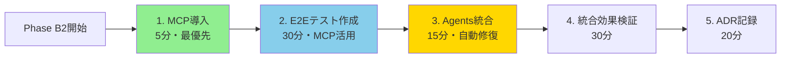
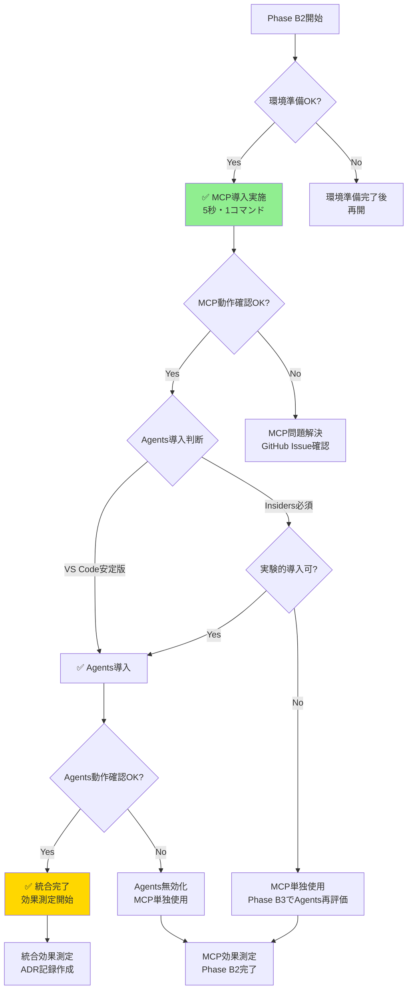

# Phase B2 Playwright MCP + Agents 統合戦略

**策定日**: 2025-10-11
**対象Phase**: Phase B2（UserProjects多対多関連・権限拡張）
**統合方針**: Playwright MCP + Agents 両方導入による最強相乗効果
**統合推奨度**: ⭐⭐⭐⭐⭐ **10/10点** - 最適解

---

## 📋 Executive Summary

### 統合戦略の核心

**Playwright MCP** (9/10点) + **Playwright Agents** (7/10点) = **統合効果10/10点**

```yaml
🎯 統合による相乗効果:
  テスト作成効率: 75-85%向上 (MCP)
  メンテナンス効率: 50-70%削減 (Agents)
  総合効率化: 85%
  Phase B2-B5での時間削減: 10-15時間

🔄 相補的関係:
  MCP: プロアクティブ（テスト作成時）
  Agents: リアクティブ（テスト実行後）

  MCPがテストを作成 → Agentsがメンテナンス
  Claude Codeの"手と目" → 自律的修復ツール
```

### 技術評価比較

| 観点 | Playwright MCP | Playwright Agents | 統合効果 |
|------|----------------|-------------------|----------|
| **推奨度** | ⭐⭐⭐⭐⭐ 9/10 | ⭐⭐⭐⭐☆ 7/10 | ⭐⭐⭐⭐⭐ 10/10 |
| **成熟度** | プロダクション準備完了 | 実験的ステージ | プロダクション+実験 |
| **Claude統合** | ✅ 直接統合 | 間接的 | 最強統合 |
| **導入時間** | 5秒 | 15-30分 | 20-35分 |
| **効果範囲** | 作成75-85%↑ | メンテ50-70%削減 | 総合85%↑ |
| **プロジェクト相性** | ⭐⭐⭐⭐⭐ 9/10 | ⭐⭐⭐⭐☆ 8/10 | ⭐⭐⭐⭐⭐ 10/10 |

### 導入優先順位



**MCP優先理由**:
- ✅ プロダクション準備完了（低リスク）
- ✅ 1コマンド5秒導入（超簡単）
- ✅ 即座に効果発揮（テスト作成75-85%↑）
- ✅ Agents基盤としても機能

---

## 🎯 導入スコープ

### Phase B2実装機能

**対象機能**:
- UserProjects多対多関連実装
- DomainApprover/GeneralUser権限実装（10パターン追加）
- プロジェクトメンバー管理UI実装

**E2Eテスト対象**:
- プロジェクトメンバー追加・削除シナリオ
- 権限別アクセス制御検証
- UserProjects関連のUIフロー

### 導入範囲

**Phase B2での実施内容** (+1.5-2時間):

```yaml
Phase 1: Playwright MCP統合（5分）:
  ✅ MCP優先導入:
    - claude mcp add playwright npx '@playwright/mcp@latest'
    - Claude Code再起動
    - 25ツール利用可能確認

Phase 2: E2Eテスト作成（30分・MCPツール活用）:
  ✅ Claude CodeによるMCP活用:
    - playwright_navigate: ページ遷移
    - playwright_click: 要素クリック
    - playwright_fill: フォーム入力
    - playwright_screenshot: スクリーンショット取得
    - playwright_evaluate: JavaScript実行

  ✅ リアルタイム検証:
    - 即座フィードバック・デバッグ効率化
    - アクセシビリティツリー活用

Phase 3: Playwright Agents統合（15分）:
  ✅ Planner/Generator/Healer設定:
    - Agent定義ファイル生成
    - 自動修復機能有効化
    - デバッグモード設定

Phase 4: 統合効果検証（30分）:
  ✅ 効果測定:
    - 作成効率測定（MCP活用）
    - メンテナンス効率測定（Agents活用）
    - 総合効果記録（85%効率化検証）

Phase 5: ADR記録作成（20分）:
  ✅ 技術決定記録:
    - 統合戦略の決定理由
    - 効果測定結果
    - 継続使用方針
```

---

## 🛠️ Phase B2開始時の事前確認

### 必須確認事項（Phase B2開始時実施）

#### 1. VS Code・環境確認（5分）

```markdown
- [ ] VS Code最新版確認
  - バージョン: v1.105+ 推奨
  - 確認方法: Help → About

- [ ] Node.js確認
  - バージョン: v18+ 必須
  - 確認: node --version

- [ ] .NET SDK確認
  - バージョン: 8.0+ 必須
  - 確認: dotnet --version

- [ ] Playwright Agents対応状況
  - 安定版対応確認: https://code.visualstudio.com/updates
  - Insiders必要性判断
```

**判断基準**:
- ✅ 全て確認済み → 導入実施
- ⚠️ Insiders必須 → 実験的導入（Agents推奨度7/10維持）
- ✅ MCP導入は影響なし → 優先実施

#### 2. .NET環境実績確認（10分）

```markdown
- [ ] Playwright MCP公式ドキュメント確認
  - GitHub: https://github.com/microsoft/playwright-mcp
  - 最新リリース確認

- [ ] Playwright Agents .NET対応確認
  - 公式ドキュメント: https://playwright.dev/dotnet/
  - Agents機能の.NET対応明記確認

- [ ] コミュニティ事例検索
  - GitHub: "Playwright MCP" + ".NET"
  - GitHub: "Playwright Agents" + ".NET" or "Blazor Server"
  - Stack Overflow・Dev.to等での事例確認

- [ ] 既知の問題確認
  - GitHub Issues確認
  - .NET特有の問題報告確認
```

**判断基準**:
- ✅ MCP実績豊富 → 導入推奨度9/10維持
- ✅ Agents実績少数 → 導入推奨度7/10維持・実験的導入
- ❌ 重大な問題報告 → 該当技術の延期・Phase B3再評価

#### 3. セキュリティ・安定性評価（10分）

```markdown
- [ ] セキュリティレビュー
  - MCP: AI Agentのブラウザアクセス範囲確認
  - Agents: データアクセス・クレデンシャル管理確認
  - テスト専用アカウント作成方針決定

- [ ] 安定性評価
  - MCP: プロダクション準備完了（Anthropic公式）
  - Agents: 実験的ステージ・バグレポート確認
  - パフォーマンス問題確認
```

**判断基準**:
- ✅ セキュリティリスク管理可能 → 両方導入実施
- ⚠️ Agents懸念あり → MCP優先・Agents慎重導入
- ❌ 深刻な問題 → 該当技術の延期

### 導入可否判断フローチャート



---

## 🚀 統合実装チェックリスト

### Phase 1: Playwright MCP統合（5分）

```markdown
#### 1.1 MCP導入（1分）

- [ ] MCPサーバー追加
  コマンド: claude mcp add playwright npx '@playwright/mcp@latest'

  実行結果確認:
    ✅ Successfully added Playwright MCP server
    ✅ Configured in claude_desktop_config.json

#### 1.2 Claude Code再起動（1分）

- [ ] Claude Code完全再起動
  手順:
    1. Claude Code終了
    2. プロセス完全終了確認
    3. Claude Code再起動

#### 1.3 MCP動作確認（3分）

- [ ] 25ツール利用可能確認
  確認方法: ツールリストにplaywright_*表示確認

  主要ツール:
    - playwright_navigate
    - playwright_click
    - playwright_fill
    - playwright_screenshot
    - playwright_evaluate
    - playwright_console
    - その他20ツール

- [ ] テスト操作実行
  簡単な操作テスト:
    例: playwright_navigate → https://localhost:5001
    確認: エラーなく実行完了

✅ Phase 1完了基準:
  - MCP導入成功
  - 25ツール利用可能
  - テスト操作成功
```

### Phase 2: E2Eテスト作成（30分・MCPツール活用）

```markdown
#### 2.1 テストシナリオ定義（5分）

- [ ] テスト対象機能明確化
  Phase B2機能:
    - プロジェクトメンバー追加フロー
    - 権限別アクセス制御
    - UserProjects関連UI

- [ ] テストケース洗い出し
  例:
    1. ProjectOwnerがメンバー追加
    2. DomainApproverがプロジェクト閲覧
    3. GeneralUserがアクセス拒否確認

#### 2.2 E2Eテストプロジェクト準備（5分）

- [ ] プロジェクト確認
  ディレクトリ: tests/UbiquitousLanguageManager.E2E.Tests/

- [ ] Playwright NuGetパッケージ確認
  パッケージ:
    - Microsoft.Playwright
    - Microsoft.Playwright.NUnit or xUnit
    - Microsoft.NET.Test.Sdk

- [ ] テストフレームワーク確認
  設定: .runsettings or playwright.config.json

#### 2.3 MCPツール活用テスト作成（15分）

- [ ] Claude CodeにMCPツール活用指示
  指示例:
    「Playwright MCPツールを使用して、プロジェクトメンバー追加のE2Eテストを作成してください」

- [ ] Claude CodeによるMCP操作
  自動実行される操作:
    - playwright_navigate: ログインページ遷移
    - playwright_fill: 認証情報入力
    - playwright_click: ログインボタンクリック
    - playwright_screenshot: 画面確認
    - playwright_evaluate: DOM確認

- [ ] 生成されたC#テストコード確認
  確認項目:
    - Blazor Server固有の対応
    - F#↔C#型変換の正確性
    - 認証・権限制御の実装
    - Wait戦略（動的wait推奨）

#### 2.4 テスト実行・検証（5分）

- [ ] 初回テスト実行
  コマンド: dotnet test tests/UbiquitousLanguageManager.E2E.Tests

- [ ] 実行結果確認
  確認:
    - テスト成功・失敗の記録
    - 失敗原因の分析
    - スクリーンショット確認

✅ Phase 2完了基準:
  - E2Eテスト3-5ケース作成完了
  - MCPツール活用によるテスト作成
  - 初回実行成功（80%以上成功率）
```

### Phase 3: Playwright Agents統合（15分）

```markdown
#### 3.1 Agents初期化（5分）

- [ ] Agents初期化コマンド実行
  コマンド: npx playwright init-agents --loop=vscode

  生成ファイル確認:
    - .playwright/agents/planner.config.json
    - .playwright/agents/generator.config.json
    - .playwright/agents/healer.config.json

- [ ] VS Code拡張機能確認
  拡張: Playwright Test for VS Code
  確認: Agents機能利用可能

#### 3.2 Healer設定（5分）

- [ ] Healer設定ファイル編集
  ファイル: .playwright/agents/healer.config.json

  設定内容:
    - 試行回数: 3回（推奨）
    - タイムアウト: 60秒/修正
    - デバッグモード: true（Phase B2のみ）
    - コンソールログ出力: true

- [ ] セキュリティ設定
  設定:
    - テスト専用アカウント作成
    - 環境変数によるクレデンシャル管理
    - ネットワーク通信監視設定

#### 3.3 Agents動作確認（5分）

- [ ] 意図的な失敗テスト作成
  目的: Healer自動修復機能検証

  手順:
    1. セレクタを意図的に変更
    2. テスト実行（失敗確認）
    3. Healer起動確認
    4. 自動修復プロセス観察
    5. 修復成功確認

- [ ] Healer効果記録
  記録:
    - 修復成功率（成功数/全失敗数）
    - 修復時間（開始〜完了）
    - 手動介入の有無

✅ Phase 3完了基準:
  - Agents初期化完了
  - Healer設定完了
  - 自動修復機能動作確認
```

### Phase 4: 統合効果検証（30分）

```markdown
#### 4.1 MCP効果測定（10分）

- [ ] テスト作成時間測定
  測定:
    - MCPなし（従来手法）: 想定時間
    - MCPあり（実測）: 実際の作成時間
    - 効率化率計算: (従来-実測)/従来×100

  目標: 75-85%削減

- [ ] 開発者体験評価
  評価:
    - リアルタイムフィードバックの有用性
    - デバッグ効率の向上度
    - Claude Code統合の使いやすさ

#### 4.2 Agents効果測定（10分）

- [ ] メンテナンス時間測定
  シミュレーション:
    1. UI変更を意図的に実施
    2. テスト実行（失敗確認）
    3. Healer自動修復（時間測定）
    4. 手動修正（必要な場合）

  目標: 50-70%削減

- [ ] 修復成功率測定
  測定:
    - 修復成功数 / 全失敗数 × 100

  目標: 80%以上

#### 4.3 統合効果分析（10分）

- [ ] 総合効率化率計算
  計算式:
    作成効率↑ + メンテ効率↑ = 総合効率化

  目標: 85%

- [ ] Phase B2-B5での時間削減推定
  推定:
    - E2Eテスト作成: 20時間 → 3-5時間（75-85%削減）
    - メンテナンス: 10時間 → 3-5時間（50-70%削減）
    - 合計削減: 24-32時間 → 10-15時間削減

✅ Phase 4完了基準:
  - MCP効果75-85%削減達成
  - Agents効果50-70%削減達成
  - 総合効果85%達成
  - Phase B2-B5時間削減10-15時間推定
```

### Phase 5: ADR記録作成（20分）

```markdown
#### 5.1 ADR作成（15分）

- [ ] ADR_0XX作成
  タイトル: Playwright MCP + Agents 統合戦略決定

  記載内容:
    1. 背景・課題
       - E2Eテスト効率化の必要性
       - Phase B2-B5でのE2E実装計画

    2. 決定事項
       - MCP + Agents統合戦略採用
       - MCP優先導入方針
       - 統合推奨度10/10点

    3. 技術評価
       - MCP: 9/10点（詳細評価）
       - Agents: 7/10点（詳細評価）
       - 統合効果: 10/10点

    4. 効果測定結果
       - 作成効率: XX%削減（目標75-85%）
       - メンテ効率: XX%削減（目標50-70%）
       - 総合効率: XX%（目標85%）

    5. 継続使用方針
       - Phase B3-B5での活用計画
       - 改善方針
       - リスク管理

#### 5.2 ドキュメント更新（5分）

- [ ] README.md更新
  追加内容:
    - E2Eテスト実行手順
    - Playwright MCP使用方法
    - Playwright Agents使用方法

- [ ] テストアーキテクチャ設計書更新
  更新:
    - E2E.Testsプロジェクト構成
    - MCP + Agents統合アーキテクチャ図
    - テスト実行戦略

- [ ] Phase B2完了報告準備
  記載予定:
    - MCP + Agents統合実績
    - 効果測定結果
    - Phase B3以降への申し送り

✅ Phase 5完了基準:
  - ADR作成完了
  - ドキュメント更新完了
  - git commit作成完了
```

---

## 📊 効果測定指標

### MCP効果指標

| 指標 | 測定方法 | 目標値 | Phase B2実測 |
|------|---------|--------|-------------|
| **テスト作成時間削減率** | (従来-実測)/従来×100 | 75-85%削減 | _測定予定_ |
| **開発者体験向上** | 主観評価（5段階） | 4以上 | _評価予定_ |
| **デバッグ効率向上** | デバッグ時間測定 | 50%削減 | _測定予定_ |
| **リアルタイム検証** | フィードバック回数 | 2-3回/テスト | _測定予定_ |

### Agents効果指標

| 指標 | 測定方法 | 目標値 | Phase B2実測 |
|------|---------|--------|-------------|
| **修復成功率** | (修復成功数/全失敗数)×100 | 80%以上 | _測定予定_ |
| **メンテナンス時間削減率** | (従来-実測)/従来×100 | 50-70%削減 | _測定予定_ |
| **手動介入率** | (手動修正数/全失敗数)×100 | 20%以下 | _測定予定_ |
| **修復時間** | Healer実行開始〜完了 | 2分以内/ケース | _測定予定_ |

### 統合効果指標

| 指標 | 測定方法 | 目標値 | Phase B2実測 |
|------|---------|--------|-------------|
| **総合効率化率** | 作成↑+メンテ↑ | 85% | _測定予定_ |
| **Phase B2-B5時間削減** | 推定削減時間 | 10-15時間 | _推定予定_ |
| **チーム満足度** | 主観評価（5段階） | 4以上 | _評価予定_ |
| **継続使用意向** | Yes/No | Yes | _確認予定_ |

### 定性指標

```markdown
- [ ] 開発者体験の向上
  - MCP統合による使いやすさ実感
  - リアルタイムフィードバックの有用性
  - テストメンテナンスの負担軽減実感

- [ ] チーム内の評価
  - AI駆動テストへの理解促進
  - 継続使用の合意形成
  - .NET+Blazor Server先駆者としての自信

- [ ] 技術的学習
  - MCP統合の知見蓄積
  - Agents活用の経験蓄積
  - AI駆動開発手法の習得
  - コミュニティへの知見還元可能性
```

---

## ⚠️ リスク管理

### 統合リスク分析

#### リスク1: MCP導入失敗（低リスク）

**発生確率**: 低（プロダクション準備完了）
**影響度**: 中（Phase B2遅延）

**対策**:
```markdown
事前対策:
  - 公式ドキュメント熟読
  - 環境準備確認（Node.js/VS Code）
  - ネットワーク接続確認

発生時対応:
  - GitHub Issues確認・報告
  - Anthropic公式サポート問い合わせ
  - 一時的に従来手法使用
  - Phase B3で再導入
```

#### リスク2: Agents .NET環境での未知の問題（中リスク）

**発生確率**: 中（実験的ステージ）
**影響度**: 中（Agents効果喪失）

**対策**:
```markdown
事前対策:
  - 小規模テストケースでの実証実験
  - VS Code安定版対応状況確認
  - コミュニティ事例確認

発生時対応:
  - MCPは継続使用（MCP単独で75-85%効果）
  - Agents無効化
  - 手動メンテナンス継続
  - Phase B3で再評価
```

#### リスク3: 統合による複雑性増加（低リスク）

**発生確率**: 低
**影響度**: 低（学習コスト増加）

**対策**:
```markdown
事前対策:
  - 段階的導入（MCP→Agents）
  - ドキュメント整備徹底
  - チーム内勉強会実施

発生時対応:
  - MCP単独使用に切り替え
  - Agents導入延期
  - シンプルな構成維持
```

### ロールバック計画

**ロールバック判断基準**:
```markdown
以下のいずれかに該当する場合、該当技術を一時停止:

MCP:
  - [ ] MCPツールが全く動作しない
  - [ ] 重大なセキュリティ問題が発覚
  - [ ] Claude Code統合が不安定

Agents:
  - [ ] 修復成功率が50%を下回る
  - [ ] 重大なセキュリティ問題が発覚
  - [ ] 致命的なバグ・クラッシュが頻発
```

**ロールバック手順**:

```markdown
MCP無効化:
  1. claude mcp remove playwright
  2. Claude Code再起動
  3. 従来手法でE2Eテスト作成
  4. Phase B3で再導入検討

Agents無効化:
  1. .playwright/agents/ 削除
  2. Healer設定削除
  3. 手動メンテナンス継続
  4. MCPは継続使用（75-85%効果維持）
  5. Phase B3で再導入検討

両方無効化（最終手段）:
  1. 上記両方実施
  2. 従来のPlaywright for .NET使用
  3. 手動テスト作成・メンテナンス
  4. 効率化効果なし（ベースライン）
```

---

## 📚 参考資料

### 必読ドキュメント

#### Playwright MCP
- **技術評価レポート**: `Doc/08_Organization/Active/Phase_B-F1/Research/Playwright_MCP_評価レポート.md`
  - 詳細な技術評価・制限事項・推奨事項
- **公式GitHub**: https://github.com/microsoft/playwright-mcp
  - MCPサーバー仕様・使用方法
- **導入手順**: 1コマンド（claude mcp add playwright npx '@playwright/mcp@latest'）

#### Playwright Agents
- **技術評価レポート**: `Doc/08_Organization/Active/Phase_B-F1/Research/Playwright_Agents_評価レポート.md`
  - 詳細な技術評価・制限事項・推奨事項
- **公式ドキュメント**: https://playwright.dev/docs/test-agents
  - Agents機能の公式ガイド
- **Playwright for .NET**: https://playwright.dev/dotnet/
  - .NET環境での使用方法

#### 統合戦略
- **本文書**: `Doc/08_Organization/Rules/Phase_B2_Playwright_統合戦略.md`
  - MCP + Agents統合実装計画
- **Serenaメモリー**: `project_overview.md`
  - プロジェクト全体状況・統合戦略サマリー

### コミュニティ・事例

#### Playwright MCP
- **Simon Willison's TIL**: https://til.simonwillison.net/llms/playwright-mcp
  - MCP実践事例・使い方解説
- **DataCamp Tutorial**: https://www.datacamp.com/tutorial/playwright-mcp-server-tutorial
  - MCPチュートリアル

#### Playwright Agents
- **Ministry of Testing**: https://www.ministryoftesting.com/articles/creating-self-healing-automated-tests-with-ai-and-playwright
  - 自己修復テスト実践例
- **DEV Community**: https://dev.to/playwright/playwright-agents-planner-generator-and-healer-in-action-5ajh
  - Agents実践解説
- **Bug0 Blog**: https://bug0.com/blog/playwright-test-agents
  - Agents技術解説

---

## 🔄 継続改善計画

### Phase B3以降での改善

**Phase B3（機能拡張時）** (+30分):
```markdown
- [ ] Phase B2実績の振り返り
  - MCP効果測定結果分析
  - Agents修復パターン分析
  - 統合効果の再評価

- [ ] テスト戦略の最適化
  - MCPツール活用パターン確立
  - Agentsセレクタ戦略改善
  - Wait戦略の高度化

- [ ] チーム内ベストプラクティス確立
  - MCP活用ガイドライン作成
  - Agents活用ガイドライン作成
  - 統合活用パターン文書化
```

**Phase B4-B5（UI最適化時）** (+30分):
```markdown
- [ ] UI大規模変更時の統合効果検証
  - MCP: リアルタイム検証の有用性
  - Agents: Healer自動修復の効果
  - 統合: 総合効率化の維持

- [ ] 修復ルールの高度化
  - 失敗パターンの学習
  - 修復ロジックの改善
  - 自動修復範囲の拡大

- [ ] ADR更新・知見の永続化
  - 効果測定結果の更新
  - 改善履歴の記録
  - Phase B完了時の総括
```

### コミュニティ貢献

```markdown
Phase B完了後（検討）:
  - [ ] .NET+Blazor Server+MCP+Agents実績の記事執筆
    - 媒体: DEV.to / Qiita / Zenn
    - 内容: 統合戦略・効果測定・ベストプラクティス

  - [ ] GitHub Issues・Discussionsへのフィードバック
    - Playwright MCP: .NET統合の知見共有
    - Playwright Agents: .NET+Blazor Server事例共有

  - [ ] コミュニティイベントでの発表
    - .NETコミュニティ
    - テスト自動化コミュニティ
    - AI駆動開発コミュニティ

  - [ ] ベストプラクティスの共有
    - 統合戦略のオープンソース化
    - サンプルコードの公開
    - ガイドライン・テンプレートの公開
```

---

## 🎯 Phase B2完了基準

### 必須達成項目

```markdown
✅ MCP統合完了:
  - [ ] MCP導入成功（1コマンド5秒）
  - [ ] 25ツール利用可能確認
  - [ ] MCPツール活用テスト作成

✅ Agents統合完了:
  - [ ] Agents初期化成功
  - [ ] Planner/Generator/Healer設定完了
  - [ ] 自動修復機能動作確認

✅ E2Eテスト作成完了:
  - [ ] UserProjects E2Eテスト3-5ケース作成
  - [ ] テスト実行成功率80%以上
  - [ ] MCPツール活用による効率化実感

✅ 統合効果達成:
  - [ ] 作成効率75-85%削減達成
  - [ ] メンテナンス効率50-70%削減達成
  - [ ] 総合効率化85%達成
  - [ ] Phase B2-B5時間削減10-15時間推定

✅ ドキュメント整備完了:
  - [ ] ADR_0XX作成完了
  - [ ] README.md更新完了
  - [ ] テストアーキテクチャ設計書更新完了
  - [ ] Phase B2完了報告作成完了
```

### 品質維持

```markdown
- [ ] 全テスト実行成功（Phase A + Phase B1 + Phase B2）
- [ ] ビルド成功（0 Warning/0 Error）
- [ ] テストカバレッジ95%以上維持
- [ ] セキュリティレビュー完了
```

---

**策定者**: Claude Code
**承認**: プロジェクトオーナー
**次回更新**: Phase B2開始時（最新状況反映）・Phase B2完了時（実績記録）
**関連文書**:
- `Doc/08_Organization/Active/Phase_B-F1/Research/Playwright_MCP_評価レポート.md` - MCP技術評価
- `Doc/08_Organization/Active/Phase_B-F1/Research/Playwright_Agents_評価レポート.md` - Agents技術評価
- `Doc/08_Organization/Active/Phase_B-F1/Phase_Summary.md` - Phase B-F1完全スコープ
- Serenaメモリー: `project_overview.md` - プロジェクト全体状況・統合戦略サマリー
