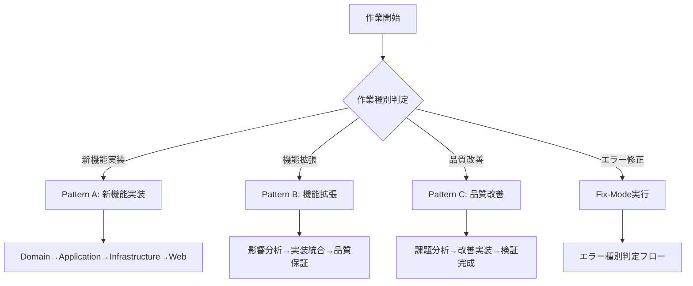
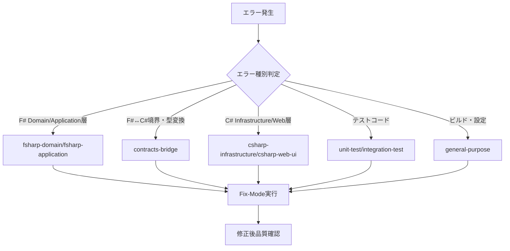

# SubAgent実行ガイドライン

## 📋 概要
Phase B1 Step3での実証結果を基に策定された、SubAgent活用効率化と品質向上のための実行ガイドライン

**基盤ADR**: ADR_016（プロセス遵守）・ADR_018（指示改善とFix-Mode活用）

## 🎯 適用対象
- 全Phase・全Step
- SubAgent Task実行時
- エラー修正（Fix-Mode）実行時

## 🔧 1. SubAgent選択フローチャート

### 1.1 作業種別による基本選択



### 1.2 エラー修正時のSubAgent選定フロー



## 🔍 2. エラー修正責務判定詳細手順

### 2.1 Step1: エラー分析（必須実行）

#### エラーメッセージ分析
```markdown
## 🔍 エラー分析チェックリスト
- [ ] エラーコード（CS1234、FS0597等）の特定
- [ ] エラーメッセージの完全な読み取り
- [ ] 発生ファイル・行番号の確認
- [ ] エラーの根本原因の推定
```

#### 影響範囲評価
```markdown
## 📊 影響範囲評価
- [ ] 影響するファイル数の確認
- [ ] 修正規模の見積もり（小/中/大）
- [ ] 他プロジェクトへの影響確認
- [ ] テストへの影響確認
```

#### 修正専門知識判定
```markdown
## 🎓 必要専門知識
- [ ] F#言語仕様の理解が必要
- [ ] C#言語仕様の理解が必要
- [ ] F#↔C#相互運用の理解が必要
- [ ] 既存実装パターンの理解が必要
```

### 2.2 Step2: SubAgent選定（必須実行）

#### 技術領域マッピング表
| エラー種別 | 対象SubAgent | 専門領域 | 適用条件 |
|----------|-------------|---------|----------|
| F#構文エラー（FS0597等） | fsharp-domain<br>fsharp-application | F#言語仕様<br>関数型プログラミング | Domain/Application層のF#コード |
| C#構文エラー（CS1234等） | contracts-bridge<br>csharp-infrastructure<br>csharp-web-ui | C#言語仕様<br>オブジェクト指向 | Contracts/Infrastructure/Web層のC#コード |
| F#↔C#境界エラー | contracts-bridge | 相互運用<br>型変換<br>TypeConverter | TypeConverter・DTO変換関連 |
| テスト関連エラー | unit-test<br>integration-test | xUnit・FsUnit<br>Moq・WebApplicationFactory | テストプロジェクト全般 |
| ビルド・設定エラー | general-purpose | MSBuild・NuGet<br>プロジェクト設定 | .csproj/.fsproj・パッケージ関連 |

### 2.3 Step3: Fix-Mode実行（改善版）

#### 標準指示テンプレート適用
```markdown
[SubAgent名] Agent, Fix-Mode: [エラー種別]エラーを修正してください。

## 修正対象エラー詳細
**ファイル**: [完全ファイルパス]:[行番号]
**エラーコード**: [CS1234/FS0597等]
**エラーメッセージ**: [ビルド出力からの完全コピー]

## 修正指示
```csharp/fsharp
// 修正前（エラー）
[具体的なエラーコード]

// 修正後（正しい）
[期待される正しいコード]
```

## 参考実装
```csharp/fsharp
[既存の類似正常コードの例]
```

## 重要な制約事項
- **ロジック変更禁止**: 構文エラーの修正のみ実施
- **既存パターン準拠**: 他の同種実装の命名規則に従う
- **構文規約遵守**: C#/F#の言語仕様・プロジェクト規約完全準拠

修正完了後、[N]件のエラーが解消されることを確認してください。
```

## 📝 3. Fix-Mode実行チェックリスト

### 3.1 実行前確認（必須）
```markdown
## 🔴 Fix-Mode実行前チェック
- [ ] エラー種別の正確な判定完了
- [ ] 適切なSubAgentの選定完了
- [ ] 標準テンプレートの準備完了
- [ ] 参考実装の特定・準備完了
```

### 3.2 指示内容確認（必須）
```markdown
## 🔴 指示内容品質チェック
- [ ] ファイルパス・行番号の正確性
- [ ] エラーメッセージの完全性
- [ ] 修正前後コードの具体性
- [ ] 制約事項の明確性
```

### 3.3 実行後確認（必須）
```markdown
## 🔴 Fix-Mode実行後チェック
- [ ] SubAgent修正実行の完了確認
- [ ] 修正内容の妥当性確認
- [ ] 個別プロジェクトビルド成功確認
- [ ] 全体ビルド成功確認（0 Warning/0 Error）
```

## 🎯 4. 具体的指示例テンプレート集

### 4.1 C#構文エラー修正例（Contracts層）

#### 実際の成功事例（Phase B1 Step3）
```markdown
contracts-bridge Agent, Fix-Mode: C#構文エラーを修正してください。

## 修正対象エラー詳細
**ファイル**: AuthenticationConverter.cs:476行目
**エラーコード**: CS0246, CS0106, CS0538
**エラーメッセージ**: 型または名前空間の名前 'ToMicrosoft' が見つかりませんでした

## 修正指示
```csharp
// 修正前（エラー）
public static Microsoft.FSharp.Core.FSharpResult<User, AuthenticationError> ToMicrosoft.FSharp.Core.FSharpResult(AuthenticationResultDto dto)

// 修正後（正しい）
public static Microsoft.FSharp.Core.FSharpResult<User, AuthenticationError> ToFSharpResult(AuthenticationResultDto dto)
```

## 参考実装
```csharp
// 他のTypeConverterメソッドの正しい命名例
public static UserDto ToDto(User user)
public static Project ToProject(ProjectDto dto)
```

## 重要な制約事項
- **ロジック変更禁止**: メソッドシグネチャ・戻り値型は維持
- **既存パターン準拠**: ToXxxResult命名規則に統一
- **構文規約遵守**: C#の有効な識別子として修正

修正完了後、6件の構文エラーが解消されることを確認してください。
```

### 4.2 using alias削除例

#### 実際の成功事例（Phase B1 Step3）
```markdown
contracts-bridge Agent, Fix-Mode: using alias構文エラーを修正してください。

## 修正対象エラー詳細
**ファイル**: AuthenticationMapper.cs:5行目、ResultMapper.cs:9行目
**エラーコード**: CS0305
**エラーメッセージ**: ジェネリック 種類 'FSharpResult<T, TError>' を使用するには、2 型引数が必要です

## 修正指示
```csharp
// 修正前（エラー）
using FSharpResult = Microsoft.FSharp.Core.FSharpResult;

// 修正後（削除）
// using文を削除し、使用箇所で完全修飾名を使用
```

## 参考実装
```csharp
// 正しい使用方法
Microsoft.FSharp.Core.FSharpResult<T, TError>
```

## 重要な制約事項
- **理由**: ジェネリック型にエイリアスは設定できない
- **対応**: 完全修飾名で直接記述
- **影響確認**: using削除による他の箇所への影響なし

修正完了後、2件のusing alias関連エラーが解消されることを確認してください。
```

### 4.3 XMLコメント構文エラー修正例

#### 実際の成功事例（Phase B1 Step3）
```markdown
contracts-bridge Agent, Fix-Mode: XMLコメント構文エラーを修正してください。

## 修正対象エラー詳細
**ファイル**: ApplicationDtos.cs:8行目
**エラーコード**: CS1587
**エラーメッセージ**: XML コメントが有効な言語要素の中にありません

## 修正指示
```csharp
// 修正前（エラー）
/// <summary>
/// Application層向けCommand/Query DTOs
/// </summary>

// 修正後（正しい）
// ========================================
// Application層向けCommand/Query DTOs
// ========================================
```

## 参考実装
```csharp
// ファイル冒頭の説明コメント例
// =================================
// 認証関連のF#↔C#マッピング
// =================================
```

## 重要な制約事項
- **理由**: XMLコメントは特定の言語要素の直前に配置する必要がある
- **対応**: 一般的なファイル説明は通常のコメント（//）を使用
- **内容保持**: 有用なコメント内容はすべて維持

修正完了後、1件のXMLコメントエラーが解消されることを確認してください。
```

## 📊 5. 効果測定・継続改善

### 5.1 定量測定指標
```markdown
## 📈 測定指標
- **Fix-Mode成功率**: 一回の指示で修正が完了する割合（目標: 95%以上）
- **修正時間効率**: エラー発見から解消までの時間（目標: 15分以下/9件基準）
- **ビルド成功率**: 修正後の即座ビルド成功率（目標: 100%）
- **SubAgent責務違反件数**: 不適切なAgent選択による失敗（目標: 0件）
```

### 5.2 継続改善サイクル
```markdown
## 🔄 改善サイクル
1. **実行記録**: 各Fix-Mode実行の詳細記録
2. **問題分析**: 失敗・非効率事例の原因分析
3. **テンプレート改善**: 指示テンプレートの継続改善
4. **ガイドライン更新**: 本文書の定期更新
```

### 5.3 品質向上効果測定
```markdown
## 🎯 品質効果
- **構文規約遵守度**: プロジェクト全体の一貫性指標
- **専門性活用度**: 各SubAgentの専門知識活用レベル
- **プロセス遵守度**: ADR_016基本原則の遵守状況
- **知見蓄積度**: 改善事例の文書化・共有状況
```

## 🔗 6. 関連文書・参照

### ADR参照
- **ADR_016**: プロセス遵守違反防止策（基本原則）
- **ADR_018**: SubAgent指示改善とFix-Mode活用（本ガイドラインの基盤）

### 実行Commands
- **task-breakdown**: SubAgent選択Pattern決定
- **step-start**: Step開始時のSubAgent組み合わせ決定
- **spec-compliance-check**: 品質確認・SubAgent効果測定

### メモリー参照
- **development_guidelines**: プロセス・手法の総合ガイド
- **tech_stack_and_conventions**: 技術規約・実装パターン
- **project_overview**: プロジェクト状況・過去の改善実績

---

## 📅 改訂履歴
- 2025-09-30: 初版作成（Phase B1 Step3実証結果を基に）

---

**このガイドラインは、SubAgent活用の効率化と品質向上を両立させるための実践的指針であり、継続的な改善と更新が重要である。**