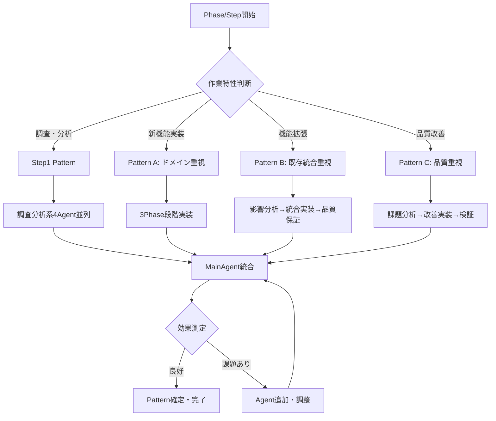

# SubAgent組み合わせパターン

**目的**: Phase・Step特性に応じたSubAgent最適選択ガイド  
**適用範囲**: 全Phase・全Step  
**作成日**: 2025-08-08  
**基準**: ADR_013 SubAgentプール方式に基づく

## 🎯 基本選択原則

### SubAgentプール（13種類）
```yaml
調査分析系（4Agent）:
  - tech-research: 技術調査・最新情報・ベストプラクティス
  - spec-analysis: 仕様分析・要件抽出・仕様準拠マトリックス
  - design-review: 設計整合性・アーキテクチャ確認
  - dependency-analysis: 依存関係・実装順序・制約分析

実装系（5Agent）:
  - fsharp-domain: F#ドメインモデル・ビジネスロジック
  - fsharp-application: F#アプリケーションサービス・ユースケース
  - contracts-bridge: F#↔C#型変換・TypeConverter（重要）
  - csharp-infrastructure: Repository・Entity Framework・外部連携
  - csharp-web-ui: Blazor Server・Razor・フロントエンド

品質保証系（4Agent）:
  - unit-test: TDD実践・単体テスト・Red-Green-Refactor
  - integration-test: WebApplicationFactory・E2E・統合テスト
  - code-review: コード品質・アーキテクチャ準拠・最適化
  - spec-compliance: 仕様準拠監査・受け入れ基準確認
```

## 🚨 SubAgent責務境界（明確化・重要）

### 実装系Agent責務境界
```yaml
fsharp-domain:
  ✅ 実行範囲:
    - src/UbiquitousLanguageManager.Domain/ 配下のみ
    - ValueObjects.fs, Entities.fs, DomainServices.fs 実装
    - F#ドメインモデル・ビジネスロジック実装
  ❌ 禁止範囲:
    - tests/ 配下のファイル読み込み・参照
    - テスト実装・TDD実践（unit-testの責務）
    - Contracts層・Infrastructure層・Web層への言及

fsharp-application:
  ✅ 実行範囲:
    - src/UbiquitousLanguageManager.Application/ 配下のみ
    - UseCase・ApplicationService実装
  ❌ 禁止範囲:
    - tests/ 配下のファイル読み込み・参照
    - Domain層・Infrastructure層の実装修正

contracts-bridge:
  ✅ 実行範囲:
    - src/UbiquitousLanguageManager.Contracts/ 配下のみ
    - DTO・TypeConverter・F#↔C#境界実装
  ❌ 禁止範囲:
    - Domain層・Application層の実装修正
    - テストプロジェクトへの参照

unit-test:
  ✅ 実行範囲:
    - tests/ 配下のすべてのテストプロジェクト
    - TDD実践・Red-Green-Refactorサイクル
    - テスト実装・既存テスト修正
  ❌ 禁止範囲:
    - src/ 配下の実装コード修正（テスト対象の修正禁止）

integration-test:
  ✅ 実行範囲:
    - tests/ 配下の統合テストプロジェクト
    - WebApplicationFactory・E2Eテスト・データベース統合テスト
  ❌ 禁止範囲:
    - src/ 配下の実装コード修正
```

### 品質保証Agent責務境界
```yaml
code-review:
  ✅ 実行範囲:
    - 全プロジェクトの読み込み・品質評価
    - アーキテクチャ準拠・コード品質確認
  ❌ 禁止範囲:
    - 実装コードの直接修正（改善提案のみ）

spec-compliance:
  ✅ 実行範囲:
    - 仕様書・実装コードの照合確認
    - 仕様準拠マトリックス検証
  ❌ 禁止範囲:
    - 実装コードの直接修正（準拠度評価のみ）
```

## 📋 spec-analysis ↔ spec-compliance 連携フロー

### 成果物継承による効率化
```yaml
Step1（仕様分析段階）:
  実行Agent: spec-analysis
  成果物出力:
    - /Doc/05_Research/Phase_XX/Spec_Compliance_Matrix.md
    - /Doc/05_Research/Phase_XX/Implementation_Requirements.md
    - /Doc/05_Research/Phase_XX/Spec_Analysis_Results.md
  
Step終了時（監査段階）:
  実行Agent: spec-compliance
  入力: 上記spec-analysis成果物（必須）
  処理: マトリックスベースの実装検証
  出力: 準拠度判定・証跡記録・改善提案

効果:
  - 仕様の二重解析回避
  - 解釈一貫性の確保
  - Context効率の最大化
```

## 📋 Step特性別推奨パターン

### Step1（調査分析）- 全Phase共通
**目的**: 課題分析・技術調査・実装計画策定  
**🔧 Command活用**: [subagent-selection Command](./.claude/commands/subagent-selection.md)で自動選択

**推奨組み合わせ**:
```yaml
必須Agent（並列実行）:
  - tech-research(技術調査): 技術課題・解決策調査
  - spec-analysis(仕様分析): 仕様詳細分析・要件抽出
  - design-review(設計レビュー): 既存設計との整合性確認
  - dependency-analysis(依存関係分析): 実装順序・依存関係分析

実行時間: 45-60分（従来90分から短縮）
並列実行: 4Agent同時実行→MainAgentで統合
Command実行: subagent-selection → Pattern自動決定 → Agent並列実行
```

### Step2以降（実装）- Phase特性別

#### **新機能実装Pattern（Phase B1, C1, D1等）**
**特徴**: 新規エンティティ・機能の縦方向スライス実装

**推奨組み合わせA（ドメイン重視）**:
```yaml
Phase1（Domain→Application）:
  - fsharp-domain(F#ドメイン): ドメインモデル設計・実装
  - fsharp-application(F#アプリケーション): ユースケース・サービス実装
  - unit-test(単体テスト): TDD実践・ドメインロジックテスト

Phase2（境界→インフラ）:
  - contracts-bridge(F#↔C#境界): F#↔C#型変換実装
  - csharp-infrastructure(C#インフラ): Repository・データアクセス実装
  - integration-test(統合テスト): データベース統合テスト

Phase3（UI→完成）:
  - csharp-web-ui(C# Web UI): Blazorコンポーネント・画面実装
  - spec-compliance(仕様準拠監査): 仕様準拠確認・受け入れテスト
  - code-review(コードレビュー): 全体品質レビュー
```

#### **機能拡張Pattern（Phase A2, B2, C2等）**
**特徴**: 既存機能の拡張・関連機能追加

**推奨組み合わせB（既存統合重視）**:
```yaml
Phase1（影響分析）:
  - dependency-analysis(依存関係分析): 既存機能への影響分析
  - design-review(設計レビュー): アーキテクチャ整合性確認
  - spec-analysis(仕様分析): 追加要件と既存仕様の整合確認

Phase2（実装・統合）:
  - 必要な実装系Agent選択（既存の拡張対象に応じて）
  - integration-test(統合テスト): 既存機能との統合テスト重点
  - unit-test(単体テスト): 追加・変更ロジックのテスト

Phase3（品質保証）:
  - code-review(コードレビュー): リファクタリング・品質改善
  - spec-compliance(仕様準拠監査): 既存＋新規仕様の全体準拠確認
```

#### **品質改善Pattern（技術負債解消等）**
**特徴**: 既存コードの改善・リファクタリング・負債解消

**推奨組み合わせC（品質重視）**:
```yaml
Phase1（課題分析）:
  - code-review(コードレビュー): 既存コードの問題点特定
  - tech-research(技術調査): 改善手法・ベストプラクティス調査
  - dependency-analysis(依存関係分析): 改善の影響範囲分析

Phase2（改善実装）:
  - 対象層のAgent選択（問題箇所に応じて）
    * F#問題: fsharp-domain(F#ドメイン), fsharp-application(F#アプリケーション)
    * 境界問題: contracts-bridge(F#↔C#境界)
    * C#問題: csharp-infrastructure(C#インフラ), csharp-web-ui(C# Web UI)
  - unit-test(単体テスト): リファクタリング安全性確保

Phase3（検証・完成）:
  - integration-test(統合テスト): 改善後の統合動作確認
  - spec-compliance(仕様準拠監査): 仕様準拠の維持確認
  - code-review(コードレビュー): 改善効果・品質向上確認
```

#### **品質保証段階Pattern（Phase B4-B5, C5-C6, D7等）**
**対象**: 技術負債解消・UI/UX最適化・統合テスト段階
**特徴**: 既存実装の品質向上・保守性改善・運用品質確保

**推奨組み合わせD（品質保証重視）**:
```yaml
Phase1（技術負債特定・分析）:
  - code-review(コードレビュー): 既存コードの問題点・改善箇所特定
  - dependency-analysis(依存関係分析): リファクタリング影響範囲分析
  - tech-research(技術調査): 最新ベストプラクティス・改善手法調査

Phase2（品質改善実装）:
  - 対象層に応じた実装系Agent選択（リファクタリング・最適化）
    * F#品質改善: fsharp-domain(F#ドメイン), fsharp-application(F#アプリケーション)
    * 境界最適化: contracts-bridge(F#↔C#境界)
    * C#品質改善: csharp-infrastructure(C#インフラ), csharp-web-ui(C# Web UI)
  - unit-test(単体テスト): リファクタリング安全性確保・テスト充実
  - code-review(コードレビュー): 改善効果確認・コード品質向上

Phase3（統合検証・品質確認）:
  - integration-test(統合テスト): E2E動作確認・パフォーマンステスト
  - spec-compliance(仕様準拠監査): 仕様準拠維持確認・品質基準達成確認
```

#### **拡張段階Pattern（Phase D7-D8等）**
**対象**: 高度機能・外部連携・運用最適化段階
**特徴**: Claude Code連携・エクスポート機能・監視・ログ・保守機能

**推奨組み合わせE（拡張機能重視）**:
```yaml
Phase1（外部連携設計・調査）:
  - tech-research(技術調査): 外部API調査・連携手法・セキュリティ要件
  - design-review(設計レビュー): アーキテクチャ影響確認・統合設計
  - spec-analysis(仕様分析): 外部連携要件・エクスポート仕様分析

Phase2（拡張機能実装）:
  - csharp-infrastructure(C#インフラ): 外部API連携・データエクスポート実装
  - contracts-bridge(F#↔C#境界): 外部連携用データ変換・フォーマット変換
  - csharp-web-ui(C# Web UI): エクスポートUI・外部連携画面実装

Phase3（運用準備・統合確認）:
  - integration-test(統合テスト): 外部連携テスト・エクスポート機能テスト
  - code-review(コードレビュー): セキュリティ・性能・保守性確認
  - spec-compliance(仕様準拠監査): 外部連携仕様準拠・運用要件達成確認
```

## 🔄 動的調整パターン

### Agent追加・変更の判断基準
```yaml
作業中の追加判断:
  - 想定以上の複雑性発見: 追加Agentの並列投入
  - 専門知識不足: tech-research(技術調査)による補強
  - 品質懸念: code-review(コードレビュー), spec-compliance(仕様準拠監査)の早期投入

Agent変更の判断:
  - F#中心→C#中心: 実装系Agent組み合わせ変更
  - 単純→複雑: 品質保証系Agentの追加投入
  - 新規→拡張: dependency-analysis(依存関係分析)の重点化
```

### 効果測定・改善
```yaml
各Pattern実行後の測定:
  - 時間効率: 予想vs実際の作業時間
  - 品質効果: テスト成功率・コード品質向上度
  - Agent寄与度: 各Agentの成果・問題点

継続改善:
  - 高効果Pattern: 標準パターンとして確立
  - 低効果Pattern: Agent組み合わせ・実行順序の調整
  - 新Pattern発見: 文書更新・知識共有
```

## 📊 Pattern選択フローチャート



## 🎯 成功基準・KPI

### Pattern効率性
- **時間短縮率**: 従来プロセス比50-60%短縮維持
- **並列効果**: Step1調査分析90分→45分達成
- **管理負荷**: 組織設計時間90%削減（90分→9分）

### 品質向上効果
- **仕様準拠率**: spec-compliance(仕様準拠監査)により100%達成
- **コード品質**: code-review(コードレビュー)により継続的改善
- **テスト品質**: unit-test(単体テスト), integration-test(統合テスト)により80%カバレッジ維持

### Agent学習効果
- **専門性深化**: 各Agent継続使用による専門知識蓄積
- **パターン最適化**: Pattern実行データによる継続改善
- **新Pattern創出**: プロジェクト特性に応じた独自Pattern開発

## 🚨 SubAgent実行制御・異常対策

### 重要: 大量起動防止策
**2025-08-31事例**: integration-test SubAgentが大量起動  
**原因**: Task tool制御不備・並列実行制御欠如  
**影響**: システムリソース大量消費・実行効率低下

### 実行前チェックリスト（必須）
```yaml
実行前確認事項:
  - [ ] 実行中SubAgentなし確認
  - [ ] Task tool重複実行なし確認
  - [ ] 同時実行数 ≤ 4個（推奨上限）
  - [ ] 明確なdescription・prompt設定
  - [ ] 適切なsubagent_type選択

監視必須SubAgent:
  - integration-test: 大量起動リスク（要特別注意）
  - tech-research: 外部API呼び出しでタイムアウト可能性
  - spec-compliance: 大容量ファイル読み込みで遅延可能性
```

### 異常検知時の対応フロー
```yaml
Step1 - 即座対応:
  1. 大量プロセス検知時の即座停止
  2. リソース使用量確認（CPU・メモリ）
  3. 実行中SubAgent強制終了

Step2 - 原因分析:
  1. Task tool呼び出し方法確認
  2. 並列実行制御の確認
  3. SubAgent選択ミス確認

Step3 - 記録・改善:
  1. 実行記録セクション更新
  2. 再発防止策の文書化
  3. チェックリスト見直し
```

### 実行記録・事例集

#### セッション記録: 2025-08-31 ルートパス競合解決
| SubAgent | 実行時刻 | 目的 | 結果 | 備考 |
|----------|---------|------|------|------|
| code-review | 13:00-13:05 | ルーティング競合分析 | ✅ | 正常実行・品質スコア85点 |
| tech-research | 13:00-13:05 | Blazor設計調査 | ✅ | 正常実行・Microsoft推奨パターン取得 |
| dependency-analysis | 13:00-13:05 | 依存関係分析 | ✅ | 正常実行・7箇所の影響範囲特定 |
| csharp-web-ui | 13:05-13:10 | Home.razor修正 | ✅ | 正常実行・ルーティング競合解消 |
| integration-test | 13:10-13:15 | 動作確認 | ⚠️ | **大量起動発生** → 手動停止・再実行で正常化 |
| spec-compliance | 13:15-13:20 | 仕様準拠確認 | ✅ | 正常実行・仕様準拠度75%確認 |

**成果**: ルーティング競合問題完全解決  
**効率**: 6SubAgent使用・総時間30分（従来90分から短縮）  
**異常**: integration-test大量起動（今後要注意）

#### 異常事例記録
```yaml
事例1: integration-test大量起動 (2025-08-31)
  原因: Task tool並列実行制御不備
  症状: 同一SubAgentが10個以上起動
  対策: 実行前チェックリスト強化
  改善: 同時実行数上限設定（≤4個）

教訓:
  - integration-testは特に監視必要
  - 並列実行時の制御強化必須
  - 異常検知時の即座停止重要
```

### SubAgent実行パターン改善
```yaml
安全実行原則:
  - Pattern A-C実行時の段階的制御
  - 高リスクSubAgentの個別実行
  - 実行状況の継続監視

推奨実行順序:
  1. 調査分析系（code-review, tech-research等）
  2. 実装系（csharp-web-ui, fsharp-domain等）
  3. 品質保証系（integration-test, spec-compliance等）※監視強化
```

## 🔧 エラー修正モード（Fix-Mode）

### 目的・適用範囲
**エラー修正時の効率的SubAgent活用** - SubAgent作業完了後のエラー発生時専用

### Fix-Mode特徴
```yaml
実行目的:
  - 特定エラーの修正のみ
  - 新規機能追加なし
  - 影響範囲が明確・限定的

実行時間:
  - 通常実行: 5-10分
  - Fix-Mode: 1-3分（1/3短縮）

実行スコープ:
  - 特定ファイル・特定エラーのみ
  - 最小限の分析・実装
  - 修正完了の即座確認
```

### Fix-Mode実行指示フォーマット
```yaml
基本フォーマット:
  "[SubAgent名] Agent, Fix-Mode: [修正内容詳細]"

具体例:
  "contracts-bridge Agent, Fix-Mode: TypeConverters.cs Option型変換エラー修正"
  "fsharp-domain Agent, Fix-Mode: ValueObjects.fs ProjectName制約エラー修正"
  "csharp-web-ui Agent, Fix-Mode: Profile.razor using文不足エラー修正"
  "unit-test Agent, Fix-Mode: ProjectTests.fs 期待値不一致エラー修正"
```

### エラー種別別SubAgent選択
```yaml
F# Domain層エラー:
  SubAgent: fsharp-domain
  対象: ValueObjects.fs, Entities.fs, DomainServices.fs
  Fix例: Smart Constructor制約・型変換・パターンマッチング

F# Application層エラー:
  SubAgent: fsharp-application
  対象: UseCase.fs, ApplicationService.fs
  Fix例: ユースケース実装・ワークフロー・エラーハンドリング

F#↔C#境界エラー:
  SubAgent: contracts-bridge
  対象: TypeConverters.cs, DTOs.cs
  Fix例: Option型変換・Result型変換・プロパティマッピング

C# Infrastructure層エラー:
  SubAgent: csharp-infrastructure
  対象: Repository.cs, DbContext.cs, Configuration
  Fix例: EF Core設定・データアクセス・外部連携

C# Web UI層エラー:
  SubAgent: csharp-web-ui
  対象: Razor files, Controllers, Services
  Fix例: Blazor Server設定・UI実装・ライフサイクル

テストエラー:
  SubAgent: unit-test または integration-test
  対象: Tests/*.fs, Tests/*.cs
  Fix例: テスト期待値・モック設定・テストデータ
```

### Fix-Mode実行プロセス
```yaml
Step1 - エラー分析（MainAgent）:
  1. エラー内容・場所の特定
  2. 責務マッピングでSubAgent選定
  3. 修正規模判定（Fix-Mode適用可否）

Step2 - Fix-Mode実行（SubAgent）:
  1. 指定エラーのみ修正実行
  2. 最小限の影響範囲での修正
  3. 修正完了の即座確認

Step3 - 修正確認（MainAgent）:
  1. ビルド成功確認
  2. テスト実行・成功確認
  3. 修正完了記録
```

### Fix-Mode使用条件・制限
```yaml
適用可能条件:
  ✅ 明確なエラーメッセージ・場所特定済み
  ✅ 修正影響範囲が1-2ファイル以内
  ✅ 新規機能追加なし
  ✅ ビジネスロジック変更なし

適用不可条件:
  ❌ エラー原因が不明確
  ❌ 設計変更・リファクタリングが必要
  ❌ 複数層にまたがる修正
  ❌ 新規メソッド・クラス追加が必要

制限事項:
  - Fix-Mode実行は1回のみ（再実行不可）
  - 修正失敗時は通常モードに切り替え
  - 複雑なエラーは通常モード実行
```

### Fix-Mode効果測定
```yaml
効率性指標:
  - 修正時間: 1-3分目標
  - 成功率: 80%以上維持
  - 再修正率: 10%以下維持

品質指標:
  - ビルド成功率: 100%
  - テスト成功維持率: 100%
  - 新規問題発生率: 5%以下

責務遵守効果:
  - SubAgent専門性活用率: 100%
  - メインエージェント責務境界遵守率: 100%
  - プロセス一貫性維持率: 100%
```

---

**更新履歴**:
- **2025-09-28 Fix-Mode（エラー修正モード）追加**（Step2実行改善・責務境界明確化）
- 2025-08-08 初版作成（Phase特性別テンプレート.mdからの移行・SubAgent方式対応）
- 2025-08-31 実行制御・異常対策セクション追加（integration-test大量起動対策）
- **2025-09-22 Pattern D・E追加**（縦方向スライス実装マスタープラン改訂対応）
  - Pattern D: 品質保証段階（Phase B4-B5, C5-C6, D7等）追加
  - Pattern E: 拡張段階（Phase D7-D8等）追加
  - Phase B/C/D の5-8段階構成への完全対応