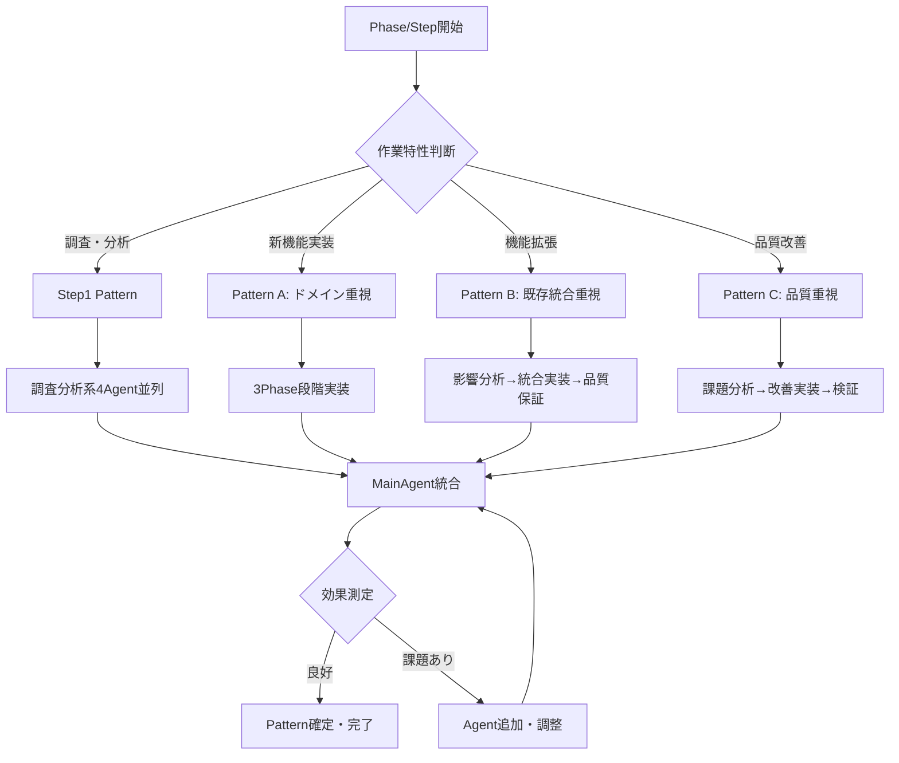

# SubAgent組み合わせパターン

**目的**: Phase・Step特性に応じたSubAgent最適選択ガイド  
**適用範囲**: 全Phase・全Step  
**作成日**: 2025-08-08  
**基準**: ADR_013 SubAgentプール方式に基づく

## 🎯 基本選択原則

### SubAgentプール（13種類）
```yaml
調査分析系（4Agent）:
  - tech-research: 技術調査・最新情報・ベストプラクティス
  - spec-analysis: 仕様分析・要件抽出・仕様準拠マトリックス
  - design-review: 設計整合性・アーキテクチャ確認
  - dependency-analysis: 依存関係・実装順序・制約分析

実装系（5Agent）:
  - fsharp-domain: F#ドメインモデル・ビジネスロジック
  - fsharp-application: F#アプリケーションサービス・ユースケース
  - contracts-bridge: F#↔C#型変換・TypeConverter（重要）
  - csharp-infrastructure: Repository・Entity Framework・外部連携
  - csharp-web-ui: Blazor Server・Razor・フロントエンド

品質保証系（4Agent）:
  - unit-test: TDD実践・単体テスト・Red-Green-Refactor
  - integration-test: WebApplicationFactory・E2E・統合テスト
  - code-review: コード品質・アーキテクチャ準拠・最適化
  - spec-compliance: 仕様準拠監査・受け入れ基準確認
```

## 📋 spec-analysis ↔ spec-compliance 連携フロー

### 成果物継承による効率化
```yaml
Step1（仕様分析段階）:
  実行Agent: spec-analysis
  成果物出力:
    - /Doc/05_Research/Phase_XX/Spec_Compliance_Matrix.md
    - /Doc/05_Research/Phase_XX/Implementation_Requirements.md
    - /Doc/05_Research/Phase_XX/Spec_Analysis_Results.md
  
Step終了時（監査段階）:
  実行Agent: spec-compliance
  入力: 上記spec-analysis成果物（必須）
  処理: マトリックスベースの実装検証
  出力: 準拠度判定・証跡記録・改善提案

効果:
  - 仕様の二重解析回避
  - 解釈一貫性の確保
  - Context効率の最大化
```

## 📋 Step特性別推奨パターン

### Step1（調査分析）- 全Phase共通
**目的**: 課題分析・技術調査・実装計画策定  
**🔧 Command活用**: [subagent-selection Command](./.claude/commands/subagent-selection.md)で自動選択

**推奨組み合わせ**:
```yaml
必須Agent（並列実行）:
  - tech-research(技術調査): 技術課題・解決策調査
  - spec-analysis(仕様分析): 仕様詳細分析・要件抽出
  - design-review(設計レビュー): 既存設計との整合性確認
  - dependency-analysis(依存関係分析): 実装順序・依存関係分析

実行時間: 45-60分（従来90分から短縮）
並列実行: 4Agent同時実行→MainAgentで統合
Command実行: subagent-selection → Pattern自動決定 → Agent並列実行
```

### Step2以降（実装）- Phase特性別

#### **新機能実装Pattern（Phase B1, C1, D1等）**
**特徴**: 新規エンティティ・機能の縦方向スライス実装

**推奨組み合わせA（ドメイン重視）**:
```yaml
Phase1（Domain→Application）:
  - fsharp-domain(F#ドメイン): ドメインモデル設計・実装
  - fsharp-application(F#アプリケーション): ユースケース・サービス実装
  - unit-test(単体テスト): TDD実践・ドメインロジックテスト

Phase2（境界→インフラ）:
  - contracts-bridge(F#↔C#境界): F#↔C#型変換実装
  - csharp-infrastructure(C#インフラ): Repository・データアクセス実装
  - integration-test(統合テスト): データベース統合テスト

Phase3（UI→完成）:
  - csharp-web-ui(C# Web UI): Blazorコンポーネント・画面実装
  - spec-compliance(仕様準拠監査): 仕様準拠確認・受け入れテスト
  - code-review(コードレビュー): 全体品質レビュー
```

#### **機能拡張Pattern（Phase A2, B2, C2等）**
**特徴**: 既存機能の拡張・関連機能追加

**推奨組み合わせB（既存統合重視）**:
```yaml
Phase1（影響分析）:
  - dependency-analysis(依存関係分析): 既存機能への影響分析
  - design-review(設計レビュー): アーキテクチャ整合性確認
  - spec-analysis(仕様分析): 追加要件と既存仕様の整合確認

Phase2（実装・統合）:
  - 必要な実装系Agent選択（既存の拡張対象に応じて）
  - integration-test(統合テスト): 既存機能との統合テスト重点
  - unit-test(単体テスト): 追加・変更ロジックのテスト

Phase3（品質保証）:
  - code-review(コードレビュー): リファクタリング・品質改善
  - spec-compliance(仕様準拠監査): 既存＋新規仕様の全体準拠確認
```

#### **品質改善Pattern（技術負債解消等）**
**特徴**: 既存コードの改善・リファクタリング・負債解消

**推奨組み合わせC（品質重視）**:
```yaml
Phase1（課題分析）:
  - code-review(コードレビュー): 既存コードの問題点特定
  - tech-research(技術調査): 改善手法・ベストプラクティス調査
  - dependency-analysis(依存関係分析): 改善の影響範囲分析

Phase2（改善実装）:
  - 対象層のAgent選択（問題箇所に応じて）
    * F#問題: fsharp-domain(F#ドメイン), fsharp-application(F#アプリケーション)
    * 境界問題: contracts-bridge(F#↔C#境界)
    * C#問題: csharp-infrastructure(C#インフラ), csharp-web-ui(C# Web UI)
  - unit-test(単体テスト): リファクタリング安全性確保

Phase3（検証・完成）:
  - integration-test(統合テスト): 改善後の統合動作確認
  - spec-compliance(仕様準拠監査): 仕様準拠の維持確認
  - code-review(コードレビュー): 改善効果・品質向上確認
```

## 🔄 動的調整パターン

### Agent追加・変更の判断基準
```yaml
作業中の追加判断:
  - 想定以上の複雑性発見: 追加Agentの並列投入
  - 専門知識不足: tech-research(技術調査)による補強
  - 品質懸念: code-review(コードレビュー), spec-compliance(仕様準拠監査)の早期投入

Agent変更の判断:
  - F#中心→C#中心: 実装系Agent組み合わせ変更
  - 単純→複雑: 品質保証系Agentの追加投入
  - 新規→拡張: dependency-analysis(依存関係分析)の重点化
```

### 効果測定・改善
```yaml
各Pattern実行後の測定:
  - 時間効率: 予想vs実際の作業時間
  - 品質効果: テスト成功率・コード品質向上度
  - Agent寄与度: 各Agentの成果・問題点

継続改善:
  - 高効果Pattern: 標準パターンとして確立
  - 低効果Pattern: Agent組み合わせ・実行順序の調整
  - 新Pattern発見: 文書更新・知識共有
```

## 📊 Pattern選択フローチャート



## 🎯 成功基準・KPI

### Pattern効率性
- **時間短縮率**: 従来プロセス比50-60%短縮維持
- **並列効果**: Step1調査分析90分→45分達成
- **管理負荷**: 組織設計時間90%削減（90分→9分）

### 品質向上効果
- **仕様準拠率**: spec-compliance(仕様準拠監査)により100%達成
- **コード品質**: code-review(コードレビュー)により継続的改善
- **テスト品質**: unit-test(単体テスト), integration-test(統合テスト)により80%カバレッジ維持

### Agent学習効果
- **専門性深化**: 各Agent継続使用による専門知識蓄積
- **パターン最適化**: Pattern実行データによる継続改善
- **新Pattern創出**: プロジェクト特性に応じた独自Pattern開発

---

**更新履歴**:
- 2025-08-08 初版作成（Phase特性別テンプレート.mdからの移行・SubAgent方式対応）