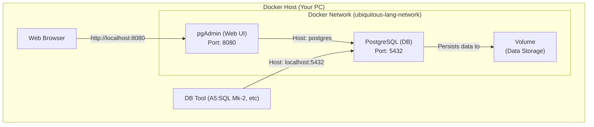

# Docker基本概念説明（初心者向け）

**作成日**: 2025-07-06  
**対象**: Docker初心者エンジニア  
**読了時間**: 約10分  

## 1. Dockerとは？

### 1.1 基本概念
**Docker** は、アプリケーションを**コンテナ**という軽量な仮想環境で実行するためのプラットフォームです。

### 1.2 従来の開発環境との違い

#### 従来の問題
- 「私の環境では動くのに、あなたの環境では動かない」
- 環境構築に時間がかかる
- 複数バージョンの管理が困難

#### Dockerでの解決
- 環境をコード化して共有
- 一度構築すれば誰でも同じ環境
- 簡単にクリーンアップ・再構築可能

## 2. 重要な用語解説

### 2.1 イメージ（Image）
- **例え**: アプリケーションの「設計図」や「テンプレート」
- **実体**: ファイルシステムの読み取り専用のスナップショット
- **具体例**: `postgres:16-alpine`（PostgreSQLのイメージ）

```bash
# イメージ一覧表示
docker images
```

### 2.2 コンテナ（Container）
- **例え**: 設計図から作られた「実際の建物」
- **実体**: イメージから起動された実行環境
- **特徴**: 軽量、隔離された環境、すぐに起動・停止可能

```bash
# 実行中のコンテナ確認
docker ps
```

### 2.3 ボリューム（Volume）
- **例え**: コンテナの「外付けハードディスク」
- **目的**: データの永続化（コンテナを削除してもデータが残る）
- **具体例**: データベースのデータファイル保存

### 2.4 ネットワーク（Network）
- **例え**: コンテナ同士の「専用回線」
- **目的**: コンテナ間の通信を安全に行う
- **具体例**: WebアプリとデータベースConatinerの通信

## 3. Docker Composeとは？

### 3.1 概要
- **目的**: 複数のコンテナを一括管理
- **設定ファイル**: `docker-compose.yml`
- **メリット**: 複雑な環境を1コマンドで起動

### 3.2 本プロジェクトでの使用例
```yaml
services:
  postgres:     # データベースコンテナ
    image: postgres:16-alpine
  pgadmin:      # 管理ツールコンテナ
    image: dpage/pgadmin4:latest
```

### 3.3 基本操作
```bash
# 環境起動
docker-compose up -d

# 環境停止
docker-compose down
```

## 4. WSL2との関係

### 4.1 WSL2とは？
- **正式名称**: Windows Subsystem for Linux 2
- **役割**: Windows上でLinuxを実行
- **Docker**: LinuxベースのためWSL2が必要

### 4.2 統合設定の意味
```
Docker Desktop → WSL2 → Linuxコンテナ実行
```

### 4.3 統合確認方法
```bash
# WSL2でDocker利用可能か確認
docker --version

# 期待される結果
Docker version 28.2.2, build e6534b4
```

## 5. よくある初心者の疑問

### Q1: コンテナを停止したらデータは消える？
**A**: コンテナ自体のデータは消えますが、**ボリューム**に保存したデータ（データベース等）は残ります。

### Q2: 複数のコンテナが同じポートを使える？
**A**: 同じホストポート（例：5432）は1つのコンテナしか使えません。異なるポートにマッピングが必要です。

### Q3: Dockerコンテナ内でファイル編集は可能？
**A**: 可能ですが、**推奨されません**。設定変更はDockerfile や docker-compose.yml で行います。

### Q4: Windows再起動したらコンテナも起動する？
**A**: `restart: unless-stopped` 設定により自動起動されます。Docker Desktop自体は手動起動が必要です。

## 6. 本プロジェクトでの実際の構成

### 6.1 構成図


### 6.2 接続の流れ
1. **A5:SQL Mk-2** → `localhost:5432` → **PostgreSQLコンテナ**
2. **Webブラウザ** → `localhost:8080` → **pgAdminコンテナ** → **PostgreSQLコンテナ**

## 7. トラブル時の基本思考

### 7.1 段階的確認
1. **Docker Desktop 起動してる？**
   ```bash
   docker --version
   ```

2. **コンテナ動いてる？**
   ```bash
   docker ps
   ```

3. **ログでエラー確認**
   ```bash
   docker-compose logs
   ```

4. **再起動してみる**
   ```bash
   docker-compose restart
   ```

### 7.2 よくあるエラーパターン
- **ポート競合**: 他のアプリが同じポート使用
- **メモリ不足**: Docker Desktopのメモリ制限
- **権限エラー**: WSL2統合設定ミス

## 8. 学習リソース

### 8.1 公式ドキュメント
- [Docker公式チュートリアル](https://docs.docker.com/get-started/)
- [Docker Compose入門](https://docs.docker.com/compose/gettingstarted/)

### 8.2 追加学習のポイント
1. **Dockerfile作成**（カスタムイメージ作成）
2. **マルチステージビルド**（本番用最適化）
3. **Docker ネットワーク詳細**（セキュリティ向上）

## 9. このプロジェクトでの次のステップ

### 9.1 環境理解確認
- [ ] PostgreSQLコンテナに接続できる
- [ ] pgAdminでデータベース管理ができる
- [ ] 基本的なDockerコマンドが使える

### 9.2 実装準備
- 次は.NETプロジェクト作成
- Entity Framework設定
- Dockerとの統合開発環境構築

---

**重要**: 分からないことがあれば、まず `docker-compose logs` でログを確認し、エラーメッセージをよく読むことから始めましょう。多くの問題は設定ミスやポート競合が原因です。

**作成者**: Claude Code  
**レビュー**: 初心者向け内容検証済み