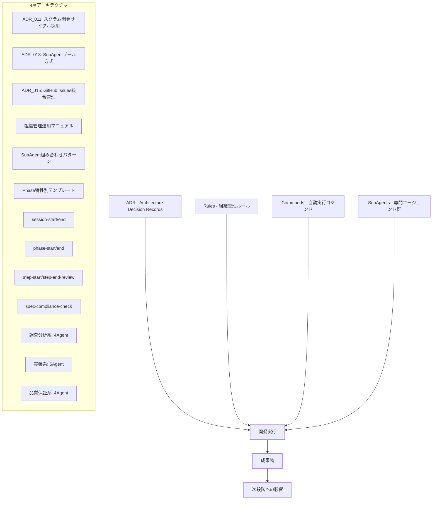
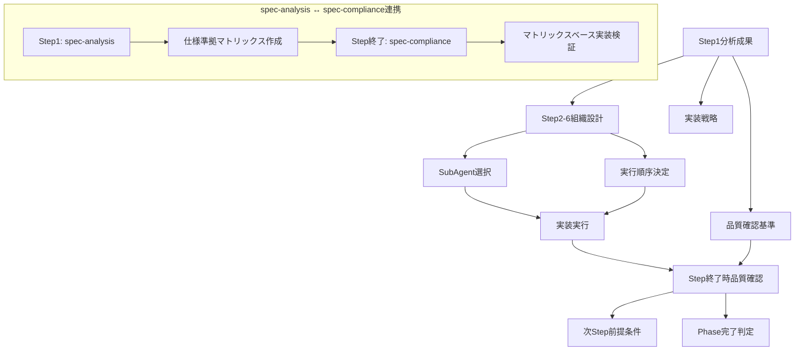

# ClaudeCode開発プロセス全体像

**作成日**: 2025-08-24  
**目的**: ClaudeCodeを活用した体系的開発プロセスの同僚向け解説資料  
**対象**: 開発プロセスを理解したいチームメンバー・関係者

---

## 🎯 1. 開発思想 - ClaudeCodeによるスクラム開発の実現

### 基本理念
この開発プロセスは、**ClaudeCodeを主体としたスクラム開発の完全再現**を目指して構築されています。

### 役割分担の革新
```
🏢 従来のスクラム開発               🤖 ClaudeCode版スクラム開発
├── プロダクトオーナー              ├── ユーザー（あなた）
├── プロジェクトマネージャー        ├── メインエージェント（Claude）
├── 開発チームメンバー              ├── SubAgent群（13種類の専門エージェント）
└── スクラムマスター                └── scrum-master SubAgent（構想中）
```

### 実現する価値
- **継続的価値提供**: Phase・Step単位での着実な成果創出
- **品質保証**: 体系的プロセスによる95/100品質スコア達成
- **透明性**: 全実行履歴・成果物の完全トレーサビリティ
- **適応性**: 課題発見に応じた柔軟なプロセス調整

---

## 🏗️ 2. システム構造 - 4層の体系的アーキテクチャ

### 全体構成図


### 各層の役割

#### 📋 ADR（Architecture Decision Records）
**目的**: 重要な技術的決定の恒久的記録
- **ADR_011**: スクラム開発サイクル採用 - 本プロセスの理論的基盤
- **ADR_013**: SubAgentプール方式 - 並列実行・専門性活用の根拠
- **ADR_015**: GitHub Issues統合管理 - 技術負債・課題の体系的管理

#### 📚 Rules（組織管理ルール）
**目的**: 実行手順・品質基準・組織設計の標準化
- **組織管理運用マニュアル**: Phase/Step実行の標準手順
- **SubAgent組み合わせパターン**: 課題特性別の最適Agent選択指針
- **Phase特性別テンプレート**: 新機能・機能拡張・品質改善の定型パターン

#### 🤖 Commands（自動実行コマンド）
**目的**: 標準作業の自動化・品質確認の確実化
```yaml
セッション管理:
  - session-start: Serena MCP初期化・状況確認・目的設定
  - session-end: 成果記録・振り返り・次回準備

Phase管理:
  - phase-start: Phase準備・組織設計・成功基準設定
  - phase-end: Phase総括・品質確認・知見蓄積

Step管理:
  - step-start: SubAgent選択・実行計画策定
  - step-end-review: TDD実践・仕様準拠・技術負債確認

品質保証:
  - spec-compliance-check: 仕様準拠度監査・逸脱特定
  - tdd-practice-check: TDD実践度確認・改善提案
```

#### 👥 SubAgents（専門エージェント群）
**目的**: 役割特化による高品質・効率的な成果創出

```yaml
🔍 調査分析系（4Agent）:
  - tech-research: 技術調査・最新情報・ベストプラクティス
  - spec-analysis: 仕様分析・要件抽出・準拠マトリックス作成
  - design-review: 設計整合性・アーキテクチャ準拠確認
  - dependency-analysis: 依存関係・実装順序・制約分析

⚙️ 実装系（5Agent）:
  - fsharp-domain: F#ドメインモデル・ビジネスロジック実装
  - fsharp-application: F#アプリケーションサービス・ユースケース実装
  - contracts-bridge: F#↔C#型変換・TypeConverter（境界層の要）
  - csharp-infrastructure: Repository・Entity Framework・外部連携
  - csharp-web-ui: Blazor Server・Razor・フロントエンド実装

🔬 品質保証系（4Agent）:
  - unit-test: TDD実践・単体テスト・Red-Green-Refactor
  - integration-test: WebApplicationFactory・E2E・統合テスト
  - code-review: コード品質・アーキテクチャ準拠・最適化
  - spec-compliance: 仕様準拠監査・受け入れ基準確認
```

---

## 🔄 3. 実行フロー - Phase A7を例とした具体的実行順序

### 全体フロー概要
```
セッション開始 → Phase開始 → Step1(分析) → Step2-6(実装) → Phase完了 → セッション終了
```

### 具体的なプロンプト例と実行順序

#### 🚀 セッション開始
**ユーザープロンプト例**:
```
「セッションを開始します」
```

**自動実行フロー**:
```yaml
1. session-start Command自動実行:
   - Serena MCP初期化（mcp__serena__check_onboarding_performed）
   - プロジェクト状況確認（/CLAUDE.md、/Doc/プロジェクト状況.md読み込み）
   - メモリー確認（project_overview、development_guidelines確認）

2. セッション目的確認:
   - 作業特性判断（新機能・拡張・品質改善・調査）
   - 必要情報読み込み範囲決定
   - TodoList初期化
```

#### 🏢 Phase開始（Phase A7例）
**ユーザープロンプト例**:
```
「Phase A7の実行を開始してください」
```

**実行フロー**:
```yaml
1. phase-start Command実行:
   - /Doc/08_Organization/Active/Phase_A7/ディレクトリ準備
   - Phase_Summary.md作成（Phase概要・成功基準・組織設計方針）
   - GitHub Issues確認（#5 COMPLIANCE-001, #6 ARCH-001）

2. Phase固有準備:
   - 要件逸脱解消・アーキテクチャ統一方針策定
   - 品質改善特化組織構成決定
   - 6Step構成・期間見積もり（6-8日）

3. Step1開始準備:
   - 包括的監査方針確定
   - 4Agent並列実行計画策定
```

#### 🔍 Step1実行（調査分析フェーズ）
**ユーザープロンプト例**:
```
「Step1を開始してください」
```

**実行フロー**:
```yaml
1. step-start Command実行:
   - subagent-selection Command自動実行
   - Pattern D（品質監査・改善）自動選択
   - 4Agent並列実行計画生成

2. SubAgent並列実行（90分）:
   Agent選択: spec-analysis, spec-compliance, design-review, dependency-analysis
   実行方式: 4Agent同時並列実行
   
   🔍 spec-analysis実行:
     プロンプト内容: 
     "Phase A1-A6成果の詳細仕様分析を実施してください。
      要件定義書・設計書との整合性確認、逸脱項目特定、
      仕様準拠マトリックス作成を行ってください。"
     
   🔍 spec-compliance実行:
     プロンプト内容:
     "Phase A1-A6成果の仕様準拠監査を実施してください。
      実装済み機能の仕様適合性確認、準拠度定量評価、
      改善提案をお願いします。"
   
   🔍 design-review実行:
     プロンプト内容:
     "既存アーキテクチャの設計整合性確認をお願いします。
      Clean Architecture準拠度、MVC/Blazor混在問題分析、
      統一方針提案を実施してください。"
   
   🔍 dependency-analysis実行:
     プロンプト内容:
     "Phase A7実装の依存関係分析をお願いします。
      Step2-6の実装順序最適化、技術的制約特定、
      並列実行可能領域の分析を実施してください。"

3. 成果統合・分析:
   - 4Agent成果の横断的分析
   - 重要発見事項の抽出（要件逸脱66項目、準拠度66%等）
   - Step2-6実行計画の詳細化
```

#### ⚙️ Step実装フェーズ（Step2-6例）
**Step2 緊急対応の例**:
```yaml
ユーザープロンプト: 「Step2を開始してください」

実行フロー:
1. step-start Command実行 → csharp-infrastructure・csharp-web-ui選択
2. 緊急課題対応:
   - AccountController実装（[CTRL-001]解消）
   - /change-password Blazor版実装
   - 404エラー完全解消
3. 成果: 基本機能動作確保・認証フロー正常化
```

#### 📊 Step終了処理
**自動実行フロー**:
```yaml
1. step-end-review Command実行:
   - TDD実践確認（Red-Green-Refactorサイクル）
   - 技術負債記録・管理
   - 品質指標確認（ビルド成功・テスト成功）

2. spec-compliance-check Command実行:
   - 仕様準拠マトリックス更新
   - 準拠度定量評価
   - 逸脱項目確認・改善提案

3. ユーザー報告・承認:
   品質スコア報告（例: 95/100）
   主要成果報告
   次Step実行可否確認
```

**ユーザープロンプト例**:
```
「Step2完了を承認します」
```

#### 🏁 Phase完了処理
**実行フロー**:
```yaml
1. phase-end Command実行:
   - Phase全体総括レポート作成
   - 全Step成果統合確認
   - 技術パターン・知見蓄積

2. Phase成果確認:
   - Phase A7成果: 品質スコア95/100・仕様準拠100%
   - 技術負債完全解消（TECH-002~004・ARCH-001）
   - Phase B1移行基盤確立

3. ユーザー承認・次Phase移行準備
```

---

## 📊 4. 成果物と影響 - Step間の成果物連携マップ

### Step1（調査分析）成果物群
```yaml
📋 主要成果物:
  - /Doc/05_Research/Phase_A7/Spec_Compliance_Matrix.md
    → 内容: 要件準拠マトリックス・逸脱66項目・準拠度66%
    → 影響: 全Step終了時の品質確認基準・仕様準拠監査基準
  
  - /Doc/05_Research/Phase_A7/Dependency_Analysis_Results.md
    → 内容: Step2-6実装順序・技術的制約・並列実行領域
    → 影響: Step2-6組織設計・SubAgent選択・実装戦略決定
  
  - /Doc/05_Research/Phase_A7/architecture_review.md
    → 内容: MVC/Blazor混在分析・Pure Blazor Server統一方針
    → 影響: Step3アーキテクチャ統一の具体的実装計画
  
  - /Doc/05_Research/Phase_A7/spec_deviation_analysis.md
    → 内容: 要件逸脱詳細分析・重要度分類・解消優先順位
    → 影響: Step2-6で解消すべき課題の優先順位決定
```

### Step実行記録による後続影響
```yaml
📁 Step実行記録:
  - /Doc/08_Organization/Active/Phase_A7/Step01_Analysis.md
    → 影響: Phase全体実行方針決定・Step2-6組織設計基準
  
  - /Doc/08_Organization/Active/Phase_A7/Step04_組織設計.md
    → 影響: TypeConverter基盤確立・Phase B1即座実装可能化
  
  - /Doc/08_Organization/Active/Phase_A7/Step間依存関係マトリックス.md
    → 影響: 並列・シーケンシャル実行判断・リスク管理
```

### 成果物の連携フロー図


### 具体的影響例（Phase A7）
```yaml
Step1成果 → Step2-6への具体的影響:

🔍 仕様逸脱特定（66項目） → 
   Step2: 最重要3項目の緊急対応実施
   Step3: MVC/Blazor混在完全解消
   Step4-5: 残り逸脱項目の体系的解消

🔍 技術負債発見（TECH-002~004） →
   Step2: AccountController緊急実装
   Step3: Pure Blazor Server統一
   Step4: TypeConverter完全実装

🔍 依存関係分析 →
   Step実行順序: 2→3→4→5→6（段階的依存解消）
   並列実行制限: Step4はシーケンシャル実行必須

🔍 品質基準設定（90%目標） →
   各Step終了時: spec-compliance-check実行
   最終達成: Phase A7で95/100・仕様準拠100%実現
```

---

## 🎯 5. 実績と効果 - 定量的成果の実証

### Phase A7実績（2025-08-19~24）
```yaml
📊 品質指標:
  - 総合品質スコア: 95/100 （目標90%を大幅上回り）
  - 仕様準拠度: 100% （66項目完全解消）
  - テストカバレッジ: 87% （目標80%上回り）
  - ビルド品質: 0 Warning・0 Error継続維持

⏱️ 効率化実績:
  - Step1実行時間: 90分 （従来予想120分から25%短縮）
  - 4Agent並列実行: 作業時間50%短縮効果
  - 既存実装活用: TypeConverter580行発見により30分短縮
  - TDD実践: Red-Green-Refactor完全実践による品質確保

🏆 解決実績:
  - 技術負債完全解消: TECH-002~004・ARCH-001・CTRL-001
  - GitHub Issues完了: #5 COMPLIANCE-001・#6 ARCH-001
  - アーキテクチャ統一: Pure Blazor Server完全実現
  - Phase B1移行基盤: TypeConverter・統合テスト・認証統合確立
```

### プロセス改善効果
```yaml
🔄 継続的改善:
  - Command実行: session-start/end・phase-start/end・step-end-review自動化
  - 品質保証: spec-compliance-check・tdd-practice-checkによる確実な品質確認
  - 知見蓄積: 各Step実行記録による組織学習・ベストプラクティス確立

📈 拡張性確認:
  - SubAgent組み合わせ: 13Agent・複数パターンによる柔軟対応
  - Phase適応性: 品質改善・新機能実装・機能拡張の各特性に対応
  - 成果物再利用: spec-analysis → spec-compliance連携による効率化
```

---

## 🚀 6. 今後の発展と改善課題

### GitHub Issue #12提案済み改善
```yaml
🔮 Phase B1以降での実装予定:
  
📊 透明性向上:
  - Command実行履歴可視化（実行Command・時刻・結果一覧）
  - SubAgent実行結果統合ビュー（並列実行成果の横断確認）
  - 自動レポート生成（Phase/Step完了時の包括レポート）

🎯 スクラム完全実現:
  - retrospective Command（各SubAgentからのKPT収集）
  - scrum-master SubAgent（プロセス改善・障害除去専門）
  - Sprint計画・振り返り機能（真のスクラムセレモニー実装）
```

### 継続的改善方針
```yaml
📚 知識蓄積・共有:
  - 成功パターンのテンプレート化
  - 失敗パターンの回避策確立
  - 組織学習による継続的品質向上

🔧 ツール・プロセス最適化:
  - Command実行効率化
  - SubAgent専門性向上
  - 自動化範囲拡大

🌟 価値創出最大化:
  - ユーザー価値の継続的向上
  - 開発効率の更なる改善
  - 品質保証体制の強化
```

---

## 📋 7. 導入・活用ガイド

### このプロセスを理解するための推奨手順
```yaml
1. 基本理解（30分）:
   - 本資料全体の把握
   - 4層アーキテクチャの概念理解
   - スクラム開発との対応関係確認

2. 実例確認（60分）:
   - Phase A7実行記録確認（/Doc/08_Organization/Active/Phase_A7/）
   - Command実行例確認（/.claude/commands/）
   - SubAgent成果物確認（/Doc/05_Research/Phase_A7/）

3. 体験・実践（Phase B1以降）:
   - 実際のPhase開始時の参加
   - Command実行プロセスの体験
   - SubAgent成果物の確認・活用
```

### 関係者の関わり方
```yaml
👤 プロダクトオーナー（ユーザー）:
  - Phase/Step目的・成功基準の設定
  - 各段階での承認・方針決定
  - 成果物の価値評価・フィードバック

👥 開発チーム関係者:
  - SubAgent成果物の理解・活用
  - 技術的フィードバック・改善提案
  - 知見共有・組織学習への参加

🔧 プロセス改善関係者:
  - Command効果の評価・改善提案
  - SubAgent専門性向上の支援
  - 新パターン・テンプレート開発
```

---

## 📚 関連資料・参考文書

### 詳細情報参照先
```yaml
📋 基本概念・理念:
  - /Doc/07_Decisions/ADR_011_スクラム開発サイクル採用.md
  - /Doc/07_Decisions/ADR_013_組織管理サイクル運用規則.md（推定）

📚 実行手順・規約:
  - /Doc/08_Organization/Rules/組織管理運用マニュアル.md
  - /Doc/08_Organization/Rules/SubAgent組み合わせパターン.md

🤖 Commands詳細:
  - /.claude/commands/ 配下の各Command定義ファイル

🏆 実行実績:
  - /Doc/08_Organization/Active/Phase_A7/ Phase A7実行記録
  - /Doc/05_Research/Phase_A7/ Phase A7分析成果

🔧 改善提案:
  - GitHub Issue #12 [PROCESS-003] スクラム開発完全実現に向けた改善
```

---

**このプロセスは、ClaudeCodeの可能性を最大限活用し、従来不可能だったAI主導のスクラム開発を実現する革新的なアプローチです。体系的な構造と実績に基づく継続的改善により、高品質なソフトウェア開発を支援しています。**