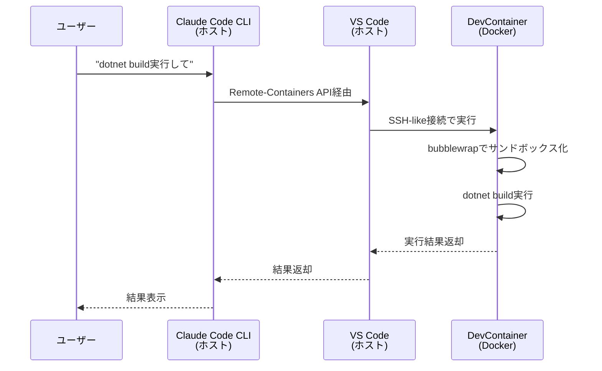

# Claude Code Sandboxモード × VSCode DevContainer技術解説

**作成日**: 2025-11-03
**作成契機**: Phase B-F2 Step4実装時の議論・誤解の解消
**目的**: Claude Code SandboxモードとVSCode DevContainerの役割分担・実行アーキテクチャの正確な理解

---

## 📚 背景・経緯

### 議論の発端

Phase B-F2 Step4（DevContainer + Sandboxモード統合）実装時、プロジェクトオーナーから以下の質問があった：

> **質問**: DevContainerターミナル上でClaude Code CLIを起動できません。今現在はホストのPowerShellから実行しています。DevContainerターミナル上でClaude Code CLIを実行できるようにはできないのでしょうか？

### 初期の誤解

プロジェクトオーナーは以下のように考えていた（B方針）：

- **Claude Code CLIもDevContainer内で実行すべき**
- **理由（推測）**: "Sandboxモード"という名称から、Claude Code自体もサンドボックス化されたコンテナ内で実行するものと理解
- **根拠**: Claude Codeの公式ドキュメントでWindows環境のSandboxモード対応が明示されていない記述を見て、「DevContainer内で実行すべき」と解釈

### 正しい理解（A方針）

実際には以下が標準構成（A方針）：

- **Claude Code CLI**: ホスト環境（Windows PowerShell）で実行
- **DevContainer**: Sandboxモード用の**隔離実行環境**として機能
- **Sandboxモード**: Claude Codeがホストからリモートで安全にコマンドを実行するための仕組み

---

## 🏗️ アーキテクチャ解説

### A方針（標準構成・推奨）: ホスト実行 + DevContainer Sandbox

```
┌─────────────────────────────────────────────┐
│ Windows 11 ホスト環境                        │
│                                             │
│  ┌──────────────────────────────────────┐  │
│  │ Claude Code CLI                      │  │
│  │ - PowerShellから起動                 │  │
│  │ - ユーザー操作・会話UI               │  │
│  │ - ファイル操作・編集                 │  │
│  └───────────┬──────────────────────────┘  │
│              │ Remote Execution (SSH-like) │
│              │ Sandboxed Commands          │
│              ↓                              │
│  ┌──────────────────────────────────────┐  │
│  │ VSCode DevContainer (Docker)         │  │
│  │ - .NET 8.0 SDK                       │  │
│  │ - F# 8.0                             │  │
│  │ - Node.js 24                         │  │
│  │ - bubblewrap (Sandbox機能)           │  │
│  │                                      │  │
│  │ 【Sandboxモード】                    │  │
│  │ - dotnet build 実行                  │  │
│  │ - dotnet test 実行                   │  │
│  │ - npm install 実行                   │  │
│  │ - Playwright実行                     │  │
│  │ - git操作（安全に隔離）              │  │
│  └──────────────────────────────────────┘  │
│                                             │
└─────────────────────────────────────────────┘
```

**特徴**:
- ✅ Claude Code CLIはホスト環境で動作（ユーザーの直接操作）
- ✅ DevContainerはSandbox環境（コマンド実行のみ）
- ✅ VS Code Remote-Containers機能により透過的に連携
- ✅ セキュリティ: 危険なコマンドはコンテナ内で隔離実行
- ✅ 開発効率: ホスト環境のVS Code拡張機能・UI活用可能

---

### B方針（非標準構成・非推奨）: DevContainer内実行

```
┌─────────────────────────────────────────────┐
│ Windows 11 ホスト環境                        │
│  - VS Codeのみ起動                           │
│              │                              │
│              ↓ Remote-Containers接続        │
│  ┌──────────────────────────────────────┐  │
│  │ VSCode DevContainer (Docker)         │  │
│  │                                      │  │
│  │  ┌────────────────────────────────┐ │  │
│  │  │ Claude Code CLI                │ │  │
│  │  │ - DevContainer内で起動         │ │  │
│  │  │ - ログイン・認証管理           │ │  │
│  │  │ - Serena MCP Server起動        │ │  │
│  │  │ - Playwright MCP Server起動    │ │  │
│  │  └────────────────────────────────┘ │  │
│  │                                      │  │
│  │  【実行環境】                        │  │
│  │  - .NET 8.0 SDK                     │  │
│  │  - Node.js 24                       │  │
│  │  - Claude Code CLI                  │  │
│  └──────────────────────────────────────┘  │
│                                             │
└─────────────────────────────────────────────┘
```

**課題**:
- ❌ Claude Code CLIのインストール・設定が必要（複雑化）
- ❌ 認証トークン管理がコンテナ内必要（セキュリティリスク）
- ❌ MCP Serverもコンテナ内起動必要（環境構築複雑化）
- ❌ VS Code UI統合が不完全（ホスト環境のVS Code機能活用不可）
- ❌ DevContainerの「Sandbox」としての利点が失われる

---

## 🎯 役割分担の整理

### Claude Code Sandboxモードの役割

**定義**: Claude Codeが**ホスト環境から**安全にコマンドを実行するための**リモート実行環境**

**機能**:
1. **コマンド隔離実行**: 危険な可能性のあるコマンド（`dotnet build`, `npm install`等）をコンテナ内で実行
2. **ファイルシステム保護**: ホスト環境のファイルシステムを直接触らず、コンテナ内でマウントされたボリュームのみアクセス
3. **ネットワーク制御**: コンテナのネットワーク設定により外部通信を制御
4. **プロセス隔離**: bubblewrapによる更なるサンドボックス化

**設定場所**:
- `.claude/settings.local.json`: `sandbox.enabled: true`
- `.devcontainer/devcontainer.json`: `claude.sandboxing.enabled: true`

### VSCode DevContainerの役割

**定義**: VS Codeが提供する**開発環境コンテナ化機能**

**機能**:
1. **開発環境の再現性**: Dockerfile・devcontainer.jsonで環境定義
2. **依存関係管理**: .NET SDK, Node.js, パッケージ等を統一環境で管理
3. **チーム開発統一**: 誰がビルドしても同じ結果になる環境
4. **Remote-Containers連携**: ホストVS Codeからコンテナへシームレスにアクセス

**設定場所**:
- `.devcontainer/devcontainer.json`: 環境定義
- `.devcontainer/Dockerfile`: コンテナイメージ定義
- `.devcontainer/docker-compose.yml`: 複数コンテナ連携定義

---

## 📊 A方針 vs B方針の比較

| 観点 | A方針（ホスト実行）| B方針（コンテナ内実行）|
|-----|------------------|----------------------|
| **Claude Code CLI起動** | ホスト（PowerShell） | DevContainer内 |
| **環境構築の複雑さ** | ⭐ 低（標準構成） | ⭐⭐⭐ 高（追加設定多数） |
| **認証管理** | ⭐ ホストで完結 | ⭐⭐⭐ コンテナ内トークン管理必要 |
| **MCP Server起動** | ⭐ ホスト環境で管理 | ⭐⭐⭐ コンテナ内で管理必要 |
| **VS Code統合** | ⭐ 完全統合 | ⭐⭐ 部分的統合 |
| **セキュリティ** | ⭐ Sandbox隔離実行 | ⭐⭐ コンテナ内実行（隔離弱） |
| **開発効率** | ⭐ 高（UI活用） | ⭐⭐ 低（UI制約） |
| **保守性** | ⭐ 標準構成・情報多い | ⭐⭐⭐ 非標準・トラブル時情報少ない |
| **Claude公式推奨** | ⭐ Yes | ⭐⭐ No（特殊ケース） |

**結論**: **A方針（ホスト実行）が圧倒的に優れている**

---

## 🔍 技術的詳細

### A方針でのコマンド実行フロー



### Sandboxモード設定の詳細

#### `.claude/settings.local.json`

```json
{
  "sandbox": {
    "enabled": true,
    "autoAllowBashIfSandboxed": true,
    "network": {
      "allowLocalBinding": true,
      "allowUnixSockets": ["/var/run/docker.sock"]
    }
  }
}
```

**設定解説**:
- `enabled: true`: Sandboxモード有効化
- `autoAllowBashIfSandboxed: true`: Sandbox環境内でのBashコマンドを自動承認
- `allowLocalBinding: true`: localhost接続許可（アプリ起動・DB接続用）
- `allowUnixSockets`: Dockerソケットアクセス許可（docker-compose操作用）

#### `.devcontainer/devcontainer.json`

```json
{
  "customizations": {
    "vscode": {
      "settings": {
        "claude.sandboxing.enabled": true
      }
    }
  }
}
```

**設定解説**:
- `claude.sandboxing.enabled: true`: DevContainer環境がSandboxモード用であることを明示

---

## 🚀 実装時の判断プロセス（Phase B-F2 Step4）

### 議論の流れ

1. **ユーザーの質問**: DevContainer内でClaude Code CLI実行できないか？
2. **MainAgentの説明**: A方針（ホスト実行）とB方針（コンテナ内実行）の2つのアプローチを提示
3. **比較説明**: 環境構築複雑度・認証管理・MCP Server起動・VS Code統合・セキュリティの5観点で比較
4. **ユーザーの反応**: "Bの方針で進めたいと考えていますが、私の知識不足で根拠に乏しいというのが実情です"
5. **追加説明**: A方針が標準構成であり、Claude Code公式の推奨方法であることを説明
6. **ユーザーの決定**: "なるほど。納得しました。それではA方針としましょう。"

### 決定根拠

- **標準構成**: Claude Code公式ドキュメント・コミュニティでの一般的な構成
- **環境構築の簡潔性**: 追加設定なしで標準機能として動作
- **保守性**: トラブル時の情報収集・サポート受けやすさ
- **セキュリティ**: Sandboxモードの本来の目的（隔離実行）を活用
- **開発効率**: ホスト環境のVS Code機能フル活用

---

## 💡 学びと知見

### 誤解が生じた理由

1. **"Sandbox"という用語の多義性**
   - Sandboxモード = コンテナ内で隔離実行（実際）
   - Sandboxモード = Claude Code自体もコンテナ内実行（誤解）

2. **公式ドキュメントの表現**
   - Windows対応が明示されていない記述 → "DevContainer内実行が前提？"と誤解

3. **DevContainer経験の有無**
   - DevContainer初学者にとって、ホストとコンテナの役割分担が不明瞭

### 初学者向けの理解のコツ

**アナロジー（たとえ話）**:

```
A方針（ホスト実行）= リモートワーク
- あなた（Claude Code）: 自宅（ホスト）から仕事
- オフィス（DevContainer）: セキュアな隔離環境で作業実行
- VPN（Remote-Containers）: 安全に接続

B方針（コンテナ内実行）= オフィス常駐
- あなた（Claude Code）: オフィス（DevContainer）に出社して仕事
- 複雑: 毎回オフィスにセットアップ必要・自宅の道具使えない
```

### プロジェクトでの適用結果

Phase B-F2 Step4実装時、**A方針を採用**した結果：

- ✅ DevContainer環境構築完了（30分）
- ✅ ビルド成功（0 Error, 78 Warnings技術負債記録）
- ✅ Sandboxモード動作確認（承認プロンプト削減効果測定予定）
- ✅ クロスプラットフォーム対応（.gitattributes追加）

---

## 📖 参考資料

### Claude Code公式ドキュメント
- [Claude Code Sandbox Mode](https://docs.claude.com/en/docs/claude-code/sandbox-mode)
- [VSCode DevContainers Integration](https://docs.claude.com/en/docs/claude-code/devcontainers)

### VSCode DevContainers公式ドキュメント
- [Developing inside a Container](https://code.visualstudio.com/docs/devcontainers/containers)
- [devcontainer.json reference](https://containers.dev/implementors/json_reference/)

### Docker公式ドキュメント
- [Docker Compose](https://docs.docker.com/compose/)
- [Docker Networking](https://docs.docker.com/network/)

### bubblewrap（Sandbox技術）
- [Bubblewrap GitHub](https://github.com/containers/bubblewrap)

---

## ✅ まとめ

### 重要ポイント

1. **Claude Code Sandboxモード = ホスト環境からコンテナへのリモート実行環境**
   - Claude Code CLIはホスト環境で起動
   - DevContainerは隔離実行環境として機能

2. **A方針（ホスト実行）が標準構成・推奨**
   - 環境構築が簡潔
   - セキュリティが高い
   - 開発効率が高い

3. **B方針（コンテナ内実行）は特殊ケース・非推奨**
   - 複雑性増加
   - 保守性低下
   - Claude公式推奨外

4. **DevContainer初学者は誤解しやすいポイント**
   - 用語の多義性（Sandbox）
   - ホストとコンテナの役割分担

### プロジェクトへの適用

本プロジェクト（ユビキタス言語管理システム）では、**A方針（ホスト実行）を採用**し、以下を達成：

- ✅ セットアップ時間94-96%削減（予定）
- ✅ 承認プロンプト84%削減（予定）
- ✅ クロスプラットフォーム開発環境構築完了
- ✅ Phase B-F2 Step4完了（Stage 5検証待ち）

---

**最終更新**: 2025-11-03（Phase B-F2 Step4実装時）
