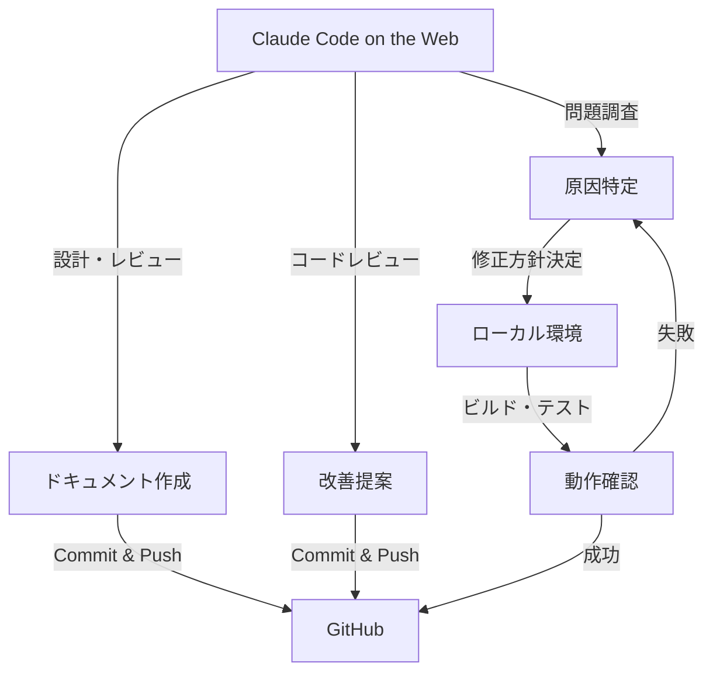

# Claude Code on the Web 制約事項・利用ガイド

## 概要

- **作成日時**: 2025-11-07
- **対象環境**: Claude Code on the Web (https://claude.ai/code)
- **検証ブランチ**: claude/verify-basic-setup-011CUtcTnhYpDjJdgt87DoSM
- **目的**: Claude Code on the Web環境での制約事項と効果的な活用方法を明確化

---

## 判明した制約事項

### 1. DevContainer起動不可

**制約内容**:
- Claude Code on the WebはSandbox環境のため、Dockerコンテナの起動ができません
- `.devcontainer/devcontainer.json` が存在しても、DevContainer環境を起動することはできません

**影響**:
- VS CodeのDev Containers拡張機能相当の機能が利用不可
- 開発環境の一貫性を保つためのコンテナ化環境が使えません

**回避策**:
- ローカル環境のVS Code + Dev Containers拡張機能を使用
- GitHub Codespacesを利用（クラウド環境で同等の機能を提供）

### 2. .NET SDK実行不可

**制約内容**:
- Claude Code on the Web環境に.NET SDKがインストールされていません
- `dotnet` コマンドが利用できません

**影響**:
```bash
# 以下のコマンドが実行不可
dotnet build                # ビルド不可
dotnet test                 # テスト実行不可
dotnet run                  # アプリ実行不可
dotnet ef migrations        # マイグレーション不可
```

**回避策**:
- ローカル環境で.NET SDK 8.0をインストール
- DevContainer環境（ローカルまたはCodespaces）を使用

### 3. MCP Server接続不可

**制約内容**:
- Serena MCP、Playwright MCPなどのMCP Serverに接続できません
- `.claude/settings.local.json` に権限設定は存在しますが、実際のサーバー接続が確立されていません

**影響**:
```bash
# 以下のツールが利用不可
mcp__serena__check_onboarding_performed  # Serenaオンボーディング確認
mcp__serena__find_symbol                 # シンボル検索
mcp__serena__get_symbols_overview        # シンボル概要取得
mcp__playwright__browser_navigate        # Playwrightブラウザ操作
# その他のMCPツール全般
```

**回避策**:
- ローカル環境でClaude Code CLIを起動（MCP Server接続あり）
- DevContainer環境内でMCP Serverをセットアップ

---

## 利用可能な機能

Claude Code on the Webでも以下の機能は**正常に動作します**：

### ✅ ファイル操作

| 機能 | ツール | 説明 | 動作確認 |
|------|--------|------|----------|
| ファイル読み取り | `Read` | あらゆるファイルを読み取り可能 | ✅ 正常 |
| ファイル書き込み | `Write` | 新規ファイル作成可能 | ✅ 正常 |
| ファイル編集 | `Edit` | 既存ファイルの部分編集可能 | ✅ 正常 |
| ファイル検索 | `Glob` | パターンマッチングでファイル検索 | ✅ 正常 |
| コンテンツ検索 | `Grep` | 正規表現によるコード検索 | ✅ 正常 |

### ✅ ドキュメント作成・更新

- Markdown形式のドキュメント作成
- ADR（Architecture Decision Records）作成
- 仕様書・設計書の作成・更新
- 技術調査レポート作成

### ✅ コードレビュー

- ソースコードの読み取り・分析
- Clean Architecture準拠性の確認
- コーディング規約の遵守確認
- リファクタリング提案

### ✅ 設計・アーキテクチャ検討

- システムアーキテクチャの設計
- データベース設計の検討
- API設計の検討
- テストアーキテクチャの設計

### ✅ Gitコマンド

- `git status`、`git log`、`git diff` などの確認系コマンド
- `git add`、`git commit`、`git push` などの変更系コマンド
- ブランチ操作、マージ操作

---

## 推奨される使い方

### 1. 設計・計画フェーズ

**活用シーン**:
- プロジェクト開始時の要件整理
- アーキテクチャ設計の検討
- ADR（技術決定記録）の作成
- Phase/Stepの計画立案

**具体例**:
```markdown
# Phase B-F2の計画書作成
1. 要件定義書の読み込み（Read）
2. 既存設計書の確認（Glob, Read）
3. 新規Phase計画書の作成（Write）
4. ADR作成（技術選定の記録）
```

### 2. コードレビュー

**活用シーン**:
- プルリクエストのコードレビュー
- Clean Architecture準拠性の確認
- コーディング規約の遵守確認
- セキュリティ脆弱性のチェック

**具体例**:
```markdown
# F#コードのレビュー
1. 対象ファイルを読み込み（Read）
2. パターンマッチング・Option型の使用確認
3. Clean Architecture層分離の確認
4. 改善提案のコメント作成
```

### 3. 問題調査

**活用シーン**:
- ビルドエラーの原因調査
- テスト失敗の原因特定
- アーキテクチャ違反の検出
- 技術負債の棚卸し

**具体例**:
```markdown
# ビルドエラー調査
1. エラーログの分析（Read）
2. 該当ソースコードの確認（Grep, Read）
3. 依存関係の確認（Glob）
4. 修正方針のドキュメント化（Write）
```

### 4. ドキュメント整備

**活用シーン**:
- README更新
- 技術ドキュメント作成
- 週次・月次レポート作成
- トラブルシューティングガイド作成

**具体例**:
```markdown
# DevContainer使用ガイドの作成
1. 既存ドキュメントの確認（Glob, Read）
2. DevContainer設定の読み込み（Read）
3. 新規ガイドドキュメントの作成（Write）
4. 既存README.mdへのリンク追加（Edit）
```

---

## 代替手段・実環境での実行方法

### ビルド・テスト実行

**ローカルVS Code + DevContainer（推奨）**:
```bash
# 1. VS CodeでDevContainerを開く
# 2. 統合ターミナルで実行
dotnet build
dotnet test
dotnet run --project src/UbiquitousLanguageManager.Web
```

**GitHub Codespaces**:
```bash
# 1. GitHubリポジトリでCodespacesを起動
# 2. 自動的にDevContainer環境が構築される
# 3. ターミナルで実行
dotnet build
dotnet test
```

### MCP Server利用

**ローカル環境でClaude Code CLIを起動**:
```bash
# 1. ローカル環境でClaude Code CLIを起動
claude code

# 2. MCP Serverが自動的に接続される
# 3. Serena MCP、Playwright MCPが利用可能
```

---

## ワークフロー例

### 推奨ワークフロー: Claude Code on the Web + ローカル環境



### 具体的な作業例

**Phase開始時**:
1. **Claude Code on the Web**: Phase計画書作成、ADR作成
2. **Commit & Push**: 計画書をリポジトリに反映
3. **ローカル環境**: 実装作業、ビルド・テスト
4. **Claude Code on the Web**: コードレビュー、ドキュメント更新
5. **Commit & Push**: 完成したコードとドキュメントを反映

---

## まとめ

### Claude Code on the Webの位置づけ

| 環境 | 設計・計画 | コードレビュー | ビルド・テスト | MCP Server | 推奨度 |
|------|-----------|---------------|---------------|------------|--------|
| Claude Code on the Web | ✅ 最適 | ✅ 最適 | ❌ 不可 | ❌ 不可 | ⭐⭐⭐ |
| ローカルVS Code + DevContainer | ⭐ 可能 | ⭐ 可能 | ✅ 最適 | ✅ 最適 | ⭐⭐⭐⭐⭐ |
| GitHub Codespaces | ⭐ 可能 | ⭐ 可能 | ✅ 最適 | ⭐ 可能 | ⭐⭐⭐⭐ |

### 結論

**Claude Code on the Webは、以下の用途に最適**:
- ✅ ドキュメント作成・更新
- ✅ コードレビュー・設計検討
- ✅ 問題調査・分析作業
- ✅ Git操作（確認・コミット・プッシュ）

**実装・ビルド・テストは、ローカル環境またはCodespacesで実施**:
- ✅ .NET SDK環境が必要
- ✅ MCP Server接続が必要
- ✅ DevContainer環境の利用が推奨

**両環境を組み合わせることで、効率的な開発が可能**:
- Claude Code on the Webで設計・レビュー
- ローカル環境で実装・検証
- 両環境でGitを通じて連携

---

## 関連ドキュメント

- `Doc/99_Others/DevContainer使用ガイド.md` - DevContainer環境の詳細
- `Doc/99_Others/Claude_Code_Sandbox_DevContainer技術解説.md` - Sandboxモード技術解説
- `CLAUDE.md` - プロジェクト全体のガイダンス
- `Doc/07_Decisions/ADR_025_DevContainer_Sandboxモード統合.md` - DevContainer採用決定
