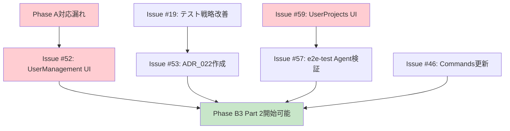

# Phase B3開始前タスク実施計画

**作成日**: 2025-11-19
**目的**: Phase B3開始前に実施すべき6件Issue + Phase A対応漏れの実施順序・組み込み方法の具体化
**参照**: `PhaseB3開始前タスク整理_ユーザー判断.md`, `PhaseA予定実績乖離分析.md`, `PhaseB全体ゴール具体化.md`

---

## 📋 対処対象タスク一覧

### ユーザー判断: Phase B3前に対処（6件）

| Issue | タスク内容                              | 推定時間 | 優先度     | 依存関係              |
| ----- | --------------------------------------- | -------- | ---------- | --------------------- |
| #59   | UserProjects UI実装                     | 2-3h     | 🔴 Critical | なし                  |
| #57   | e2e-test Agent運用検証                  | 5m-1h    | 🔴 Critical | #59と同時             |
| #46   | Commands更新延期判断                    | 1-1.5h   | 🟡 Medium   | なし                  |
| #53   | ADR_022作成（テスト失敗時判断プロセス） | 2-3h     | 🟡 Medium   | #19後推奨             |
| #19   | テスト戦略改善・再発防止                | 3-4h     | 🟡 Medium   | なし                  |
| #52   | Phase A UserManagement UI実装           | 8-12h    | 🔴 Critical | Phase A対応漏れの一部 |

**合計推定時間**: 16.5-24.5時間

### Phase A対応漏れ（5画面）

| 対応漏れ画面                     | 推定工数 | 優先度     | Issue関連     |
| -------------------------------- | -------- | ---------- | ------------- |
| ユーザー一覧画面                 | 3-4h     | 🔴 Critical | #52に含まれる |
| ユーザー登録画面                 | 2-3h     | 🔴 Critical | #52に含まれる |
| ユーザー編集画面                 | 3-4h     | 🔴 Critical | #52に含まれる |
| プロフィール変更画面             | 1-2h     | 🟡 Medium   | 新規          |
| パスワードリセットメール送信画面 | 2-3h     | 🟡 Medium   | 新規          |
| パスワードリセット実行画面       | 2-3h     | 🟡 Medium   | 新規          |

**合計推定時間**: 13-19時間

**全体合計推定時間**: 29.5-43.5時間

---

## 🎯 実施方針・戦略

### 基本方針
1. **Phase A完全完成を優先**: Phase Bに進む前にPhase Aを100%完成させる
2. **依存関係を考慮**: Issue間の依存関係に基づいた実施順序
3. **SubAgent並列実行**: 可能な範囲で並列実行による効率化
4. **段階的統合**: 小さな単位で実装→テスト→統合のサイクル

### Phase B3への組み込み方法

**Phase B3を2つのパートに分割**:

#### Phase B3 Part 1: 前提タスク対処（Step1-2相当）
- Phase A対応漏れ完全解決
- Issue #59, #57, #46, #53, #19対処
- **推定時間**: 29.5-43.5時間（4-6セッション）

#### Phase B3 Part 2: プロジェクト機能完成（Step3-4相当）
- 統計情報実装
- デフォルトドメイン動作確認
- 削除時影響分析
- **推定時間**: 6-10時間（1-2セッション）

---

## 📊 実施順序・依存関係マトリックス

### 依存関係の分析

### 実施グループ分け

#### グループ1: 並行実施可能（独立タスク）
- Issue #46: Commands更新延期判断（1-1.5h）
- Issue #19: テスト戦略改善・再発防止（3-4h）

**推定時間**: 4-5.5時間（並行実施時: 3-4時間）

#### グループ2: Phase A完全完成（Critical Path）
- Phase A対応漏れ: ユーザー管理UI 3画面（8-10h）
- Phase A対応漏れ: 認証補助機能UI 3画面（5-8h）

**推定時間**: 13-18時間

#### グループ3: グループ2完了後実施
- Issue #53: ADR_022作成（2-3h）※Issue #19完了後
- Issue #59: UserProjects UI実装（2-3h）
- Issue #57: e2e-test Agent運用検証（5m-1h）※Issue #59と同時

**推定時間**: 4-6時間

---

## 🗓️ Phase B3 Part 1 実施計画詳細

### Step1: Phase A対応漏れ（ユーザー管理UI）
**推定時間**: 8-12時間（1-2セッション）
**優先度**: 🔴 Critical
**関連Issue**: #52

#### 実施内容
1. **ユーザー一覧画面実装**（3-4h）
   - UI設計書3.6節準拠
   - 一覧表示・検索・フィルタ・ページング
   - 編集・削除ボタン（権限制御）
   - SubAgent: `csharp-web-ui`

2. **ユーザー登録画面実装**（2-3h）
   - UI設計書3.7節準拠
   - メールアドレス・氏名・初期パスワード・ロール・所属プロジェクト
   - バリデーション・権限制御
   - SubAgent: `csharp-web-ui`

3. **ユーザー編集画面実装**（3-4h）
   - UI設計書3.8節準拠
   - 氏名・ロール・所属プロジェクト・ステータス・パスワードリセット
   - バリデーション・権限制御
   - SubAgent: `csharp-web-ui`

4. **E2Eテスト作成**（1-2h）
   - ユーザー管理CRUD E2Eテスト
   - SubAgent: `e2e-test`

#### 成果物
- ✅ `UserManagement/UserList.razor`
- ✅ `UserManagement/UserCreate.razor`
- ✅ `UserManagement/UserEdit.razor`
- ✅ E2Eテスト: `tests/UbiquitousLanguageManager.E2E.Tests/user-management.spec.ts`

#### 完了基準
- ✅ UI設計書3.6-3.8節100%実装
- ✅ エンドユーザーがユーザー管理操作可能
- ✅ E2Eテスト全Pass
- ✅ 0 Warning/0 Error維持

---

### Step2: Phase A対応漏れ（認証補助機能UI）
**推定時間**: 5-8時間（1セッション）
**優先度**: 🟡 Medium

#### 実施内容
1. **プロフィール変更画面実装**（1-2h）
   - UI設計書3.2節準拠
   - 氏名変更（メールアドレスは変更不可）
   - SubAgent: `csharp-web-ui`

2. **パスワードリセットメール送信画面実装**（2-3h）
   - UI設計書3.4節準拠
   - メールアドレス入力・リセットメール送信
   - SubAgent: `csharp-web-ui` + `csharp-infrastructure`

3. **パスワードリセット実行画面実装**（2-3h）
   - UI設計書3.5節準拠
   - 新しいパスワード設定・リンク有効期限確認
   - SubAgent: `csharp-web-ui` + `csharp-infrastructure`

4. **E2Eテスト作成**（1-2h）
   - パスワードリセットフロー E2Eテスト
   - SubAgent: `e2e-test`

#### 成果物
- ✅ `ProfileEdit.razor`
- ✅ `Auth/ForgotPassword.razor`
- ✅ `Auth/ResetPassword.razor`
- ✅ E2Eテスト: `authentication.spec.ts` 拡張（3シナリオ追加）

#### 完了基準
- ✅ UI設計書3.2, 3.4, 3.5節100%実装
- ✅ パスワードリセットフロー完全動作
- ✅ E2Eテスト全Pass（9/9シナリオ）
- ✅ **Phase A完全完成（100%）達成**

---

### Step3: Issue #59 + #57 対処
**推定時間**: 2-4時間（1セッション）
**優先度**: 🔴 Critical
**依存関係**: Step1-2完了後（Phase A完成後）

#### 実施内容

##### Issue #59: UserProjects UI実装（2-3h）
1. **ProjectList.razorに遷移リンク追加**
   - `data-testid="member-management-link"` 実装
   - プロジェクト一覧 → メンバー管理画面への遷移
   - SubAgent: `csharp-web-ui`

2. **E2Eテスト実行確認**
   - `user-projects.spec.ts` 全シナリオPass確認

##### Issue #57: e2e-test Agent運用検証（5分-1時間）
1. **Issue #59実装時にe2e-test Agent活用**
2. **運用効果測定**
   - 実装時間削減率
   - テスト品質向上
   - Agent活用パターン確立

#### 成果物
- ✅ `ProjectList.razor` 更新（遷移リンク追加）
- ✅ E2Eテスト全Pass確認
- ✅ e2e-test Agent運用効果レポート

#### 完了基準
- ✅ ProjectList → ProjectMembers遷移動作確認
- ✅ E2Eテスト（user-projects.spec.ts）全Pass
- ✅ Phase B エンドユーザー操作 77.8% → 100%達成

---

### Step4: Issue #46 + #19 + #53 対処（並行）
**推定時間**: 6-8.5時間（1セッション）
**優先度**: 🟡 Medium
**並行実施**: 可能（独立タスク）

#### Issue #46: Commands更新延期判断（1-1.5h）
**実施内容**:
1. Commands刷新必要性の再評価
2. 延期判断基準の策定
3. ADR作成（必要に応じて）

**SubAgent**: `design-review` + `tech-research`

#### Issue #19: テスト戦略改善・再発防止（3-4h）
**実施内容**:
1. Phase A/B1/B2のテスト失敗事例分析
2. 再発防止策の策定
3. テスト戦略ドキュメント更新
4. ベストプラクティス確立

**SubAgent**: `design-review` + `spec-compliance`

#### Issue #53: ADR_022作成（テスト失敗時判断プロセス）（2-3h）
**実施内容**:
1. Issue #19の知見を基にADR_022作成
2. テスト失敗時の判断プロセス明文化
3. 対処優先度マトリックス策定

**SubAgent**: なし（MainAgentがドキュメント作成）
**依存関係**: Issue #19完了後に実施

#### 成果物
- ✅ Commands更新判断レポート（Issue #46）
- ✅ テスト戦略改善ドキュメント（Issue #19）
- ✅ ADR_022: テスト失敗時判断プロセス（Issue #53）

---

## 📅 Phase B3 Part 1 実施スケジュール

### タイムライン（推奨）

| Step      | タスク内容                        | 推定時間     | セッション | 累積時間 |
| --------- | --------------------------------- | ------------ | ---------- | -------- |
| **Step1** | Phase A対応漏れ（ユーザー管理UI） | 8-12h        | 1-2        | 8-12h    |
| **Step2** | Phase A対応漏れ（認証補助機能UI） | 5-8h         | 1          | 13-20h   |
| **Step3** | Issue #59 + #57                   | 2-4h         | 1          | 15-24h   |
| **Step4** | Issue #46 + #19 + #53（並行）     | 6-8.5h       | 1          | 21-32.5h |
| **合計**  | Phase B3 Part 1                   | **21-32.5h** | **4-5**    | -        |

### 並行実施による効率化

**Step4の並行実施**:
- Issue #46: MainAgent（1-1.5h）
- Issue #19: SubAgent 1（design-review, 3-4h）
- Issue #53: SubAgent 2（Issue #19完了後, 2-3h）

**並行実施時間**: 6-8.5h → **実質4-5.5h**（並列効率30-40%）

**Phase B3 Part 1 最適化後**: **19-28h（3-4セッション）**

---

## 🎯 Phase B3 Part 2: プロジェクト機能完成

### Step5: プロジェクト統計情報・機能完成
**推定時間**: 6-10時間（1-2セッション）
**優先度**: 🟡 Medium
**前提条件**: Phase B3 Part 1完了

#### 実施内容
1. **統計情報実装**（3-4h）
   - ドメイン数・ユーザー数・用語数集計
   - ProjectList.razor表示追加
   - SubAgent: `csharp-web-ui` + `csharp-infrastructure`

2. **デフォルトドメイン動作確認**（1-2h）
   - ProjectDomainService検証
   - E2Eテスト作成
   - SubAgent: `integration-test`

3. **削除時影響分析**（2-4h）
   - 関連データ確認ロジック
   - 削除確認ダイアログ拡張
   - SubAgent: `csharp-web-ui` + `csharp-infrastructure`

#### 成果物
- ✅ プロジェクト統計情報表示機能
- ✅ デフォルトドメイン自動作成動作保証
- ✅ 削除時影響分析機能
- ✅ E2Eテスト完全化

#### 完了基準
- ✅ Phase B エンドユーザー操作 9/9完全達成（100%）
- ✅ UI設計書3.1-3.3節完全動作保証
- ✅ Phase B3完了基準全達成

---

## 📊 Phase B3全体スケジュール

### 全体タイムライン

| Part       | 内容                 | 推定時間   | セッション | 備考                        |
| ---------- | -------------------- | ---------- | ---------- | --------------------------- |
| **Part 1** | 前提タスク対処       | 19-28h     | 3-4        | Phase A完全完成 + Issue対処 |
| **Part 2** | プロジェクト機能完成 | 6-10h      | 1-2        | Phase B完全完成             |
| **合計**   | Phase B3全体         | **25-38h** | **4-6**    | -                           |

### マイルストーン

| マイルストーン                 | 達成基準                                      | 完了予定             |
| ------------------------------ | --------------------------------------------- | -------------------- |
| **MS1**: Phase A完全完成       | UI設計書8画面100%実装・エンドユーザー操作100% | Part 1 Step1-2完了時 |
| **MS2**: Phase B Issue対処完了 | Issue #59, #57, #46, #53, #19完全解決         | Part 1 Step3-4完了時 |
| **MS3**: Phase B完全完成       | UI設計書3画面100%動作・エンドユーザー操作100% | Part 2 Step5完了時   |

---

## 🎯 Phase B3完了基準（最終確認）

### Phase A完了基準（Part 1完了時）
- ✅ UI設計書8画面100%実装（3/8 → 8/8画面）
- ✅ エンドユーザー操作100%可能（37.5% → 100%）
- ✅ E2Eテスト全シナリオPass（6/9 → 12/12シナリオ）
- ✅ Clean Architecture 97点維持
- ✅ 0 Warning/0 Error維持

### Phase B完了基準（Part 2完了時）
- ✅ UI設計書3画面100%動作（66.7% → 100%操作可能）
- ✅ エンドユーザー操作9/9完全達成
- ✅ プロジェクト統計情報表示
- ✅ デフォルトドメイン自動作成動作保証
- ✅ 削除時影響分析機能完成
- ✅ E2Eテスト完全化
- ✅ Clean Architecture 97点維持

### Phase B3総合完了基準
- ✅ **Phase A完全完成**（100%）
- ✅ **Phase B完全完成**（100%）
- ✅ **Issue 6件完全解決**
- ✅ **品質基準維持**（97点以上）
- ✅ **Phase B4移行準備100%完了**

---

## 📝 実施時の注意事項

### SubAgent活用方針
1. **csharp-web-ui**: UI実装全般
2. **csharp-infrastructure**: Repository拡張・認証機能
3. **e2e-test**: E2Eテスト作成・実行
4. **design-review**: 設計整合性確認
5. **spec-compliance**: 仕様準拠度確認

### 品質保証プロセス
1. **各Step完了時**:
   - `dotnet build` 実行（0 Warning/0 Error確認）
   - `dotnet test` 実行（全テストPass確認）
   - E2Eテスト実行（該当シナリオPass確認）

2. **Part 1完了時**:
   - Phase A完全完成確認（UI設計書8画面動作確認）
   - エンドユーザー視点での受け入れテスト

3. **Part 2完了時**:
   - Phase B完全完成確認（UI設計書3画面完全動作確認）
   - エンドユーザー視点での受け入れテスト
   - `phase-end` Command実行・Phase B3完了宣言

### リスク管理
1. **時間超過リスク**:
   - 各Step推定時間の上限を超える場合、即座にユーザーに報告
   - Step分割・再計画の検討

2. **品質低下リスク**:
   - Clean Architectureスコア97点未満の場合、品質改善を優先
   - テスト失敗の場合、原因分析・修正を優先

3. **スコープクリープリスク**:
   - 計画外の追加要件が発生した場合、ユーザーに確認
   - Phase B3スコープの厳守

---

## 🎯 サマリ

### Phase B3の2段階構成
- **Part 1**: 前提タスク対処（19-28h・3-4セッション）
  - Phase A完全完成
  - Issue 6件対処

- **Part 2**: プロジェクト機能完成（6-10h・1-2セッション）
  - Phase B完全完成

### 推定合計時間
- **最小**: 25時間（4セッション）
- **最大**: 38時間（6セッション）
- **中央値**: 31.5時間（5セッション）

### 重要マイルストーン
1. **MS1**: Phase A 100%完成（Part 1 Step1-2）
2. **MS2**: Issue対処完了（Part 1 Step3-4）
3. **MS3**: Phase B 100%完成（Part 2 Step5）

### Phase A教訓の適用
- ✅ **ゴール具体化**: UI設計書との明示的紐付け
- ✅ **受け入れ基準**: エンドユーザー視点100%操作可能
- ✅ **完成度マトリックス**: 定量的完成度管理
- ✅ **Phase完了判定**: 100%完成確認必須

---

**作成者**: Claude Code
**参照ドキュメント**:
- `Doc/99_Others/PhaseB3開始前タスク整理_ユーザー判断.md`
- `Doc/99_Others/PhaseA予定実績乖離分析.md`
- `Doc/99_Others/PhaseB全体ゴール具体化.md`
- `Doc/08_Organization/Rules/縦方向スライス実装マスタープラン.md`
